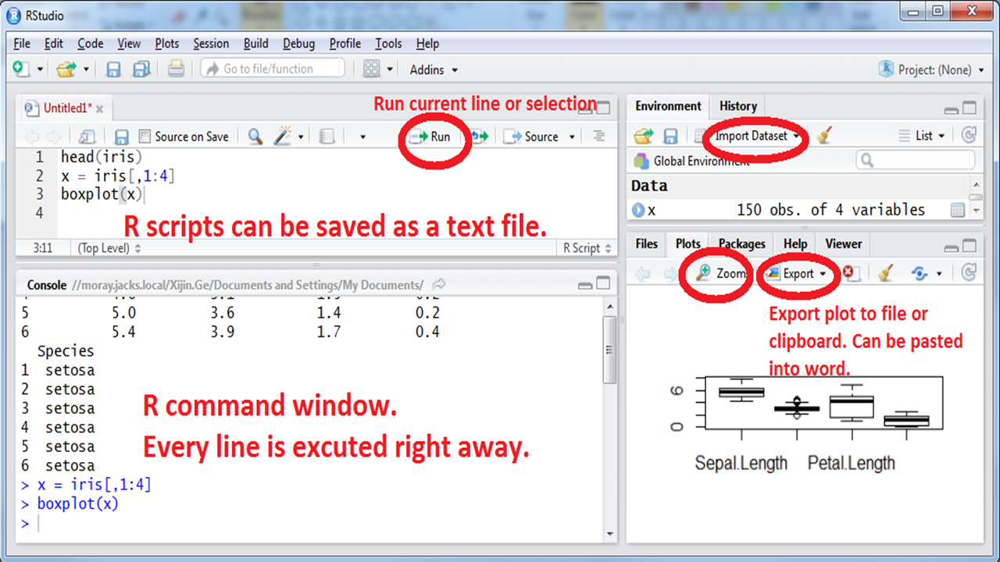
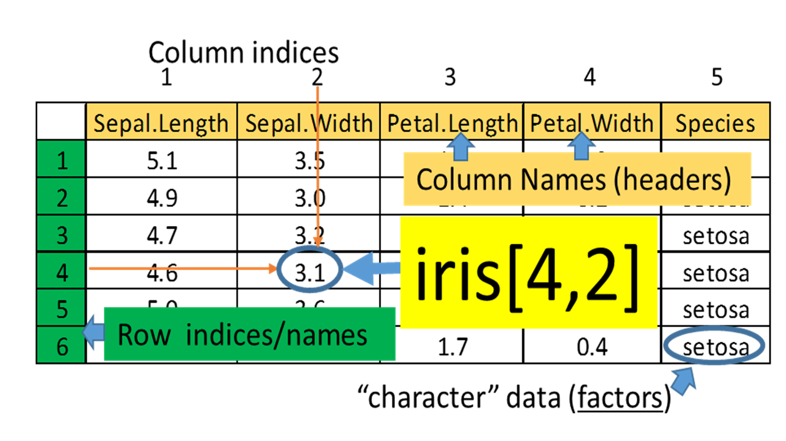
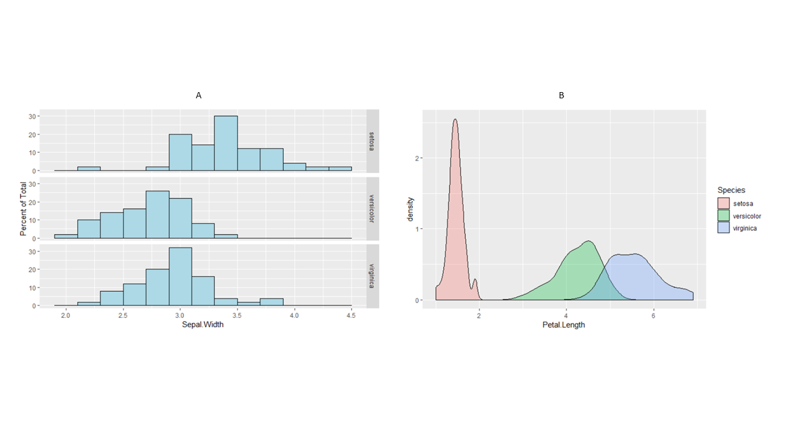

# Step into R programming--the iris flower dataset  

**Getting started**

1. Install R from [www.R-project.org](www.R-project.org). Choose the cloud server or any U.S. mirror site.
2. Install RStudio Desktop from [www.RStudio.com](www.RStudio.com). Rstudio uses the R software you just installed in the background, but provides a more user-friendly interface. R commands can be typed directly into the “Console” window. Or you can enter them in the “R Script” window and click the “Run” button. 
3. Alternatively, you can use Rstudio through a web browser via [Rstudio Cloud.](https://rstudio.cloud/) Some universities also host their own Rstudio server on more powerful workstations.  

```{r echo=FALSE, out.width='80%'}

```

As a quick sample session, try all of these commands below in the Console window and guess what’s going on. If you understand all of these, you do not need this book. Consider more advanced books like [R for Data Science](https://r4ds.had.co.nz/). If it takes a few months to type these 243 characters,  try [www.RapidTyping.com](www.RapidTyping.com).  
```{r eval = FALSE}
head(iris)
str(iris)
summary(iris)
x <- iris[, 1:4]
head(x)
boxplot(x)
plot(x[, 3:4])
abline( lm(x[, 4] ~ x[, 3]) )
pairs(x)
stars(x)

PL <- x$Petal.Length
PL
barplot(PL)
hist(PL)
Species <- iris$Species
Species
pie( table(Species) )
boxplot(PL ~ Species )
summary( aov(PL ~ Species) )
```


## Data frames have rows and columns: the Iris flower dataset 
In 1936, Edgar Anderson collected data to quantify the geographic variation of *Iris* flowers. The data set consists of 50 samples from each of three sub-species ( *Iris setosa*, *Iris virginica* and *Iris versicolor*). Four features were measured from each sample: the lengths and the widths of sepals and petals, in centimeters (cm). This data is included in R software. Go to the Wikipedia page for this data set (yes, it is famous!). Have a quick look at the data there, think about what distinguishes the three species? If we have a flower with sepals of 6.5cm long and 3.0cm wide, petals of 6.2cm long, and 2.2cm wide, which species does it most likely belong to? **Think** (!) for a few minutes while eyeballing the data at Wikipedia. Getting familar with this dataset is vital to follow this book. 


```{r echo=FALSE, out.width='50%', fig.cap='Iris flower. Photo from Wikipedia.', fig.align='center' }
knitr::include_graphics("images/img0101_iris.png")
```

```{r echo=FALSE, out.width='80%', fig.cap='Example of a data frame. ', fig.align='center'}

```

To answer these questions, let’s visualize and analyze the data with R. Type these commands without the comments after “#”.  

```{r echo=TRUE, results='hide'}
iris        #This will print the whole dataset, which is included with R 
dim(iris)   # show the dimension of the data frame: 150 rows and 5 columns.
head(iris)  # show the first few rows; useful for bigger datasets. 
```

So the first 4 columns contain numeric values. The last one is species information as **character** values. This is an important distinction, as we cannot add or subtract character values. This object is a **data frame**, with both numeric and character columns. A **matrix** only contains one type of values, often just numbers.

To have a look at the data in a spreadsheet, we can use the fix( ) function.
```{r eval = FALSE}
fix(iris)  # examine data frame in a spreadsheet. 
```

Click on column names to double-check data types (numeric vs. character). Sometimes we need to overwrite data types guessed by R. For example, sometimes we use 1 for male and 0 for female. These are essentially categories; Values like 1.6 make no sense. In this case we need to enforce this column as characters. **Note this window needs to be closed before proceeding to the next**. 
```{r eval=FALSE, echo=TRUE, results='hide'}
View(iris)  # this Rstudio function also shows data. Note R is case sensitive. 
```

Individual values in a data frame can be accessed using row and column indices.
```{r echo=TRUE, results='hide'}
iris[3, 4]    # shows the value in 3rd row, 4th column.  It is 0.2.
iris[3, ]     # shows all of row 3
iris[, 4]     # shows all of column 4
iris[3, 1:4]  # shows row 3, columns 1 to 4. 
```

```{exercise}
Display data in rows 1 to 10 from columns 2 to 5.  Start a new Word document. Copy and paste your R code and the results to the document and save it as PDF.
```

```{r echo=FALSE, out.width='45%', fig.align='center'}
knitr::include_graphics("images/img0100_tips.png")
```
```{r}
colnames(iris)  # Column names. 
```

Remember these column names, as we are going to use them in our analysis now. Note that sepal length information is contained in the column named **Sepal.Length**. Since R is case sensitive, we have to type these column names exactly as above. 
```{r echo=TRUE, results='hide'}
attach(iris)  # attach dataset to R working memory, so that columns can be accessible by name.
Petal.Length  # after attaching, we can just use column names to represent a column of numbers as a vector 
```

R is case-sensitive. “petal.length” will not be recognized.
```{r}
mean(Petal.Length)   # mean( ) is a function that operates on Petal.Length, a vector of 150 umbers
```

```{exercise}
Compute average sepal length. Hint: replace **Petal.Length** with **Sepal.Length**.
```

The best way to learn about other R functions is Google search. 

```{exercise}
Google “R square root function” to find the R function, and compute the value of 
 $\sqrt(123.456)$.
```

## Analyzing one set of numbers

```{r}
x <- Petal.Length   # I am just lazy and don’t want to type “Petal.Length”, repeatedly.
summary(x)
```

- The minimum petal length is 1.0, and the maximum is 6.9.  
- **Average** petal length is 3.758. 
- The mid-point or median is 5.35, as about half of the numbers is smaller than 5.35.  Why the median is different from the mean? What happens if there is a typo and one number is entered 340cm instead of 3.40cm?  
- The 3rd quartile, or 75^th^ percentile is 5.1, as 75% of the flowers has petals shorter than 5.1. The 95^th^ percentile for the weight of 2-year-old boy is 37 pounds. If a 2-year-old boy weighs 37 pounds, he is heavier than 95% of his peers.  If a student’s GPA ranks 5^th^ in a class of 25, he/she is at 80^th^ percentile.
- The 1st quartile, or 25^th^ percentile is 1.6.  Only 25% of the flowers has petals shorter than 1.6.
These summary statistics are graphically represented as a boxplot in the Figure \@ref(fig:1-3)A. Boxplots are more useful when multiple sets of numbers are compared. 

(ref:1-3) Boxplot of petal length (A) and of all 4 columns (B). 

```{r 1-3, echo=c(1, 5), fig.show='hold', out.width='50%', fig.cap='(ref:1-3)', fig.align='center'}
boxplot(x)   # Figure 1.3A. It graphically represents the spread of the data. 
text(x = 1, y = c(5.2, 4.5, 1.75), labels = c("75th pencentile", "Median", "25th pencentile"))
text(1.45, 6.6, labels = "boxplot(x)", col = "red")
legend("topleft", inset = .02, legend = "A",  box.lty = 0)
boxplot(iris[, 1:4])  # boxplot of several columns at the same time Figure 1.3B.
text(4.1, 7.5, labels = "boxplot(iris[, 1:4])", col = "red")
legend("topleft", inset = .001, legend = "B",  box.lty = 0)
```

In Rstudio, you can copy a plot to clipboard using the **Export** button on top of the plot area. Or you can click **zoom**,  right click on the popup plot and select **“Copy Image”**.  Then you can paste the plot into Word.  If you are using R software, instead of Rstudio, you can right click on the plots and copy as meta-file. 

```{exercise}
What can we tell from this boxplot (Figure \@ref(fig:1-3)B)? Summarize your observations in PLAIN English. Note the differences in median and the spread (tall boxes). What is the most variable characteristics?
```
  
To quantify the variance, we can compute the **standard deviation** σ:
\begin{align}
σ=\sqrt{\frac{1}{N}[(x_{1}-u)^2+(x_{2}-u)^2+...+(x_{N}-u)^2]}    
\end{align}
where
\begin{align}
u=\frac{1}{N}(x_{1}+x_{2}+...x_{N})
\end{align}
If all the measurements are close to the mean (µ), then standard deviation should be small. 

```{r}
sd(x)  # sd( ) is a function for standard deviation
sd(Sepal.Width) 
```

As we can see, these flowers have similar sepal width. They differ widely in petal length. This is consistent with the boxplot above. Perhaps changes in petal length lead to better survival in different habitats.

With R it is very easy to generate graphs.
```{r out.width='80%', fig.cap='Barplot of petal length', fig.align='center'}
barplot(x)
```

As we can see, the first 50 flowers (Iris setosa) have much shorter petals than the other two species. The last 50 flowers (Iris verginica) have slightly longer petals than the middle (iris versicolor). 

(ref:1-4) Sequence plot, histogram, lag plot and normal Q-Q plot. 

```{r 1-4, echo=c(1, 3, 5, 7, 8), fig.show='hold', out.width='50%', fig.cap='(ref:1-4)', fig.align='center'}
plot(x)  # Run sequence plot
legend("topleft", inset = .02, legend = "plot(x)",  box.lty = 0)
hist(x)  # histogram
legend(1.6, 36, legend = "hist(x)",  box.lty = 0)
lag.plot(x)
legend("topleft", inset = .02, legend = "lag.plot(x)",  box.lty = 0)
qqnorm(x)  # Q-Q plot for normal distribution
qqline(x) 
legend("topleft", inset = .02, legend = "qqnorm(x)",  box.lty = 0)
```

Histogram shows the distribution of data. The histogram top right of Figure \@ref(fig:1-4) shows that there are more flowers with Petal Length between 1 and 1.5.  It also shows that the data does not show a bell-curved distribution.

Lag plot is a scatter plot against the same set of number with an offset of 1. Any structure in lag plot indicate non-randomness in the order in which the data is presented.

Q-Q plot can help check if data follows a Gaussian distribution, which is widely observed in many situations. Also referred to as normal distribution, it is the pre-requisite for many statistical methods. See Figure \@ref(fig:1-5) for an example of normal distribution. Quantiles of the data is compared against those in a normal distribution.   If the normal Q-Q plot is close to the reference line produced by qqline( ), then the data has a normal distribution.

```{exercise}
Generate 500 random numbers from the standard normal distribution and generate sequence plots, histogram, lag plot, and Q-Q plot. You should get plots like those in Figure \@ref(fig:1-5).  Hint: Run x = rnorm(500) to generate these numbers, and then re-run the last 5 lines of code on this page. They are also shown on Figure \@ref(fig:1-4).
```

(ref:1-5) Plots for random generated numbers following a normal distribution. This is for reference. 
```{r 1-5, echo=FALSE, fig.show='hold', out.width='50%', out.length='50%', fig.cap='(ref:1-5)', fig.align='center'}
x <- rnorm(500)
plot(x)   # Run sequence plot    
hist(x)   # histogram
lag.plot(x)
qqnorm(x)  #Q-Q plot for normal distribution
qqline(x) 
```

```{exercise}
Investigate Septal Length distribution using these techniques and summarize your observations in PLAIN English.  Hint: assign x with the values in the sepal length column (x = Sepal.Length), and re-run all the code in this section.
```

## Student’s t-test 
In hypothesis testing, we evaluate how likely the observed data can be generated if a certain hypothesis is true. If this probability (p value) is very small (< 0.05, typically), we reject that hypothesis. 
Are the petal lengths of iris setosa significantly different from these of iris versicolor? 
```{r}
x <- Petal.Length[1:50]  # the first 50 values of Sepal.Length are for iris setosa
y <- Petal.Length[51:100]  # the next 50 values of Sepal.Length are for iris versicolor
t.test(x, y)  # t.test( ) is an R function for student’s t-test
```

The null hypothesis is that the true mean is the same. Since p value is really small, we reject this hypothesis. Iris versicolor has longer sepals than iris setosa.  

```{exercise}
Are iris setosa and iris versicolor significantly different in sepal width?  Hint: Replace Petal.Length with something else and re-run above code.
```

We can also do t-test on one set of numbers. This is a one-sample t-test of mean:
```{r}
t.test(Sepal.Length, mu = 5.8)
```

In this case, our hypothesis is that the true average of sepal length for all iris flowers is 5.8.   Since p value is quite big, we accept this hypothesis. This function also tells us the 95% confidence interval on the mean. Based on our sample of 150 iris flowers, we are 95% confident that the true mean is between 5.71 and 5.98. 

```{exercise}
Compute 95% confidence interval of petal length. 
```

## Test for normal distribution
We can perform hypothesis testing on whether a set of numbers derived from normal distribution. The null hypothesis is that the data is from a normal distribution. 
```{r}
shapiro.test(Petal.Length)
```

If petal length is normally distributed, there is only 7.412×10^-10^ chance of getting a test statistic of 0.87627, which is observed in our sample of 150 flowers. In other words, it is highly unlikely that petal length follows a normal distribution. We reject the normal distribution hypothesis.

```{exercise}
Is sepal width normally distributed? Run Shapiro’s test and also generate histogram and normal Q-Q plot.
```

## Analyzing a column of categorical values

In the iris dataset, the last column contains the species information. These are “string” values or categorical values.  
```{r echo=c(1, 2, 3, 5), fig.show='hold', out.width='50%', fig.cap='Frequencies of categorical values visualized by Pie chart (A) and bar chart (B).', fig.align='center'}
counts <- table(Species)  # tabulate the frequencies
counts
pie(counts)  # See Figure 1.7A
legend("topleft", inset = .02, legend = "A",  box.lty = 0)
barplot(counts)  # See Figure 1.7B
text(3.71, 48, labels = "B")
```

Pie charts are very effective in showing proportions.

We can see that the three species are each represented with 50 observations.

## Analyzing the relationship between two columns of numbers 
Scatter plot is very effective in visualizing correlation between two columns of numbers. 

(ref:2-1) Scatter plot of petal width and petal length.

```{r 2-1, message=FALSE, out.width='80%', fig.cap='(ref:2-1)', fig.align='center'}
attach(iris)      # attach the data set
x <- Petal.Width  # just lazy
y <- Petal.Length 
plot(x, y)        # scatterplot,  refined version in Figure 1.9
```

Figure \@ref(fig:2-1) shows that there is a positive correlation between petal length and petal width. In other words, flowers with longer petals are often wider. So the petals are getting bigger substantially, when both dimensions increase.   
Another unusual feature is that there seems to be two clusters of points. Do the points in the small cluster represent one particular species of Iris? We need to further investigate this. The following will produce a plot with the species information color-coded. The resultant Figure \@ref(fig:2-2) clearly shows  that indeed one particular species, *I. setosa* constitutes the smaller cluster in the low left. The other two species also show difference in this plot, even though they are not easily separated. This is a very important insight into this dataset. 

(ref:2-2) Scatter plot shows the correlation of petal width and petal length.

```{r 2-2, echo=c(1, 2), out.width='80%', fig.cap='(ref:2-2)', fig.align='center'}
plot(x, y, col = rainbow(3)[Species])  # change colors based on another column (Species). 
legend("topleft", levels(Species), fill = rainbow(3))  # add legends on topleft.
abline(lm(y ~ x))
```

The rainbow( ) function generates 3 colors and Species information is used to choose colors. Note that Species column is a factor, which is a good way to encode columns with multiple levels. Internally, it is coded as 1, 2, 3. 
```{r}
str(iris)  # show the structure of data object
```

Perhaps due to adaption to environment, change in petal length lead to better survival. With the smallest petals, *Iris Setosa* is found in Arctic regions. *Iris versicolor* is often found in the Eastern United States and Eastern Canada. *Iris virginica* “is common along the coastal plain from Florida to Georgia in the Southeastern United States [Wikipedia].” It appears the iris flowers in warmer places are much larger than those in colder ones. With R, it is very easy to generate lots of graphics. But we still have to do the thinking. It requires to put the plots in context.

We can quantitatively characterize the strength of the correlation using several types of correlation coefficients, such as Pearson’s correlation coefficient, r.  It ranges from -1 to 1.   
```{r}
cor(x, y) 
```

This means the petal width and petal length are strongly and positively correlated.
```{r}
cor.test(x, y)
```

Through hypothesis testing of the correlation, we reject the null hypothesis that the true correlation is zero. That means the correlation is statistically significant.
Note that Pearson’s correlation coefficient is not robust against outliers and other methods such as Spearman’s exists. See help info:
```{r echo=TRUE, message=FALSE}
?cor  # show help info on cor ( )
```
We can also determine the equation that links petal length and petal width. This is so called regression analysis. We assume 
         Petal.Length = *a* × Petal.Width + *c* + *e*, 
where *a* is the slope parameter, *c* is a constant, and *e* is some random error.   This linear model can be determined by a method that minimizes the least squared-error:
```{r}
model <- lm(y ~ x)  # Linear Model (lm): petal length as a function of petal width
summary(model)      # shows the details
```

As we can see, we estimated that *a*=2.22944 and *c*=1.08356. Both parameters are significantly different from zero as the p values are <2×10^-16^ in both cases. In other words, we can reliably predict 
Petal.Length = 2.22944 × Petal.Width + 1.08356.  This model can be put on the scatter plot as a line.
```{r fig.keep='none'}
plot(model)
abline(model)  # add regression line to existing scatter plot. Finishes Figure 1.8.
```

Sometimes, we use this type of regression analysis to investigate whether variables are associated. 

```{exercise}
Investigate the relationship between sepal length and sepal width using scatter plots, correlation coefficients, test of correlation, and linear regression. Again interpret all your results in PLAIN and proper English.
```

## Visualizing and testing the differences in groups
Are boys taller than girls of the same age? Such situations are common. We have measurements of two groups of objects and want to know if the observed differences are real or due to random sampling error.   

```{r  message=FALSE, fig.keep='none'}
attach(iris)  # attach iris data
boxplot(Petal.Length ~ Species)  # Generate boxplot: Petal length by species, see Figure 1.11
```

(ref:2-4) Boxplot of petal length, grouped by species.

```{r 2-4, echo=FALSE, fig.cap='(ref:2-4)', fig.align='center'}
knitr::include_graphics("images/img0204_LengthSpecies.png")
```
From the boxplot, it is obvious that *I. Setosa* has much shorter petals. But are there significant differences between *I. versicolor* and *I. virginica*?  We only had a small sample of 50 flowers for each species. But we want to draw some conclusion about the two species in general. We could measure all the iris flowers across the world; Or we could use statistics to make inference. First we need to extract these data
```{r results='hide'}
x <- Petal.Length[51:100]  # extract Petal Length of iris versicolor, from No.51 to No.100
x  # x contain 50 measurements
y <- Petal.Length[101:150]  # extract Petal length of iris virginica,  from No. 101 to No. 150
y  # y contain 50 measurements
```

```{r fig.keep='none'}
boxplot(x, y)  # a boxplot of the two groups of values
t.test(x, y)
```
In this student’s t-test, our null hypothesis is that the mean petal length is the same for *I. versicolor* and *I. virginica*. A small p value of 2.2x10^-16^ indicates under this hypothesis, it is extremely unlikely to observe the difference of 1.292cm through random sampling. Hence we reject that hypothesis and conclude that the true mean is different. If we measure all *I. versicolor* and *I. virginica* flowers in the world and compute their true average petal lengths, it is very likely that the two averages will differ. On the other hand, if p value is larger than a threshold, typically 0.05, we will accept the null hypothesis and conclude that real average petal length is the same. 

We actually do not need to separate two set of numbers into two data objects in order to do t-test or compare them side-by-side on one plot. We can do it right within the data frame. R can separate data points by another column.
```{r results='hide', fig.keep='none'}
x2 <- iris[51:150, ]  # Extract rows 51 to 150
t.test(Petal.Length ~ Species, data = x2)  # t-test of Petal.Length column, divided by the Species column in x2. 
boxplot(Petal.Length ~ Species, data = droplevels(x2))  # droplevels( ) removes empty levels in Species
```

```{exercise}
Use boxplot and t-test to investigate whether sepal width is different between *I. versicolor* and *I. virginica*. Interpret your results. 
```

## Testing the difference among multiple groups (Analysis of Variance: ANOVA)
As indicated by Figure \@ref(fig:2-4), sepal width has small variation, even across 3 species. We want to know if the mean sepal width is the same across 3 species. This is done through Analysis of Variance (ANOVA).

(ref:2-5) Boxplot of sepal width across 3 species.

```{r 2-5, echo=c(1,3), fig.cap='(ref:2-5)', fig.align='center'}
boxplot(Sepal.Width ~ Species)  # Figure 1.12
text(2.5, 4.2, labels = "boxplot(Sepal.Width~Species)", col = "red")
summary(aov(Sepal.Width ~ Species))
```
Since p value is much smaller than 0.05, we reject the null hypothesis. The mean sepal width is not the same for 3 species. This is the only thing we can conclude from  this. The boxplot in Figure \@ref(fig:2-5) seems to indicate  that *I. Setosa* has wider sepals. 
Now  we  demonstrate  how  to  use  the lattice package  for  visualizing  data using multiple panels. This package is not included in the base version of R. They need to be downloaded and installed. One of main advantages of R is that it is open, and users can contribute their code as packages. If you are  using **Rstudio**,  you  can  choose **Tools->Install packages** from the main menu, and then enter the name of the package.
If  you  are  using  R  software,  you  can  install  additional  packages,  by clicking **Packages** in the main menu, and select a mirror site. These mirror sites  all  work  the  same,  but  some  may  be  faster. Lately I  just  use cloud mirror. After choosing a mirror and clicking “OK”, you can scroll down the long list to find your package.  Alternatively, you can type this command to install packages. 
```{r}
#install.packages ("ggplot2")  # choose the cloud mirror site when asked
```
Packages only need to be installed once. But every time you need to use a package, you need to load it from your hard drive. 
```{r}
library(ggplot2)  # load the ggplot2 package
```
Figure \@ref(fig:2-6)A shows the sepal width distribution for each of the 3 species.  The 3 histograms are aligned in panels: layout of 1 column and 3 rows. 

Figure \@ref(fig:2-6)A shows an interesting feature in how sepal width is distributed. While for I. setosa it is skewed to the right. For the other two species it is skewed to the left. 

We can also have density plots side-by-side (Figure \@ref(fig:2-6)B):

```{r fig.keep='none'}
ggplot(iris, aes(x = Sepal.Width, group = Species, 
                 y = c(..count..[..group.. == 1]/sum(..count..[..group.. == 1]),
                       ..count..[..group.. == 2]/sum(..count..[..group.. == 2]),
                       ..count..[..group.. == 3]/sum(..count..[..group.. == 3])) * 100)) + 
  geom_histogram(binwidth = .2, colour = "black", fill = "lightblue") + 
  facet_grid(Species ~ .) +
  labs(y = "Percent of Total")
ggplot(iris, aes(x = Petal.Length, fill = Species)) + geom_density(alpha = .3)
```


(ref:2-6) Visualizing data using the ggplot2 package. 

```{r 2-6, echo=FALSE, fig.cap='(ref:2-6)', fig.align='center'}

```

```{exercise}
Use boxplot, multiple panel histograms and density plots to investigate whether petal width is the same among three subspecies. 
```
