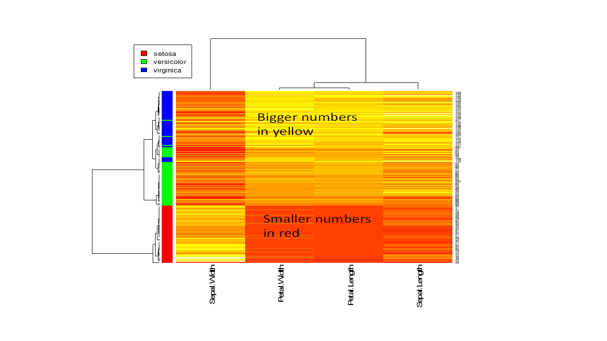

# Analyzing iris flower data set II 

## Visualizing the entire dataset 

### A Matrix only contains numbers

While data frames can have a mix of numbers and characters in different columns, a **matrix is often only contain numbers**.  Let’s extract first 4 columns from the data frame iris and convert to a matrix:
```{r}
x <- as.matrix(iris[, 1:4])  # convert to matrix
colMeans(x)  # column means for matrix
colSums(x)
```
The same thing can be done with rows via **rowMeans(x)** and **rowSums(x)**. 

```{r results='hide'}
y <- iris[1:10, 1:4]  # extract the first 10 rows of iris data in columns 1 to 4. 
y
t(y)          # transpose 
z <- y + 5    # add a number to all numbers in a matrix
z <- y * 1.5  # multiply a factor 
z + y         # subtracting corresponding elements 
y * z         # multiplying corresponding elements
y <- as.matrix(y)  # convert the data.frame y to a matrix
z <- as.matrix(z)  # convert the data.frame z to a matrix
y %*% t(z)         # Matrix multiplication, I never used this.
```

### Scatter plot matrix
**Challenge 2a**: Generate a scatter plot matrix using the first 4 columns of iris flower dataset. Use the species information to color-code the data points. Add legends, and provide brief interpretation.

### Heatmap

**Heatmaps** with hierarchical clustering are my favorite way to visualize data matrices. The rows and columns are kept in place, values are coded by colors. Heatmaps can directly visualize millions of numbers in one plot. The hierarchical trees also shows the similarity among rows or columns: closely connected rows or columns are similar. 

```{r  fig.keep='none'}
x <- as.matrix(iris[, 1:4])   
heatmap(x, scale = "column")  # Heatmap with hierarchical clustering trees.  Numbers are scaled by column.
```
If you are a perfectionist, here is how to fine-tune the graph. We define a function called ppc ( ). As you may notice R works by calling the name of the function and the input to that function in parentheses. Multiple input parameters are separated by a comma. We also notice that the follow commands span several lines. 

```{r fig.keep='none'}
ppc <- function(x, ...){  # A distance function of 1-PPC (Pearson’s correlation coefficient)
       as.dist(1 - cor(t(x), method = "pearson"))  
}
heatmap(x,                   # data, must be a matrix! 
        scale   = "column",  # transformed to have zero mean and unit standard deviation by column
        distfun = ppc,       # use custom function to compute similarity between rows and columns
        margins = c(10, 2),  # define the margins so that the column names show up completely
        RowSideColors = rainbow(3)[iris$Species])   # add colored bar according to Species
legend("topleft", levels(iris$Species), fill = rainbow(3))  # add legend in a separate line
```
``````{r echo=FALSE, fig.cap='Heatmaps and hierarchical clustering is a powerful technique for visualizing data matrix.', fig.align='center'}

```

More advanced customization can be done with heatmap.2 in the ggplots package. 

Note that yellow indicates relatively large numbers and red represents relatively small numbers.  Rows or columns that are bracketed closer are more similar. So the trees display a hierarchy of similarities. 

**Challenge 2b**: Based on heatmap and the star plot, what is your overall impression regarding the differences among these 3 species of flowers? 

Below is another solution for a heatmap of the iris flower data set. 

(ref:12-3) Heatmap for iris flower dataset.

```{r 12-3, message=FALSE, fig.cap='(ref:12-3)', fig.align='center'}
library(gplots)
hclust2 <- function(x, ...)
  hclust(x, method="average", ...)
x <- as.matrix( iris[, 1:4])
x <- apply(x, 2, function(y) (y - mean(y)))
heatmap.2(x, 	
	        hclustfun = hclust2,  # use average linkage
	        col = greenred(75),   #color green red
         	density.info = "none", 
	        trace = "none", 
	        scale = "none", 
	        labRow = FALSE,   # no row names
        	RowSideColors = rainbow(3)[iris$Species], 
        	srtCol = 45,	# column labels at 45 degree
	        margins = c(10, 10))  # bottom and right margins
legend("topright", levels(iris$Species),       
       fill = rainbow(3)[1:3])
```

### Star plot Segment diagrams
**Star plot uses stars to visualize multidimensional data.** Radar chart is a useful way to display multivariate observations with an arbitrary number of variables.  Each observation is represented as a star-shaped figure with one ray for each variable. For a given observation, the length of each ray is made proportional to the size of that variable. The star plot is first used by Georg von Mayr in 1877!
```{r fig.keep='none'}
x = iris [, 1:4]
stars(x)         # do I see any diamonds?  I want the bigger one!
stars(x, key.loc = c(17,0))    # What does this tell you?
```

### Segment diagrams
The stars() function can also be used to generate segment diagrams, where each variable is used to generate colorful segments. The sizes of the segments are proportional to the measurements. 
```{r fig.keep='none'}
stars(x, key.loc = c(18,0.5), draw.segments = T )    
stars(state.x77, draw.segments = T, key.loc = c(13, 1.0))  # Where is South Dakota?
```

(ref:12-4) Star plots and segments diagrams.

```{r 12-4, echo=FALSE, fig.cap='(ref:12-4)', fig.align='center'}
knitr::include_graphics("images/img1204_starsegment.png")
```

**Challenge 2c**: Re-produce the segments diagram of the state data and offer some interpretation regarding South Dakota compared with other states. 

### Parallel coordinate plot
Parallel coordinate plot is a straightforward way of visualizing multivariate data using lines.

(ref:12-5) Parallel coordinate plots directly visualize high-dimensional data by drawing lines.

```{r 12-5, fig.cap='(ref:12-5)', fig.align='center'}
x = iris[, 1:4]
matplot(t(x), type = 'l',                #“l” is lower case L for “line”.
        col = rainbow(3)[iris$Species])  # Species information is color coded
legend("topright", levels(iris$Species), fill = rainbow(3))  # add legend to figure.
text(c(1.2, 2, 3, 3.8), 0, colnames(x))  # manually add names
```

The result is shown in Figure \@ref(fig:12-5). Note that each line represents a flower. The four measurements are used to define the line. We can clearly see that I. setosa have smaller petals. 

 In addition to this, the “lattice” package has something nicer called “parallelplot”. That function can handle columns with different scales. 
 
### Box plot

(ref:12-6) Box plot of all 4 columns.

```{r 12-6, out.width='80%', fig.cap='(ref:12-6)', fig.align='center'}
#boxplot(x)  # plain version. Column names may not shown properly
par(mar = c(8, 2, 2, 2))  # set figure margins (bottom, left, top, right)
boxplot(x, las = 2)   # Figure 2.5
```

Notice that las = 2 option puts the data labels vertically. The par function sets the bottom, left, top and right margins respectively of the plot region in number of lines of text. Here we set the bottom margins to 8 lines so that the labels can show completely. 

**Challenge 2d**: Write R code to generate Figure \@ref(fig:12-7). 

(ref:12-7) Scatter plot shows the correlation of petal width and petal length.

```{r 12-7, echo=FALSE, out.width='80%', fig.cap='(ref:12-7)', fig.align='center'}
attach(iris)    # attach the data set
plot(Petal.Width, Petal.Length, 
     col = rainbow(3)[Species])     # change colors based on another column (Species). 
legend("topleft", levels(Species), fill = rainbow(3))    # add legends on topleft.
abline(lm(Petal.Length ~ Petal.Width))
```

**Challenge 2e**: Write R code to generate Figure \@ref(fig:12-8), which show the means of petal length for each of the species with error bars corresponding to standard deviations. 
(ref:12-8) Bar plot of average petal lengths for 3 species.

```{r 12-8, echo=FALSE, message=FALSE, out.width='80%', fig.cap='(ref:12-8)', fig.align='center'}
attach(iris)  # attach the data set
Means <- tapply(Petal.Length, list(Species), mean)  # compute means by group defined by Species
SDs <- tapply(Petal.Length, list(Species), sd)   # calculate standard deviation by group
Nsamples <- tapply(Petal.Length, list(Species), length) # number of samples per group
xloc <- barplot(Means,  # bar plot, returning the location of the bars
                xlab = "Number of Species",
                ylab = "Measurements(cm)",
                ylim = c(0, 7), col = "green")
arrows(xloc, Means - SDs,  # add error bars as arrows
       xloc, Means + SDs,
       code = 3, angle = 90, length = 0.1)
text(xloc, 0.5, paste("n=", Nsamples))   # add sample size to each group
```

## Combining plots
It is possible to combine multiple plots at the same graphics window.

(ref:13-1) Combine multiple histograms.  

```{r 13-1, message=FALSE, fig.show='hold', out.width='50%',out.height='50%', fig.cap='(ref:13-1)', fig.align='center'}
op <- par(no.readonly = TRUE)  # get old parameters
par(mfrow= c(2, 2))  # nrows = 2; ncols= 2
attach(iris)
hist(Sepal.Length)
hist(Sepal.Width)
hist(Petal.Length)
hist(Petal.Width)
par(op)  # restore old parameters; otherwise affect all subsequent plots
```

The result is shown in Figure \@ref(fig:13-1). This plot gives a good overview of the distribution of multiple variables. We can see that the overall distributions of petal length and petal width are quite unusual. 

**Challenge 2f**: Create a combined plot for Q-Q plot of the 4 numeric variables in the iris flower data set. Arrange your plots in 1 row and 4 columns. Include straight lines and interpretations. 

## Plot using principal component analysis (PCA)
PCA is a linear projection method. As illustrated in Figure \@ref(fig:13-4), it tries to define a new set of orthogonal coordinates to represent the dataset such that the new coordinates can be ranked by the amount of variation or information it captures in the dataset. After running PCA, you get many pieces of information: 

•	How the new coordinates are defined, 

•	The percentage of variances captured by each of the new coordinates,

•	A representation of all the data points onto the new coordinates.

(ref:13-4) Concept of PCA. Here the first component x’ gives a relatively accurate representation of the data.

```{r 13-4, echo=FALSE, out.width='75%', fig.cap='(ref:13-4)', fig.align='center'}
knitr::include_graphics("images/img1304_PCA.png")
```

Here’s an example of running PCA in R. Note that “scale=T” in the following command means that the data is normalized before conduction PCA so that each variable has unite variance. 
```{r message=FALSE}
? prcomp
pca = prcomp(iris[, 1:4], scale = T)   
pca  # Have a look at the results.
```

Note that the first principal component is positively correlated with Sepal length, petal length, and petal width. Recall that these three variables are highly correlated. Sepal width is the variable that is almost the same across three species with small standard deviation. PC2 is mostly determined by sepal width, less so by sepal length.
```{r results='hide', fig.keep='none'}
plot(pca)  # plot the amount of variance each principal components captures.
str(pca)   # this shows the structure of the object, listing all parts. 
```

```{r}
head(pca$x)  # the new coordinate values for each of the 150 samples
```

These numbers can be used to plot the distribution of the 150 data points. 
```{r fig.keep='none'}
plot(pca$x[, 1:2], pch = 1, col = iris$Species,
		 xlab = "1st principal component", 
		 ylab = "2nd Principal Component")
     legend("topright", levels(iris$Species), fill = rainbow(3))
```

The result (left side of Figure \@ref(fig:13-5)) is a projection of the 4-dimensional iris flowering data on 2-dimensional space using the first two principal components. From this I observed that the first principal component alone can be used to distinguish the three species. We could use simple rules like this: If PC1 <  -1, then Iris setosa. If PC1 > 1.5 then Iris virginica. If -1 < PC1 < 1, then Iris versicolor.

(ref:13-5) PCA plot of the iris flower dataset using R base graphics (left) and ggplot2 (right).

```{r 13-5, echo=FALSE, fig.show='hold', out.width='50%', fig.cap='(ref:13-5)', fig.align='center'}
plot(pca$x[, 1:2], pch = 1, col = iris$Species,
		 xlab = "1st principal component", 
		 ylab = "2nd Principal Component")
legend("topright", levels(iris$Species), fill = rainbow(3))
pcaData <- as.data.frame(pca$x[, 1:2])
pcaData <- cbind(pcaData, iris$Species)	
colnames(pcaData) <- c("PC1", "PC2", "Species")
percentVar <- round(100 * summary(pca)$importance[2, 1:2], 0) 	# compute % variances
library(ggplot2)
ggplot(pcaData, aes(PC1, PC2, color = Species, shape = Species)) +   # starting ggplot2
	     geom_point(size = 2) +                                        # add data points
       xlab(paste0("PC1: ", percentVar[1], "% variance")) +          # x label
       ylab(paste0("PC2: ", percentVar[2], "% variance")) +          # y  label
	     ggtitle("Principal component analysis (PCA)") +               # title              
       theme(aspect.ratio = 1)                                       # width and height ratio   
```

## First attempt at ggplot2
There are 3 big plotting systems in R: base graphics, lattice, and ggplot2. Now let’s try ggplot2. First, let’s construct a data frame as demanded by ggplot2.
```{r fig.keep='none'}
pcaData <- as.data.frame(pca$x[, 1:2])
pcaData <- cbind(pcaData, iris$Species)	
colnames(pcaData) <- c("PC1", "PC2", "Species")

#install.packages("ggplot2")
library(ggplot2)
ggplot(pcaData, aes(PC1, PC2, color = Species, shape = Species)) +   # define plot area
	     geom_point(size = 2)                                          # adding data points
```

Now we have a basic plot. As you could see this plot is very different from those from R base graphics. We are adding elements one by one using the “+” sign at the end of the first line.

We will add details to this plot. 
```{r fig.keep='none'}
percentVar <- round(100 * summary(pca)$importance[2, 1:2], 0)	  # compute % variances
ggplot(pcaData, aes(PC1, PC2, color = Species, shape = Species)) +  # starting ggplot2
	     geom_point(size = 2) +                                       # add data points
	     xlab(paste0("PC1: ", percentVar[1], "% variance")) +         # x label
	     ylab(paste0("PC2: ", percentVar[2], "% variance")) +         # y  label
	     ggtitle("Principal component analysis (PCA)") +              # title            
    	 theme(aspect.ratio = 1)                                      # width and height ratio             
```

The result is shown in right side of Figure \@ref(fig:13-5). You can experiment with each of the additional element by commenting out the corresponding line of code. You can also keep adding code to further customize it. 

**Challenge 2g**: Create PCA plot of the state.x77 data set. Use the state.region information to color code the states. Interpret your results. Use both R base graphics and ggplot2. Hint: do not forget normalization using the scale option. 

## Classification: Predicting the odds of binary outcomes 
It is easy to distinguish *I. setosa* from the other two species, just based on petal length alone. Here we focus on building a predictive model that can predict between *I. versicolor* and *I. virginica*. For this we use the logistic regression to model the odd ratio of being *I. virginica* as a function of all of the 4 measurements: 

$$ln(odds)=ln(\frac{p}{1-p})
                     =a×Sepal.Length + b×Sepal.Width + c×Petal.Length + d×Petal.Width+c+e.$$

```{r}
iris2 <- iris[51:150, ]  # removes the first 50 samples, which represent I. setosa
iris2 <- droplevels(iris2)  # removes setosa, an empty levels of species.
model <- glm(Species ~ . , family = binomial(link = 'logit'), 
             data = iris2)  # Species ~ . species as a function of everything else in the dataset
summary(model)
```
Sepal length and width are not useful in distinguishing versicolor from *virginica*. The most significant (P=0.0465) factor is Petal.Length. One unit increase in petal length will increase the log-odd of being *virginica* by 9.429.  Marginally significant effect is found for Petal.Width. 

If you do not fully understand the mathematics behind linear regression or logistic regression, do not worry about it too much.  Me either. In this class, I just want to show you how to do these analysis in R and interpret the results. 
I do not understand how computers work. Yet I **use** it every day. 

**Challenge 2h**: So far, we used a variety of techniques to investigate the iris flower dataset. Recall that in the very beginning, I asked you to eyeball the data and answer two questions:

•	What distinguishes these three species? 

•	If we have a flower with sepals of 6.5cm long and 3.0cm wide, petals of 6.2cm long, and 2.2cm wide, which species does it most likely belong to?

Review all the analysis we did, examine the raw data, and answer the above questions. Write a paragraph and provide evidence of your thinking. Do more analysis if needed. If you give wrong answer for the 2nd question, you may lose 50% of homework points. So think hard!  If you are uncertain, avoid assertive claims. 