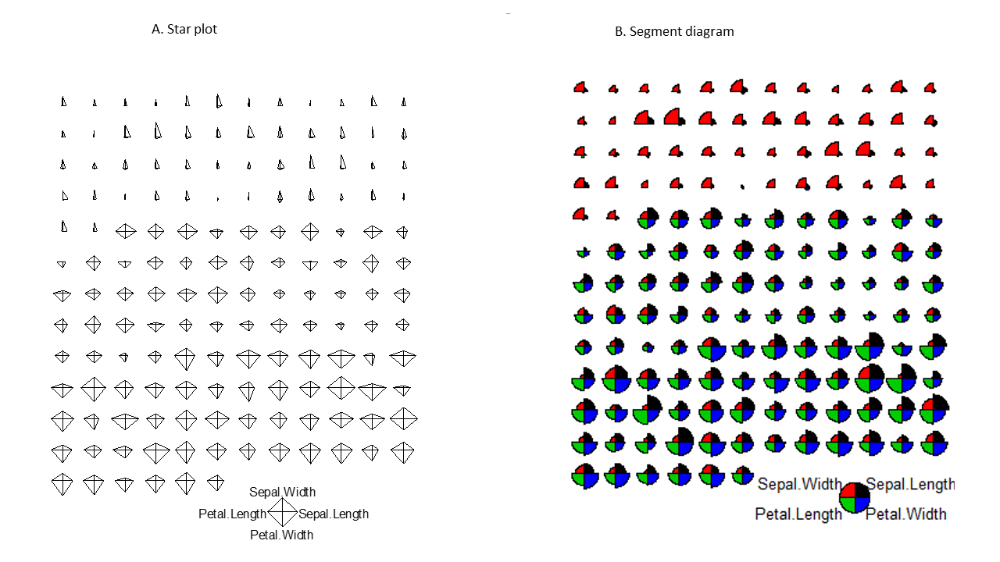

# Visualizing the iris flower data set

Learning objectives:

- Understand basic concepts of R graphics
- Install and load R packages 
- Create basic plots with ggplot2
- Explore various methods to visualize the iris flower dataset

## Basic concepts of R graphics

Let's start with base R graphics. We have two main categories of graphics functions in base R: high-level and low-level. High-level functions are the initiators, starting a new plot and setting the stage for further additions using low-level functions. Here’s a table for a clearer picture:
  
  Function   |  Description
  -----------|---------------------------------------------
  plot       | Generic plotting function
  boxplot	   | boxplot. Works with matrix columns or equations (e.g., boxplot(y ~ x))
  hist	     | histogram
  qqnorm	   | Quantile-quantile (Q-Q) plot to check for normality
  curve	     | Graph an arithmetic function
  barplot	   | Barplot
  mosaicplot | Using mosaics to represent the frequencies of tabulated counts.
  heatmap	   | Using colors to visualize a matrix of numeric values.


Table: High-level graphics functions that start a new plot
  
\newline  \newline

In contrast, Low-level functions are the collaborators, adding elements to an existing plot without starting afresh, as shown below:


  Function   |  Description
  -----------|---------------------------------------------
  points	   | Add points to a plot
  lines	     | Draw lines on a plot
  abline	   | Plot a straight line
  segments	 | Add line segments
  text	     | Insert text into a plot
  legend	   | Append a legend to a plot
  arrows	   | Add arrows to a plot

Table: Low-level graphics functions that add elements to an existing plot


Another crucial distinction about data visualization is between plain, exploratory plots and 
refined, annotated ones. Both types are essential. To get some sense of what the data looks like, Exploratory Data Analysis (EDA) often involves generating numerous "plain" graphics with **default settings**. R is a very powerful EDA tool. 

When certain aspects of the data catch our eye, we may aim for more polished graphics suitable for publications or presentations. This often involves additional coding to tweak various parameters. For many, including myself, this process is a mix of Google searches, example code snippets, and a healthy dose of trial and error.

One of the open secrets of R programming is that you can start from a plain figure and  **refine it step by step**. Here is an example using the base R graphics, which produces a basic scatter plot with the petal length on the x-axis and petal width on the y-axis. Since iris is a data frame, we will use the ```iris$Petal.Length``` to refer to the Petal.Length column. 

```{r, fig.align='center', out.width='80%' }
PL <- iris$Petal.Length
PW <- iris$Petal.Width
plot(PL, PW)
```
  
To change the type of symbols: 
```{r, fig.align='center', out.width='80%'}
plot(PL, PW, pch = 2) # pch = 2 means triangle symbols
```


The **pch** parameter ranges from 0 to 25, with each number representing a different symbol. Figure \@ref(fig:pchsymbols) illustrates commonly used values and symbols.
  
```{r pchsymbols, echo=FALSE, out.width='100%', fig.cap='Points Symbols.', fig.align='center'}
knitr::include_graphics(normalizePath("images/ch2_1_pch_symbols.png"))
```

To explore more customization options for the **plot** function, consult the R documentation:
```{r, eval=FALSE}
? plot
```

Altering data point colors is effortless with the **col = ** parameter.
```{r, fig.align='center', out.width='80%'}
plot(PL, PW, pch = 2, col = "green") # Change the symbol color to green
```

Next, Let's use different symbols for different species. Begin by extracting the species information. 
```{r, fig.align='center', out.width='80%'}
iris$Species
```
This output shows that the 150 observations are classed into three species: *setosa*, *versicolor*, and *virginica*. If reading the iris data from a file, like what we did in Chapter 1, it's necessary to convert the Species column into a **factor** from **character**. 
```{r, fig.align='center', out.width='80%'}
iris$Species <- as.factor(iris$Species)
str(iris$Species)
```

**factors** are used to store categorical variables as levels. Once converted into a factor, each observation is represented by one of the three species. 
To numerically plot these factors, use the *as.numeric* function. Since we do not want to change the data frame, we will define a new variable called speciesID. 
```{r, fig.align='center', out.width='80%'}
speciesID <- as.numeric(iris$Species)
speciesID
```

Now, assign different markers to different species using *pch = speciesID*.
```{r, fig.align='center', out.width='80%'}
plot(PL, PW, pch = speciesID, col = "green")
```

Here, 150 integers stored in the speciesID factor are used
to alter marker types. The first 50 data points (*setosa*) are represented by open
circles (pch = 1), the next 50 (*versicolor*) by triangles (pch = 2), while the last
50 (*virginica*) by crosses (pch = 3).

Similarly, different colors can be assigned to each species.
```{r, fig.align='center', out.width='80%'}
# Red, green, and blue for *setosa*, *versicolor*, and *virginica* respectively
plot(PL, PW, pch = speciesID, col = speciesID)
```


Our figure is starting to look nice, with each iris species distinctly marked by color and shape. This might seem like overkill, but it's incredibly helpful, especially considering that some folks are colorblind. Let's enhance our plot further by adjusting labels and adding a title.


```{r, fig.align='center', out.width='80%'}
plot(PL, PW, # x and y
  pch = speciesID, # Symbol type
  col = speciesID, # Color
  xlab = "Petal length (cm)", # x label
  ylab = "Petal width (cm)", # y label
  main = "Petal width vs. length"  # Chart title
) 
```
Notice the multi-line structure of this chunk? Breaking long lines into shorter ones enhances clarity and readability. And fear not when typing in the Console window, R knows that you are not done, and waits patiently for your closing parenthesis.

Remember: indentation with two spaces and ending with a right parenthesis are key for reusable and understandable code, for others or your future self. Check out these style guides for more tips: 
[breif](http://adv-r.had.co.nz/Style.html) and 
[detailed](https://style.tidyverse.org/). It's like knowing the dress code for a fancy event.

A true perfectionist never settles. Spot the strong linear correlation between petal length and width? Let's add a trend line using **abline()**, a low level graphics function.  
```{r, echo = c(2), fig.align='center', out.width='80%'}
plot(PL, PW,
  pch = speciesID,
  col = speciesID,
  xlab = "Petal length (cm)",
  ylab = "Petal width (cm)",
  main = "Petal width vs. length"
)
abline(lm(PW ~ PL)) # The order is reversed as we need y ~ x
```
Here, ```lm(PW ~ PL)``` generates a linear model (lm) of petal width as a function of petal 
length. y ~ x is **formula notation** that used in many different situations.
The linear regression model is used to plot the trend line.

Next, we calculate the Pearson's correlation coefficient and mark it on the plot. 
```{r, fig.show=FALSE}
PCC <- cor(PW, PL) # Pearson's correlation coefficient
PCC <- round(PCC, 2) # Round to the 2nd place after decimal point
paste("R = ", PCC)
```
The *paste* function glues two strings together. Then we use the **text** function to 
place the merged string in the lower right corner by specifying the coordinate of (x=5, y=0.5). 

(ref:23-5) A refined scatter plot using base R graphics.

```{r 23-5, echo = c(3,4), fig.cap='(ref:23-5)', fig.align='center', out.width='80%'}
plot(PL, PW,
  pch = speciesID, # Unique symbols for each species
  col = speciesID, # Distinct colors
  xlab = "Petal length (cm)", # Label x-axis
  ylab = "Petal width (cm)", # Label y-axis
  main = "Petal width vs. length"
) # Add a title
abline(lm(PW ~ PL)) # Add a trend line
text(5, 0.5, paste("R=", PCC)) # Add text annotation
legend("topleft", # Specify the location of the legend
  levels(iris$Species), # Specify the levels of species
  pch = 1:3, # Symbol parade
  col = 1:3 # Color fiesta
) 
```
The last expression adds a legend at the top left using the *legend* function.
While **plot** is a high-level graphics function that starts a new plot,
**abline**, **text**, and **legend** are low-level functions that add to our existing plot. 

Now you should be proud of yourself if you are able to generate such a plot. This is how we create complex plots step-by-step with trial-and-error. Creating such intricate plots is an exercise in patience and creativity. But let's not forget another open secret of coding: "borrowing" ideas and code is totally fine! The [R Graphics Cookbook](https://r-graphics.org/) includes all kinds of R plots and
sample code. And websites? Check out [website:](http://www.r-graph-gallery.com/) <http://www.r-graph-gallery.com/> for more than 200 examples or dive into another collection at [here:](http://bxhorn.com/r-graphics-gallery/) <http://bxhorn.com/r-graphics-gallery/>. 
These resources are goldmines when you have a graph in mind and just need the right template to tweak.


## Scatter plot matrix

While data frames can have a mixture of numbers and characters in different
columns, **matrices typically contain only numbers**. Let's extract the first 4
columns from the data frame iris and convert them into a matrix:

```{r}
ma <- as.matrix(iris[, 1:4]) # Convert to matrix
colMeans(ma) # Calculate column means
colSums(ma)  # Calculate column sums
```
This technique can also be applied to rows using *rowMeans(x)* and *rowSums(x)*. 

Next up, let's create a scatter plot matrix using *pairs()* function.
```{r fig.keep="none"}
pairs(ma)
```
For a more colorful representation:

(ref:spm2-2) Scatter plot matrix.

```{r spm2-2, message=FALSE, out.width='100%', fig.cap='(ref:spm2-2)', fig.align='center'}
pairs(ma, col = rainbow(3)[speciesID]) # Set colors by species
```

>
```{exercise}

>
Interpret the scatter plot matrix in Figure \@ref(fig:spm2-2). 
```
>
\ \
>
```{exercise}

>
Plot a scatter plot matrix for dataset **mtcars**, utilizing different point symbols and colors based on the types of *cyl*. 
```

## Star and segment diagrams
**Star plot, also known as Radar chart, uses stars to visualize multidimensional data.** It is a useful way to display multivariate observations with an arbitrary number of variables. Each observation is represented as a star-shaped figure with one ray for each variable. For a given observation, the length of each ray is made proportional to the size of that variable. The star plot was firstly used by Georg von Mayr in 1877!
```{r fig.keep='none'}
df <- iris[, 1:4]
stars(df) # Do I see any diamonds?
stars(df, key.loc = c(17, 0)) # What does this tell you?
```

>
```{exercise}

>
Based on the star plot, What insights can you gather about the differences among the three iris species? 
```


The stars() function can also be used to generate segment diagrams, where each variable is used to generate colorful segments. The sizes of the segments are proportional to the measurements. 
```{r fig.keep='none'}
stars(df, key.loc = c(20, 0.5), draw.segments = TRUE)
```

(ref:12-4) Star plots and segments diagrams.

```{r 12-4, echo=FALSE, fig.cap='(ref:12-4)', fig.align='center'}

```

>
```{exercise}

>
Produce the segments diagram for the state data (state.x77) and offer interpretation of the results, especially in relation to South Dakota compared to other states. Hints: Convert the matrix to a data frame using *df.state.x77 <- as.data.frame(state.x77)*, then plot the segments diagram based on the dataset *df.state.x77*.
```


  
## The ggplot2 package is intuitive and powerful
In our R graphics toolkit, we have not just the base R graphics, but also the lattice and ggplot2 packages. These are the three musketeers of R graphics! Lattice builds upon base R for multi-faceted graphs, while ggplot2, developed on the principles of the Grammar of Graphics(hence the "gg"), adds layers to create complex graphics. Renowned for its intuitive design and powerful features, ggplot2 is becoming increasingly popular.

ggplot2's magic lies in its modular approach, enabling step-by-step refinement of charts through:

-   **Aesthetic mapping**:Linking variables to visual characteristics.
-   **Geometric shapes**: Crafting the visuals (points, lines, boxes, bars, histograms, maps, etc)
-   **Scales** and **statistical transformations**: Adjusting scales, applying transformations like log, reverse, count, etc.
-   **coordinate systems**: Framing the plot space. 
-   **facets**: Creating multiple plots for comparative analysis.
-   **Labels** and **annotations**: Adding textual elements for clarity.

For a deeper dive, check out these comprehensive tutorials on ggplot2  [here](https://uc-r.github.io/ggplot_intro) and 
by its [author](https://r4ds.had.co.nz/data-visualisation.html). 


Not part of the base R distribution, ggplot2 is available on the CRAN [website](https://cran.r-project.org/web/packages/ggplot2/index.html).
It need to be downloaded and installed. One of the main advantages of R is that it
is open, and users can contribute their codes as packages. If you are using
**RStudio**, you can choose **Tools-\>Install packages** from the main menu, and
then enter the name of the package. If you are using R software, you can install
additional packages, by clicking **Packages** in the main menu, and select a
mirror site. All these mirror sites work the same, but some may be faster. After
choosing a mirror and clicking "OK", you can scroll down the long list to find
your package. Alternatively, you can type this command to install packages.


```{r eval=FALSE}
# Install the package. You can also do it through the Packages Tab
install.packages("ggplot2")
```

Installation of a new package is a one-time affair, but remember, you need to **load** it from your hard drive into memory every time you use its **functions or data**.

```{r message=FALSE, warning=FALSE}
library(ggplot2) # Load the ggplot2 package
```

Let's walk through the steps of creating a scatter plot using ggplot2, adding layers one at a time.

```{r eval=FALSE}
# Start with the canvas
ggplot(data = iris)
```


(ref:2-6) Basic scatter plot using the ggplot2 package.

```{r 2-6, fig.cap='(ref:2-6)',fig.align='center', out.width='100%', message=FALSE}

# Map data to x and y coordinates
ggplot(data = iris) +
  aes(x = Petal.Length, y = Petal.Width)

# Add data points
ggplot(data = iris) +
  aes(x = Petal.Length, y = Petal.Width) +
  geom_point()

# Customize color & symbol type
ggplot(data = iris) +
  aes(x = Petal.Length, y = Petal.Width) +
  geom_point(aes(color = Species, shape = Species))

# Incorporate a trend line
ggplot(data = iris) +
  aes(x = Petal.Length, y = Petal.Width) +
  geom_point(aes(color = Species, shape = Species)) +
  geom_smooth(method = lm)

# Annotate with text to a specified location by setting coordinates x = , y =
ggplot(data = iris) +
  aes(x = Petal.Length, y = Petal.Width) +
  geom_point(aes(color = Species, shape = Species)) +
  geom_smooth(method = lm) +
  annotate("text", x = 5, y = 0.5, label = "R=0.96")
```

ggplot2 commands often span multiple lines. Each command is like a brushstroke, gradually building up your visual masterpiece. The '+' sign is a cue of the addition of another layer to your plot. ggplot2 takes care of many details, simplifying the process of creating complex plots like Figure \@ref(fig:23-5). 

```{r message=FALSE, fig.align='center', out.width='80%' }
ggplot(iris) +
  aes(x = Petal.Length, y = Petal.Width) + # Define the space
  geom_point(aes(color = Species, shape = Species)) + # Add points
  geom_smooth(method = lm) + # Add trend line
  annotate("text", x = 5, y = 0.5, label = "R=0.96") + # Annotate with text
  xlab("Petal length (cm)") + # X-axis labels
  ylab("Petal width (cm)") + # Y-axis labels
  ggtitle("Correlation between petal length and width") # Title
```

Creating a plot in ggplot2 resembles painting: startING with a blank canvas, gradually sketching the background, outlining the main features, and finally adding the detailed touches. Imagine yourself as an artist, with data as your palette.

```{r, echo=FALSE}
# URL https://giphy.com/gifs/l3vRnG8MctBsvAMtG
```

>
```{exercise}

>
Create a scatter plot of sepal length vs sepal width, differentiate species by colors and shapes, and include a trend line.
```

## Other types of plots with ggplot2

Creating box plots, a fundamental data visualization tool, is straightforward with ggplot2. For instance, examining sepal length across different iris species:

```{r out.width='80%',fig.align='center'}
library(ggplot2) # Load ggplot2
ggplot(data = iris) +
  aes(x = Species, y = Sepal.Length, color = Species) +
  geom_boxplot() # Classic box plot
```

Here, the categorical variable 'Species' is used on the x-axis to group data. The y-axis displays the distribution of sepal lengths. One of ggplot2's strengths is its ability to refine plots effortlessly.

(ref:22-1) Enhancing box plot with raw data points.

```{r fig.cap='(ref:22-1)', out.width='80%',fig.align='center'}
ggplot(data = iris) +
  aes(x = Species, y = Sepal.Length, color = Species) +
  geom_boxplot() +
  geom_jitter(position = position_jitter(0.2)) # Add jittered raw data points
```
Adding raw data points on top of the boxplot provides a richer view. To avoid cluttering, we jitter these points within each subgroup. The color-coding is simply achieved with "color = Species". ggplot2 gracefully handles the finer details, like the automatic generation of legends in these density plots.

(ref:2-7) Density plot of petal length by species.

```{r 2-7, fig.cap='(ref:2-7)',out.width='60%', fig.align='center' }
ggplot(data = iris) +
  aes(x = Petal.Length, fill = Species) +
  geom_density(alpha = 0.3) # A density plot with a touch of transparency
```


(ref:2-51) Density plot by subgroups using facets. 

```{r fig.cap='(ref:2-51)', out.width='80%',fig.align='center'}
ggplot(data = iris) +
  aes(x = Petal.Length, fill = Species) +
  geom_density(alpha = 0.3) +
  facet_wrap(~Species, nrow = 3)  # Facet for comparison across species
```

```{r dynamite, fig.cap='Dynamite Plot.', out.width='80%', fig.align='center'}
ggplot(iris) +
  aes(x = Species, y = Sepal.Width, fill = Species) +
  stat_summary(geom = "bar", fun = "mean") +
  stat_summary(geom = "errorbar", fun.data = "mean_se", width = .3) # Mean and error bar
```

The bar plot with error bar, as seen in \@ref(fig:dynamite) is humorously termed as "dynamite plot" due to its appearance. Rafael Irizarry, a renowned statistician, criticized dynamite plot in his [blog](https://simplystatistics.org/2019/02/21/dynamite-plots-must-die/): **"The dynamite plots must die!"**.  He pointed out dynamite plots' limitations in conveying detailed data information, obscure the outliers and overall distribution. So many scientists prefer box plots with jittered points for a more comprehensive view.
 
>
```{exercise}

>
Use boxplot and density plots to investigate the similarity and differences of petal width across the three species in the **iris** dataset. 
```

## Hierarchical clustering and heat map

**Hierarchical clustering** summarizes observations into trees representing the overall similarities. This technique is superb for visualizing how different samples relate to each other.

```{r}
ma <- as.matrix(iris[, 1:4]) # Convert to matrix
disMatarix <- dist(ma) # Calculate distance matrix
plot(hclust(disMatarix)) # Generate and plot hierarchical clustering tree
```

The **dist()** function calculates a distance matrix with the default Euclidean 
distance method. The distance matrix is then used by the **hclust()** function to generate a 
hierarchical clustering tree with the default complete linkage method, which is then plotted in a nested command. 

The 150 samples of flowers are organized in this cluster dendrogram based on their Euclidean 
distance, which is labeled vertically by the bar to the left side. Highly similar flowers are 
grouped together in smaller branches, and their distances can be found according to the vertical 
position of the branching point. We are often more interested in looking at the overall structure 
of the dendrogram. For example, we see two big clusters.

The detailed process of Hierarchical clustering: First, each of the flower samples is treated as a cluster. The algorithm joins
the two most similar clusters based on a distance function. This is performed
iteratively until there is just a single cluster containing all 150 flowers. At
each iteration, the distances between clusters are recalculated according to one
of the methods---*Single linkage, complete linkage, average linkage, and so on*.
In the single-linkage method, the distance between two clusters is defined by
the smallest distance among the all possible object pairs. This approach puts
'friends of friends' into a cluster. On the contrary, the complete linkage
method defines the distance as the largest distance between object pairs. It
finds similar clusters. Between these two extremes, there are many options in
between. The most robust linkage method is the average linkage, which uses the average of all distances. However, the default seems to be the complete linkage. Thus we need to change that in our final version.

**Heat maps**, especially when combined with hierarchical clustering, are fantastic for visualizing data matrices. The rows and columns are reorganized based on hierarchical clustering, and the values in the matrix are coded by colors. Heat maps can directly visualize millions of numbers in one plot. The hierarchical trees also show the similarity among rows and columns. 

```{r}
heatmap(ma,
  scale = "column",
  RowSideColors = rainbow(3)[iris$Species]
)
```

Scaling is handled by the **scale()** function, which subtracts the mean from each
column and then divides by the standard division. Afterward, all the columns
have the same mean of approximately 0 and standard deviation of 1. This is also
called standardization. The default color scheme uses yellow for higher values and red for lower ones. The color bar on the left corresponds to different species. This basic heatmap lacks a legend and could use some polishing. Instead of going down the rabbit hole of adjusting dozens of parameters to basic
heatmap function (or it's enhanced version heatmap.2 from the gplots package), We
will refine this plot using another R package called **pheatmap**. 


```{r eval = FALSE}
install.packages("pheatmap")
```

(ref:12-3) Heatmap for the iris flower dataset.

```{r 12-3, warning=FALSE, message=FALSE, fig.cap='(ref:12-3)', fig.align='center'}
library(pheatmap)
ma <- as.matrix(iris[, 1:4]) # Convert to matrix
row.names(ma) <- row.names(iris) # Assign row names in the matrix
pheatmap(ma,
  scale = "column",
  clustering_method = "average", # Use average linkage
  annotation_row = iris[, 5, drop = FALSE], # Add the 5th column as color bar
  show_rownames = FALSE
)
```

First, we convert the first 4 columns of the iris data frame into a matrix. Then
the row names are assigned to be the same, namely, "1" to "150". This is
required because row names are used to match with the column annotation
information, specified by the annotation\_row parameter. Even though we only
need the 5th column, i.e., Species, this has to be a data frame. To prevent R
from automatically converting a one-column data frame into a vector, we used 
*drop = FALSE* option. Multiple columns can be contained in the column
annotation data frame to display multiple color bars. The rows could be
annotated the same way.

More information about the pheatmap function can be obtained by reading the help
document. But most of the times, I rely on the online tutorials. Beyond the
official documents prepared by the author, there are many documents created by R
users across the world. The R user community is uniquely open and supportive. For instance, when I
was researching heatmap.2, a more refined version of heatmap, part of the gplots
package, and landed on Dave Tang's
[blog](https://davetang.org/muse/2010/12/06/making-a-heatmap-with-r/), which
mentioned that there is a more user-friendly package called pheatmap described
in his other
[blog](https://davetang.org/muse/2018/05/15/making-a-heatmap-in-r-with-the-pheatmap-package/).
Kamil Slowikowski's [blog](https://slowkow.com/notes/pheatmap-tutorial/) also provide valuable insights into function pheatmap.

Come back to our Figure \@ref(fig:12-3). It offers deep insights into the dataset. The 150 flowers in the rows are organized into different clusters. *I. Setosa* samples obviously formed a unique cluster, characterized by smaller (blue) petal length, petal width, and sepal length. The other two subspecies are not clearly separated but *I. Virginica* samples form a small subcluster showing bigger petals. The columns are also organized into dendrograms, reaffirming the strong correlation between petal length and width.


## Principal component analysis (PCA)
Principal Component Analysis (PCA) is a linear dimension-reduction method, simplifying the complexity in high-dimensional data by reducing its number of dimensions. This section may be skipped if you would like, as it contains more statistics than R programming. However, PCA is crucial for visualizing and interpreting data in a more comprehensible manner.

As illustrated in Figure \@ref(fig:13-4), PCA transforms the data into a new set of orthogonal coordinates, ranking them based on the variation or information they capture. PCA process results in:

-  Definitions of new coordinates,
-  Percentages of variances captured by these coordinates,
-  Representations of data points on these new coordinates.

Here the first component x’ gives a relatively accurate representation of the data.

(ref:13-4) Concept of PCA. 

```{r 13-4, echo=FALSE, out.width='75%', fig.cap='(ref:13-4)', fig.align='center'}
knitr::include_graphics("images/img1304_PCA.png")
```

Let's take the first 4 columns of the iris data for a PCA spin. Note that "scale = TRUE" normalizes the data before conducting PCA, ensuring each variable has unit variance.

```{r message=FALSE}
pca <- prcomp(iris[, 1:4], scale = TRUE) 
pca # Display PCA results.
```

The first principal component is positively correlated with Sepal length, petal length, and petal width. Recall that these three variables are highly correlated. Sepal width, which is relatively constant across species, influences PC2 the most, while sepal length influences PC2 the least.

```{r out.width='50%' }
plot(pca) # Plot the variance captured by each principal component.
str(pca) #  Explore PCA object structure
```

```{r }
head(pca$x) # New coordinate values for the 150 iris samples
```

To visualize the PCA results, we first construct a data frame suitable for ggplot2 format.
```{r fig.keep='none'}
pcaData <- as.data.frame(pca$x[, 1:2]) # Extract first two components
pcaData <- cbind(pcaData, iris$Species) # Add species information
colnames(pcaData) <- c("PC1", "PC2", "Species") # Rename columns

library(ggplot2)
ggplot(pcaData) +
  aes(PC1, PC2, color = Species, shape = Species) + # Define plot area
  geom_point(size = 2) # Add data points
```

Now we have a basic plot. We can add elements one by one using the “+” 
sign at the end of each line to add details to this plot. 

(ref:13-5) PCA plot of the iris flower dataset.

```{r 13-5, message=FALSE, fig.show='hold', out.width='80%', fig.cap='(ref:13-5)', fig.align='center'}
percentVar <- round(100 * summary(pca)$importance[2, 1:2], 0) # Calculate percentage variances
ggplot(pcaData, aes(PC1, PC2, color = Species, shape = Species)) +
  geom_point(size = 2) + # Add data points
  xlab(paste0("PC1: ", percentVar[1], "% variance")) + # x label
  ylab(paste0("PC2: ", percentVar[2], "% variance")) + # y label
  ggtitle("Principal component analysis (PCA)") + # Title
  theme(aspect.ratio = 1) # Width and height ratio
```

The plot (Figure \@ref(fig:13-5)) projects the 4-dimensional iris data onto a 2-dimensional space using the first two principal components. Based on its value, PC1 alone can distinguish the three species quite effectively: 
PC1 <  -1: Iris setosa; 
PC1 > 1.5: Iris virginica; 
-1 < PC1 < 1: Iris versicolor.


>
```{exercise}

>
Perform PCA on the state.x77 dataset (converted to a data frame) using state.region for color coding. Don't forget to normalize the data using scale function. Interpret your findings.
```

## Logistic Regression for Binary Outcomes Prediction 
Because this section contains more statistics than R programming like PCA, you may skip it too if you would like.
PCA helps us see the big picture, which reveals that *I. setosa* is easy to be distinguished from the other two species based on petal length alone. While logistic regression is a statistical method for predicting binary outcomes, particularly between *I. versicolor* and *I. virginica*. Let's build a model using the odds ratio of being *I. virginica* as a function of all
of the 4 measurements:


$$ln(odds)=ln(\frac{p}{1-p})
                     =a×Sepal.Length + b×Sepal.Width + c×Petal.Length + d×Petal.Width+c+e.$$

```{r}
df <- iris[51:150, ] # ocus on versicolor and virginica.
df <- droplevels(df) # Removes setosa, now an empty levels of species
model <- glm(Species ~ ., # Model: Species as a function of other variables
  family = binomial(link = "logit"),
  data = df
)
summary(model)
```
Interestingly, sepal measurements are not very helpful in distinguishing **versicolor** from
*virginica*. Petal length, however, emerges as a significant factor with P=0.0465. One unit
increase in petal length will increase the log-odds of being *virginica* by
9.429. Petal.Width is a marginally significant effect.

Don't worry if the mathematics behind logistic regression or logistic regression seems complex for you. The key is learning how to apply these analyses in R and interpret the results. Think R is a tool best learned through practice, much like a computer. I do not understand how computers work, yet I **use** it every day.

You do not need to finish the rest of this book. Now it's entirely possible to start working on one of your own datasets after reading the first two chapters.
If you do not have a dataset, consider sources such as [TidyTuesday](https://github.com/rfordatascience/tidytuesday). Set a research question and start experimenting. Feel free to borrow some example code as needed. 


>
```{exercise}

>
So far, we used a variety of techniques to investigate the iris flower dataset. Recall that in the very beginning, I asked you to eyeball the data and answer two questions:
>
a.	What distinguishes these three species? 
b.	If we have a flower with sepals of 6.5cm long and 3.0cm wide, petals of 6.2cm long, and 2.2cm wide, which species does it most likely belong to?
>
Review the raw data and previous analyses, write a paragraph with your conclusions supported by evidence. Feel free to conduct additional analysis if necessary.
```


References:
1 Beckerman, A. (2017). Getting started with r second edition. New York, NY, Oxford University Press.
