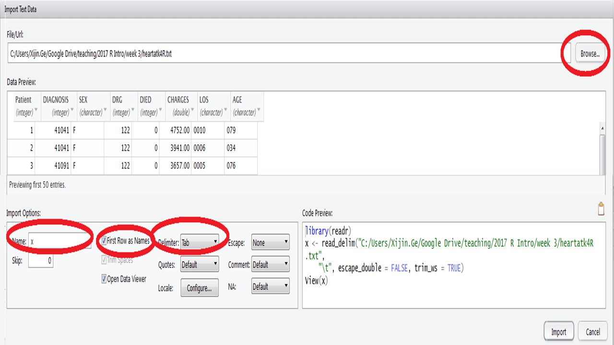

#  Data importing

## challenge
For the heart attack data set, if we assume that these patients are randomly drawn from United States, answer the following questions. 

1)	Do men and women suffer from heart attack at similar age?   (Hint: t-test,  boxplot or use lattice package)
2)	Are older people tend to stay longer in the hospital for heart attack? (Hint: correlation test, scatter plot)
3)	Are the specific types of heart attack (DIAGNOSIS) has anything to do with charges? (Hint: ANOVA, boxplot by subgroup, or use the lattice package)
4)	What is the most important predictor of survival? (Logistic regression, but the algorithm does not converge, so this question is optional.)

For each of the questions, we need both plots and quantitative analyses like statistical tests*.  I will encourage you to use the lattice package. One submission per group. Read the background information on this data and interpret results accordingly.

You are also required to post on our discussion topic individually. 
The instructions below might help you importing the data into R. 

There are many different ways to get data into R. You can enter data manually (see below), or semi-manually (see below).  You can read data into R from a local file or a file on the internet. You can also use R to retrieve data from databases, local or remote. The most import thing is to read data set into R correctly. A dataset not read in correctly will never be analyzed or visualized correctly.

```{r 9-0, echo=FALSE, out.width='50%', fig.align='center'}
knitr::include_graphics("images/img0900_note.png")
```

## Enter data manually
```{r}
options(knitr.graphics.auto_pdf = TRUE)
```

```{r}
x <- c(2.1, 3.1, 3.2, 5.4)
sum(x)
A <- matrix(
       c(2, 4, 3, 1, 5, 7),  # the data elements 
       nrow = 2,             # number of rows 
       ncol = 3)             # number of columns                     
A                            # show the matrix
x <- scan()  # Enter values from keyboard, separated by Return key. End by empty line. 
```
2.1

3.1

4.1

Note that you can paste a column of numbers from Excel.

## Reading data from file using Import dataset in Rstudio

Before reading files into R, we often need to open the files to take a look. Notepad or WordPad that come with Windows is very limited (and sooo amateur)! Do not even think about using Microsoft Word!   I strongly recommend that you install a powerful text editor such as NotePad++ (https://notepad-plus-plus.org/), or TextPad (https://www.textpad.com/).  If you are a Mac user, try TextMate, TextWrangler etc. I use NotePad++ almost every day to look into data, and also write R programs, as it can highlight R commands based on R syntax. I even use a tool called NppToR (https://sourceforge.net/projects/npptor/) to send R commands from NotePad++ directly to R, and I love it!

Regardless of their extensions in file names, all **plain text files** can be opened by these text editors. Plain text files only contain text without any formatting, links and images.  The file names can be “poems.txt”, “poems.tex”, “students.csv”,  or just “data” without extension. I often save my R scripts as text file with names like “code_1-22-2017.R”.  You can import text files, regardless of file names, to Microsoft Excel, which can properly parse your file into columns if the correct delimiter is specified. 

Comma separated values (CSV) files, use comma to separate the columns. CSV files can also be conveniently opened by Excel. And Rstudio likes it too. So let’s try to use CSV files. Another common type is tab-delimitated text files, which uses the tab or \t as it is invisible character.  Other types of files such as Excel .xls or .xlsx files often needed to be saved as CSV files. 

Probably the most intuitive way to read data into Rstudio is to use the **Import dataset** function available at **File->Import Datase**t from the Rstudio menu. You can also click  **Import dataset** button on the top-right of the Rstudio interface. The preferred format is CSV.  But it is not required. You can open a text file with Excel, and save it as a CSV file.

1.	Download data and read background information 
Download the heartatk4R.txt file from this page http://statland.org/R/RC/tables4R.htm It is also available in the Datasets folder on D2L. It is a tab-deliminated text file, meaning the different columns are separated by tab, hence the "\t" above.  
2.	In Rstudio, click **File->Import Datase->From CSV…**, find the file on your hard drive. You should change the **Delimiter** to “tab”, and the preview shows that the data is correctly parsed into multiple columns. You can also change the name of your data object by changing the default “heartatk4R” to **“x”** on the lower left of the import interface. See Figure \@ref(fig:3-1). 

The awesome nerds at Rstudio actually helped you generated these 3 lines of code:
```{r results='hide', message=FALSE}
library(readr)
x <- read_delim("C:/rbookdown/Learning R through Example/Learning R through Example-Source/heartatk4R.txt","\t", 
                escape_double = FALSE, trim_ws = TRUE)
View(x)  # shows the data, will change if you modify it. 
```

Before you click **Import**, I highly recommend that you select all the codes and copy it to your clipboard.  After clicking **Import**, you can paste the code into a script window. If you do not have a script window open, you can create one by clicking the **File +** icon on the top left. Copy and paste these code to your script file. You will need it when you want to re-run the analysis without going through the above steps. You can see the data appears as a spreadsheet, which can be sorted by clicking on the column names. This spreadsheet can be closed. To reopen, click on x object, which is a data frame named after the input file. You data is now available as x. 
   
(ref:3-1) Importing data into R.

```{r 3-1, echo=FALSE, fig.cap='(ref:3-1)', fig.align='center'}

```

3.	**Check data type**. Most of the times, R can guess the type of data in each column. But we always need to double check using the str command. If not satisfied, we can enforce data type conversion in R using the as.numeric, as.factor, or as.character functions.
```{r}
str(x)  # structure of data object, data types for each column
```

Note that the first column is just patient id number runs from 1 to 12844. It will not be useful in our analysis. The numbers in DIAGNOSIS, DRG, and DIED are integers but they actually **code for certain categories**. They are not measurements. It does not make sense, for example, to add them or average them. Most of the times, there is no particular order. The same is true for SEX.   
We need to reformat these columns as **factors**. We are going to use **x$SEX** to refer to the SEX column of the data frame x:
```{r}
x$DIAGNOSIS <- as.factor(x$DIAGNOSIS)  # convert this column to factor
x$SEX <- as.factor(x$SEX)
x$DRG <- as.factor(x$DRG)
x$DIED <- as.factor(x$DIED)
```

Now the last three columns are actually numeric measurements.  But the LOS and AGE were actually read as characters, due the fact that 10 is recorded as 0010.
```{r}
x$LOS <- as.numeric(x$LOS)  # convert to numeric
x$AGE <- as.numeric(x$AGE)
str(x)  # double check structure of data
summary(x)  # a summary often gives us a lot of useful information 
```
The summary( ) function is very useful to get basic information about data frames.

Note that for numeric columns we are shown mean, median, etc, while for factors the frequencies are shown.  This reassured us that the data types are correctly recognized. It also shows missing values for CHARGES. 
Some people got free treatment for heart attack? Maybe not. Missing does not mean zero. Maybe the data was not entered for some patients.  

We can also reformat the columns before clicking **Import**:
After locating the file, you can click on the automatically detected data type under each of the column names as shown in Figure \@ref(fig:9-2). By selecting “Factor” from the drop down and enter all possible levels separated by commas, you can successfully format this column as a factor.

(ref:9-2) Changing data types while importing data into Rstudio.

```{r 9-2, echo=FALSE, out.width='80%', fig.cap='(ref:9-2)', fig.align='center'}
knitr::include_graphics("images/img0902_datatype.png")
```   
   
## Data manipulation in a data frame 
We can sort the data by age. Again, type these commands in the script window, instead of directly into the Console window. And save the scripts once a while. 
```{r}
x <- x[order(x$AGE), ]  # sort by ascending order by AGE
```

**Global Environment** window contains the names and sizes of all the variables or objects in the computer memory. R programming is all about creating and modifying these objects in the memory with clear, step-by-step instructions. Now try to sort the data by clicking on the column names in spreadsheet from Global Environment. 

Just like in Excel, you can add a new column with computed results:
```{r}
x$pdc <- x$CHARGES / x$LOS
```

Here we created a new column pdc to represent per day cost. 
We can also create a column to represent age groups using the floor function just returns the integer part.
```{r}
x$ag <- floor(x$AGE/10) * 10
```

You can now do things like this:
```{r fig.keep='none'}
boxplot(x$CHARGES ~ x$ag)
```

Each box represents an age group. Older patients tends to stay longer in the hospital after being admitted for heart attack. 

You can extract a subset of cases:
```{r}
x2 <- subset(x, SEX == "F")  #  Only females “==” is for comparison and “=” is for assign value.
x3 <- subset(x, AGE > 80)  # only people older than 80
summary(x3)   
```

Try not to attach the data when you are manipulation data like this. 

**Challenge 1**: Generate a histogram of cost per day for middle-aged men aged between 40 and 60. Hint: subset your data step by step. 

## Reading file using read.table, read.csv, etc.
As you get more experience with R programming, there are many other options to import data.

1.	Create a new project folder by File->New Project->New Directory->Empty Project and then create a new folder.
2.	Download and save the heartatk4R.txt file to that new folder. That folder becomes your **default working directory**.  You can read the file like this.
3.	Now you can read the data yourself.
```{r}
heartatk4R <- read.table("heartatk4R.txt", header = TRUE, sep = "\t")
```

4.	Then we can repeat the above commands to check and adjust data types for the columns. 

In summary, we have the following code to read in the data. 
```{r results='hide'}
# Reading the heart attack dataset. I am not using the Import Dataset in Rstudio.
# We have to make sure the file is in the current working directory
# To set working directory from Rstudio main menu, go to Session  Set Working Directory
rm(list = ls())  # Erase all objects in memory
getwd()  # show working directory
x <- read.table("heartatk4R.txt", sep="\t", header = TRUE)
head(x)  # show the first few rows
# change several columns to factors
x$DRG <- as.factor(x$DRG)
x$DIED <- as.factor(x$DIED)
x$DIAGNOSIS <- as.factor(x$DIAGNOSIS)
x$SEX <- as.factor(x$SEX)
str(x)  # show the data types of columns
summary(x)  # show summary of dataset
```

Alternatively, you can skip all of the above and do this.  
```{r}
x <- read.table("http://statland.org/R/RC/heartatk4R.txt", 
                header = TRUE, 
                sep = "\t", 
                colClasses = c("character", "factor", "factor", "factor", 
                               "factor", "numeric", "numeric", "numeric"))
```

We are reading data directly from the internet with the URL. And we are specifying the data type for each column. 

**Challenge 2**: Type in Table \@ref(tab:9-01) in Excel and save as a CSV file. Create a new Rstudio project as outlined above. Create a script file with comments and starting scripts, including the rm(ls()) and getwd() command. Copy the CSV file to the new folder.  Import to Rstudio. Convert data types. Copy the generated R code similar to those shown in Figure \@ref(fig:9-2) into the script file. Submit your R code and the results from the **str(patients)** function to show the data structure and **head(patients)** to show the data. 

```{r echo=FALSE, results='hide'}
LastName <- c("Smith", "Bird", "Wilson")
Age <- c("19", "55", "23")
Sex <- c("M", "F", "M")
BloodPressure <- c("100", "86", "200+")
Weight <- c("130.2", "300", "212.7")
HeartAttack <- c("1", "0", "0")
dat <- data.frame(LastName,	Age, Sex, BloodPressure, Weight, HeartAttack)
data.frame(dat)
```
```{r 9-01, echo=FALSE}
knitr::kable(
  data.frame(dat),
  booktabs = TRUE,
  caption = 'An example of a multivariate dataset.'
)
```

(ref:09-02) Beginning a project in Rstudio, a recommended workflow: commenting, resetting, checking working folder.

```{r 09-02, echo=FALSE, fig.cap='(ref:09-02)', fig.align='center'}
knitr::include_graphics("images/img0902_function.png")
```  

## General procedure to read data into R:
1.	If data is compressed, unzip using 7-zip, WinRAR, Winzip, gzip. Any of these will do. 
2.	Is it a text file   (CSV, txt, …) or Binary file (XLS, XLSX, …)?    Convert binary to text file using corresponding application. Comma separated values (CSV) files, use comma to separate the columns. Another common type is tab-delimitated text files, which uses the tab or \textbackslash t as it is invisible character.  
3.	Open with a text editor (TexPad, NotePad++) to have a look. 
4.	Rows and columns?   Row and column names? **row.names = 1    header = T**
5.	Deliminaters between columns?(space, comma, tab…)     **sep = “\textbackslash t”**
6.	Missing values?  NA, na, NULL, blank, NaN, 0  **missingstring = **
7.	Open as text file in Excel, choose appropriate deliminater while importing, or use the **Text to Column** under Data in Excel. Beware of the annoying automatic conversion in Excel “OCT4”->“4-OCT”.  Edit column names by removing spaces, or shorten them for easy of reference in R. Save as CSV for reading in R.
8.	Change working directory to where the file was saved. Main menu: **File->Change dir…**
9.	read.table ( ),  or read.csv( ). For example,
 **x <- read.table(“somefile.txt”, sep = “\textbackslash t”, header = TRUE, missingstring = “NA”)**
10.	Double check the data with **fix( x )**, click on the column name to make sure each column is recognized correctly as **“character”** or **“numeric”**.  
Pay attention to columns contain numbers but are actually IDs (i.e. student IDs), these should be treated as character.  For example, **x $ ids <- as.character(x $ ids)**,  # x is the data frame and ids is the column name.  Also pay attention to columns contain numbers but actually codes for some discrete categories (1, 2, 3, representing treatment 1, treatment 2 and treatment 3). These needs to be reformatted as **factors**. This could be done with something like **x $ treatment <- as.factor(x $ treatment)**. 

Refresher using cheat sheets that summarize many R functions is available here: [https://www.rstudio.com/resources/cheatsheets/](https://www.rstudio.com/resources/cheatsheets/). It is important to know the different types of R objects: **scalars, vectors, data frames, matrix, and lists**. 

## Recommended workflow for EVERY project 

It is best to create a separate folder that contains all related files. You can do the same for research projects.  In Rstudio, this is called a **Project**.  
1.	**Create a project in a new folder**. I recommend you to start by setting up a project in a new folder by going to **File->New project->New Directory->Empty Project**. Then choose where the directory will be created on your hard drive. I created a directory called “week1” under  "C:\textbackslash Users \textbackslash Xijin.Ge \textbackslash Google Drive \textbackslash teaching \textbackslash 2017 R data visualization"^1^ .  Rstudio creates a Project file named like “week1.Rproj”, which contains information such as scripts files and working folders. Projects files can be saved and later opened from **File->Open**. You get everything ready to go on a particular assignment or research project. 

2.	**Copy required data files to the new directory**. From Windows or Mac operation systems, you can now copy all required data files to the directory just created. 

3.	**Creating a script file**. Once you have a new project created, the first step is to start a new script file by clicking the **File +**  button or go to **File->New file** and choose **R script file**. By default, the script file is called Untitled1.R. Rstudio will ask you to change it the first time you hit “Save” button . 

4.	**Start your R script by adding comments on background information**. Comments starting with “#” are ignored by R when running, but they are helpful for humans, including yourself, to understand the code. We re-cycle and re-use our codes over and over, so it is vital to add information about what a chunk of code does. Figure \@ref(fig:9-1) shows a recommended workflow for beginning your script.

5.	**Write your scripts while saving your project files**. If you click on the **Run** button, Rstudio runs the current line of code where your cursor is located. You can also select multiple lines and run them at once. You can jump back and forth but remember you are operating on the data objects sequentially. So sometimes you want to get a fresh start by running the reset line, namely:**rm(list=ls())**. This command lists and then deletes all data objects from R’s brain. As you develop your coding skills, following these guidelines can make you more efficient. Remember to save everything once a while by hitting the **Save** button on the main icon bar! Even though Rstudio saves your scripts every 5 seconds, it can crash.  

(ref:9-1) Beginning a project in Rstudio, a recommended workflow: commenting, resetting, checking working folder.

```{r 9-1, echo=FALSE, out.width='80%', fig.cap='(ref:9-1)', fig.align='center'}
knitr::include_graphics("images/img0901_rstudio.png")
```


** from original chapter 4(summary for Import function)**

## Reading data from a file using Import dataset in Rstudio

Probably the most intuitive (not the most convenient) way to read data into Rstudio is to use the Import Dataset function.  Following these steps carefully to read in your data:

1.	Create a folder called week3 on your computer. 
2.	Download data file to that folder. Download the **heartatk4R.txt** file from this page [http://statland.org/R/RC/tables4R.htm](http://statland.org/R/RC/tables4R.htm) It is also available in the Datasets folder on D2L. It is a tab-delimited text file, meaning the different columns are separated by tab.  
3.	Install **NotePad++** and open the data with it to take a look. For Mac users, try Text Edit.
4.	**Start Rstudio**. If you already started it, save your scripts. Go to **Help->Check for updates** from the main menu. Download and install the latest version if yours is not. 
5.	Create a new project by **File->New Project->Existing Directory**. Browse to select the week3 folder and click on **Create Project**. 
6.	Start a script window by **File->New file->R script**. The script window is where you will be entering your commands. Then click the **save button** and name the file like **week3_scripts.R**. You should save the script often while working on it. 
7.	Run and save scripts. In the script window, type **sum(1:100)**, then click the **Run button** on the top right. This command is sent to the console window and executed. You should see the result 5050. Click the **save button** to save your script before moving on. You can also highlight several lines of code and run them together.  If you have an error message, you can edit your code and re-run. 
8.	In Rstudio, click **File->Import Dataset->From text (base)**, and find the heartatk4R.txt file on your hard drive. You should double check the **Delimiter** is “tab”, and whether your data has column names as header. Inspect the preview to make sure the data is correctly parsed into multiple columns. After clicking Import, the awesome nerds at Rstudio actually helped you generated these 2 lines of code:
```{r}
#heartatk4R <- read.delim("C:/week3/heartatk4R.txt")
#View(heartatk4R)   # shows the data
```

**Copy and paste** this code to your script window. We like to keep a record of what happened. You can see the data appears as a spreadsheet, which can be sorted by clicking on the column names. This spreadsheet can be closed. To reopen, click on the heartatk4R object, which is a data frame named after the input file,  in the **Global Environment** window that contains the names and sizes of all the variables or objects in the computer memory. R programming is all about creating and modifying these objects in the memory with clear, step-by-step instructions. 

9.	**Check and convert data type.** Most of the times, R can guess the type of data (numbers vs. categories) in each column. But we need to double check and convert if necessary. First, we make a copy of the data. We will modify the new object (x) and leave the raw data (heartatk4R) as is. Type the following commands in the script window and execute them by clicking on the Run button. 
```{r results='hide'}
#x <- heartatk4R  # Make a copy of the data for manipulation, call it x. 
#str(x)  # structure of data object, data types for each column
```

10. Sorting, subsetting, and creating new columns. Try not to attach the data when you are manipulation data like this. 

