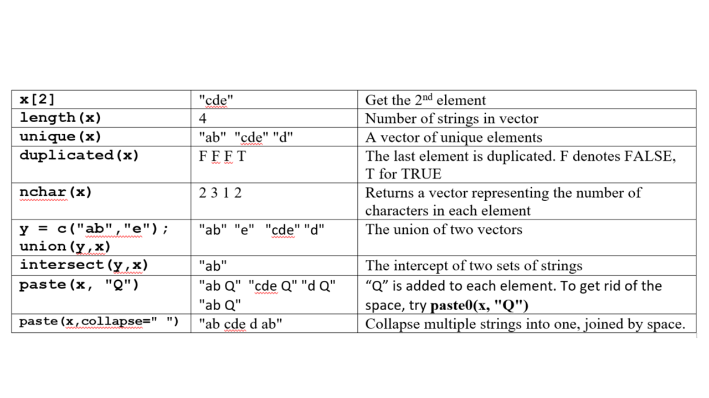
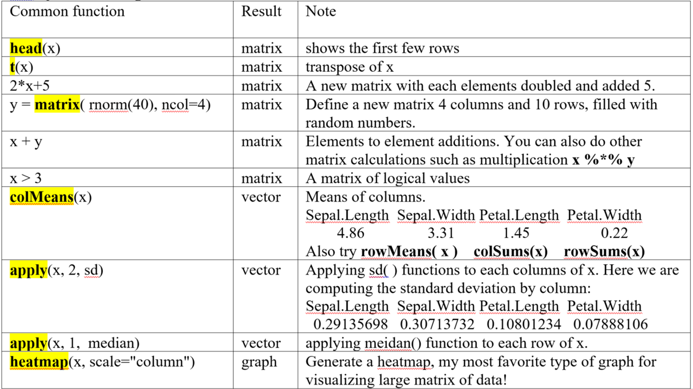
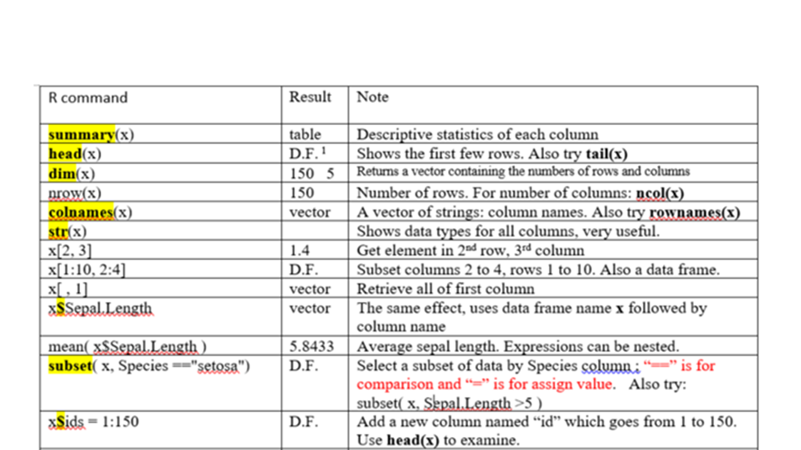

# Data structures

R data types and basic expressions^1^ :
Common **data structures** in R include **scalars, vectors, factors, matrices, data frames**, and **lists**. These data structures can contain one or more individual data elements of several types, namely **numeric** (2.5), **character** (“Go Jacks”), or **logical** (TRUE or FALSE). 

##	Expressions
Type anything at the prompt, and R will evaluate it and print the answer.
```{r}
1 + 1
```

There's your result, **2**. It's printed on the console right after your entry.

Type the string **"Go Jacks"**. (Don't forget the quotes!)
```{r}
"Go Jacks"
```

**Challenge 6a**: Now try multiplying 45.6 by 78.9  

##	Logical Values

Some expressions return a "logical value": **TRUE** or **FALSE**. (Many programming languages refer to these as "boolean" values.) Let's try typing an expression that gives us a logical value:
```{r}
3 < 4
```

And another logical value (note that you need a double-equals sign to check whether two values are equal - a single-equals sign won't work):
```{r}
2 + 2 == 5
```

**T** and **F** are shorthand for **TRUE** and **FALSE**. Try this:
```{r}
T == TRUE
```


##	Variables
As in other programming languages, you can store a value into a variable to access it later. Type **x = 42** to store a value in **x**.  x is a **scalar, with only one data element**. 
```{r}
x = 42
```

You can also use the following. This is a conventional, safer way to assign values.
```{r}
x <- 42
```

x can now be used in expressions in place of the original result. Try dividing **x** by **2** (**/** is the division operator).
```{r}
x / 2
```

You can re-assign any value to a variable at any time. Try assigning **"Go Jacks!"** to **x**.
```{r}
x <- "Go Jacks!"
```

You can print the value of a variable at any time just by typing its name in the console. Try printing the current value of x.
```{r}
x
```

Now try assigning the **TRUE** logical value to **x**.
```{r}
x <- TRUE
```

You can store multiple values in a variable or object. That is called a **vector**, which is explained below. An object can also contain a table with rows and columns, like an Excel spreadsheet, as a **matrix**, or **data frame**. 

##	Functions
You call a function by typing its name, followed by one or more arguments to that function in parenthesis. Most of your R commands are functional calls. Let's try using the sum function, to add up a few numbers. Enter:
```{r}
sum(1, 3, 5)
```

Some arguments have names. For example, to repeat a value 3 times, you would call the **rep** function and provide its **times** argument:
```{r}
rep("Yo ho!", times = 3)
```

##	Looking for Help and Example Code
```{r message=FALSE, results='hide'}
? sum 
```

A web page will pope up. This is the official help information for this function. At the bottom of the page is some example code. The quickest way to learn an R function is to run the example codes and see the input and output. You can easily copy, paste, and twist the example code to do your analysis. 

**example()** brings up examples of usage for the given function. Try displaying examples for the min function:
```{r results='hide', fig.keep='none'}
example(min)
```
```{r}
min(5:1, pi)  # -> one number
```

Example commands and plots will show up automatically by typing Return in RStudio. 
In R, you need to click on the plots. 
```{r message=FALSE, results='hide', warning=FALSE, fig.keep='none'}
example(boxplot)  # bring example of boxplot
```

I found a lot of help information about R through Google. **Google tolerate typos, grammar errors, and different notations. Also, most (99 %) of your questions have been asked and answered on various forums. Many R gurus answered a ton of questions on web sites like** [stackoverflow.com](stackoverflow.com)**, with example codes!**  I also use Google as a reference. 

**Challenge 6b**: Try to find and run the two functions that sets and returns the current working directory. 

**Challenge 6c**: Try to find and run the function that lists all the files in the current working folder. 

It is important to add comments to your code. Everything after the “#” will be ignored by R when running.  We often recycle and repurpose our codes. 
```{r}
max(1, 3, 5)  # return the maximum value of a vector
```

##	Vectors
A vector is an object that holds a sequence of values of the same type. A vector's values can be numbers, strings, logical values, or any other type, as long as they're all the same type. Once upon a time, Tom, Jerry, and Mickey went fishing and they caught 7, 3, and 9 fishes, respectively. This information can be stored in a vector, like this:
```{r}
c(7, 3, 9)
```

The **c** function (**c** is short for Combine) creates a new vector by combining a set of values. If we want to continue to use the vector, we hold it in an object and give it a name:
```{r}
fishes <- c(7, 3, 9)
fishes
```

**fishes** is a vector with 3 data elements. There are many functions that operate on vectors. You can plot the vector:
```{r fig.keep='none'}
barplot(fishes)  # see figure 6.1A
```

You can compute the total:
```{r}
sum(fishes)
```

We can access the individual elements by indices, starting at 1:
```{r}
fishes[3]
```

**Challenge 6d**: Does Mickey caught more fishes than Tom and Jerry combined? Write R code to verify this statement using the **fishes** vector and return a TRUE or FALSE value.

Jerry protested that the ¼ inch long fish he caught and released per fishing rules was not counted properly. We can change the values in the 2nd element directly by:
```{r}
fishes[2] <- fishes[2] + 1 
```

On the left side, we take the current value of the 2nd element, which is 3, and add an 1 to it. The result (4) is assigned back to the 2nd element itself. As a result, the 2nd element is increased by 1. This is not an math equation, but a value assignment operation. More rigorously, we should write this as fishes[2] **<-** fishes[2] + 1

We can also directly overwrite the values. 
```{r}
fishes[2] <- 4
fishes
```

They started a camp fire, and each ate 1 fish for dinner. Now the fishes left:
```{r}
fishes2 <- fishes - 1
fishes2
```

Most arithmetic operations work just as well on vectors as they do on single values. **R subtracts 1 from each individual element**. If you add a scalar (a single value) to a vector, the scalar will be added to each value in the vector, returning a new vector with the results. 

While they are sleeping in their camping site, a fox stole 3 fishes from Jerry’s bucket, and 4 fishes from Mickey’s bucket. How many left? 
```{r}
stolen <- c(0, 3, 4)  # a new vector
fishes2 - stolen
```

If you add or subtract two vectors of the same length, R will take the corresponding values from each vector and add or subtract them. The 0 is necessary to keep the vector length the same.

Proud of himself, Mickey wanted to make a 5ft x 5ft poster to show he is the best fisherman. Knowing that **a picture worthes a thousand words**, he learned R and started plotting. He absolutely needs his names on the plots. The data elements in a vector can have names or labels. 
```{r}
names(fishes) <- c("Tom", "Jerry", "Mickey")
```

The right side is a vector, holding 3 character values. These values are assigned as the names of the 3 elements in the fishes vector.  names is a built-in function. Our vector looks like:
```{r fig.keep='none'}
fishes
barplot(fishes)   # see figure 6.1B
```

(ref:6-1) Simple Bar plot

```{r 6-1, echo=FALSE, out.width='80%', fig.cap='(ref:6-1)', fig.align='center'}
knitr::include_graphics("images/img0601_fish.png")
```

Assigning names for a vector also enables us to use labels to access each element. Try getting the value for Jerry:
```{r}
fishes["Jerry"]
```

**Challenge 6e**: Now see if you can set the value for **Tom** to something other than 5 using the name rather than the index.

Tom proposes that their goal for next fishing trip is to double their catches.
```{r}
2 * fishes
```

Hopelessly optimistic, Jerry proposed that next time each should “square” their catches, so that together they may feed the entire school. 
```{r}
sum(fishes ^ 2)
```

Note that two operations are nested. You can obviously do it in two steps.

**Challenge 6f**: Create a vector representing the prices of groceries, bread $2.5, milk $3.1, jam $5.3, beer $9.1.  And create a bar plot to represent this information. 

Vectors cannot hold values with different modes (types). Try mixing modes and see what happens:
```{r}
c(1, TRUE, "three")
```

All the values were converted to a single mode (characters) so that the vector can hold them all.   To hold diverse types of values, you will need a **list**, which is explained later in Part 3 of this document. 

###	Sequence Vectors

If you need a vector with a sequence of numbers you can create it with **start:end** notation. This is often used in loops and operations on the indices of vectors etc. Let's make a vector with values from 5 through 9:
```{r}
5:9
```

A more versatile way to make sequences is to call the **seq** function. Let's do the same thing with **seq**:
```{r}
seq(5, 9)
```

seq also allows you to use increments other than 1. Try it with steps of 0.5:
```{r}
seq(5, 9, .5)
```

**Challenge 6g**: Compute 1+2+3… +1000 with one line of R code. Hint: examine the example code for sum( ) function in the R help document. 

###	Scatter Plots     
The **plot** function takes two vectors, one for X values and one for Y values, and draws a graph of them.
Let's draw a graph showing the relationship of numbers and their sines.

First, we'll need some sample data. We'll create a vector for you with some fractional values between 0 and 20, and store it in the x variable.

Now, try creating a second vector with the sines of those values:
```{r}
x <- seq(1, 20, 0.1)
y <- sqrt(x)
```

Then simply call plot with your two vectors:
```{r fig.keep='none'}
plot(x, y)
```

Great job! Notice on the graph that values from the first argument (x) are used for the horizontal axis, and values from the second (y) for the vertical.

**Challenge 6h**: Create a vector with 21 integers from -10 to 10, and store it in the x variable.  Then create a scatterplot of x2 against x. 

###	Missing data is represented as NA 

Sometimes, when working with sample data, a given value isn't available. But it's not a good idea to just throw those values out. R has a value that explicitly indicates a sample was not available: **NA**. Many functions that work with vectors treat this value specially.
We'll create a vector for you with a missing sample, and store it in the **a** variable.
Try to get the sum of its values, and see what the result is:
```{r}
a <- c(1, 3, NA, 7, 9)
sum(a)
```

The sum is considered "not available" by default because one of the vector's values was **NA**. This is the responsible thing to do; R won't just blithely add up the numbers without warning you about the incomplete data. We can explicitly tell **sum** (and many other functions) to remove **NA** values before they do their calculations, however.

Bring up documentation for the **sum** function:
```{r}
? sum
```

sum    pckage:base                    

R Documentation
...


As you see in the documentation, **sum** can take an optional named argument, **na.rm**. It's set to **FALSE** by default, but if you set it to **TRUE**, all **NA** arguments will be removed from the vector before the calculation is performed.

Try calling **sum** again, with **na.rm** parameter set to **TRUE**:
```{r}
sum(a, na.rm = TRUE)
```

To check if NA is in a vector, we use the function is.na( ). Note that the result is a vector holding logical values. 
```{r}
is.na(a)
```

**Challenge 6i**.   Now compute the average of values in a. Ignore the missing values. 

## Lists
Vectors contain a set of values. But one vector can only contain one type of values, numbers, characters, or logical values.  A list can store a series of objects of different types. 
```{r}
y <- list(height = 5,name = "John Doe", BP = c(100, 77))  # a list with 3 components
```

If we want one of the items in its original form, we can extract it with double square brackets:
```{r}
y[[3]]
```

Alternatively, we can refer to the objects by using the dollar sign and the name of the object:
```{r}
y$BP
```

Many R functions, such as *t.test()*, returns results as a **list**, which contain a series of components, such as a P value, a vector of residuals or coefficients, and even a matrix of data.  A list is the natural way to represent this sort of thing as one big object that could be parsed. 
```{r}
result <- t.test(rnorm(100), rnorm(100))  # rnorm(100): 100 random number
result  # A list holds all  results of t-test
result$p.value  # This retrieves just the P value
result$estimate  # this returns a vector containing two values
```

The help page of t.test contains information about what types of values are returned and their names.
```{r}
? t.test
```

Value

A list with class "htest" containing the following components:

**statistic**: …

**p.value**:   the p-value for the test.

**estimate**:  the estimated mean or difference in means depending on whether it was a one-sample test or a two-sample test.


With this in mind, let’s run a simulation using a loop. What we want to do is to generate two sets of 100 random numbers from the standard normal distribution with zero mean and unit standard deviation, and perform t-test and get the P value. By repeating this process 500 times, we want to see the distribution of P values and count how many times we get significant result with P < 0.05. 
```{r results='hide', fig.keep='none'}
pvalues <- rep(1, 500)  # define a vector containing 500 numbers, all equal to 1.
for (i in 1:500) {  # Loop: The values of i takes values from 1,2,3, …, 500
     result = t.test(rnorm(100), rnorm(100))    
     pvalues[i] = result$p.value  # P values are stored in the i-th element in the vector
}  
hist(pvalues)  # define
summary(pvalues)   
sum(pvalues < 0.05)  # Count how many P values are less than 0.05. 
```

**Challenge 6j**. Write R code to generate two vectors, each containing 100 random numbers from the standard normal distribution. Then compute Pearson’s correlation coefficient (PPC). Repeat 1000 times and plot the distribution of PPCs. Discuss your results briefly. Hint: You can use the above example code as a starting point. 

## Strings and string vectors
We encounter text data sometimes. Plus, we also have row and column names. We can easily manipulate these string objects.

One **String**:  Type  **x <- "R is cool"**  and then try each one of these:
```{r echo=FALSE}
knitr::include_graphics("images/img0701_string.png")
```

Define a **string** x: "R is cool"
```{r}
x <- "R is cool"
```

If we want to know the number of character of the string:
```{r}
nchar(x)
```

We can concatenate strings. By default a space is added.
```{r}
paste(x, "!!")
```

If we want to extract sub-string from position of 6 and 9:
```{r}
substr(x, 6, 9)
```

Split string into a list which is seperated by space:
```{r}
strsplit(x, " ")
```

Find pattern "R" and replace with "Tim":
```{r}
gsub("R", "Tim", x)
```

Or remove space followed by anything:
```{r}
gsub(" .*", "", x)
```

We can search for pattern like "is" in the string.
```{r}
grepl("is", x)
```

We can also convert the whole string into low case or upper case by "tolower" or "toupper" function.
```{r}
tolower(x)
toupper(x)
```

A **vector** can hold many strings. This can be a column of names or IDs in a table.  
Define a character vector by   **x <- c("ab",  "cde",  "d",  "ab")** then try these:
```{r echo=FALSE}

```

A **vector** can hold many strings. This can be a column of names or IDs in a table.  
First let's define a character vector x of: "ab",  "cde",  "d",  "ab".
```{r}
x <- c("ab", "cde", "d", "ab") 
```

If we are interested in the 2nd element:
```{r}
x[2]
```

Now we need to know the number of strings in the vector:
```{r}
length(x)
```

We can find out a vector of unique elements
```{r}
unique(x)
```

Is there any duplicated element in the vector?
```{r}
duplicated(x)
```
The last element is duplicated. F denotes FALSE, and T for TRUE.
If we want to know the number of characters in each of the element:
```{r}
nchar(x)
```

We can also unite two vectors x and y if we define another vector y first:
```{r}
y <- c("ab", "e")
union(x, y)
```

Is there intersept among these two sets of strings?
```{r}
intersect(x, y)
```

We can add something like "Q" to each element:
```{r}
paste(x, "Q")
```

To get rid of the space between these element and "Q", try paste0:
```{r}
paste0(x, "Q")
```

If we want to collapse multiple strings into one, which is joined by space:
```{r}
paste(x, collapse = " ")
```

Using these functions, we can achieve many things. For example if we have a piece of DNA sequence: 
```{r}
DNA <- "taaCCATTGtaaGAACATGGTTGTCcaaaCAAGATGCTAGT"
```

Note that I am using the assignment operator “<-”, instead of “=”, which also works most of the times but it could be ambiguous. First we need to convert everything to upper case. 
```{r}
DNA <- toupper(DNA)
```

Next, we want to cut this DNA into smaller pieces by looking for a certain pattern “ATG”. This type of thing happens in nature, as some enzymes cut DNA according to certain pattern. 
```{r}
segs <- strsplit(DNA, "ATG")
```

The result is contained in an object segs, which is a list.  We needed the unlist( ) function to convert list to a string vector. 
```{r}
segs <- unlist(segs)   
segs  # a vector of strings
segs[1]  # first segment
```

**Challenge 6k**. In the iris flower dataset iris, define a new column called FullName which contains the full species name by adding “Iris “ in front of species name. In other words, “setosa” should become “Iris setosa”, “virginica” would be “Iris virginica”, and “versicolor” needs to be “Iris versicolor”. 

## Matrix operations
A **matrix** has rows and columns, but it can only contain one type of values, i.e. numbers, characters, or logical values.   Define a matrix using the Iris dataset and try the following commands.

```{r echo=FALSE}

```

```{r}
x <- as.matrix(iris[1:10, 1:4])
```

First let's show the fist few rows
```{r}
head(x)
```

You can transform the matrix if you want, for the convenience of view and analysis.
```{r}
t(x)
```

We can produce a new matrix by each element is doubled and added 5
```{r}
y <- 2*x+5
y
```

Also we can do other calculation by adding or multiplying matrics.
```{r}
x + y
x * y
```

We can also get a logical matrix using logical code like:
```{r}
x>3
```

Now if we want to know the mean and sum of these rows and columns, try rowMeans(), colMeans(), rowSums(), colSums().
```{r}
rowMeans(x)
colMeans(x)
rowSums(x)
colSums(x)
```

Here we are computing the standard deviation by columns, using 2 for columns.
```{r}
apply(x, 2, sd)
```

Or median by rows, using 1 for rows. 
```{r}
apply(x, 1, median)
```

Heatmap is my favorite type of graph for visualizing a large matrix data.
```{r}
heatmap(x, scale = "column", margins = c(10,5))
```

**Challenge 6l**: Take the first 4 columns of iris data set and format as a matrix. Compute the median for each column using the apply function. 


## Operations on data frames
Once data is read in as **data frame**, these are commands you can use to analyze it. 
Type **x <- iris** and then try these commands:

```{r echo=FALSE}

knitr::include_graphics("images/img0704n1.png")
```

-^1^ D.F.: data frame


Read in data frame x:
```{r}
x <- iris
```

Using summary() we can get descriptive statistics of each column.
```{r}
summary(x)
```

head() and tail() functions show the fist and last few rows.
```{r}
head(x)
tail(x)
```

If we want to know both number of rows and number of columns of the data frame:
```{r}
dim(x)
```

We can just get number of rows or number of columns seperately:
```{r}
nrow(x)
ncol(x)
```

If we are intersted in the column names or row names, which should be a vector of strings:
```{r}
colnames(x)
rownames(x)
```

str() is a very useful function, which shows data types for all columns.
```{r}
str(x)
```

Like string and vector, we can select one elememt in the data frame, like elemnet in 2nd row and 3rd column.
```{r}
x[2, 3]
```

Also we can subset a smaller data frame from x, such as columns 2 to 4 and rows 1 to 10:
```{r}
x[1:10, 2:4]
```

We can only retrieve all of the first column:
```{r}
x[, 1]
```

Using the data frame name x followed column name has the same effect.
```{r}
x$Sepal.Length
```

If we need to know the average Sepal Length, we use mean() function. By the way, expressions can be nested.
```{r}
mean(x$Sepal.Length)
```

It's very common to select a subset of data by certain column. Note "==" is for comparison and "=" is for assign value.

**Challenge 6m**:  A researcher studied the pathogenicity of fungi species on certain plants. Their results are in two files in the Datasets folder on D2L as a zipped file pathogenicity.zip. Once unzipped, it contains two files. The first (pathogenicity.txt) contains pathogenicity (the “Infection” column) in terms percentages plant tissue infected. Each isolate was used to infect 9 plants. The entire experiment is repeated according to expt column (1 or 2). The second file (species.txt) contains information about the genotypes identified by sequencing of the fungi DNA. Isolate ID links these two files. The goal is to compare the pathogens in terms of pathogenicity.  These two files are available here and both are tab-deliminated text files.

1)	Create a folder, download the data files into it, and create an Rstudio project in the folder.

2)	Read in these two files. Note that for the species file, DO NOT treat Strings as factors. Unselect this in the import wizard. Keep a copy of the import command into your R script.

3)	Change the species name from “no matching sequences/no significant similarity” to “no match”

4)	Plot histogram of infection across all experiments.

5)	Merge these two files according to Isolate ID. 

6)	Show the number of rows and columns of the merged data.

7)	Show the first few rows of data.
8)	Show the column names

9)	Show summary descriptive statistics for all columns

10)	Show the data types of all columns in the merged data

11)	Create a pie chart by Species (hint: tabulate frequencies first)

12)	Generate a boxplot to compare infection percentage across species

13)	Sort the combined data by infection and show the most infectious species with highest percentages.

14)	Compute average infection for each of the species (use aggregate)

15)	Run linear regression for infection as a function of species, expt, and plant. We want to know if the technical replicate factors have significant impact on the data. Interpret your results.

Provide interpretation of the plots or quantitative analyses.

Submit R code and results. Please send me an email if you need help. Xijin.Ge@sdsate.edu

Hint: 1. Make sure the data is correctly imported in the desired type. Numeric, character or factor. 

Hint 2: Most R functions you need can be found in the **Error! Reference source not found**. 1-3 and previous notes. 

Hint 3: Structure your R code by partition into parts with comments.

## For more in-depth exercises
Go to: [http://tryr.codeschool.com/](http://tryr.codeschool.com/)  
This material is based on http://tryr.codeschool.com/    