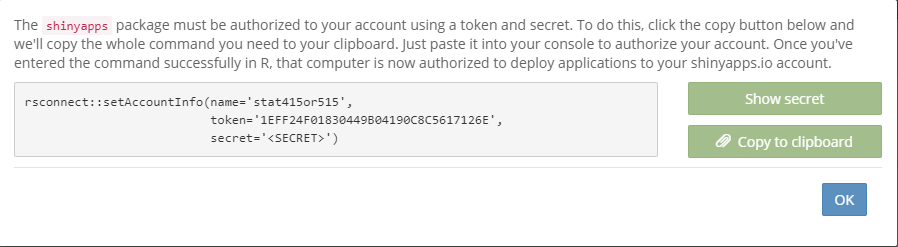

# Advanced topics


## Introduction to R Markdown


<iframe width="851" height="638" src="https://www.youtube.com/embed/AI6U08TrogY" frameborder="0" allow="accelerometer; autoplay; encrypted-media; gyroscope; picture-in-picture" allowfullscreen></iframe>


Let's start learning R Markdown from its cheat sheet. Here's a fun and simple way to start: Click the RStudio IDE and navigate to *Help $\rightarrow$ Cheatsheets $\rightarrow$ R Markdown Cheat Sheet.* As the cheat sheet explained, the R Markdown (.Rmd) file can combine your code and the output in one file, and produce documents in various formats, such as html, pdf, MS Word, or RTF.  

(ref:label0) R Markdown Cheat Sheet.

```{r label0, echo=F, out.width="80%", fig.cap='(ref:label0)', fig.align='center'}
knitr::include_graphics("images/Ch7_Adv_top_0.PNG")
```

Here is how to create an R Markdown file: Firstly, you need to open a new .Rmd file at File $\rightarrow$ New File $\rightarrow$. Then, in the open window, feel free to change the **Title**. For example, you can change the **Untitled** to **MyFirstRmd**. Third, choose the default output format from the three options: HTML, PDF or WORD. Then click "OK" . 

(ref:label1)  Create a new RMarkdown file.

```{r label1, echo=F, out.width = "80%", fig.cap = "(ref:label1)" , fig.align='center'}
knitr::include_graphics("images/Ch7_Adv_top_1.PNG")
```

Congratulations, you now have a new file named MyFirstRmd.Rmd.

The first part of the file is YAML (Yet Another Markup Language) header, which is surrounded by dashes "\-" . As shown in Figure \@ref(fig:label2), it specifies the key arguments for the document, such as **title**, **author**, **date**, and output format. If it says  **output: pdf_document**, congratulations, you have chosen **PDF** as the default format for your create file. 

(ref:label2)  YAML Header.

```{r label2, echo=F, out.width = "80%", fig.cap = "(ref:label2)" , fig.align='center'}
knitr::include_graphics("images/Ch7_Adv_top_2.PNG")
```

 
The second part of an .Rmd file is called chunks of R, surrounded by three back ticks "`". Figure \@ref(fig:label3) is an example of a chunk. The "nm_cars" after r in the \{ \} is the name of the chunk.  

(ref:label3)  Chunk of R.

```{r label3, echo=F, out.width = "45%", fig.cap = "(ref:label3)" , fig.align='center'}
knitr::include_graphics("images/Ch7_Adv_top_3.PNG")
```

A chunk is a collection of r code. You can run each chunk by clicking the right arrow on the top-right or using the Ctrl+Shift+Enter shortcut. R executes the code and displays the outputs along with the code，as illustrated in Figure \@ref(fig:label3). 

```{r nm_cars, echo=F}
summary(cars)
```

Many chunk options are available in the R Markdown Cheat Sheet. let's explore some common chunk options that you'll use frequently.

1, **eval = FALSE** behaves like a display case, showing the code but not evaluating it. The final document will only show the code, sans results.

```{r echo=FALSE, out.width='50%'}
knitr::include_graphics("images//Ch7_Adv_top_6.PNG")
```

2, **include = FALSE** is like a ninja, running the code, without displaying the code or result in the final document. 

```{r echo=FALSE, out.width='50%'}
knitr::include_graphics("images//Ch7_Adv_top_7.PNG")
```

3, **echo = FALSE** acts like a stagehand, hiding the code from the final document, and revealing only the output.

```{r echo=FALSE, out.width='50%'}
knitr::include_graphics("images//Ch7_Adv_top_8.PNG")
```

Another chunk below displays only the plot in the final document. The code does not show up since the `echo = FALSE` parameter was added to the code chunk.

```{r echo=FALSE, out.width='50%'}
knitr::include_graphics("images//Ch7_Adv_top_9.PNG")
```

4, **message = FALSE** prevents messages from appearing in the final document.

5, **warning = FALSE** is like a "Do Not Disturb" sign, preventing warnings from showing up in the final document.

6, **results = 'hide'** is a bit of a tease, Concealing printed output.

7, **fig.show = 'hide'** is like a magician, hiding plots in sleeve and out of sight.

8, **error = TRUE** acts as a brave soul, allowing the render to continue even if code returns an error.


The third part of an .Rmd file included the text mixed with symbols like # or *.

```{r echo=FALSE, out.width='100%'}
knitr::include_graphics("images//Ch7_Adv_top_4.PNG")
```

You can type your text like how you do in MS Word. The pound symbol **#** implies a heading. The number of pounds indicates the heading level; It runs from 1 to 6. One **#** presents the first level header, two **#**s imply the second level header, and etc. Here is an output displaying various levels.


```{r echo=FALSE, out.width='60%'}
knitr::include_graphics("images//Ch7_Adv_top_5.PNG")
```

To italicize a word, surround it with a single asterisk: \*Italic\* becomes *Italic*. For bolding, use two asterisks: \*\*bold\*\* turns into **bold**.

The final step is to obtain the whole output by clicking the **Knit** button on the top of the .Rmd file. You will be asked to name the file and save it to your PC if it is the first time you knit the file. 

Follow these simple steps as instructed, your output file will magically appear on your screen. 

## Tidyverse

Tidyverse is a collection of powerful R packages, including superheros like ggplot2, dplyr, readr, purr, tidyr, and tibble. They were all written by Hadley Wickham, a true hero in the open-source R world. Following the same design philosophy and grammar, these mighty packages are designed to make R code more readable, intuitive, and just plain fun. As they are so user-friendly, some people argue that beginners should start by learning them, instead of the base R. Now let’s explain the dplyr package in a little detail using the classic iris data set. 

```{r eval = FALSE}
install.packages("dplyr") 
```

``` {r message = FALSE, warning = FALSE}
library(dplyr)
```

In dplyr, we use the pipe operator '%>%' like a magic wand, sending data to the next stage. This is similar to the “+” operator we used in ggplot2 but for data manipulation. For example: to create a new data frame for setosa with sepals longer than 4.0:
```{r results='hide'}
iris %>% 
  filter(Species == "setosa", Sepal.Length > 4)
```

Add a new column for the ratios of sepal length to sepal width:
```{r results='hide'}
iris %>% 
  mutate(ratio = Sepal.Length / Sepal.Width)
```

Sort by sepal length in ascending order:
```{r results='hide'}
iris %>% 
  arrange(Sepal.Length)
```

The power of dplyr is that we can connect these pipe operators to define a work flow. Imagine we're looking for the Iris setosa flowers with the largest sepal ratio. 
```{r}
iris %>% 
  filter(Species == "setosa") %>%                  # Filter rows
  select(Sepal.Length, Sepal.Width) %>%            # Select two columns 
  mutate(ratio = Sepal.Length / Sepal.Width) %>%   # Add a new column
  arrange(desc(ratio))   %>%                       # Sort in descending order
  head()   # Show top rows. No more pipes, end of sequence.
```

Here, **filter**( ), **mutate**( ) and **arrange**( ) are 3 magical **“verbs”** that operate on the data frame sequentially. **head**( ) is the function that only shows the top rows. Notice the pipe operator '%>%' at the end of each line, leading us through the enchantment sequence, making the code a delight to read.
  
Two other useful verbs are **group_by**( ) and **summarise**( ), perfect for generating summary statistics. Below, we use group_by to split the dataset into 3 groups by the species, compute the means of sepal length and width, and then recombine. It is a **“split-apply-combine”** magic.  

```{r}
iris %>% 
  group_by(Species)  %>%  # Split by Species 
  summarise(avgSL = mean(Sepal.Length), avgSW = mean(Sepal.Width)) %>% 
  arrange(avgSL)
```

Here we've created a bouquet of new data frames, each displaying the mean sepal length and sepal width for each species. Obviously, we can change **mean**( ) to many other functions. This makes it very easy to summarize large data sets. 

Exercise Instructions:
For all the following exercises, you need to use R Markdown. Please submit both your .Rmd file and the final document in pdf format. (No answer key is required.)

>
```{exercise}

>
Fill in the blanks. Hint: Build your code piece by piece, testing each step. Use **head** or **summary** to check your work.
>
a. Read in the heart attack data from chapter 4. Insert Your own Path there.     
b. Calculate the average cost per day for patients with different DIAGNOSIS codes.    
c. Focus on females older than 20 and younger than 70 who stayed in the hospital at least one day.   
d. Sort the results in descending order.
e. Use one command with multiple steps.
>
heartatk4R <- read.csv("______________/heartatk4R.txt",  header = TRUE, sep = "\t",  
>          
    colClasses = c("character", "factor", "factor", "factor", "factor", "numeric", "numeric", "numeric")
>                           
head(heartatk4R)      
>
library(dplyr)
>
df <- heartatk4R %>%
>
  filter(SEX == "______" & AGE > 20 _____ AGE < 70 & ________) %>%
>
  group_by(___________) %>%
>
  ___________(CostPerDay = ___________) %>%
>
  summarise(AvgCostPerDay = __________(CostPerDay, na.rm = _______)) %>%
>
  ___________(-AvgCostPerDay)
>
df
```

## Interactive plots made easy with Plotly

Ever wished your ggplot2 creations could come alive? Let's dive into 'plotly'. 

```{r message = FALSE, warning = FALSE, eval = FALSE}
install.packages("plotly")
```

```{r message = FALSE, warning = FALSE}
library(plotly)
g <- ggplot(iris, aes(Petal.Width, Petal.Length , color = Species)) + geom_point() 
ggplotly(g)
```

We first generated the plot using ggplot2 and stored it in an object 'g', which was rendered interactively with plotly. If you mouse over the plot, the values are highlighted. Want a closer look? You can also select an area on the chart to zoom in. 


## Shiny Apps   
Recent developments in R made it easy to create interactive charts and even complex websites. Without any web development experience, I created a site entirely in R (iDEP http://ge-lab.org/idep/) to enable biologists to analyze genomic data on their own.  My blog (http://gex.netlify.com) is another RStudio creation. 

###	Install the Shiny package

To start your own magical journey, invoke Shiny by typing this in the console:
```{r eval = FALSE}
install.packages("shiny")
```

###	Create a Shiny web app is a piece of cake

```{r echo=FALSE, out.width='60%'}
knitr::include_graphics("images/img1201_shiny.png")
```

Start a new Shiny app by either using the shortcut above or navigating through **File -> New File -> Shiny Web App** from the RStudio main menu. Give your app a name, such as *test1*, and save it to your local PC. RStudio, being the helpful elf it is, provides a small, but functional sample app in a file named test1.app.R. Click on **Run App** on the top-right of the script window, a histogram will pop up. We can customize the histogram bins by moving the sliding bar, just like a DJ tweaking the soundboard.

```{r echo=FALSE, out.width='60%', fig.align='center'}
knitr::include_graphics("images//Ch7_Adv_top_10.PNG")
```

###	Let’s play!

We can further customize the outputs by editing the code. In the app.R file, there are two **functions**: *ui()* and *server()* . The *ui()* defines the user interface, and *server()* specifies the logic. 

a.	Personalize the color by changing the col = **'darkgray'** in line 44 to your favorite color, such as **'green', 'red'**, etc. For a rainbow effect, set it to col = **rainbow(10)** so that we can use ten colors on a rolling basis.

```{r echo=FALSE, out.width='80%'}
knitr::include_graphics("images//Ch7_Adv_top_11.PNG")
knitr::include_graphics("images//Ch7_Adv_top_12.PNG")
```

After saving the correction, run the app again.

```{r echo=FALSE, out.width='80%'}
knitr::include_graphics("images//Ch7_Adv_top_13.PNG")
```

b.	Switch the dataset. To replace the original dataset Old Faithful Geyser to a new dataset iris, we need to modify the columns and dataset specified on line 40. Meanwhile, by updating the content after **titlePanel** on line 16, we get a new title. See the hignlighted code in the following graphs.

```{r echo=FALSE, out.width='80%'}
knitr::include_graphics("images//Ch7_Adv_top_14_1.PNG")
knitr::include_graphics("images//Ch7_Adv_top_14_2.PNG")
knitr::include_graphics("images//Ch7_Adv_top_14.PNG")
knitr::include_graphics("images//Ch7_Adv_top_15.PNG")
```

Save the changes and run the app again. Figure \@ref(fig:label16) is the histogram of iris's Sepal length.

(ref:label16)  Output of the Sepal length in the iris.

```{r label16, echo=F, out.width = "80%", fig.cap = "(ref:label16)" , fig.align='center'}
knitr::include_graphics("images/Ch7_Adv_top_16.PNG")
```


c.	Adjust default bins. The default number of bins of 30, specified at line 25, is probably too big. Let's reduce it to 12 by setting value = 12.

```{r echo=FALSE, out.width='80%', fig.align='center'}
knitr::include_graphics("images//Ch7_Adv_top_17.PNG")
knitr::include_graphics("images//Ch7_Adv_top_18.PNG")
```

Save and rerun the app, now we have the histogram with 12 bins by default.

```{r echo=FALSE, out.width='80%', fig.align='center'}
knitr::include_graphics("images//Ch7_Adv_top_19.PNG")
```

d.	Add column selection. Would it be cool if the user can choose the variable from the output? Yes, it's possible! We can change 'Sepal.Length' to other columns by assigning x to other variables. To make it, add a control widget by inserting this line of code after line 20: "selectInput("cid", "Column", choices = colnames(iris)),". **Do not forget the comma at the very end! ** Remember, it is crucial!

```{r echo=FALSE, out.width='80%'}
knitr::include_graphics("images//Ch7_Adv_top_20.PNG")
knitr::include_graphics("images//Ch7_Adv_top_21.PNG")
```

Save and run the app. A **Column** control widget presents above the **Number of bins**. You are now able to select any of the variable in iris dataset. 

```{r echo=FALSE, out.width='80%'}
knitr::include_graphics("images//Ch7_Adv_top_22.PNG")
```


But wait, the histogram does not change correspondingly. This is because we have not changed the code with respect to the histogram. Take a look at the **server** function, on line 44, the histogram function is given as **hist(x,...)**, where **x <- iris[, 'Sepal.Length']**, specified on line 40. That's why only the histogram of Sepal length is produced. To let the histogram change according to the selection of column, we replace **x <- iris[, 'Sepal.Length']** with **x <- iris[, input\$cid ]** on the line 40. Note that the **cid** is consistent with the inserted code **selectInput( "cid",$\cdots$)** on line 20: "**sidebarPanel(selectInput("cid", "Column", choices = colnames(iris)),**".

```{r echo=FALSE, out.width='80%'}
knitr::include_graphics("images//Ch7_Adv_top_23.PNG")
knitr::include_graphics("images//Ch7_Adv_top_24.PNG")
```

Save and rerun the code. Then select a variable from the **Column**, say *Petal.Width*, now, the histogram of Petal width shows up accordingly.

```{r echo=FALSE, out.width='80%', fig.align='center'}
knitr::include_graphics("images//Ch7_Adv_top_25.PNG")
```

>
```{exercise}

>
What happens when you choose the last Column of "Species" in the app? 
Solve the issue by deleting the variable 'Species' from the data iris. Hint: Modify the code on line 20: *selectInput(“cid”, “Column”, choices = colnames(iris))*. 
```

To modify the title, let's define a main title as *titl <- *, and then assign it to the option "main =___ " in the hist() function.

>
```{exercise}

>
Change the title from “Histogram of x” to "Histogram of __" where _ is the name of the selected variable like “Sepal.Length”. Complete the question by filling in the blanks. Your output should look like the Figure 7.6.
>
titl <- paste("Histogram of", **input$cid**, sep = " ")
>
hist(x, breaks = bins, col = 'green', border = 'white', main = _______)
```
>
```{r echo=FALSE, out.width = "80%", fig.cap = "Histogram output." , fig.align='center'}
knitr::include_graphics("images/Ch7_Adv_top_27.png")
```


e.	Enhance your app with a more complex feature. Let's add an approximation normal distribution line by replacing the function **hist(x, breaks = bins, col = 'green', border = 'white')** with the code below:

```{r eval=F}
      h <- hist(x, breaks = bins, col = rainbow(10), border = 'white')
      yfit <- dnorm(bins, mean = mean(x), sd = sd(x)) 
      yfit <- yfit *  diff( h$mids[1:2]) * length(x) 
      lines(bins, yfit, col = "blue")
```

The output should mirror Figure \@ref(fig:label28).

(ref:label28) Output of adding an approximation normal distribution curve.

```{r label28, echo=F, out.width = "80%", fig.cap = "(ref:label28)" , fig.align='center'}
knitr::include_graphics("images/Ch7_Adv_top_28.png")
```

>
```{exercise}

>
Fill in the blanks to solve the error message when selecting **Species** in the **Column** in this app by plotting a pie chart instead. Your pie chart should be similar to Figure 7.8.
>
Hint steps:
>
1, Ensure the **selectInput()** line the same as its original with all columns selected. 
>
2, Separate the variables into two groups, numeric variables (columns 1 through 4) for histogram and categorical variable (5th column) for pie plot. 
>
3, Use 'if()' and '}else{' to differentiate the groups. 
```
>
```{r echo=F, out.width = "80%", fig.cap = "Pie chart output." , fig.align='center'}
knitr::include_graphics("images/Ch7_Adv_top_29.png")
```


```{r eval=FALSE, message=FALSE, warning=FALSE}
library(shiny)
# Define UI for application that draws a histogram
ui <- fluidPage(
   
   # Application title
   titlePanel("Interactive page for iris data"),
   
   # Sidebar with a slider input for number of bins 
   sidebarLayout(
      sidebarPanel(
        selectInput("cid", "Select the column", choices = ___________),
         sliderInput("bins",
                     "Number of bins:",
                     min = 1,
                     max = 50,
                     value = 12)
      ),
      
      # Show a plot of the generated distribution
      mainPanel(
         plotOutput("Plot")
      ) 
   )
 )

# Define server logic required to draw a histogram and pie plot

server <- function(input, output) {
   
   output$Plot <- renderPlot({
     
      x    <- iris[, input$cid]
      
      # Draw the histogram with the specified number of bins for variable columns
      ________ (input$cid %in% colnames(iris)[______]){
      bins <- seq(min(x), max(x), length.out = input$bins + 1)
      titl <- paste("Histogram of", input$cid, sep = " ")
      hist(x, breaks = bins, col = 'green', border = 'white', main = titl)
      
      # Draw the pie plot for categorical column Species
        __________
        count <- table(x)
        labl <- paste(names(count), "\n", count, sep = "")
        titl <- paste("Pie plot of", input$cid, sep = " ")
        pie(count, labels = labl, main = titl)
      }
   })
}

```


```{r echo=F, warning=FALSE}
library(shiny)

# Define UI for application that draws a histogram
ui <- fluidPage(
   
   # Application title
   titlePanel("Interactive page for iris data"),
   
   # Sidebar with a slider input for number of bins 
   sidebarLayout(
      sidebarPanel(
        selectInput("cid", "Select the column", choices = colnames(iris)),
         sliderInput("bins",
                     "Number of bins:",
                     min = 1,
                     max = 50,
                     value = 12)
      ),
      
      # Show a plot of the generated distribution
      mainPanel(
         plotOutput("Plot")
      ) 
   )
 )

# Define server logic required to draw a histogram and pie plot

server <- function(input, output) {
   
   output$Plot <- renderPlot({
     
      x    <- iris[, input$cid]
      
      # Draw the histogram with the specified number of bins for variable columns
      if (input$cid %in% colnames(iris)[1:4]){
      bins <- seq(min(x), max(x), length.out = input$bins + 1)
      titl <- paste("Histogram of", input$cid, sep = " ")
      hist(x, breaks = bins, col = 'green', border = 'white', main = titl)
      
      # Draw the pie plot for categorical column Species
      } else {
        count <- table(x)
        labl <- paste(names(count), "\n", count, sep = "")
        titl <- paste("Pie plot of", input$cid, sep = " ")
        pie(count, labels = labl, main = titl)
      }
   })
}


# Run the application 
#shinyApp(ui = ui, server = server)
```

### Publish your app

Ready to share your magical Shiny app with the world? Just follow these steps to publish it online. If it's your first time, fear not; It's easier than baking a pie(and less messy)!

Step 1: Click the "Publish" button at the top-right of the window. Then choose "ShinyApps.io" in the Connect Account window as shown in the Figure \@ref(fig:label30).

(ref:label30) Connect Account.

```{r label30, echo=F, out.width = "80%", fig.cap = "(ref:label30)" , fig.align='center'}
knitr::include_graphics("images/Ch7_Adv_top_30.png")
```

Step 2: Click "your account on ShinyApps" in the **Connect ShinyApps.io Account** window as shown in Figure \@ref(fig:label31).

(ref:label31) Connect ShinyApps.io Account.

```{r label31, echo=F, out.width = "80%", fig.cap = "(ref:label31)" , fig.align='center'}
knitr::include_graphics("images/Ch7_Adv_top_31.png")
```

Step 3: In the **Shinyapps.io by RStudio** window, hit "Sign Up". 

(ref:label32) Sign up.

```{r label32, echo=F, out.width = "80%", fig.cap = "(ref:label32)" , fig.align='center'}
knitr::include_graphics("images/Ch7_Adv_top_32.png")
```

Step 4: Type your email, password and confirm password in the window as shown in \@ref(fig:label33), then click "Sign Up".

(ref:label33) Registration.

```{r label33, echo=F, out.width = "80%", fig.cap = "(ref:label33)" , fig.align='center'}
knitr::include_graphics("images/Ch7_Adv_top_33.png")
```

Step 5: In the **Account Setup** window (Figure \@ref(fig:label34)), type an account name that you would like to use and click "Save". Remember, everyone will have a unique account name. If the name is already taken (like "MyFirstShiny"), the border of the box will turn to red. You need to pick up another name and keep it cool. I named my account "stat415or515". 

(ref:label34) Account Setup.

```{r label34, echo=F, out.width = "80%", fig.cap = "(ref:label34)" , fig.align='center'}
knitr::include_graphics("images/Ch7_Adv_top_34.png")
```

Step 6: A new window will pop up, showing you how to finish the final steps. Start by installing the package **rsconnect**. Then click the "Copy to clipboard" button in Figure \@ref(fig:label36), and paste it into your console to authorize your account. Lastly, replace the path in Figure \@ref(fig:label37) with the path where your Shiny app is saved. Remember, the slash is **forward** not backward in the path. For example, my shiny app *IrisData.R* saved at 'C:/Users/Documents/FirstShiny/' is published  with the following code:

```{r eval=F}
library(rsconnect)
rsconnect::deployApp('C:/Users/Documents/FirstShiny/IrisData')
```

(ref:label36) Authorization steps.

```{r label36, echo=F, out.width = "80%", fig.cap = "(ref:label36)" , fig.align='center'}

```

(ref:label37) Specify the path of your app.

```{r label37, echo=F, out.width = "80%", fig.cap = "(ref:label37)" , fig.align='center'}
knitr::include_graphics("images/Ch7_Adv_top_37.png")
```

Step 7: Find your app's URL link at the bottom of Figure \@ref(fig:label38). The link to my iris data is [https://stat415or515.shinyapps.io/IrisData/](https://stat415or515.shinyapps.io/IrisData/).

(ref:label38) Generate the link.

```{r label38, echo=F, out.width = "80%", fig.cap = "(ref:label38)" , fig.align='center'}
knitr::include_graphics("images/Ch7_Adv_top_38.png")
``` 

Show off your creation by sending the URL of your data to your friends or your adviser. For more detailed instructions, check out these excellent tutorials: 

[https://docs.rstudio.com/shinyapps.io/getting-started.html](https://docs.rstudio.com/shinyapps.io/getting-started.html)

[https://shiny.rstudio.com/tutorial/written-tutorial/lesson1/](https://shiny.rstudio.com/tutorial/written-tutorial/lesson1)

Looking for solutions to these exercises? They're hiding out at GitHub:

[https://github.com/gexijin/teach/blob/master/app.R](https://github.com/gexijin/teach/blob/master/app.R)


## Define your own function

Creating your own functions in R is like having a personal chef for your data – it cooks up exactly what you need, whenever you need it!

Take the following arithmetic function as a starter: 

$$f(x)=1.57345 x^3+ x^2-2x+1$$

Sure, you can compute it manually:
```{r}
x <- 5
1.57345 * x ^ 3 + x ^ 2 - 2 * x + 1
```

This will work, but why go through the hassle every time? Let’s define our own function without repeating same code every time:
```{r}
myf <- function(x) {                           # Name the function myf
       y = 1.57345 * x^3 + x^2 - 2 * x + 1     # Define the function
       return(y)                               # Return the function result
}
```

Note that “{”  and “}” signify the beginning and end of a block of code.  **“function”** is the magic word, telling R that a function is going to be defined. At the end, the **“return”** statement reveals the desired result. 

Now you can call the function easily:
```{r}
myf(5)     # Obtain the y value for x=5
```
or 
```{r}
myf(x = 5) 
```

It even works with vectors! For example:
```{r}
x <- - 10 : 10  # A vector with integer values from -10 to 10
myf(x)          # Apply the function myf() to x
plot(x, myf(x)) # Plot the function
```

Function can handle many different calculations beyond arithmetic functions. More than just numbers, it can take in one or more various data types and return a list of complex data objects. 

>
```{exercise}

>
Suppose f(x)= |x|+5x-6, where |x| means the absolute value of x.  
>
a. Write an R function to implement this arithmetic function.             
b. Use this function to calculate f(-4.534).                 
c. Plot the function's graph.                 
```


Now, let's define a function to count even numbers in a vector. 

```{r}
# Count the number of even integers in vec
evencount <- function(vec) {
  k <- 0                      # Assign 0 to a count variable k
  for (i in vec) {            # Loop through all elements (represented by i) in vec
                              # Values of i are actually vec[1],vec[2],...
    if (i %% 2 == 0)          # Test if i is an even or odd number
                              # %% is the modulo operator
      k <- k + 1              # Add to count if the number is even
                            
  }
  return(k)                   # Return the count of even numbers
}
```

```{r}
x <- c(2, 5, 7, 8, 14, 12, 8, 3) # Define a new vector x
evencount(x)                     # Count even numbers in 'x'
```

A variable is called local variable if it is only visible within a function. For instance, *k* and *vec* are local variables to the function **evencount()**. They disappear after the function returns. Trying to access them outside will leave you empty-handed:
```{r eval=F}
k  # Poof!
```

Error: object 'k' not found

```{r eval=F}
vec  # Gone with the wind!
```

Error: object 'vec' not found

A variable is called global variable if it is defined outside of a function and is accessible within the function. Here is an example:

```{r}
myfun.globle <- function (x){
  y <- 1
  return(x - 2 * y)
}
myfun.globle(8)    # Calculate 8-2*y = 8-2*(1) = 6
```
y is a global variable here.

The function *myfun.globle2()* defined below returns the same value as above. But both x and y within the parentheses *(x, y=1)* in *function*() are local variables.
```{r}
myfun.globle2 <- function (x, y = 1){ # y is set as 1 within the function by default
  return(x - 2 * y)
 }
myfun.globle2(8)    # Calculate 8-2*y = 8-2*(1) = 6
```


>
```{exercise}

>
Define a function which returns the count of all odd numbers in the vector x <- 1:99. 
```

>
```{exercise}

>
Create a function to count the values that are less than 0 for two vectors x=rnorm(50) and y=rnorm(5000), respectively. Then craft another function to calculate the proportion of such values for x and y respectively. Compare the calculated proportions with theoretical proportion 0.5, what conclusions can you make?
```


```{r echo=FALSE, results= 'hide', message=FALSE}
fun1 <- function(x){
  k <- 0
  for (n in x) { 
    if (n < 0) k <- k + 1
  } 
  return(k/length(x))  # Return the proportion of values less than 0
}

x = rnorm(50)
y = rnorm(5000)
fun1(x)
fun1(y)
```

So, except basic R skills, now you go through advance topics like R Markdown, Tidyverse, Plotly, ShinyApp, and function. Each topic is like a magical spell; use them wisely and watch your data dance to your tunes!