# Advanced topics


## Introduction to R Markdown

<iframe width="851" height="638" src="https://www.youtube.com/embed/AI6U08TrogY" frameborder="0" allow="accelerometer; autoplay; encrypted-media; gyroscope; picture-in-picture" allowfullscreen></iframe>


Let's start learning R Markdown from its cheat sheet. Click the RStudio IDE under *Help $\rightarrow$ Cheatsheets $\rightarrow$ R Markdown Cheat Sheet.* As the cheat sheet explained, the R Markdown (.Rmd) file can combine your code and the output in one file, and produce various formats, such as html, pdf, MS Word, or RTF documents.  

(ref:label0) R Markdown Cheat Sheet

```{r label0, echo=F, out.width="80%", fig.cap='(ref:label0)', fig.align='center'}
knitr::include_graphics("images/Ch7_Adv_top_0.PNG")
```

To create a R Markdown file by the following process, firstly, you can open a new .Rmd file at File $\rightarrow$ New File $\rightarrow$. In the open window, feel free to change the **Title**. For example, you can change the **Untitled** to **MyFirstRmd**. Then choose the default output format from the three options: HTML, PDF or WORD. Then click "OK". 

(ref:label1)  Create a new RMarkdown file

```{r label1, echo=F, out.width = "80%", fig.cap = "(ref:label1)" , fig.align='center'}
knitr::include_graphics("images/Ch7_Adv_top_1.PNG")
```

A new .Rmd file named MyFirstRmd.Rmd is created. 

The first part of the file is the YAML (Yet Another Markup Language) header. The YAML header is surrounded by dashes "\-". See the Figure \@ref(fig:label2). It specifies the key arguments for the document, such as **title**, **author**, **date**, and output format. The output format is html in the example. You may see the **output: pdf_document**, which means that the default format you have chosen is **PDF** when you created the file. 

(ref:label2)  YAML Header

```{r label2, echo=F, out.width = "80%", fig.cap = "(ref:label2)" , fig.align='center'}
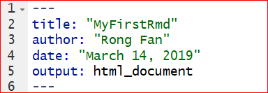
```

 
The second part of a .Rmd file is surrounded by three back ticks "`". They are called chunks of R. Figure \@ref(fig:label3) is an example of a chunk. The "nm_cars" after r in the \{ \} is the name of the chunk.  

(ref:label3)  Chunk of R

```{r label3, echo=F, out.width = "45%", fig.cap = "(ref:label3)" , fig.align='center'}
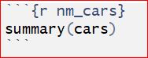
```

A chunk is a collection of r code. You can run each chunk by clicking the right arrow on the top-right of the chunk or by pressing the shortcut Ctrl+Shift+Enter. Then R executes the code and displays the outputs inline with the code. The output of chunk in Figure \@ref(fig:label3) is shown below. 

```{r nm_cars, echo=F}
summary(cars)
```

You can find many options for chunks in the R Markdown Cheet Sheet. let's take a look at some of the chunk options that you'll use frequently.

1, **eval = FALSE** stops code from being evaluated. See the chunk below which displays the code only. The code won't be evaluated and therefore does not have any result in the final document.

```{r echo=FALSE, out.width='50%'}
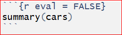
```

2, **include = FALSE** runs the code, but does not display the code or result in the final document. 

```{r echo=FALSE, out.width='50%'}
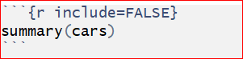
```

3, **echo = FALSE** hides the code from the final document, and only presents the output obtained from the chunk.

```{r echo=FALSE, out.width='50%'}
knitr::include_graphics("images//Ch7_Adv_top_8.PNG")
```

Another chunk below displays only the plot in the final document. The code does not show up in the final document since the `echo = FALSE` parameter was added to the code chunk.

```{r echo=FALSE, out.width='50%'}
knitr::include_graphics("images//Ch7_Adv_top_9.PNG")
```

4, **message = FALSE** prevents messages from apprearing in the final document.

5, **warning = FALSE** prevents warnings from showing up in the final document.

6, **results = 'hide'** hides printed output.

7, **fig.show = 'hide'** hides plots.

8, **error = TRUE** allows the render to continue even if code returns an error.


The third part of a .Rmd file is the text mixed with symbols like # or *.

```{r echo=FALSE, out.width='100%'}
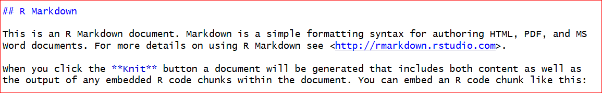
```

You can type your text like how you do in MS Word files. The pound symbol **#** implies a heading. The number of pounders indicate the heading level, it runs from 1 to 6. One **#** presents the first level header, two **#**s implies the second level header, and etc. Here is an output of various level headers.


```{r echo=FALSE, out.width='60%'}
knitr::include_graphics("images//Ch7_Adv_top_5.PNG")
```

The symbol \* arounds a word before and after will give an italic text format. If two \*s around a word before and after will bold the word. Such as, \*Italic\* and \*\*bold\*\* will be *Italic* and **bold** in the output file.

The last step is to obtain the output by clicking the **Knit** button on the top of the .Rmd file. You will be asked to name the file and save it to your PC if it is the first time you knit the file. Do as instructed, then an output file will be opened automatically. 

## Tidyverse

Tidyverse is collection of powerful R packages. The packages include ggplot2, dplyr, readr, purr, tidyr, and tibble. They were all written by Hadley Wickham, a true hero in the open-source R world. Following the same design philosophy and grammar, these powerful packages are designed to make R code easier to read. As they are more intuitive, some people argue that beginners should start by learning them, instead of the base R. Now Let’s explain the dplyr package in a little detail for manipulating iris data set. 

```{r message=FALSE, eval = FALSE}
install.packages("dplyr") 
```

``` {r}
library(dplyr)
```

In dplyr, we use the pipe operator %>% to send data to the next stage. This is similar to the “+” operator we used in ggplot2. To create a new data frame for setosa with sepals longer than 4.0:
```{r results='hide'}
iris %>% 
  filter(Species == "setosa", Sepal.Length > 4)
```

Add a new column that contains the ratios of sepal length to sepal width:
```{r results='hide'}
iris %>% 
  mutate(ratio = Sepal.Length / Sepal.Width)
```

Sort by sepal length in ascending order:
```{r results='hide'}
iris %>% 
  arrange(Sepal.Length)
```

The power of dplyr is that we can connect these pipe operators to define a work flow. Suppose we want to see the Iris setosa flowers with the largest ratio of sepal length to sepal width. 
```{r}
iris %>% 
  filter(Species == "setosa") %>%                  # filter rows
  select(Sepal.Length, Sepal.Width) %>%            # select two columns 
  mutate(ratio = Sepal.Length / Sepal.Width) %>%   # add a new column
  arrange(desc(ratio))   %>%                       # sort in descending order
  head()   # only show top rows. No more pipes, end of sequence.
```

**filter**( ), **mutate**( ) and **arrange**( ) are 3 **“verbs”** that operate on the data frame sequentially. **head**( ) is the function that only shows the top rows. Notice the pipe operator %>% at the end of each line.  This code is much easier to read by humans, as it defines a sequence of operations.
  
Two other useful verbs are **group_by**( ) and **summarise**( ). They can be used to generate summary statistics. Below, we use group_by to split the data frame into 3 data frames by the species information, compute the mean of sepal lengths and width, and then combine. So it is **“split-apply-combine”**.  

```{r}
iris %>% 
  group_by(Species)  %>%  # split by Species 
  summarise(avgSL = mean(Sepal.Length), avgSW = mean(Sepal.Width)) %>% 
  arrange(avgSL)
```

Here we created a new data frame with the mean sepal length and sepal width for each of the 3 species. Obviously, we can change **mean**( ) to many other functions. This makes it very easy to summarize large data sets. 

Note:
For all the following exercises, you need to do them by using R Markdown. You should submit your .Rmd file and the final document with pdf format. (You do not submit any answer key for these exercises. )

>
```{exercise}

>
Fill in the blanks. Hint: Build your code step by step. Test each step to make sure they work separately as desired. You can use the **head** or **summary** function at the end to examine if the desired data is produced. 
>
a. Read in the heart attack data same as you used in chapter 4. Insert Your own Path there.     
b. Calculate the average cost per day for patients with different DIAGNOSIS codes.    
c. Restrict to females aged older than 20 and younger than 70 who stayed at least one day.   
d. Sort the results in descending order.
e. Use one command with multiple steps.
>
heartatk4R <- read.csv("______________/heartatk4R.txt",  header = TRUE, sep = "\t",  
>          
    colClasses = c("character", "factor", "factor", "factor", "factor", "numeric", "numeric", "numeric")
>                           
head(heartatk4R)      
>
library(dplyr)
>
df <- heartatk4R %>%
>
  filter(SEX == "______" & AGE > 20 _____ AGE < 70 & ________) %>%
>
  group_by(___________) %>%
>
  ___________(CostPerDay = ___________) %>%
>
  summarise(AvgCostPerDay = __________(CostPerDay, na.rm = _______)) %>%
>
  ___________(-AvgCostPerDay)
>
df
```

## Interactive plots made easy with Plotly

```{r message = FALSE, warning = FALSE, eval = FALSE}
install.packages("plotly")
```

```{r message = FALSE, warning = FALSE}
library(plotly)
g <- ggplot(iris, aes(Petal.Width, Petal.Length , color = Species)) + geom_point() 
ggplotly(g)
```

We first generated the plot using ggplot2 and stored it in an object g, which is rendered interactive with Plotly. If you mouse over the plot, the values are highlighted. You can also select an area on the chart to zoom in. 

The R community is uniquely supportive. There are lots of free online books, tutorials, example codes, etc. Here are some helpful websites and information.


## Shiny Apps   
Recent developments in R made it easy to create interactive charts and even complex websites. Without any web development experience, I created a site entirely in R ( iDEP http://ge-lab.org/idep/ ) to enable biologists to analyze genomic data on their own.  My blog (http://gex.netlify.com ) is also created in Rstudio. 

###	Install the Shiny package by typing this in the console.
 
```{r eval = FALSE}
install.packages("shiny")
```

###	Create a Shiny web app is a piece of cake

```{r echo=FALSE, out.width='60%'}
knitr::include_graphics("images/img1201_shiny.png")
```

Start a new Shiny app use the shortcut shown above. Or, select **File -> New File -> Shiny Web App** from the RStudio main menu. Give your app a name, such as *test1*. Save the app to your local PC. The nice nerds at Rstudio understand the power of an example. A small, but functional app is shown, defined in a file called test1.app.R. Click on **Run App** on the top-right of the script window, a histogram will pop up. We can custermize the number of bins of the histogram by moving the sliding bar.

```{r echo=FALSE, out.width='60%', fig.align='center'}
knitr::include_graphics("images//Ch7_Adv_top_10.PNG")
```

We can further custermize the outputs by editing the code. In the app.R file, there are two **functions**: *ui()* and *server()* . The *ui()* defines the user interface, and *server()* specifies the logic. 

###	Let’s play!

a.	Change the color by changing the col = **'darkgray'** in line 44 to your favorite color, such as **'green', 'red'**, etc. To make it colorful, set it to col = **rainbow(10)** so we can use ten colors on a rolling basis. See the highlignted code.

```{r echo=FALSE, out.width='80%'}
knitr::include_graphics("images//Ch7_Adv_top_11.PNG")
knitr::include_graphics("images//Ch7_Adv_top_12.PNG")
```

After saving the correction, run the app again.

```{r echo=FALSE, out.width='80%'}
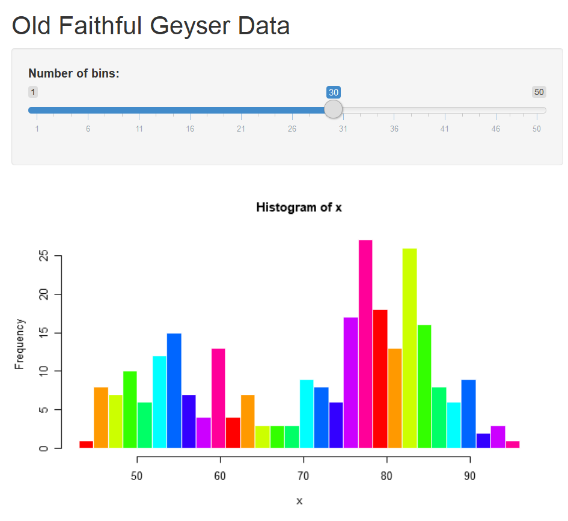
```

b.	Switch the data. To replace the original dataset Old Faithful Geyser to a new dataset iris, we need to change the columns and dataset specified on line 40. Meanwhile we need to change the content after **titlePanel** on line 16 to get a new title. See the hignlighted code in the following graphs.

```{r echo=FALSE, out.width='80%'}
knitr::include_graphics("images//Ch7_Adv_top_14_1.PNG")
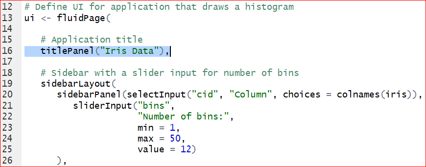
knitr::include_graphics("images//Ch7_Adv_top_14.PNG")
knitr::include_graphics("images//Ch7_Adv_top_15.PNG")
```

Save the changes and run the app again. Figure \@ref(fig:label16) is the output of histogram of the Sepal length in iris dataset.

(ref:label16)  Output of the Sepal length in the iris.

```{r label16, echo=F, out.width = "80%", fig.cap = "(ref:label16)" , fig.align='center'}
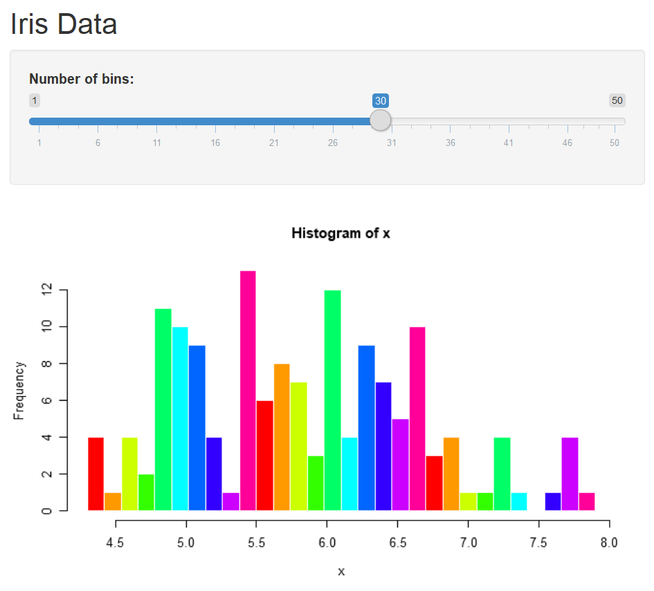
```


c.	The default number of bins of 30, specified at line 25, is probably too big. We can change the defaul value to 12 by setting value = 12.

```{r echo=FALSE, out.width='80%', fig.align='center'}
knitr::include_graphics("images//Ch7_Adv_top_17.PNG")
knitr::include_graphics("images//Ch7_Adv_top_18.PNG")
```

Save the changes and run the app again, we have the histogram with 12 bins by default.

```{r echo=FALSE, out.width='80%', fig.align='center'}
knitr::include_graphics("images//Ch7_Adv_top_19.PNG")
```

d.	We can change 'Sepal.Length' to other columns by assigning x to other variables. Would it be cool if the user can choose the variable from the output? To make it, we need to add a control widget by inserting this line of code after line 20: "selectInput("cid", "Column", choices = colnames(iris)),". Do not forget the comma at the very end! 

```{r echo=FALSE, out.width='80%'}
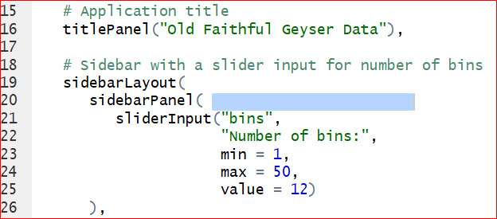
knitr::include_graphics("images//Ch7_Adv_top_21.PNG")
```

Save and run the app. A control widget **Column** presents above the **Number of bins**. We are able to select any of the variable in iris dataset. 

```{r echo=FALSE, out.width='80%'}
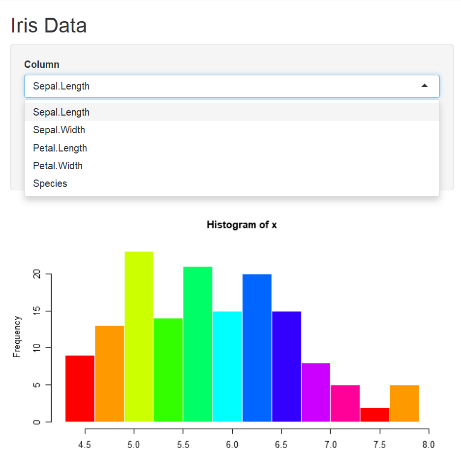
```


As you may have noticed that, the columns can be selected from the control widget **Column**, but the histogram does not change correspondingly. This is because that we have not changed the code with respect to the histogram. Take a look at the **server** function, on line 44, the histogram function is given as **hist(x,...)** where **x <- iris[, 'Sepal.Length']** sepecified on line 40. That is why the histogram produces only the histogram of Sepal length. To let the histogram change according to the selection of columns, we replace **x <- iris[, 'Sepal.Length']** by **x <- iris[, input\$cid ]** on the line 40. Note that the **input\$cid** is consistant with the inserted code **selectInput( "cid",$\cdots$)** on line 20: "**sidebarPanel(selectInput("cid", "Column", choices = colnames(iris)),**".

```{r echo=FALSE, out.width='80%'}
knitr::include_graphics("images//Ch7_Adv_top_23.PNG")
knitr::include_graphics("images//Ch7_Adv_top_24.PNG")
```

Save and run the code. Select a variable from the **Column**, say *Petal.Width*, then the histogram of Petal width shows up correctly.

```{r echo=FALSE, out.width='80%', fig.align='center'}
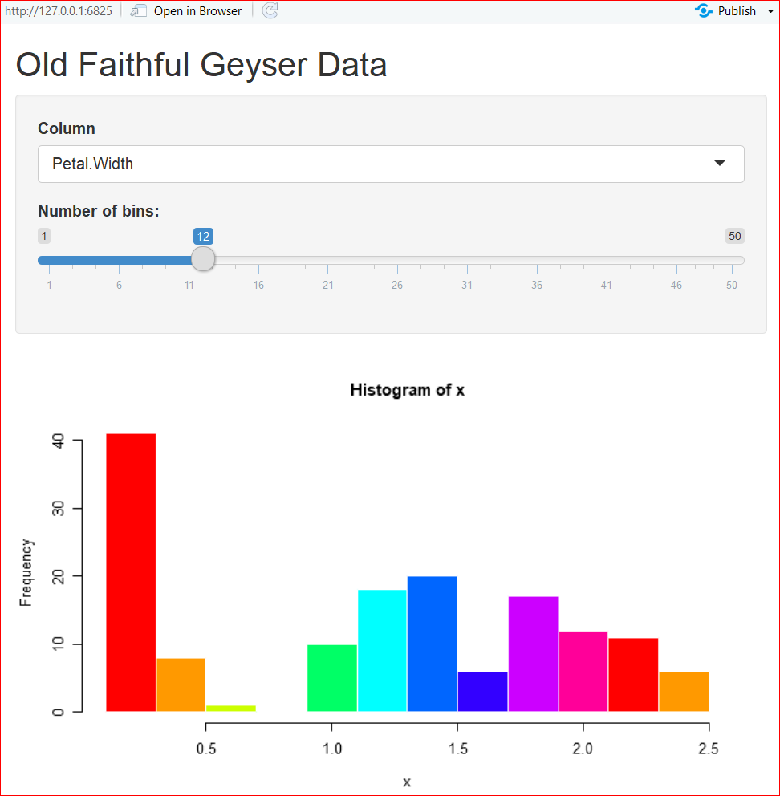
```

>
```{exercise}

>
What happens when you choose the last Column "Species" in the app? 
Solve the error by deleting the variable Species from the data iris. Hint: Modify the code on line 20: *selectInput(“cid”, “Column”, choices = colnames(iris))*. 
```

To change the title, let's define a main title as *titl <- *, then assign it to the option "main =___ " in the hist() function. Your output should look like the Figure 7.6.

>
```{exercise}

>
Change the title from “Histogram of x” to "Histogram of __" where _ is the name of the selected variable like “Sepal.Length”. Complete the question by filling in the blanks.
>
titl <- paste("Histogram of", **input$cid**, sep = " ")
>
hist(x, breaks = bins, col = 'green', border = 'white', main = _______)
```
>
```{r echo=F, out.width = "80%", fig.cap = "Histogram output" , fig.align='center'}
knitr::include_graphics("images/Ch7_Adv_top_27.PNG")
```


e.	We can build a more complex app by adding an approximation normal distribution line by replace the function **hist(x, breaks = bins, col = 'green', border = 'white')** by the code below:

```{r eval=F}
      h <- hist(x, breaks = bins, col = rainbow(10), border = 'white')
      yfit <- dnorm(bins, mean = mean(x), sd = sd(x)) 
      yfit <- yfit *  diff( h$mids[1:2]) * length(x) 
      lines(bins, yfit, col = "blue")
```

The output should be similar to Figure \@ref(fig:label28).

(ref:label28) Output of adding an approximation normal distribution curve.

```{r label28, echo=F, out.width = "80%", fig.cap = "(ref:label28)" , fig.align='center'}
knitr::include_graphics("images/Ch7_Adv_top_28.PNG")
```

>
```{exercise}

>
Fill in the blanks to solve the error message in this app by plotting a pie chart when the variable **Species** is selected in the **Column**. Your output of the pie chart should be similar to Figure 7.8.
>
Hint steps:
>
1, Change the **selectInput()** line as its original with all columns selected. 
>
2, Separate the variables into two groups, numeric variables (columns 1 throught 4) for histogram and categorical variables (5th column) for pie plot. 
>
3, Use if() and }else{ for each group. 
```
>
```{r echo=F, out.width = "80%", fig.cap = "Pie chart output" , fig.align='center'}
knitr::include_graphics("images/Ch7_Adv_top_29.PNG")
```


```{r, eval=FALSE, message=FALSE, warning=FALSE}
library(shiny)
# Define UI for application that draws a histogram
ui <- fluidPage(
   
   # Application title
   titlePanel("Interactive page for iris data"),
   
   # Sidebar with a slider input for number of bins 
   sidebarLayout(
      sidebarPanel(
        selectInput("cid", "Select the column", choices = ___________),
         sliderInput("bins",
                     "Number of bins:",
                     min = 1,
                     max = 50,
                     value = 12)
      ),
      
      # Show a plot of the generated distribution
      mainPanel(
         plotOutput("Plot")
      ) 
   )
 )

# Define server logic required to draw a histogram and pie plot

server <- function(input, output) {
   
   output$Plot <- renderPlot({
     
      x    <- iris[, input$cid]
      
      # draw the histogram with the specified number of bins for variable columns
      ________ (input$cid %in% colnames(iris)[______]){
      bins <- seq(min(x), max(x), length.out = input$bins + 1)
      titl <- paste("Histogram of", input$cid, sep = " ")
      hist(x, breaks = bins, col = 'green', border = 'white', main = titl)
      
      # draw the pie plot for catogorical column Species
      __________
        count <- table(x)
        labl <- paste(names(count), "\n", count, sep = "")
        titl <- paste("Pie plot of", input$cid, sep = " ")
        pie(count, labels = labl, main = titl)
      }
   })
}

```


```{r echo=F}
library(shiny)

# Define UI for application that draws a histogram
ui <- fluidPage(
   
   # Application title
   titlePanel("Interactive page for iris data"),
   
   # Sidebar with a slider input for number of bins 
   sidebarLayout(
      sidebarPanel(
        selectInput("cid", "Select the column", choices = colnames(iris)),
         sliderInput("bins",
                     "Number of bins:",
                     min = 1,
                     max = 50,
                     value = 12)
      ),
      
      # Show a plot of the generated distribution
      mainPanel(
         plotOutput("Plot")
      ) 
   )
 )

# Define server logic required to draw a histogram and pie plot

server <- function(input, output) {
   
   output$Plot <- renderPlot({
     
      x    <- iris[, input$cid]
      
      # draw the histogram with the specified number of bins for variable columns
      if (input$cid %in% colnames(iris)[1:4]){
      bins <- seq(min(x), max(x), length.out = input$bins + 1)
      titl <- paste("Histogram of", input$cid, sep = " ")
      hist(x, breaks = bins, col = 'green', border = 'white', main = titl)
      
      # draw the pie plot for catogorical column Species
      } else {
        count <- table(x)
        labl <- paste(names(count), "\n", count, sep = "")
        titl <- paste("Pie plot of", input$cid, sep = " ")
        pie(count, labels = labl, main = titl)
      }
   })
}


# Run the application 
#shinyApp(ui = ui, server = server)
```

### Pubish your app
You can publish your app online by clicking on the Publish button at the top right of the app window and following the instructions. If this is the first time you publish a shiny app, here are the steps.

Step 1: Click on "Publish" button in at the top-right of the window. Then click on "ShinyApps.io" in the Connect Account window as shown in the Figure \@ref(fig:label30).

(ref:label30) : Connect Account.

```{r label30, echo=F, out.width = "80%", fig.cap = "(ref:label30)" , fig.align='center'}
knitr::include_graphics("images/Ch7_Adv_top_30.PNG")
```

Step 2: Click "your account on ShinyApps" in the **Connect ShinyApps.io Account** window as shown in Figure \@ref(fig:label31).

(ref:label31) Connect ShinyApps.io Account

```{r label31, echo=F, out.width = "80%", fig.cap = "(ref:label31)" , fig.align='center'}
knitr::include_graphics("images/Ch7_Adv_top_31.PNG")
```

Step 3: Click "Sign Up" in the new **Shinyapps.io by RStudio** window. 

(ref:label32) Sign up

```{r label32, echo=F, out.width = "80%", fig.cap = "(ref:label32)" , fig.align='center'}
knitr::include_graphics("images/Ch7_Adv_top_32.PNG")
```

Step 4: Type your email, password and confirm password in the window as shown in \@ref(fig:label33), then click "Sign Up".

(ref:label33) Registration

```{r label33, echo=F, out.width = "80%", fig.cap = "(ref:label33)" , fig.align='center'}
knitr::include_graphics("images/Ch7_Adv_top_33.PNG")
```

Step 5: In the **Account Setup** window Figure \@ref(fig:label34), type an account name that you would like to use, then click on "Save". Everyone will have a unique accout name. For example, if you type "MyFirstShiny", then the border of the box turn to red which a reminder that the name is occupied. You need to pick up another name. I picked up my account name "stat415or515". 

(ref:label34) Account Setup

```{r label34, echo=F, out.width = "80%", fig.cap = "(ref:label34)" , fig.align='center'}
knitr::include_graphics("images/Ch7_Adv_top_34.PNG")
```

Step 6: A new window will show up and show you how to finish the next steps. Firstly, install the package **rsconnect**. Then click the "Copy to clipboard" button in Figure \@ref(fig:label36), and paste it into your console to authorize your account. Finally, replace the path in Figure \@ref(fig:label37) with the path where your Shiny app is saved. Note, the slash is **forward** not backward in the path. For example, I have a Shiny app named *IrisData.R* which is saved at 'C:/Users/Documents/FirstShiny/', then I run the following code to publish my app.

```{r eval=F}
library(rsconnect)
rsconnect::deployApp('C:/Users/Documents/FirstShiny/IrisData')
```

(ref:label36) Authorization

```{r label36, echo=F, out.width = "80%", fig.cap = "(ref:label36)" , fig.align='center'}
knitr::include_graphics("images/Ch7_Adv_top_36.PNG")
```

(ref:label37) Change the path to your app

```{r label37, echo=F, out.width = "80%", fig.cap = "(ref:label37)" , fig.align='center'}
knitr::include_graphics("images/Ch7_Adv_top_37.PNG")
```

Step 7: You can find the link at the bottom of Figure \@ref(fig:label38). The link for my iris data is [https://stat415or515.shinyapps.io/IrisData/](https://stat415or515.shinyapps.io/IrisData/).

(ref:label38) Generating the link

```{r label38, echo=F, out.width = "80%", fig.cap = "(ref:label38)" , fig.align='center'}
knitr::include_graphics("images/Ch7_Adv_top_38.PNG")
``` 

Show it off by sending the URL of your data to your friends or your adviser. More instructions can be found in these excellent tutorials: 
[https://docs.rstudio.com/shinyapps.io/getting-started.html](https://docs.rstudio.com/shinyapps.io/getting-started.html), and [https://shiny.rstudio.com/tutorial/written-tutorial/lesson1/](https://shiny.rstudio.com/tutorial/written-tutorial/lesson1/). 

Solutions to these exercises can be found at GitHub [https://github.com/gexijin/teach/blob/master/app.R](https://github.com/gexijin/teach/blob/master/app.R)


## Define your own function

We can also easily define our own functions. For example, we have the following arithmetic function: 

$$f(x)=1.5 x^3+ x^2-2x+1$$

Obviously, we can use the following code to do the computing:
```{r}
x <- 5
1.57345 * x ^ 3 + x ^ 2 - 2 * x + 1
```

This will work, but every time we have to re-write this code. Let’s define our own function without repeating same code everytime:
```{r}
myf <- function(x) {                           #Name of my function is myf
       y = 1.57345 * x^3 + x^2 - 2 * x + 1 #Expression of the function
       return(y)                               #Return vaules of the function
}
```

Note that “{”  and “}” signify the beginning and end of a block of code.  **“function”** tells R that a function is going to be defined. At the end, the **“return”** statement returns the desired values. 

You can copy and paste the 4 lines of code to R and it defines a function called myf, which you can call the function by:
```{r}
myf(5)     # Obtain the y value given x=5.
```
or 
```{r}
myf(x = 5) #
```

The funtion applies to a vector as well. For example:
```{r}
x <- - 10 : 10  # x is a vector with integer values from -10 to 10.
myf(x)          # Apply the function myf() to x.
plot(x, myf(x)) # Plot function f(x) = 1.57345 * x ^ 3 + x ^ 2 - 2 * x + 1.
```

Functions can handle many different calculations beyond arithmetic functions. It can take in one or more inputs and return a list of complex data objects too. 

>
```{exercise}

>
Suppose f(x)= |x|+5x-6, where |x| means the absolute value of x.  
>
a. Write an R function to implement this arithmetic function.               
b. Use this function to find f(-4.534).                 
c. Obtain the graph of the function.                 
```


Let's define a function to count even numbers in a vector. 

```{r}
#counts the number of even intergers in vec
evencount <- function(vec) {
  k <- 0                      # assign 0 to a count varialbe k
  for (i in vec) {            # Find all elements (represented by i) in vec. 
                              # Values of i are actually vec[1],vec[2],...
    if (i %% 2 == 0) 
      k <- k + 1              # test if i is an even or odd number. 
                              # %% is the modulo operator.
  }
  return(k)                   #Return the count of even numbers in vec.
}
```

```{r}
x=c(2, 5, 7, 8, 14, 12, 8, 3) # Define a new vector. 
evencount(x) # Call the function evencount(). Replace vec with defined vector x.
```

A vaiable is called local variable if it is only visible within a function. Such as *k* and *vec* are local variables to the function **evencount()**. They disappear after the function returns.

k

Error: object 'vec' not found

vec

Error: object 'vec' not found

A variable is called global variable if it is defined outside of functions. A global variable is also available within functions. Here is an example:

```{r}
myfun.globle <- function (x){
  y <- 1
  return(x - 2 * y)
}
myfun.globle(8)    # set x=8, and do the calculation: 8-2*y = 8-2*(1)=6
```
Here y is a global variable.

The function *myfun.globle2()* defined below returns the same values as above. But both x and y within the the paratheses *(x, y=1)* following *function* are local variables.
```{r}
myfun.globle2 <- function (x, y = 1){ #y is set as 1 within the function by default.
  return(x - 2 * y)
 }
myfun.globle2(8)    #8-2*y = 8-2*(1)=6
```

>
```{exercise}

>
Define a function which returns the count of all odd numbers in the vector x <- 1:99. 
```

>
```{exercise}

>
Define a function counting the values that are less than 0 for two vectors x=rnorm(50) and y=rnorm(5000) respectively. Define another function to calculate the proportion that values are less than 0 for x and y respectively. Compare calculated proportions with theoretical proportion 0.5, what conclusions can you make?
```


```{r echo=FALSE, results= 'hide', message=FALSE}
fun1 <- function(x){
  k <- 0
  for (n in x) { 
    if (n < 0) k <- k + 1
  } 
  return(k/length(x))
}
x = rnorm(50)
y = rnorm(5000)
fun1(x)
fun1(y)
```

