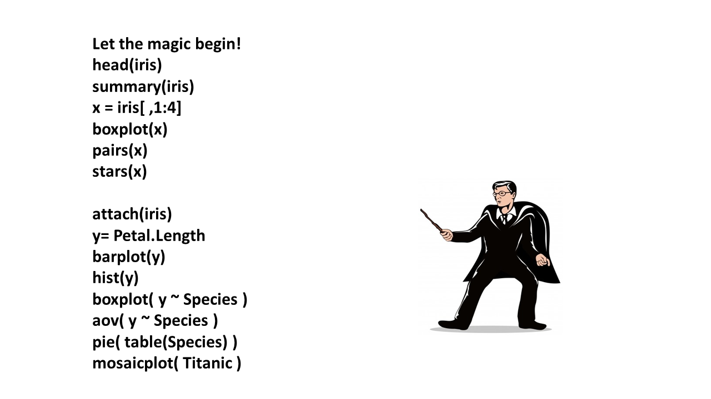
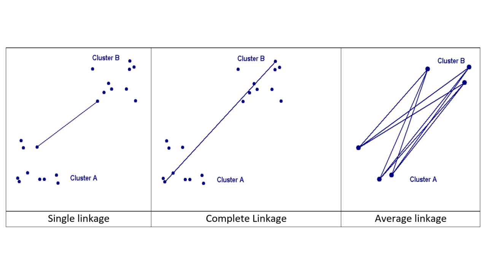
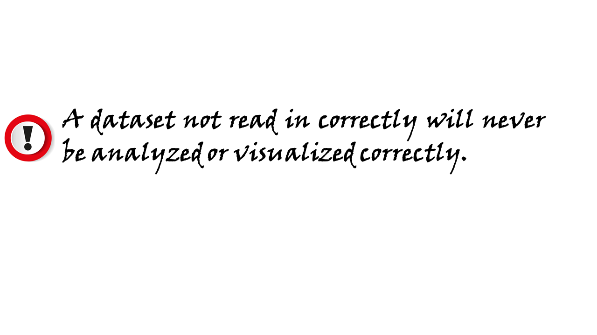
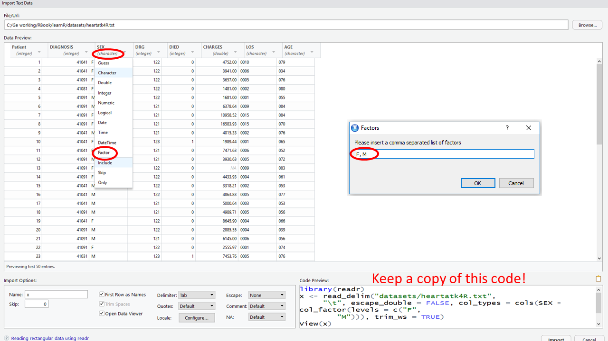
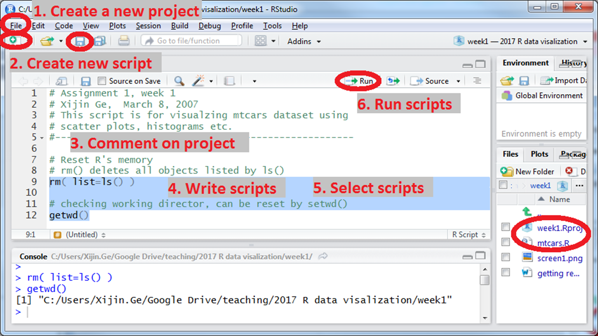
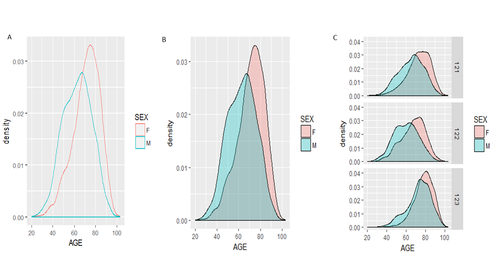

--- 
title: "Learning R through examples"
author: "Xijin Ge"
date: "`r Sys.Date()`"
site: bookdown::bookdown_site
output: bookdown::gitbook
documentclass: book
bibliography: [book.bib, packages.bib]
biblio-style: apalike
link-citations: yes
github-repo: gexijin/learnR
description: "This is a draft of a book for learning data analysis with the R language. This book emphasizes hands activities. Comments and suggestions welcome."
---

# Index{-}
Chapter 1  Step into R program

Chapter 2  Visualizing data set

Chapter 3  Data structures

Chapter 4  Data importing 

Chapter 5  Heart attack data set I

Chapter 6  Heart attack data set II

Chapter 7  Advanced topics

Chapter 8  State data set

Chapter 9  Game sale data set

Chapter 10  Employee salary data set


<!--chapter:end:index.Rmd-->

# Step into R program-Analyzing iris flower dataset  

**Getting started**

1. Install R from [www.R-project.org](www.R-project.org). Choose the cloud server or any U.S. mirror site.
2. Install RStudio Desktop from [www.RStudio.com](www.RStudio.com). Rstudio uses the R software you just installed in the background, but provides a more user-friendly interface. We will use Rstudio. R commands can be typed directly into the “Console” window. Or you can enter them in the “R Script” window and click the “Run” button. 

```{r echo=FALSE, out.width='80%'}
knitr::include_graphics("images/img0100_Rstudio.png")
```

Just try all of these commands and guess what’s going on. If it takes a few months to type these 188 characters,  try [www.RapidTyping.com](www.RapidTyping.com).  
```{r echo=FALSE, out.width='80%'}

```

## Data frames have rows and columns: the Iris flower dataset 
In 1936, Edgar Anderson collected data to quantify the geographic variation of *Iris* flowers. The data set consists of 50 samples from each of three sub-species ( *Iris setosa*, *Iris virginica* and *Iris versicolor*). Four features were measured from each sample: the lengths and the widths of sepals and petals, in centimeters (cm). This data is included in R software. Go to the Wikipedia page for this data set (yes, it is famous!).  Have a quick look at the data there, think about what distinguishes the three species? If we have a flower with sepals of 6.5cm long and 3.0cm wide, petals of 6.2cm long, and 2.2cm wide, which species does it most likely belong to? **Think** (!) for a few minutes while eyeballing the data at Wikipedia.


```{r echo=FALSE, out.width='50%', fig.cap='Iris flower. Photo from Wikipedia.', fig.align='center' }
knitr::include_graphics("images/img0101_iris.png")
```

```{r echo=FALSE, out.width='80%', fig.cap='Example of a data frame. ', fig.align='center'}
knitr::include_graphics("images/img0102_dataframe.png")
```

To answer these questions, let’s visualize and analyze the data with R. Type these commands without the comments after “#”.  

```{r echo=TRUE, results='hide'}
iris        #This will print the whole dataset, which is included with R 
dim(iris)   # show the dimension of the data frame: 150 rows and 5 columns.
head(iris)  # show the first few rows; useful for bigger datasets. 
```

So the first 4 columns contain numeric values. The last one is species information as **character** values. This is an important distinction, as we cannot add or subtract character values. This object is a **data frame**, with both numeric and character columns. A **matrix** only contains one type of values, often just numbers.

To have a look at the data in a spreadsheet, we can use the fix( ) function.
```{r}
#fix(iris)  # examine data frame in a spreadsheet. 
```

Click on column names to double-check data types (numeric vs. character). Sometimes we need to overwrite data types guessed by R. For example, sometimes we use 1 for male and 0 for female. These are essentially categories; Values like 1.6 make no sense. In this case we need to enforce this column as characters. **Note this window needs to be closed before proceeding to the next**. 
```{r echo=TRUE, results='hide'}
View(iris)  # this Rstudio function also shows data. Note R is case sensitive. 
```

Individual values in a data frame can be accessed using row and column indices.
```{r echo=TRUE, results='hide'}
iris[3, 4]    # shows the value in 3rd row, 4th column.  It is 0.2.
iris[3, ]     # shows all of row 3
iris[, 4]     # shows all of column 4
iris[3, 1:4]  # shows row 3, columns 1 to 4. 
```

```{exercise}
Display data in rows 1 to 10 from columns 2 to 5.  Start a new Word document. Copy and paste your R code and the results to the document and save it as PDF.
```

```{r echo=FALSE, out.width='45%', fig.align='center'}
knitr::include_graphics("images/img0100_tips.png")
```
```{r}
colnames(iris)  # Column names. 
```

Remember these column names, as we are going to use them in our analysis now. Note that sepal length information is contained in the column named **Sepal.Length**. Since R is case sensitive, we have to type these column names exactly as above. 
```{r echo=TRUE, results='hide'}
attach(iris)  # attach dataset to R working memory, so that columns can be accessible by name.
Petal.Length  # after attaching, we can just use column names to represent a column of numbers as a vector 
```

R is case-sensitive. “petal.length” will not be recognized.
```{r}
mean(Petal.Length)   # mean( ) is a function that operates on Petal.Length, a vector of 150 umbers
```

```{exercise}
Compute average sepal length. Hint: replace **Petal.Length** with **Sepal.Length**.
```

The best way to learn about other R functions is Google search. 

```{exercise}
Google “R square root function” to find the R function, and compute the value of 
 $\sqrt(123.456)$.
```

## Analyzing one set of numbers

```{r}
x <- Petal.Length   # I am just lazy and don’t want to type “Petal.Length”, repeatedly.
summary(x)
```

- The minimum petal length is 1.0, and the maximum is 6.9.  
- **Average** petal length is 3.758. 
- The mid-point or median is 5.35, as about half of the numbers is smaller than 5.35.  Why the median is different from the mean? What happens if there is a typo and one number is entered 340cm instead of 3.40cm?  
- The 3rd quartile, or 75^th^ percentile is 5.1, as 75% of the flowers has petals shorter than 5.1. The 95^th^ percentile for the weight of 2-year-old boy is 37 pounds. If a 2-year-old boy weighs 37 pounds, he is heavier than 95% of his peers.  If a student’s GPA ranks 5^th^ in a class of 25, he/she is at 80^th^ percentile.
- The 1st quartile, or 25^th^ percentile is 1.6.  Only 25% of the flowers has petals shorter than 1.6.
These summary statistics are graphically represented as a boxplot in the Figure \@ref(fig:1-3)A. Boxplots are more useful when multiple sets of numbers are compared. 

(ref:1-3) Boxplot of petal length (A) and of all 4 columns (B). 

```{r 1-3, echo=c(1, 5), fig.show='hold', out.width='50%', fig.cap='(ref:1-3)', fig.align='center'}
boxplot(x)   # Figure 1.3A. It graphically represents the spread of the data. 
text(x = 1, y = c(5.2, 4.5, 1.75), labels = c("75th pencentile", "Median", "25th pencentile"))
text(1.45, 6.6, labels = "boxplot(x)", col = "red")
legend("topleft", inset = .02, legend = "A",  box.lty = 0)
boxplot(iris[, 1:4])  # boxplot of several columns at the same time Figure 1.3B.
text(4.1, 7.5, labels = "boxplot(iris[, 1:4])", col = "red")
legend("topleft", inset = .001, legend = "B",  box.lty = 0)
```

In Rstudio, you can copy a plot to clipboard using the **Export** button on top of the plot area. Or you can click **zoom**,  right click on the popup plot and select **“Copy Image”**.  Then you can paste the plot into Word.  If you are using R software, instead of Rstudio, you can right click on the plots and copy as meta-file. 

```{exercise}
What can we tell from this boxplot (Figire \@ref(fig:1-3)B)? Summarize your observations in PLAIN English. Note the differences in median and the spread (tall boxes). What is the most variable characteristics?
```
  
To quantify the variance, we can compute the **standard deviation** σ:
\begin{align}
σ=\sqrt{\frac{1}{N}[(x_{1}-u)^2+(x_{2}-u)^2+...+(x_{N}-u)^2]}    
\end{align}
where
\begin{align}
u=\frac{1}{N}(x_{1}+x_{2}+...x_{N})
\end{align}
If all the measurements are close to the mean (µ), then standard deviation should be small. 

```{r}
sd(x)  # sd( ) is a function for standard deviation
sd(Sepal.Width) 
```

As we can see, these flowers have similar sepal width. They differ widely in petal length. This is consistent with the boxplot above. Perhaps changes in petal length lead to better survival in different habitats.

With R it is very easy to generate graphs.
```{r out.width='80%', fig.cap='Barplot of petal length', fig.align='center'}
barplot(x)
```

As we can see, the first 50 flowers (Iris setosa) have much shorter petals than the other two species. The last 50 flowers (Iris verginica) have slightly longer petals than the middle (iris versicolor). 

(ref:1-4) Sequence plot, histogram, lag plot and normal Q-Q plot. 

```{r 1-4, echo=c(1, 3, 5, 7, 8), fig.show='hold', out.width='50%', fig.cap='(ref:1-4)', fig.align='center'}
plot(x)  # Run sequence plot
legend("topleft", inset = .02, legend = "plot(x)",  box.lty = 0)
hist(x)  # histogram
legend(1.6, 36, legend = "hist(x)",  box.lty = 0)
lag.plot(x)
legend("topleft", inset = .02, legend = "lag.plot(x)",  box.lty = 0)
qqnorm(x)  # Q-Q plot for normal distribution
qqline(x) 
legend("topleft", inset = .02, legend = "qqnorm(x)",  box.lty = 0)
```

Histogram shows the distribution of data. The histogram top right of Figure \@ref(fig:1-4) shows that there are more flowers with Petal Length between 1 and 1.5.  It also shows that the data does not show a bell-curved distribution.

Lag plot is a scatter plot against the same set of number with an offset of 1. Any structure in lag plot indicate non-randomness in the order in which the data is presented.

Q-Q plot can help check if data follows a Gaussian distribution, which is widely observed in many situations. Also referred to as normal distribution, it is the pre-requisite for many statistical methods. See Figure \@ref(fig:1-5) for an example of normal distribution. Quantiles of the data is compared against those in a normal distribution.   If the normal Q-Q plot is close to the reference line produced by qqline( ), then the data has a normal distribution.

```{exercise}
Generate 500 random numbers from the standard normal distribution and generate sequence plots, histogram, lag plot, and Q-Q plot. You should get plots like those in Figure \@ref(fig:1-5).  Hint: Run x = rnorm(500) to generate these numbers, and then re-run the last 5 lines of code on this page. They are also shown on Figure \@ref(fig:1-4).
```

(ref:1-5) Plots for random generated numbers following a normal distribution. This is for reference. 
```{r 1-5, echo=FALSE, fig.show='hold', out.width='50%', out.length='50%', fig.cap='(ref:1-5)', fig.align='center'}
x <- rnorm(500)
plot(x)   # Run sequence plot    
hist(x)   # histogram
lag.plot(x)
qqnorm(x)  #Q-Q plot for normal distribution
qqline(x) 
```

```{exercise}
Investigate Septal Length distribution using these techniques and summarize your observations in PLAIN English.  Hint: assign x with the values in the sepal length column (x = Sepal.Length), and re-run all the code in this section.
```

## Student’s t-test 
In hypothesis testing, we evaluate how likely the observed data can be generated if a certain hypothesis is true. If this probability (p value) is very small (< 0.05, typically), we reject that hypothesis. 
Are the petal lengths of iris setosa significantly different from these of iris versicolor? 
```{r}
x <- Petal.Length[1:50]  # the first 50 values of Sepal.Length are for iris setosa
y <- Petal.Length[51:100]  # the next 50 values of Sepal.Length are for iris versicolor
t.test(x, y)  # t.test( ) is an R function for student’s t-test
```

The null hypothesis is that the true mean is the same. Since p value is really small, we reject this hypothesis. Iris versicolor has longer sepals than iris setosa.  

```{exercise}
Are iris setosa and iris versicolor significantly different in sepal width?  Hint: Replace Petal.Length with something else and re-run above code.
```

We can also do t-test on one set of numbers. This is a one-sample t-test of mean:
```{r}
t.test(Sepal.Length, mu = 5.8)
```

In this case, our hypothesis is that the true average of sepal length for all iris flowers is 5.8.   Since p value is quite big, we accept this hypothesis. This function also tells us the 95% confidence interval on the mean. Based on our sample of 150 iris flowers, we are 95% confident that the true mean is between 5.71 and 5.98. 

```{exercise}
Compute 95% confidence interval of petal length. 
```

## Test for normal distribution
We can perform hypothesis testing on whether a set of numbers derived from normal distribution. The null hypothesis is that the data is from a normal distribution. 
```{r}
shapiro.test(Petal.Length)
```

If petal length is normally distributed, there is only 7.412×10^-10^ chance of getting a test statistic of 0.87627, which is observed in our sample of 150 flowers. In other words, it is highly unlikely that petal length follows a normal distribution. We reject the normal distribution hypothesis.

```{exercise}
Is sepal width normally distributed? Run Shapiro’s test and also generate histogram and normal Q-Q plot.
```

## Analyzing a column of categorical values

In the iris dataset, the last column contains the species information. These are “string” values or categorical values.  
```{r echo=c(1, 2, 3, 5), fig.show='hold', out.width='50%', fig.cap='Frequencies of categorical values visualized by Pie chart (A) and bar chart (B).', fig.align='center'}
counts <- table(Species)  # tabulate the frequencies
counts
pie(counts)  # See Figure 1.7A
legend("topleft", inset = .02, legend = "A",  box.lty = 0)
barplot(counts)  # See Figure 1.7B
text(3.71, 48, labels = "B")
```

Pie charts are very effective in showing proportions.

We can see that the three species are each represented with 50 observations.

## Analyzing the relationship between two columns of numbers 
Scatter plot is very effective in visualizing correlation between two columns of numbers. 

(ref:2-1) Scatter plot of petal width and petal length.

```{r 2-1, message=FALSE, out.width='80%', fig.cap='(ref:2-1)', fig.align='center'}
attach(iris)      # attach the data set
x <- Petal.Width  # just lazy
y <- Petal.Length 
plot(x, y)        # scatterplot,  refined version in Figure 1.9
```

Figure \@ref(fig:2-1) shows that there is a positive correlation between petal length and petal width. In other words, flowers with longer petals are often wider. So the petals are getting bigger substantially, when both dimensions increase.   
Another unusual feature is that there seems to be two clusters of points. Do the points in the small cluster represent one particular species of Iris? We need to further investigate this. The following will produce a plot with the species information color-coded. The resultant Figure \@ref(fig:2-2) clearly shows  that indeed one particular species, *I. setosa* constitutes the smaller cluster in the low left. The other two species also show difference in this plot, even though they are not easily separated. This is a very important insight into this dataset. 

(ref:2-2) Scatter plot shows the correlation of petal width and petal length.

```{r 2-2, echo=c(1, 2), out.width='80%', fig.cap='(ref:2-2)', fig.align='center'}
plot(x, y, col = rainbow(3)[Species])  # change colors based on another column (Species). 
legend("topleft", levels(Species), fill = rainbow(3))  # add legends on topleft.
abline(lm(y ~ x))
```

The rainbow( ) function generates 3 colors and Species information is used to choose colors. Note that Species column is a factor, which is a good way to encode columns with multiple levels. Internally, it is coded as 1, 2, 3. 
```{r}
str(iris)  # show the structure of data object
```

Perhaps due to adaption to environment, change in petal length lead to better survival. With the smallest petals, *Iris Setosa* is found in Arctic regions. *Iris versicolor* is often found in the Eastern United States and Eastern Canada. *Iris virginica* “is common along the coastal plain from Florida to Georgia in the Southeastern United States [Wikipedia].” It appears the iris flowers in warmer places are much larger than those in colder ones. With R, it is very easy to generate lots of graphics. But we still have to do the thinking. It requires to put the plots in context.

We can quantitatively characterize the strength of the correlation using several types of correlation coefficients, such as Pearson’s correlation coefficient, r.  It ranges from -1 to 1.   
```{r}
cor(x, y) 
```

This means the petal width and petal length are strongly and positively correlated.
```{r}
cor.test(x, y)
```

Through hypothesis testing of the correlation, we reject the null hypothesis that the true correlation is zero. That means the correlation is statistically significant.
Note that Pearson’s correlation coefficient is not robust against outliers and other methods such as Spearman’s exists. See help info:
```{r echo=TRUE, message=FALSE}
?cor  # show help info on cor ( )
```
We can also determine the equation that links petal length and petal width. This is so called regression analysis. We assume 
         Petal.Length = *a* × Petal.Width + *c* + *e*, 
where *a* is the slope parameter, *c* is a constant, and *e* is some random error.   This linear model can be determined by a method that minimizes the least squared-error:
```{r}
model <- lm(y ~ x)  # Linear Model (lm): petal length as a function of petal width
summary(model)      # shows the details
```

As we can see, we estimated that *a*=2.22944 and *c*=1.08356. Both parameters are significantly different from zero as the p values are <2×10^-16^ in both cases. In other words, we can reliably predict 
Petal.Length = 2.22944 × Petal.Width + 1.08356.  This model can be put on the scatter plot as a line.
```{r fig.keep='none'}
plot(model)
abline(model)  # add regression line to existing scatter plot. Finishes Figure 1.8.
```

Sometimes, we use this type of regression analysis to investigate whether variables are associated. 

```{exercise}
Investigate the relationship between sepal length and sepal width using scatter plots, correlation coefficients, test of correlation, and linear regression. Again interpret all your results in PLAIN and proper English.
```

## Visualizing and testing the differences in groups
Are boys taller than girls of the same age? Such situations are common. We have measurements of two groups of objects and want to know if the observed differences are real or due to random sampling error.   

```{r  message=FALSE, fig.keep='none'}
attach(iris)  # attach iris data
boxplot(Petal.Length ~ Species)  # Generate boxplot: Petal length by species, see Figure 1.11
```

(ref:2-4) Boxplot of petal length, grouped by species.

```{r 2-4, echo=FALSE, fig.cap='(ref:2-4)', fig.align='center'}
knitr::include_graphics("images/img0204_LengthSpecies.png")
```
From the boxplot, it is obvious that *I. Setosa* has much shorter petals. But are there significant differences between *I. versicolor* and *I. virginica*?  We only had a small sample of 50 flowers for each species. But we want to draw some conclusion about the two species in general. We could measure all the iris flowers across the world; Or we could use statistics to make inference. First we need to extract these data
```{r results='hide'}
x <- Petal.Length[51:100]  # extract Petal Length of iris versicolor, from No.51 to No.100
x  # x contain 50 measurements
y <- Petal.Length[101:150]  # extract Petal length of iris virginica,  from No. 101 to No. 150
y  # y contain 50 measurements
```

```{r fig.keep='none'}
boxplot(x, y)  # a boxplot of the two groups of values
t.test(x, y)
```
In this student’s t-test, our null hypothesis is that the mean petal length is the same for *I. versicolor* and *I. virginica*. A small p value of 2.2x10^-16^ indicates under this hypothesis, it is extremely unlikely to observe the difference of 1.292cm through random sampling. Hence we reject that hypothesis and conclude that the true mean is different. If we measure all *I. versicolor* and *I. virginica* flowers in the world and compute their true average petal lengths, it is very likely that the two averages will differ. On the other hand, if p value is larger than a threshold, typically 0.05, we will accept the null hypothesis and conclude that real average petal length is the same. 

We actually do not need to separate two set of numbers into two data objects in order to do t-test or compare them side-by-side on one plot. We can do it right within the data frame. R can separate data points by another column.
```{r results='hide', fig.keep='none'}
x2 <- iris[51:150, ]  # Extract rows 51 to 150
t.test(Petal.Length ~ Species, data = x2)  # t-test of Petal.Length column, divided by the Species column in x2. 
boxplot(Petal.Length ~ Species, data = droplevels(x2))  # droplevels( ) removes empty levels in Species
```

```{exercise}
Use boxplot and t-test to investigate whether sepal width is different between *I. versicolor* and *I. virginica*. Interpret your results. 
```

## Testing the difference among multiple groups (Analysis of Variance: ANOVA)
As indicated by Figure \@ref(fig:2-4), sepal width has small variation, even across 3 species. We want to know if the mean sepal width is the same across 3 species. This is done through Analysis of Variance (ANOVA).

(ref:2-5) Boxplot of sepal width across 3 species.

```{r 2-5, echo=c(1,3), fig.cap='(ref:2-5)', fig.align='center'}
boxplot(Sepal.Width ~ Species)  # Figure 1.12
text(2.5, 4.2, labels = "boxplot(Sepal.Width~Species)", col = "red")
summary(aov(Sepal.Width ~ Species))
```
Since p value is much smaller than 0.05, we reject the null hypothesis. The mean sepal width is not the same for 3 species. This is the only thing we can conclude from  this. The boxplot in Figure \@ref(fig:2-5) seems to indicate  that *I. Setosa* has wider sepals. 
Now  we  demonstrate  how  to  use  the lattice package  for  visualizing  data using multiple panels. This package is not included in the base version of R. They need to be downloaded and installed. One of main advantages of R is that it is open, and users can contribute their code as packages. If you are  using **Rstudio**,  you  can  choose **Tools->Install packages** from the main menu, and then enter the name of the package.
If  you  are  using  R  software,  you  can  install  additional  packages,  by clicking **Packages** in the main menu, and select a mirror site. These mirror sites  all  work  the  same,  but  some  may  be  faster. Lately I  just  use cloud mirror. After choosing a mirror and clicking “OK”, you can scroll down the long list to find your package.  Alternatively, you can type this command to install packages. 
```{r}
#install.packages ("ggplot2")  # choose the cloud mirror site when asked
```
Packages only need to be installed once. But every time you need to use a package, you need to load it from your hard drive. 
```{r}
library(ggplot2)  # load the ggplot2 package
```
Figure \@ref(fig:2-6)A shows the sepal width distribution for each of the 3 species.  The 3 histograms are aligned in panels: layout of 1 column and 3 rows. 

Figure \@ref(fig:2-6)A shows an interesting feature in how sepal width is distributed. While for I. setosa it is skewed to the right. For the other two species it is skewed to the left. 

We can also have density plots side-by-side (Figure \@ref(fig:2-6)B):

```{r fig.keep='none'}
ggplot(iris, aes(x = Sepal.Width, group = Species, 
                 y = c(..count..[..group.. == 1]/sum(..count..[..group.. == 1]),
                       ..count..[..group.. == 2]/sum(..count..[..group.. == 2]),
                       ..count..[..group.. == 3]/sum(..count..[..group.. == 3])) * 100)) + 
  geom_histogram(binwidth = .2, colour = "black", fill = "lightblue") + 
  facet_grid(Species ~ .) +
  labs(y = "Percent of Total")
ggplot(iris, aes(x = Petal.Length, fill = Species)) + geom_density(alpha = .3)
```


(ref:2-6) Visualizing data using the ggplot2 package. 

```{r 2-6, echo=FALSE, fig.cap='(ref:2-6)', fig.align='center'}
knitr::include_graphics("images/img0206n_HistDensity.png")
```

```{exercise}
Use boxplot, multiple panel histograms and density plots to investigate whether petal width is the same among three subspecies. 
```

<!--chapter:end:01-Step-into-R-program-Analyzing-iris-flower-data-set.Rmd-->

# Visualizing data set-Analyzing cars and iris flower data sets

## Basic concepts of R graphics

In addition to the graphics functions in base R, there are many other packages we can use to create graphics. The most widely used are lattice and ggplot2. Together with base R graphics, sometimes these are referred to as the three independent paradigms of R graphics.  The lattice package extends base R graphics and enables the creating of graphs in multiple facets. The ggplot2 is developed based on a so-called Grammar of Graphics (hence the “gg”), a modular approach that builds complex graphics using layers.  
   
  Note the recommended textbook R Graphics Cookbook includes all kinds of R plots and code. Some are online: [http://www.cookbook-r.com/Graphs/](http://www.cookbook-r.com/Graphs/). There are also websites lists all sorts of R graphics and example codes that you can use. [http://www.r-graph-gallery.com/](http://www.r-graph-gallery.com/) contains more than 200 such examples. Another one is here: [http://bxhorn.com/r-graphics-gallery/](http://bxhorn.com/r-graphics-gallery/)  
  
  We start with base R graphics. The first import distinction should be made about high- and low-level graphics functions in base R. See this table. 
  
(ref:9-02) List of graphics functions in base R.

```{r 9-02, echo=FALSE, fig.cap='(ref:9-02)', fig.align='center'}
knitr::include_graphics("images/img0902_function.png")
```  

Sometimes we generate many graphics quickly for exploratory data analysis (EDA) to get some sense of how the data looks like. We can achieve this by using plotting functions with default settings to quickly generate a lot of “plain” plots. R is a very powerful EDA tool. However, you have to know what types of graphs are possible for the data.  Other times, we want to generate really “cool”-looking graphics for papers, presentations. Making such plots typically requires a bit more coding, as you have to add different parameters easily understood. For me, it usually involves some google searches of example codes, and then I revise it via trial-and-error. If I cannot make it work, I read the help document. 

## Visualizing mtcars dataset 

###scatter plot
The mtcars data set is included in base R. It contains various statistics on 32 different types of cars from the 1973-74 model year. The data was obtained from the 1974 Motor Trend US magazine. Our objective is to use this dataset to learn the difference between them, possibly for choosing a car to buy.

```{r message=FALSE}
mtcars  # show the mtcars dataset
? mtcars  # shows the information on this dataset
```

####Customize scatterplots
We start with a basic scatter plot. First, we attach the mtcars data to memory so that we can refer to the columns directly by their names.
```{r fig.show='hide'}
attach(mtcars)  # attach dataset to memory
plot(wt, mpg)  # weight (wt) and miles per gallon (mpg), see Figure 2.3
```

This generates a basic scatter plot with default settings using wt as x and mpg as y. Each data points are represented as an open circle on the plot. As you could see,  heavier vehicles are less fuel efficient. We can add a regression line on this scatter plot using a lower-level graphics function **abline**:

```{r echo=c(2), fig.show='hide'}
plot(wt, mpg)
abline(lm(mpg ~ wt))  # add regression line
```

Note that lm(mpg ~ wt) generates a linear regression model of mpg as a function of wt, which is then passed on to abline. We add other information about these cars to customize this plot. 

```{r fig.show='hide'}
plot(wt, mpg, pch = am)  # am = 1 for automatic transmission
```

**“pch”** is a parameter that specifies the types of data points on the plot. See Figure \@ref(fig:9-3) for a whole list of possible values. The “am” column in mtcars dataset indicates whether the car is automatic transmission (am = 1) or not (am = 0). 

(ref:9-3) Data point types in base R.

```{r 9-3, echo=FALSE, fig.cap='(ref:9-3)', fig.align='center'}
knitr::include_graphics("images/img0903_symbol.png")
```  

```{r}
am
```

So R uses circles or squares according to this sequence for each of the data points. It draws a circle when am value is 1, and square when it is zero. See all the types in Figure \@ref(fig:9-3).  We add a legend to the top-right corner using a low-level graphics function legend:

```{r echo=c(2), fig.show='hide'}
plot (wt, mpg, pch = am) 
legend("topright", c("Automatic", "Manual"), pch = 0:1) 
```

This plot shows that heavier cars often use manual transmissions. Always slow down and interpret your plots in plain language. We can be happy about this plot, but we continue to fuss in more information on this graph.  Using the same line of thinking, we can change the color of the data points according to other information, i.e. the number of cylinders. 

```{r fig.show='hide'}
plot(wt, mpg, pch = am, col = rainbow(3)[as.factor(mtcars$cyl)])
#Generate 3 colors for the 3 types of cyl.
```

The rainbow(3) generates a vector of 3 colors. The 3 levels of the cylinders will be assigned to three colors respectively. The red, green and blue represent the cylinder 4, 6, and 8 respectively. Now we alter the size of the data points to represent additional information such as horsepower, hp. Since hp is often a big number, we divide it by 50, a ratio determined by trial-and-error. These sometimes are called **bubble plots** or **balloon plots.** 

```{r fig.show='hide'}
plot(wt, mpg, pch = am, col = rainbow(3)[as.factor(mtcars$cyl)], cex = hp / 50)
legend(4.5, 34, levels(as.factor(mtcars$cyl)), title = "Cylinders", pch = 15,
       col = rainbow(3))
```

Note that we added this legend at the (5, 30) position on the plot. To see all the options: 
```{r}
? plot
```

This website lists all the parameters for R graphics: [http://www.statmethods.net/advgraphs/parameters.html](http://www.statmethods.net/advgraphs/parameters.html). Now we want to finish up this plot by adding axis labels, and title. We also changed the x-axis range to 1-6 using the xlim parameter to specify the limits. We finally put everything together. 

(ref:9-4) Enhanced scatter plot of mtcars data. Also called bubble plot or balloon plot.

```{r 9-4, echo=FALSE, fig.cap='(ref:9-4)', fig.align='center'}
plot(wt, mpg, pch = am, col = rainbow(3)[as.factor(mtcars$cyl)], cex = hp/50,
     xlab = "Weight (1000 lbs)", ylab = "Miles per gallon", 
     main = "Weight and MPG", xlim = c(1, 6))
abline(lm(mpg ~ wt))    # add regression line
legend("topright", c("Automatic", "Manual"), pch = 0:1)  # marker 
legend(5.48, 28, levels(as.factor(mtcars$cyl)), 
       title = "Cylinders", 
       pch = 15,
       col = rainbow(3))  # legend for color
```

Note that this seemingly complicated chunk of code is built upon many smaller steps, and it involves trial-and-error. 

```{exercise}
Create a scatter plot similar to Figure \@ref(fig:9-4) using the mtcars dataset to highlight the correlation between hp and disp (displacement). You should use colors to represent carb ( # of carburetors), types of data points to denote the number of gears, and size of the data points proportional to qsec, the number of seconds the cars need run the first ¼ mile. Add regression line and legends. Note that you should include comments and interpretations. Submit your code and plot in a PDF file. 
Hint: Go through the above example first. Then start small and add on step by step. 
```

Figure \@ref(fig:9-4) is perhaps a bit too busy. Let’s develop an elegant version.

```{r fig.show='hide'}
plot(wt, mpg, pch = 16, cex = hp / 50, col = rainbow(3)[as.factor(mtcars$cyl)]) 
```

Notes: x; y; solid circle; horsepowersize of bubble; color cylinder 4, 6, or 8

Then we use a lower-level graphics function points to draw circles around each data point.

(ref:9-5) Scatter plot showing the weight and MPG, colored by the number of cylinders. A line at mpg = 20 separates the 4-cylinder cars from 8 cylinder cars.

```{r 9-5, echo=FALSE, fig.cap='(ref:9-5)', fig.align='center'}
plot(wt, mpg, pch = 16, cex = hp / 50, col = rainbow(3)[plot(wt, mpg, pch = 16, cex = hp / 50, col = rainbow(3)[as.factor(mtcars$cyl)])]) 
abline(h = 20, col = "red", lwd = 2, lty = 2)
points(wt, mpg, cex = hp / 50)
lines(lowess(wt, mpg), col = "blue")  # lowess line
legend("topright", levels(as.factor(mtcars$cyl)), title = "Cylinders", 
       pch = 15, col = rainbow(3))
```

This line adds a LOWESS smooth line determined by locally-weighted polynomial regression.


```{exercise}
Generate the bubble plot Figure \@ref(fig:9-5) based on the code:"plot(wt, mpg, pch = 16, cex = hp / 50, col = rainbow(3)[as.factor(mtcars$cyl)])". Submit your complete code and the generated plot. Give a brief interpretation about your plot.
```

#### 3D scatter plot
Even though I’ve never been a fan of 3D plots, it is possible in R using additional packages such as scatterplot3d.  Install this package and then try the following.

(ref:9-6) 3D scatter plots are rarely useful.

```{r 9-6, fig.cap='(ref:9-6)', fig.align='center'}
library(scatterplot3d) 
scatterplot3d(wt, disp, mpg, color = rainbow(3)[as.factor(mtcars$cyl)], type = "h", pch = 20)
```

3D plots are hard to interpret. So try to avoid them. However, it is fun when you can interact with them. Using example code at this website, you can create interactive 3D plots: [http://www.statmethods.net/graphs/scatterplot.html](http://www.statmethods.net/graphs/scatterplot.html)


1  I like to work directly from my **Google Drive**, which automatically backs up my files in the cloud and syncs across several of my computers. This is an insurance against disasters like my dog peeing on my computer and ruins my grant proposal just before the deadline.

2  Note that I was trying to avoid having spaces in column names. Instead of “Blood Pressure”, I used “BloodPressure”. This makes the columns easier to reference to.

###Barplot with error bars
If we are interested in the difference between the cars with different numbers of cylinders. The 32 models are divided into 3 groups as cyl takes the values of 4, 6, or 8. We can use the aggregate function to generate some statistics by group. 

```{r}
stats <- aggregate(. ~ cyl, data = mtcars, mean)
stats 
```

This tells R to divide the cars into different groups by cyl and compute the average of all other columns for each group. The results above indicate many differences. As the number of cylinders increase, fuel efficiency measured by mpg decreases, while displacement and horsepower increases. We can obviously create a basic bar chart to show the difference in mpg. 
```{r fig.keep='none'}
barplot(stats[, 2])  # basic bar plot
```

The labels are missing from this basic plot. It is certainly possible to add the labels, but it is more convenient to use the tapply function, which generates a vector with names. We use tapply to calculate the mean, standard deviation (sd) and the numbers of samples for each group. 
```{r}
Means <- tapply(mpg, list(cyl), mean)  # Average mpg per group
Means
```

Note that it generates a vector and “4”, “6”, and “8” are names of each of the elements in this vector. 

tapply applies a function to a vector (mpg) according to grouping information defined by a factor (cyl) of the same length. Here it first groups the mpg numbers into 3 groups (cly= 4, 6, 8), and then within each group, the mean is calculated and returned. tapply is a member of a family of functions which includes apply, sapply, and lapply; all are powerful and efficient in computing than loops.

Similarly, we can compute the standard deviation for each group.
```{r}
SDs <- tapply(mpg, list(cyl), sd)  # SD per group for mpg
SDs
```

Now we can have a basic barplot with group names:
```{r}
barplot(Means)
```

Our goal is to generate a graph like Figure \@ref(fig:10-4) with both error bars and text annotation on the number of samples per group. We use two low-level graphics functions to add these elements to the plot, namely, text, and arrow. The text function adds any text to a plot to a position specified by x, y coordinates. Let’s try it. 
```{r echo=c(2), fig.keep='none'}
barplot(Means)
text(0.5, 5, "n=11")  # adding text to plot
```

The (0.5, and 5) are the x and y location of the text information. Try to change it to something else within the plotting range, meaning x within 0 to 3 and y between 0 and 25. You can place any text anywhere. We added sample size information for the first group. We can choose to do this for each of bar manually, but obvious there should be a better way to do this. The trick is to find the precise location of all the bars and place the text there, hopefully doing this once for all of them. To achieve this, we use the values returned by the barplot object. 
```{r fig.keep='none'}
xloc <- barplot(Means)  # get locations of the bars
xloc  # the center of each of bars on x
```

**Yes, plotting functions not only generate graphs, they can also returns values**. These values sometimes are useful in computing or refining the graph. Try this: h <- hist( rnorm(100) ) and then type h to see the values returned by hist function. 

In our barplot case, we got an object containing the location of the center of the bars on x-axis. So the first bar is located on x=0.7. Since xloc has the location on all bars, we can add the information all at once:
```{r echo=c(1, 2, 4), fig.keep='none'}
Nsamples <- tapply(mpg, list(cyl), length)  #number of samples per group
Nsamples
barplot(Means)
text(xloc, 2, Nsamples)   # add sample size to each group
```

The xloc specifies the center of the bars on the x-axis, namely 07, 1.9, and 3.1. The y coordinates are all 2. Try change the y location from 2 to 10, and see what happens. Looking great! The sample sizes are labeled on all the bars! This method works even if you have 20 bars! Now we want to make it explicit that these numbers represent sample size. For the first bar, we want “n=11”, instead of just “11”. 

First, we will append “n=” to each number and generate a string vector using the paste function 
```{r echo=c(1, 3)}
paste("n=", Nsamples)  # creating the strings to be added to the plot
barplot(Means)  # re-create bar plot
text(xloc, 2, paste("n=", Nsamples))  # add sample size to each group
```

Following a similar strategy, now we want to add error bars to represent standard deviations (SD) within each group. The plot is more informative as we visualize both the mean and variation within groups. For each bar, we need to draw an error bar from mean – SD to mean + SD. 

Let’s play with the arrows function, which draws arrows on plots. 
```{r echo=c(2, 3, 4), fig.keep='none'}
barplot(Means)
arrows(1, 15,  # x,y of the starting point
       1, 25)  # x,y of the ending point
arrows(2, 15, 2, 25, code = 3)  # arrows on both ends
arrows(3, 10, 3, 20, code = 3, angle = 90)  # bend 90 degrees, flat
```

Now it's beginning to look a lot like Christmas (error bar)!  I learned this clever hack of arrows as error bars from (Beckerman 2017)^1^.  We are ready to add the error bars using the data stored in xloc, Means and SDs.
```{r fig.keep='none'}
barplot(Means)  # re-create bar plot
arrows(xloc, Means - SDs,   # define 3 beginning points
       xloc, Means + SDs,   # define 3 ending points
       code = 3, angle = 90, length = 0.1)
```

Yes, we have a bar plot with error bars! We need to add a few refinements now such as colors, labels, and a title. As the first error bar is truncated, we need to adjust the range for y, by changing the ylim parameter. Putting everything together, we get this code chuck.

(ref:10-4) Bar chart with error bar representing standard deviation. 

```{r 10-4, fig.cap='(ref:10-4)', fig.align='center'}
attach(mtcars)    # attach data, two columns: numbers and groups
Means <- tapply(mpg, list(cyl), mean)  #compute means by group defined by cyl
SDs <- tapply(mpg, list(cyl), sd)   # calculate standard deviation by group
Nsamples <- tapply(mpg, list(cyl), length)  # number of samples per group
xloc <- barplot(Means,  # bar plot, returning the location of the bars
                xlab = "Number of Cylinders",
                ylab = "Average MPG",
                ylim = c(0,35), col = "green")
arrows (xloc, Means - SDs,  # add error bars as arrows
        xloc, Means + SDs,
        code = 3, angle = 90, length = 0.1)
text(xloc, 2, paste("n=", Nsamples))  # add sample size to each group
```

Sometimes we want error bars to represent standard error instead which is given by  σ/√n, where σ is standard deviation and n is sample size.  

In R we can do complex statistical tests or regression analyses with just one line of code, for example, aov, glm. However, we went through all this trouble to generate just a bar chart! **What is the point?** We could click around in sigmaPlot, or GraphPad and get a barplot in less time. Well, once you figured how to do one, you can easily do this for 10 graphs.  More importantly, this code clearly recorded the plotting process, which is essential for reproducible research. 

```{exercise}
Revise the above relative code to generate a bar chart showing the average weight of cars with either automatic or manual transmission. Include error bars, the number of samples and axis labels. 
```

```{exercise}
Create a bar chart with error bars to show the average illiteracy rate by region, using the illiteracy rate in the state.x77 data and regions defined by state.region in the state data set. Hints: 1, Check the type of data set using class(state.x77); 2, Convert the matrix dataset to data frame using df.state.x77 <- as.data.frame(state.x77); 3, Attach df.state.x77.
```

### Visualizing correlation between categorical variables
If we are interested in the correlation between two categorical variables, we can tabulate the frequencies from a data frame:
```{r}
counts <- table(cyl, am)
```

This contingency table gives us the number of cars in each combination. Among the 8-cylinder cars, there are 12 models with manual transmission, and only 2 models have automatic transmission. We obviously can feed this into a fisher’s exact test to test for independence. We could easily visualize this information with a bar chart.
```{r fig.keep='none'}
barplot(counts)
```

We generated a stacked barplot. Let’s refine it. 

We have a plot like the left of Figure \@ref(fig:10-5). We can also put the bars side-by-side, by setting the beside option to TRUE. 

(ref:10-5) Bar plots showing the proportion of cars by cylinder and transmission.

```{r 10-5, fig.show='hold', out.width='50%', fig.cap='(ref:10-5)', fig.align='center'}
barplot(counts, col = rainbow(3),
        xlab ="Transmission",
        ylab = "Number of cars")
legend("topright",rownames(counts), 
       pch = 15, title = "Cylinders", col = rainbow(3))
barplot(counts, col = rainbow(3),
        xlab = "Transmission",
        ylab = "Number of cars",
        beside = TRUE)
legend("topright",rownames(counts), 
       pch = 15, title = "Cylinders", col = rainbow(3))
```

See the right side of Figure \@ref(fig:10-5). Given a large dataset, we can easily tabulate categorical variables and plot these to show the relative frequencies.

Another easy plot is the mosaic plot:

(ref:10-6) Mosaic plot.

```{r 10-6, fig.cap='(ref:10-6)', fig.align='center'}
mosaicplot(counts, col = c("red", "green"))
```

Vertically, we divide the square into 3 parts, the area of each is proportional to the number of cars with different cylinders. There are more 8-cylinder vehicles than those with 4 or 6. Horizontally, we divide the square according to the am variable, which represents automatic transmission (am =0) or manual transmission. Clearly, these two are not independent. As the number of cylinder increases, more cars are using manual transmission. 

While the height of the bars in the bar chart in Figure 5 represents absolute totals per category, in mosaic plots the height are equal. Thus we see proportions within each category.

```{exercise}
Use bar plot and mosaic plot to investigate the correlation between cyl and gear. Interpret your results.
```

### Detecting correlations among variables
In ther beginning of this chapter we used scatter plots to study the correlation between two variables, mpg and wt in the mtcars dataset. There are many such pairwise correlations. One simple yet useful plot of the entire dataset is scatter plot matrix (SPM). SPMs can be created by the pairs function, or just run plot on a data frame.
```{r fig.keep='none'}
plot(mtcars)  # scatter plot matrix; same as pairs(mtcars) 
```

(ref:10-1) Scatter plot matrix of the mtcars dataset.

```{r 10-1, echo=FALSE, fig.cap='(ref:10-1)', fig.align='center'}
pairs(mtcars[, 1:7],col = rainbow(3)[as.factor(mtcars$cyl)])  # Add color 
```

We can spend all day studying this large plot, as it contains information on all pairs of variables. For example, mpg is negatively correlated with disp, hp, and wt, and positively correlated with drat. There are many variations of scatter plot matrix, for instance, the spm function in the car package. Also try this cool plot using ellipses: [http://www.r-graph-gallery.com/97-correlation-ellipses/](http://www.r-graph-gallery.com/97-correlation-ellipses/)


(ref:10-2) Showing correlation matrix with ellipses.

```{r 10-2, message=FALSE, fig.cap='(ref:10-1)', fig.align='center'}
library(ellipse)  # install.packages("ellipsis") 
library(RColorBrewer)  # install.packages("RcolorBrewer") 
data <- cor(mtcars)  # correlation matrix
my_colors <- brewer.pal(5, "Spectral")  # Color Pannel 
my_colors <- colorRampPalette(my_colors)(100)
ord <- order(data[1, ])  # Order the correlation matrix
data_ord <- data[ord, ord]
plotcorr(data_ord, col = my_colors[data_ord * 50 + 50], mar = c(1, 1, 1, 1))
```

```{exercise}
Generate a scatter plot **matrix** of the state.x77 data in the state data set included in base R. It includes various statistics on the 50 U.S. states. Type  ? **state** for more information and type **state.x77** to see the data. Also, visualize the correlation using the ellipses shown above. Interpret your results. What types of correlation do you find interesting? Hint: The class(state.x77) should be "matrix" not "data frame", otherewise convert it to a "matrix".
```

If you examine the above code carefully, the ellipses are drawn just based on a matrix of Pearson's correlation coefficients. We can easily quantify the relationship between all variables by generating a matrix of Pearson’s correlation coefficient: 

```{r results='hide'}
cor(mtcars)  # correlation coefficient of all columns
```
```{r}
corMatrix  <-  cor(mtcars[, 1:11])
round(corMatrix, 2)  # Round to 2 digits
```

We used the round function to keep two digits after the decimal point. We can examine the coefficients in this matrix. Note that strong negative correlations are also interesting. For example, wt and mpg have a correlation of r= -0.87, meaning that heavier vehicles tend to have smaller mpg. 

 We can visualize this matrix in other ways besides the ellipses. The most logical thing to do with a matrix of correlation coefficients is to generate a tree using hierarchical clustering.  
 
(ref:10-3) Hierarchical clustering tree. 

```{r 10-3, fig.cap='(ref:10-3)', fig.align='center'}
plot(hclust(as.dist(1 - corMatrix)))  # hierarchical clustering
```
 
Here we first subtracted the r values from 1 to define a distance measure. So perfectly correlated variables with r = 1 have a distance of 0, while negatively correlated variables with r = -1 have a distance of 2. We did this operation on the entire matrix at once. You can try to run the 1- corMatrix from the command line to see the result. The result is then formatted as a distance matrix using as.dist, which is passed to the hclust function to create a hierarchical clustering tree. See more info on hclust by using 
```{r message=FALSE}
? hclust
```

 As we can see from the tree, cyl is most highly correlated with disp and then hp and wt. Broadly, the variables form two groups, with high correlation within each cluster. This is an important insight into the overall correlation structure of this data set. 

```{exercise}
Generate a hierarchical clustering tree for the 32 car models in the mtcars dataset and discuss your results. Hint: You can transpose the dataset using function t(), so that rows becomes columns and columns become rows. Then you should be able to produce a similar tree for the cars. 
Another straight forward method is to translate the numbers in the correlation matrix into colors using the image functions. 
```

```{r}
image(corMatrix)  # translate a matrix into an image
```

Here we are using red and yellow colors to represent the positive and negative numbers, respectively. Since the row and column names are missing, we can use the heatmap function.
```{r}
heatmap(corMatrix, scale = "none")  # Generate heatmap
```

Here a lot more things are going on. The orders are re-arranged and also a tree is drawn to summarize the similarity. We explain heatmap in details later. 

A more elegant way of show correlation matrix using ggplot2 is available here: http://www.sthda.com/english/wiki/ggplot2-quick-correlation-matrix-heatmap-r-software-and-data-visualization. So as you can see, coding is not hard when you can steal ideas from others, thanks to Dr. Google and the thousands of contributors, who contribute code examples and answer questions online. R has a fantastic user community. 

### Hierarchical clustering    
In the mtcars dataset, we have 32 car models, each characterized by 11 parameters (dimensions, variables). We want to compare or group these cars using information about all of these parameters.  We know that Honda Civic is similar to Toyota Corolla but different from a Cadillac. Quantitatively, we need to find a formula to measure the similarity. Given two models, we have 22 numbers. We need to boil them down to one number to measure relative similarity.  This is often done by a distance function. The most popular one is Euclidean distance, (it is also the most abused metric):$Eucliden Distance  D=√((mpg_1-mpg_2)^2+(hp_1-hp_2)^2+(wt_1-wt_2)^2+⋯)$.If two cars have similar characteristics, they have similar numbers on all of these dimensions; their distance as calculated above is small. Therefore, this is a reasonable formula. Note that we democratically added the squared difference of all dimensions.  We treated every dimension with equal weight. However, if we look at the raw data, we know that some characteristics, such as *hp*(horsepower), have much bigger numerical value than others. In other words, the difference in *hp* can overwhelm our magic formula and make other dimensions essentially meaningless. Since different columns of data are in very different scale, we need to do some normalization.  We want to transform data so that they are comparable on scale. At the same time, we try to preserve as much information as we could.   

(ref:11-1) Heatmap with all default settings. This is not correct. Normalization is needed. Do not go out naked.

```{r 11-1, fig.cap='(ref:11-1)', fig.align='center'}
mt = as.matrix(mtcars) 
heatmap(mt) 
```

In this basic heat map, data are scaled by row by default. Some numbers are massive (*hp* and *disp*), and they are all in bright yellow. This is not democratic or reasonable as these big numbers dominate the clustering. We clearly need to do some normalization or scaling for each column which contains different statistics. Through check the help information by:
```{r message=FALSE}
? heatmap
```

We can figure out that we need an additional parameter: 

```{r fig.keep='none'}
heatmap(mt, scale = "column")  # Figure 2.13
```

 Scaling is handled by the scale function, which subtracts the mean from each column and then divides by the standard division. Afterward, all the columns have the same mean of approximately 0 and standard deviation of 1. This is called standardization.
```{r}
? scale
```

We can also handle scaling ourselves. We can use the apply function to subtract the mean from each column and then divide by the standard division of each column. 
```{r}
mt <- apply(mt, 2, function(y)(y - mean(y)) / sd(y))
```

Note that we defined a function, and ‘applied’ the function to each of the columns of mt. For each column, we first calculate the mean and standard deviation. Then the mean is subtracted before being divided by standard deviation. The second parameter “2” refers to do something with the column. Use “1” for row. 

Sometimes, we have columns with very little real variation. Being divided by standard deviation will amplify noise. In such cases, we just subtract the mean. This is called **centering**. Centering is less aggressive in transforming our data than standardization. 
```{r results='hide'}
apply(mt, 2, mean)  # compute column mean
```

Here mean( ) is the function that applied to each column.  The column means are close to zero. 
```{r results='hide'}
colMeans(mt)   # same as above
apply(mt, 2, sd)   # compute sd for each column
```

Here sd( ) is the function that applied to each column. 

(ref:11-2) Heatmap of mtcars dataset.    Yellow- positive number / above average.

```{r 11-2, fig.cap='(ref:11-2)', fig.align='center'}
heatmap(mt, scale = "none")  # Figure 2.13
```

This produced Figure \@ref(fig:11-2). 

Another function with much better coloring is heatmap.2 in the gplot package.
```{r fig.keep='none', message=FALSE}
#install.packages("gplots") 
library(gplots)
heatmap.2(mt) # plain version 
```

This basic heatmap is not very cool. So, we do some fine tuning. This function have a million parameters to tune:

(ref:11-3) Fine-tuned heatmap using heatmap.2 in gplots package.

```{r 11-3, fig.cap='(ref:11-3)', fig.align='center'}
? heatmap.2 
heatmap.2(mt, col = greenred(75),
          density.info = "none", 
          trace = "none", 
          scale = "none", 
          margins = c(5, 10))
```

Note that the **last argument** gives a large right margin, so that the long names can show up un-truncated. 
By default, the heatmap function scales the rows in the data matrix so that it has zero mean. In our case, we already did our scaling, so we use **scale="none"** as a parameter. Also, the dendrogram on the left and top are generated using the **hclust** function. The distance function is Euclidean distance. All of these can be changed. 

(ref:11-4) Single, complete and average linkage methods for hierarchical clustering.

```{r 11-4, echo=FALSE, fig.cap='(ref:11-4)', fig.align='center'}

```

We used the hclust function before. Let’s dive into the details a little bit. First, each of the objects (columns or rows in *mtcars* data), is treated as a cluster. The algorithm joins the two most similar clusters based on a distance function. This is performed iteratively until there is just a single cluster containing all objects. At each iteration, the distances between clusters are recalculated according to one of the methods—*Single linkage, complete linkage, average linkage, and so on*. In the single-linkage method, the distance between two clusters is defined by the smallest distance among the object pairs. This approach puts ‘friends of friends’ into a cluster. On the contrary, complete linkage method defines the distance as the largest distance between object pairs. It finds similar clusters. Between these two extremes, there are many options in between. The linkage method I found the most robust is the average linkage method, which uses the average of all distances.  However, the default seems to be complete linkage. Thus we need to change that in our final version of the heat map.

(ref:11-5) Final version of heatmap for mtcars data.

```{r 11-5, fig.cap='(ref:11-5)', fig.align='center'}
library(gplots)
hclust2 <- function(x, ...)  # average linkage method
  hclust(x, method="average", ...)
dist2 <- function(x, ...)  #distance method
  as.dist(1-cor(t(x), method="pearson"))
# Transform data
mt <- apply(mt, 2, function(y)(y - mean(y)) / sd(y))
heatmap.2(mt, 
	        distfun = dist2,  # use 1-Pearson as distance
	        hclustfun = hclust2,  # use average linkage
	        col = greenred(75),   #color green red
	        density.info = "none", 
	        trace = "none", 
	        scale = "none", 
	        RowSideColors = rainbow(3)[as.factor(mtcars$cyl)],    
	        margins = c(5, 10) # bottom and right margins
          )                                                                             
legend("topright",levels(as.factor(cyl)),
       fill=rainbow(3))    # add legend 
```

Here we defined and used our custom distance function **dist2** and used average linkage method for hclust. We also added a color bar to code for the number of cylinders. We can also add color bars for the columns, as long as we have some information for each of the column.

Hierarchical clustering coupled with a heatmap is a very effective method to visualize and explore multidimensional data. It not only visualizes all data points but also highlights the correlation structure in both rows and columns. It is my favorite plot, and you can find such plots in many of my scientific publications! 

Let’s discuss how to interpret Figure \@ref(fig:11-5). First, the colors red and green represent positive and negative numbers, respectively. Bright red represent large positive numbers and bright green means negative numbers with large absolute values. Since we standardized our data, **red indicates above average and green below average**.  The 8 cylinder cars which form a cluster in the bottom have bigger than average horsepower (*hp*), weight (*wt*). These cars have smaller than average fuel efficiency (*mpg*), acceleration(*qsec*), the number of gears. These cars share similar characteristics and form a tight cluster.   The four-cylinder cars, on the other hand, have the opposite.

The distance in the above dendrogram between two objects is proportional to some measure of dissimilarity (such as Euclidean distance) between them defined by the original data. This is true for both trees, the one on the top and the one on the left. 

**There are many ways to quantify the similarity between objects. **
The first step in hierarchical clustering is to define distance or dissimilarity between objects that are characterized by vectors. 

- We have discussed that we can use Pearson’s correlation coefficient (PCC) to measure the correlation between two numerical vectors. We could thus easily generate a measure of dis-similarity/distance by a formula like: 
$Distance(x,y) = 1-PCC(x,y)$.
This score have a maximum of 2 and minimum of 0.  Similar distance measure could be defined based on any non-parametric versions of correlation coefficients. In addition to these, there are many ways to quantify dis-similarity: (See: http://www.statsoft.com/textbook/cluster-analysis/)

- Euclidean distance. This is probably the most commonly chosen type of distance. It simply is the geometric distance in the multidimensional space. It is computed as:  
$Distance(x,y) = √(∑_{i=1}^{m}(x_i-y_i )^2 )$,
where *m* is the dimension of the vectors. Note that Euclidean (and squared Euclidean) distances are usually computed from raw data, and not from standardized data. This method has certain advantages (e.g., the distance between any two objects is not affected by the addition of new objects to the analysis, which may be outliers). However, the distances can be greatly affected by differences in scale among the dimensions from which the distances are computed. For example, if one of the dimensions denotes a measured length in centimeters, and you then convert it to millimeters, the resulting Euclidean or squared Euclidean distances can be greatly affected, and consequently, the results of cluster analyses may be very different. It is good practice to transform the data, so they have similar scales.

- Squared Euclidean distance. You may want to square the standard Euclidean distance to place progressively greater weight on objects that are further apart.

- City-block (Manhattan) distance. This distance is simply the average difference across dimensions. In most cases, this distance measure yields results similar to the simple Euclidean distance. However, note that in this measure, the effect of single large differences (outliers) is dampened (since they are not squared). The city-block distance is computed as:
$Distance(x,y)  = \frac{1}{m}∑_{i=1}^{m}|x_i-y_i|$

- Chebyshev distance. This distance measure may be appropriate in cases when we want to define two objects as "different" if they are different on any one of the dimensions. The Cheever distance is calculated by: 
$Distance(x,y)  = Maximum|x_i-y_i|$

- Percent disagreement. This measure is particularly useful if the data for the dimensions included in the analysis are categorical in nature. This distance is computed as:
$Distance(x,y) = (Number of xi ≠ yi)/ m$

```{exercise}
Generate a heatmap for the statistics of 50 states in the state.x77 dataset (for information ? state) using heatmap.2 in the gplots package.  Normalize your data properly before creating heatmap. Use the default Euclidean distance and complete linkage. Use *state.region* to color code the states and include an appropriate legend. Interpret your results. Discuss both trees.  
```

```{exercise}
Change distance function to 1-Pearson’s correlation coefficient. Change linkage method to average linkage. Turn off the clustering of the columns by reading the help information on **heatmap.2**.  Observe what is different in the clustering trees.
```

```{exercise}
Generate a heat map for the iris flower dataset. For data normalization, do not use standardization, just use centering (subtract the means). Use the species information in a color bar and interpret your results. 
```

### Representing data using faces. Serious scientific research only!
Humans are sensitive to facial images. We can use this to visualize data.

(ref:10-7) Using faces to represent data.

```{r 10-7, fig.cap='(ref:10-7)', fig.align='center'}
#install.packages("TeachingDemos")
library(TeachingDemos)
faces(mtcars) 
```

This is called Chernoff’s faces. Each column of data is used to define a facial feature. The features parameters of this implementation are: 1-height of face ("mpg"), 2-width of face ("cyl")   3-shape of face (“disp”), 4-height of mouth (“hp”), 5-width of mouth (“drat”), 6-curve of smile (“wt”), 7-height of eyes (“qsec”), 8-width of eyes(“vs”), 9-height of hair(“am”), 10-width of hair (“gear”), 11-styling of hair (“carb”). 

It turns out that the longer, serious faces represent smaller cars that are environmentally-friendly, while big polluters are shown as cute, baby faces. What an irony!

## Visualizing iris data set

### A Matrix only contains numbers

While data frames can have a mix of numbers and characters in different columns, a **matrix is often only contain numbers**.  Let’s extract first 4 columns from the data frame iris and convert to a matrix:
```{r}
attach(iris)
x <- as.matrix(iris[, 1:4])  # convert to matrix
colMeans(x)  # column means for matrix
colSums(x)
```
The same thing can be done with rows via **rowMeans(x)** and **rowSums(x)**. 

Here is some matrix algebra.
```{r results='hide'}
y <- iris[1:10, 1:4]  # extract the first 10 rows of iris data in columns 1 to 4. 
y
t(y)          # transpose 
z <- y + 5    # add a number to all numbers in a matrix
z <- y * 1.5  # multiply a factor 
z + y         # adding corresponding elements 
y * z         # multiplying corresponding elements
y <- as.matrix(y)  # convert the data.frame y to a matrix
z <- as.matrix(z)  # convert the data.frame z to a matrix
y %*% t(z)         # Matrix multiplication
```

### Scatter plot matrix
We can generate a matrix of scatter plots simply by:
```{r fig.keep="none"}
pairs(iris[, 1:4]) 
```

```{r fig.cap='Scatter plot matrix.', fig.align='center'}
pairs(iris[, 1:4], col = rainbow(3)[as.factor(iris$Species)])  # Figure 2.18
```

```{exercise}
Look at this large plot for a moment. What do you see? Provide interpretation of these scatter plots. 
```

### Heatmap
**Heatmaps** with hierarchical clustering are my favorite way to visualize data matrices. The rows and columns are kept in place, and the values are coded by colors. Heatmaps can directly visualize millions of numbers in one plot. The hierarchical trees also show the similarity among rows and columns: closely connected rows or columns are similar. 

(ref:12-3) Heatmap for iris flower dataset.

```{r 12-3, message=FALSE, fig.cap='(ref:12-3)', fig.align='center'}
library(gplots)
hclust2 <- function(x, ...)
  hclust(x, method="average", ...)
x <- as.matrix( iris[, 1:4])
x <- apply(x, 2, function(y) (y - mean(y)))
heatmap.2(x, 	
	        hclustfun = hclust2,  # use average linkage
	        col = greenred(75),   #color green red
         	density.info = "none", 
	        trace = "none", 
	        scale = "none", 
	        labRow = FALSE,   # no row names
        	RowSideColors = rainbow(3)[as.factor(iris$Species)], 
        	srtCol = 45,	# column labels at 45 degree
	        margins = c(10, 10))  # bottom and right margins
legend("topright", levels(iris$Species),       
       fill = rainbow(3))
```

### Star plot
**Star plot uses stars to visualize multidimensional data.** Radar chart is a useful way to display multivariate observations with an arbitrary number of variables.  Each observation is represented as a star-shaped figure with one ray for each variable. For a given observation, the length of each ray is made proportional to the size of that variable. The star plot is first used by Georg von Mayr in 1877!
```{r fig.keep='none'}
x = iris [, 1:4]
stars(x)         # do I see any diamonds in Figure 2.20A?  I want the bigger one!
stars(x, key.loc = c(17,0))    # What does this tell you?
```

```{exercise}
Based on heatmap and the star plot, what is your overall impression regarding the differences among these 3 species of flowers? 
```

### Segment diagrams
The stars() function can also be used to generate segment diagrams, where each variable is used to generate colorful segments. The sizes of the segments are proportional to the measurements. 
```{r fig.keep='none'}
stars(x, key.loc = c(20,0.5), draw.segments = T )    
```

(ref:12-4) Star plots and segments diagrams.

```{r 12-4, echo=FALSE, fig.cap='(ref:12-4)', fig.align='center'}
knitr::include_graphics("images/img1204n_starsegment.png")
```

```{exercise}
Produce the segments diagram of the state data (state.x77) and offer some interpretation regarding South Dakota compared with other states. Hints: Convert the matrix to data frame using df.state.x77 <- as.data.frame(state.x77),then attach df.state.x77.
```

### Parallel coordinate plot
Parallel coordinate plot is a straightforward way of visualizing multivariate data using lines.

(ref:12-5) Parallel coordinate plots directly visualize high-dimensional data by drawing lines.

```{r 12-5, fig.cap='(ref:12-5)', fig.align='center'}
x = iris[, 1:4]
matplot(t(x), type = 'l',                #“l” is lower case L for “line”.
        col = rainbow(3)[iris$Species])  # Species information is color coded
legend("topright", levels(iris$Species), fill = rainbow(3))  # add legend to figure.
text(c(1.2, 2, 3, 3.8), 0, colnames(x))  # manually add names
```

The result is shown in Figure \@ref(fig:12-5). Note that each line represents a flower. The four measurements are used to define the line. We can clearly see that I. setosa have smaller petals. 

In addition to this, the “lattice” package has something nicer called “parallelplot”. That function can handle columns with different scales. 
 
### Box plot
```{r fig.keep='none'}
boxplot(x)  # plain version. Column names may not shown properly
```

(ref:12-6) Box plot of all 4 columns

```{r 12-6, message=FALSE, out.width='80%', fig.cap='(ref:12-6)', fig.align='center'}
par(mar = c(8, 2, 2, 2))  # set figure margins (bottom, left, top, right)
boxplot(x, las = 2)   # Figure 2.22
```

Notice that las = 2 option puts the data labels vertically. The par function sets the bottom, left, top and right margins respectively of the plot region in number of lines of text. Here we set the bottom margins to 8 lines so that the labels can show completely. 

### Bar plot with error bar

(ref:12-8) Bar plot of average petal lengths for 3 species

```{r 12-8, echo=FALSE, message=FALSE, out.width='80%', fig.cap='(ref:12-8)', fig.align='center'}
attach(iris)  # attach the data set
Means <- tapply(Petal.Length, list(Species), mean)  # compute means by group defined by Species
SDs <- tapply(Petal.Length, list(Species), sd)   # calculate standard deviation by group
Nsamples <- tapply(Petal.Length, list(Species), length) # number of samples per group
xloc <- barplot(Means,  # bar plot, returning the location of the bars
                xlab = "",
                ylab = "Measurements(cm)",
                main = "Petal Length",
                ylim = c(0, 7), col = "green")
arrows(xloc, Means - SDs,  # add error bars as arrows
       xloc, Means + SDs,
       code = 3, angle = 90, length = 0.1)
text(xloc, 0.5, paste("n=", Nsamples))   # add sample size to each group
```

```{exercise}
Write R code to generate Figure \@ref(fig:12-8), which show the means of petal length for each of the species with error bars corresponding to standard deviations. 
(ref:12-8) Bar plot of average petal lengths for 3 species.
```

### Combining plots
It is possible to combine multiple plots at the same graphics window.

(ref:13-1) Combine multiple histograms.  

```{r 13-1, message=FALSE, fig.show='hold', out.width='50%',out.height='50%', fig.cap='(ref:13-1)', fig.align='center'}
op <- par(no.readonly = TRUE)  # get old parameters
par(mfrow= c(2, 2))  # nrows = 2; ncols= 2
attach(iris)
hist(Sepal.Length)
hist(Sepal.Width)
hist(Petal.Length)
hist(Petal.Width)
par(op)  # restore old parameters; otherwise affect all subsequent plots
```

The result is shown in Figure \@ref(fig:13-1). This plot gives a good overview of the distribution of multiple variables. We can see that the overall distributions of petal length and petal width are quite unusual. 

```{exercise}
Create a combined plot for Q-Q plot of the 4 numeric variables in the iris flower data set. Arrange your plots in 1 row and 4 columns. Include straight lines and interpretations. 
```

### Plot using principal component analysis (PCA)
PCA is a linear projection method. As illustrated in Figure \@ref(fig:13-4), it tries to define a new set of orthogonal coordinates to represent the dataset such that the new coordinates can be ranked by the amount of variation or information it captures in the dataset. After running PCA, you get many pieces of information: 

•	How the new coordinates are defined, 

•	The percentage of variances captured by each of the new coordinates,

•	A representation of all the data points onto the new coordinates.

(ref:13-4) Concept of PCA. Here the first component x’ gives a relatively accurate representation of the data.

```{r 13-4, echo=FALSE, out.width='75%', fig.cap='(ref:13-4)', fig.align='center'}
knitr::include_graphics("images/img1304_PCA.png")
```

Here’s an example of running PCA in R. Note that “scale=T” in the following command means that the data is normalized before conduction PCA so that each variable has unite variance. 
```{r message=FALSE}
? prcomp
pca = prcomp(iris[, 1:4], scale = T)   
pca  # Have a look at the results.
```

Note that the first principal component is positively correlated with Sepal length, petal length, and petal width. Recall that these three variables are highly correlated. Sepal width is the variable that is almost the same across three species with small standard deviation. PC2 is mostly determined by sepal width, less so by sepal length.
```{r }
plot(pca)  # plot the amount of variance each principal components captures.
str(pca)   # this shows the structure of the object, listing all parts. 
```

```{r}
head(pca$x)  # the new coordinate values for each of the 150 samples
```

These numbers can be used to plot the distribution of the 150 data points. 
```{r fig.keep='none'}
plot(pca$x[, 1:2], pch = 1, col = rainbow(3)[iris$Species],
		 xlab = "1st principal component", 
		 ylab = "2nd Principal Component")
     legend("topright", levels(iris$Species), fill = rainbow(3))
```

The result (left side of Figure \@ref(fig:13-5)) is a projection of the 4-dimensional iris flowering data on 2-dimensional space using the first two principal components. From this I observed that the first principal component alone can be used to distinguish the three species. We could use simple rules like this: If PC1 <  -1, then Iris setosa. If PC1 > 1.5 then Iris virginica. If -1 < PC1 < 1, then Iris versicolor.

(ref:13-5) PCA plot of the iris flower dataset using R base graphics (left) and ggplot2 (right).

```{r 13-5, echo=FALSE, message=FALSE, fig.show='hold', out.width='50%', fig.cap='(ref:13-5)', fig.align='center'}
plot(pca$x[, 1:2], pch = 1, col = rainbow(3)[iris$Species],
		 xlab = "1st principal component", 
		 ylab = "2nd Principal Component")
legend("topright", levels(iris$Species), fill = rainbow(3))
pcaData <- as.data.frame(pca$x[, 1:2])
pcaData <- cbind(pcaData, iris$Species)	
colnames(pcaData) <- c("PC1", "PC2", "Species")
percentVar <- round(100 * summary(pca)$importance[2, 1:2], 0) 	# compute % variances
library(ggplot2)
ggplot(pcaData, aes(PC1, PC2, color = Species, shape = Species)) +   # starting ggplot2
	     geom_point(size = 2) +                                        # add data points
       xlab(paste0("PC1: ", percentVar[1], "% variance")) +          # x label
       ylab(paste0("PC2: ", percentVar[2], "% variance")) +          # y  label
	     ggtitle("Principal component analysis (PCA)") +               # title              
       theme(aspect.ratio = 1)                                       # width and height ratio   
```

### Attempt at ggplot2
There are 3 big plotting systems in R: base graphics, lattice, and ggplot2. Now let’s try ggplot2. First, let’s construct a data frame as demanded by ggplot2.
```{r fig.keep='none'}
pcaData <- as.data.frame(pca$x[, 1:2])
pcaData <- cbind(pcaData, iris$Species)	
colnames(pcaData) <- c("PC1", "PC2", "Species")

#install.packages("ggplot2")
library(ggplot2)
ggplot(pcaData, aes(PC1, PC2, color = Species, shape = Species)) +   # define plot area
	     geom_point(size = 2)                                          # adding data points
```

Now we have a basic plot. As you could see this plot is very different from those from R base graphics. We are adding elements one by one using the “+” sign at the end of the first line.

We will add details to this plot. 
```{r fig.keep='none'}
percentVar <- round(100 * summary(pca)$importance[2, 1:2], 0)	  # compute % variances
ggplot(pcaData, aes(PC1, PC2, color = Species, shape = Species)) +  # starting ggplot2
	     geom_point(size = 2) +                                       # add data points
	     xlab(paste0("PC1: ", percentVar[1], "% variance")) +         # x label
	     ylab(paste0("PC2: ", percentVar[2], "% variance")) +         # y  label
	     ggtitle("Principal component analysis (PCA)") +              # title            
    	 theme(aspect.ratio = 1)                                      # width and height ratio             
```

The result is shown in right side of Figure \@ref(fig:13-5). You can experiment with each of the additional element by commenting out the corresponding line of code. You can also keep adding code to further customize it. 

The function *autoplot()* in package **ggfortify** can generate the similar plot as Figure \@ref(fig:13-5). The differences are caused by algorithms used in different packages.
```{r warning=FALSE}
library(ggfortify)
autoplot(prcomp(pca$x[, 1:2]), data = iris, colour = 'Species', shape = 'Species')
```

More details can be found in this webpage:

[https://cran.r-project.org/web/packages/ggfortify/vignettes/plot_pca.html](https://cran.r-project.org/web/packages/ggfortify/vignettes/plot_pca.html).

```{exercise}
Create PCA plot of the state.x77 data set (convert matrix to data frame). Use the state.region information to color code the states. Interpret your results. Hint: do not forget normalization using the scale option. 
```

### Classification: Predicting the odds of binary outcomes 
It is easy to distinguish *I. setosa* from the other two species, just based on petal length alone. Here we focus on building a predictive model that can predict between *I. versicolor* and *I. virginica*. For this we use the logistic regression to model the odd ratio of being *I. virginica* as a function of all of the 4 measurements: 

$$ln(odds)=ln(\frac{p}{1-p})
                     =a×Sepal.Length + b×Sepal.Width + c×Petal.Length + d×Petal.Width+c+e.$$

```{r}
iris2 <- iris[51:150, ]  # removes the first 50 samples, which represent I. setosa
iris2 <- droplevels(iris2)  # removes setosa, an empty levels of species.
model <- glm(Species ~ . , family = binomial(link = 'logit'), 
             data = iris2)  # Species ~ . species as a function of everything else in the dataset
summary(model)
```
Sepal length and width are not useful in distinguishing versicolor from *virginica*. The most significant (P=0.0465) factor is Petal.Length. One unit increase in petal length will increase the log-odd of being *virginica* by 9.429.  Marginally significant effect is found for Petal.Width. 

If you do not fully understand the mathematics behind linear regression or logistic regression, do not worry about it too much.  Me either. In this class, I just want to show you how to do these analysis in R and interpret the results. 
I do not understand how computers work. Yet I **use** it every day. 

```{exercise}
So far, we used a variety of techniques to investigate the iris flower dataset. Recall that in the very beginning, I asked you to eyeball the data and answer two questions:

•	What distinguishes these three species? 

•	If we have a flower with sepals of 6.5cm long and 3.0cm wide, petals of 6.2cm long, and 2.2cm wide, which species does it most likely belong to?

Review all the analysis we did, examine the raw data, and answer the above questions. Write a paragraph and provide evidence of your thinking. Do more analysis if needed.
```

References:
1 Beckerman, A. (2017). Getting started with r second edition. New York, NY, Oxford University Press.

<!--chapter:end:02-Visualizing-data-set-Analyzing-iris-flower-data-set.Rmd-->

# Data structures

R data types and basic expressions^1^ :
Common **data structures** in R include **scalars, vectors, matrices, factors, data frames**, and **lists**. These data structures can contain one or more individual data elements of several types, namely **numeric** (2.5), **character** (“Go Jacks”), or **logical** (TRUE or FALSE). 

## Basic concepts
###	Expressions
Type anything at the prompt, and R will evaluate it and print the answer.
```{r}
1 + 1
```

There's your result, **2**. It's printed on the console right after your entry.

Type the string **"Go Jacks"**. (Don't forget the quotes!)
```{r}
"Go Jacks"
```

```{exercise}
Now try multiplying 45.6 by 78.9.
```

###	Logical Values

Some expressions return a "logical value": **TRUE** or **FALSE**. (Many programming languages refer to these as "boolean" values.) Let's try typing an expression that gives us a logical value:
```{r}
3 < 4
```

And another logical value (note that you need a double-equals sign to check whether two values are equal - a single-equals sign won't work):
```{r}
2 + 2 == 5
```

**T** and **F** are shorthand for **TRUE** and **FALSE**. Try this:
```{r}
T == TRUE
```


###	Variables
As in other programming languages, you can store a value into a variable to access it later. Type **x = 42** to store a value in **x**.  x is a **scalar, with only one data element**. 
```{r}
x = 42
```

You can also use the following. This is a conventional, safer way to assign values.
```{r}
x <- 42
```

x can now be used in expressions in place of the original result. Try dividing **x** by **2** (**/** is the division operator), and other calculations.
```{r}
x / 2
log(x)
x^2
sqrt(x)
x > 1
```

You can re-assign any value to a variable at any time. Try assigning **"Go Jacks!"** to **x**.
```{r}
x <- "Go Jacks!"
```

You can print the value of a variable at any time just by typing its name in the console. Try printing the current value of x.
```{r}
x
```

Now try assigning the **TRUE** logical value to **x**.
```{r}
x <- TRUE
```

You can store multiple values in a variable or object. That is called a **vector**, which is explained below. An object can also contain a table with rows and columns, like an Excel spreadsheet, as a **matrix**, or **data frame**. 

###	Functions
You call a function by typing its name, followed by one or more arguments to that function in parenthesis. Most of your R commands are functional calls. Let's try using the sum function, to add up a few numbers. Enter:
```{r}
sum(1, 3, 5)
```

Some arguments have names. For example, to repeat a value 3 times, you would call the **rep** function and provide its **times** argument:
```{r}
rep("Yo ho!", times = 3)
```


```{exercise}
Suppose a vector is definded as x <- c(12, 56, 31, -5, 7). Calculate the mean of all elements in x, assign the mean to *y*. Squared each element in x and assign the result in a new vector *z*.
```

```{exercise}
Try to find and run the two functions that sets and returns the current working directory. 
```

```{exercise}
Try to find and run the function that lists all the files in the current working folder. 
```

Many times, we want to re-use a chunk of code. The most efficient way is to wrap these code as a function, clearly define what the input and the output. Functions are fundamental building blocks of R. Most of the times when we run R commands, we are calling and executing functions.  We can easily define our very own functions.

For example, we have the following arithmetic function: 

$$f(x)=1.5 x^3+ x^2-2x+1$$

Obviously, we can use the following code to do the computing:
```{r}
x <- 5
1.57345 * x ^ 3 + x ^ 2 - 2 * x + 1
```

This will work, but every time we have to re-write this code. 
So let’s try to define our own function:
```{r}
myf <- function(x) {
       y = 1.57345 * x ^ 3 + x ^ 2 - 2 * x + 1
       return(y)
}
```

Note that “{”  and “}” signify the beginning and end of a block of code.  **“function”** tells R that a function is going to be defined. At the end, the **“return”** statement returns the desired value. 

You can copy and paste the 4 lines of code to R and it defines a function called myf, which you can call by:
```{r}
myf(5)  # or myf(x = 5)
```

As you can see you get the same results when x=5. But now you can use this in many ways. 
```{r}
x <- - 10 : 10  # x now is a vector  with 21 numbers -10, -9, … 10
myf(x) 
plot(x, myf(x))  # see plot on the right.
```

Obviously functions can handle many different calculations beyond arithmetic functions. It can take in one or more inputs and return a list of complex data objects too. 

```{exercise}
Write an R function to implement this arithmetic function:  f(x)= |x|+5x-6. Note |x| means the absolute value of x. Use this function to find f(4.534), and also produce a plot like the example. 
```

Let's define a function to count even numbers in a vector. 

```{r}
#counts the number of even intergers in vec
evencount <- function(vec) {
  k <- 0 # assign o to i      #assign 0 to a count varialbe k
  for (i in vec) {            #set i to vec[1],vec[2],...
    if (i %% 2 == 0) k <- k + 1 # test if i is an even or odd number. %% is the modulo operator
  }
  return(k)                   #print the computed value of k
}
```

```{r}
x=c(2, 5, 7, 8, 14, 12, 8, 3) #a vector
evencount(x)           #Call the function evencount(). 
```

A vaiable is called local variable if it is only visible within a function. Such as *k* and *vec* are local variables to the function **evencount()**. They disappear after the function returns.

k

Error: object 'vec' not found

vec

Error: object 'vec' not found

A variable is called global variable if it is defined outside of functions.A global variable is also available within functions. Here is an example:

```{r}
myfun.globle <- function (x){
  y <- 1
  return(x - 2 * y)
}
myfun.globle(8)    # set x=8, and do the calculation: 8-2*y = 8-2*(1)=6
```
Here y is a global variable.


The function *myfun.globle2()* defined below returns the same values as above. But both x and y within the the paratheses *(x, y=1)* following *function* are local variables.
```{r}
myfun.globle2 <- function (x, y = 1){ #y is set as 1 within the function by default.
  return(x - 2 * y)
 }
myfun.globle2(8)    #8-2*y = 8-2*(1)=6
```

```{exercise}
Define a function counting the values that are less than 0 for two vectors x=rnorm(50) and y=rnorm(5000) respectively. Define another function to calcute the proportion that values are less than 0 for x and y respectively. Compare calculated proportions with theoretical proportion 0.5, what conclusions can you make?
```

```{r echo=FALSE, results= 'hide', message=FALSE}
fun1 <- function(x){
  k <- 0
  for (n in x) { 
    if (n < 0) k <- k + 1
  } 
  return(k/length(x))
}
x = rnorm(50)
y = rnorm(5000)
fun1(x)
fun1(y)
```

###	Looking for Help and Example Code
```{r message=FALSE, results='hide'}
? sum 
```

A web page will pope up. This is the official help information for this function. At the bottom of the page is some example code. The quickest way to learn an R function is to run the example codes and see the input and output. You can easily copy, paste, and twist the example code to do your analysis. 

**example()** brings up examples of usage for the given function. Try displaying examples for the min function:
```{r fig.keep='none'}
example(min)
```

```{r}
min(5:1, pi)  # -> one number
```

Example commands and plots will show up automatically by typing Return in RStudio. 
In R, you need to click on the plots. 
```{r message=FALSE, results='hide', warning=FALSE, fig.keep='last'}
example(boxplot)  # bring example of boxplot
```

I found a lot of help information about R through Google. Google tolerate typos, grammar errors, and different notations. Also, most (99 %) of your questions have been asked and answered on various forums. Many R gurus answered a ton of questions on web sites like** [stackoverflow.com](stackoverflow.com)**, with example codes!  I also use Google as a reference. 

It is important to add comments to your code. Everything after the “#” will be ignored by R when running. We often recycle and repurpose our codes. 
```{r}
max(1, 3, 5)  # return the maximum value of a vector
```

## Data structures
###	Vectors
A vector is an object that holds a sequence of values of the same type. A vector's values can be numbers, strings, logical values, or any other type, as long as they're all the same type. They can come from a column of a data frame. if we have a vector x:
```{r}
x <- c(5, 2, 22, 11, 5)
x
```
Here **c** stands for *concatenate*, do not use it as variable name. It is as special as you!

Vectors can not hold values with different modes (types). Try mixing modes and see what happens:
```{r}
c(1, TRUE, "three")
```

All the values were converted to a single mode (characters) so that the vector can hold them all. To hold diverse types of values, you will need a **list**, which is explained later in this chapter. 

If you need a vector with a sequence of numbers you can create it with **start:end** notation. This is often used in loops and operations on the indices of vectors etc. Let's make a vector with values from 5 through 9:
```{r}
5:9
```

A more versatile way to make sequences is to call the **seq** function. Let's do the same thing with **seq**:
```{r}
seq(from = 5, to = 9)
```

seq also allows you to use increments other than 1. Try it with steps of 0.5:
```{r}
seq(from = 5, to = 9, by = .5)
```

Create a sequence from 5 to 9 with length 15: 
```{r}
seq(from = 5, to = 9, length = 15)
```

```{exercise}
Compute 1+2+3… +1000 with one line of R code. Hint: examine the example code for sum( ) function in the R help document.
```

#### Commands about vector
Next we will try those commands about vector. First let's find out what is the 4th element of our vector x <- c(5, 2, 22, 11, 5), or the elements from 2 to 4.
```{r}
x[4]
x[2:4]
```

If you define the vector as y,
```{r}
y <- x[2:4]
```

No result is returned but you "captured" the result in a new vector, which holds 3 numbers. You can type y and hit enter to see the results. Or do some computing with it. 
```{r}
y <- x[2:4]; y
```

This does exactly the same in one line. Semicolon separates multiple commands.

Now if we want to know the number of elements in the vector
```{r}
length(x)
```

It's also easy to know about the maximum, minimum, sum, mean and median individually or together. We can get standard deviation too.
```{r}
max(x)
min(x)
sum(x)
mean(x)
median(x)
summary(x)
sd(x)
```

rank() function ranks the elements. Ties are shown as the average of these ranks. While sort() will sort from the smallest to the biggest, decreasing = T will make it sort form the biggest to the smallest.
```{r}
rank(x)
sort(x)
sort(x, decreasing = T)
```

diff() lag and iterate the differences of vector x.
```{r}
diff(x)
```

rev() will reverse the position of the elements in the vector.
```{r}
rev(x)
```

Operations are performed element by element. Same for log, sqrt, x^2, etc. They return vectors too.
```{r}
log(x)
sqrt(x)
x^2
2*x + 1
```

If we don't want the second element and save it as y:
```{r}
y <- x[-2]
y
```

Add an element 100 to the vector x between the second and the third element:

```{r}
x <- c(5, 2, 22, 11, 5)     
x <- c(x[1:2], 100, x[3:5] )  #add an element 100 to x between elements 8 and 9
x                          #The value 100 is added to the previous vector x 
```

Length of the new created x is:
```{r}
length(x)
```


To add a new element to the end, we can use the two commands below, they generate same result.
```{r}
x <- c(5, 2, 22, 11, 5) 
c(x, 7)
append(x, 7)
```

Creat an empty vector y:
```{r}
y <- c()
y
```
```{r}
length(y)
```

Sometimes we are interested in unique elements:
```{r}
x <- c(5, 2, 22, 11, 5) 
unique(x)
```

And the frequencies of the unique elements:
```{r}
x <- c(5, 2, 22, 11, 5)
table(x)
```

If we are interested in the index of the maximum or minimum:
```{r}
x <- c(5, 2, 22, 11, 5)
which.max(x)
which.min(x)
```

Or we need to look for the location of a special value:
```{r}
x <- c(5, 2, 22, 11, 5)
which(x == 11)
```
Or more complicated, we want to find the locations where $x^2>100$:
```{r}
x <- c(5, 2, 22, 11, 5)
x^2
```
```{r}
which (x^2 > 100)
```


We can randomly select some elements from the vector. Run the following code more than once, do you always get the same results? The answer is "No". Because the 3 elements are randomly selected.
```{r}
x <- c(5, 2, 22, 11, 5)
sample(x, 3)
```

Elements in the vector can have names. Type "x" in the command window to see the difference.
```{r}
x <- c(5, 2, 22, 11, 5)
names(x) <- c("David", "Breck", "Zach", "Amy", "John")
x
```

Now we can refer to the elements by their names.
```{r}
x["Amy"]
```

The *any()* and *all()* functions produce logical values. They return if any of all of their arguments are TRUE.

```{r}
x <- c(5, 2, 22, 11, 5)
any(x < 10)
```

```{r}
x <- c(5, 2, 22, 11, 5)
any(x < 0)
```

```{r}
x <- c(5, 2, 22, 11, 5)
all(x < 10)
```

```{r}
x <- c(5, 2, 22, 11, 5)
any(x > 0)
```

```{r}
x>10
```

If we want to get a subset from a vector, there are multiple methods can be used.Here are some examples:

```{r}
x <- c(NA, 2, -4, NA, 9, -1, 5)
x
```
```{r}
y <- x[x < 0]
y
```
There are annoying NAs in the subset y. We can remove the NAs by applying *na.rm()* function to y. Or we can use the *subset()* function to get a "clean" data without NAs.
```{r}
subset(x, x < 0)
```

The *ifelse()* function allows us do conditional element selection. The usage is *ifelse(test, yes, no)*. The yes and no depends on the test is true of false. Here are two examples.
```{r}
x <- c(2, -3, 4, -1, -5, 6)
y <- ifelse(x > 0, 'Positive', 'Negative')
y
```
In this example, the element in y is either 'positive' or 'negative'. It depends on x greater than 0 or less than 0.

```{r}
x <- c(3, 4, -6, 1, -2)
y <- ifelse (x < 0, abs(x), 2 * x + 1) 
y
```
In this example, if an element in x is less than 0, then take the absolute value of the element. Otherwise multiply the element by 2 then add 1.

```{exercise}
Using sample selction function randomly select 10 integers from 1 to 100. Create a vector y which satisfies the following conditions: if an selcted integer is an even number, then y returns 'even', otherwise y returns 'odd'.
```

If we have two vectors and try to compare them with each other:
```{r}
x <- c(5, 2, 22, 11, 5)
y <- c(5, 11, 8)
z <- match(y, x)
z
```

match() returns the locations in 2nd vector. NA means missing, not found. To check if NA is in a vector, we use the function is.na( ). Note that the result is a vector holding logical values. Do we have missing value in our vector? 
```{r}
is.na(x)
is.na(z)
```

Sometimes, when working with sample data, a given value isn't available. But it's not a good idea to just throw those values out. R has a value that explicitly indicates a sample was not available: **NA**. Many functions that work with vectors treat this value specially.
For our z vector, try to get the sum of its values, and see what the result is:
```{r}
sum(z)
```

The sum is considered "not available" by default because one of the vector's values was **NA**. This is the responsible thing to do; R won't just blithely add up the numbers without warning you about the incomplete data. We can explicitly tell **sum** (and many other functions) to remove **NA** values before they do their calculations, however.

Bring up documentation for the **sum** function:
```{r}
? sum
```

sum    package:base                    

R Documentation
...


As you see in the documentation, **sum** can take an optional named argument, **na.rm**. It's set to **FALSE** by default, but if you set it to **TRUE**, all **NA** arguments will be removed from the vector before the calculation is performed.

Try calling **sum** again, with **na.rm** parameter set to **TRUE**:
```{r}
sum(z, na.rm = TRUE)
```

```{exercise}
Now compute the average of values in z. Ignore the missing values.
```

Let's using examples to show the differences between NULL and NA.
```{r}
# build up a vector of numbers greater than 10 in vector vec.x
vec.x <- c(40, 3, 11, 0, 9)
z1 <- NULL
for (i in vec.x) {
  if (i > 10) z1 <- c(z1, i)
}
z1

```

```{r}
length(z1)
```


```{r}
# build up a vector of numbers greater than 10 in vector vec.x
vec.x <- c(40, 3, 11, 0, 9)
z2 <- NA
for (i in vec.x) {
  if (i > 10) z2 <- c(z2, i)
}
z2
```

```{r}
length(z2)
```

Comparing the length of z1 and z2, we know the NULL is counted as nonexistent, but the NA is counted as a missing value.

Let's do some opertations related to vectors. Firsly, we start from the operation between a vector and a scalar. 
```{r}
# Operation between x and a scalar
x <- c(1, 4, 8, 9, 10)
y <- 1
x+y

```
As you can see, 1 is added to each element in x.  The operation is equivalent to: 
```{r}
x <- c(1, 4, 8, 9, 10)
y <- c(1, 1, 1, 1, 1)
x+y
```
The operation between vectors with same length is element-wise. For example:
```{r}
# Operation between two vectors with same length
x <- c(1, 4, 8, 9, 10)
y <- c(1, 2, 0, 3, 15)
x+y
```
```{r}
x*y
```

If vectors have different length, then R will automatically *recycles* the shorter one, untill it has the same length as the longer one. For example:
```{r}
x <- c(1, 4, 8, 9, 10)
y <- c(1, 2)
x+y
```
The y was *recyled*, in fact the real operation is showed below:
```{r}
x <- c(1, 4, 8, 9, 10)
y <- c(1, 2, 1, 2, 1)
x+y
```


####	Scatter Plots of two vectors  
The **plot** function takes two vectors, one for X values and one for Y values, and draws a graph of them. Let's draw a graph showing the relationship of numbers and their sines.

```{r}
x <- seq(1, 20, 0.1)
y <- sqrt(x)
```


Then simply call plot with your two vectors:
```{r }
plot(x, y)
```

Great job! Notice on the graph that values from the first argument (x) are used for the horizontal axis, and values from the second (y) for the vertical.

```{exercise}
Create a vector with 21 integers from -10 to 10, and store it in the x variable.  Then create a scatterplot of x^2 against x. 
```

#### Fish example of vector
Once upon a time, Tom, Jerry, and Mickey went fishing and they caught 7, 3, and 9 fishes, respectively. This information can be stored in a vector, like this:
```{r}
c(7, 3, 9)
```

The **c()** function creates a new vector by combining a set of values. If we want to continue to use the vector, we hold it in an object and give it a name:
```{r}
fishes <- c(7, 3, 9)
fishes
```

**fishes** is a vector with 3 data elements. There are many functions that operate on vectors. You can plot the vector:
```{r fig.keep='none'}
barplot(fishes)  # see figure 6.1A
```

You can compute the total:
```{r}
sum(fishes)
```

We can access the individual elements by indices:
```{r}
fishes[3]
```

```{exercise}
Does Mickey caught more fishes than Tom and Jerry combined? Write R code to verify this statement using the **fishes** vector and return a TRUE or FALSE value.
```

Jerry protested that the ¼ inch long fish he caught and released per fishing rules was not counted properly. We can change the values in the 2nd element directly by:
```{r}
fishes[2] <- fishes[2] + 1 
```

On the left side, we take the current value of the 2nd element, which is 3, and add an 1 to it. The result (4) is assigned back to the 2nd element itself. As a result, the 2nd element is increased by 1. This is not an math equation, but a value assignment operation. More rigorously, we should write this as fishes[2] **<-** fishes[2] + 1

We can also directly overwrite the values. 
```{r}
fishes[2] <- 4
fishes
```

They started a camp fire, and each ate 1 fish for dinner. Now the fishes left:
```{r}
fishes2 <- fishes - 1
fishes2
```

Most arithmetic operations work just as well on vectors as they do on single values. R subtracts 1 from each individual element. If you add a scalar (a single value) to a vector, the scalar will be added to each value in the vector, returning a new vector with the results. 

While they are sleeping in their camping site, a fox stole 3 fishes from Jerry’s bucket, and 4 fishes from Mickey’s bucket. How many left? 
```{r}
stolen <- c(0, 3, 4)  # a new vector
fishes2 - stolen
```

If you add or subtract two vectors of the same length, R will take the corresponding values from each vector and add or subtract them. The 0 is necessary to keep the vector length the same.

Proud of himself, Mickey wanted to make a 5ft x 5ft poster to show he is the best fisherman. Knowing that **a picture worthes a thousand words**, he learned R and started plotting. He absolutely needs his names on the plots. The data elements in a vector can have names or labels. 
```{r}
names(fishes) <- c("Tom", "Jerry", "Mickey")
```

The right side is a vector, holding 3 character values. These values are assigned as the names of the 3 elements in the fishes vector.  names is a built-in function. Our vector looks like:
```{r fig.keep='none'}
fishes
barplot(fishes)   # see figure 6.1B
```

(ref:6-1) Simple Bar plot

```{r 6-1, echo=FALSE, out.width='80%', fig.cap='(ref:6-1)', fig.align='center'}
knitr::include_graphics("images/img0601_fish.png")
```

Assigning names for a vector also enables us to use labels to access each element. Try getting the value for Jerry:
```{r}
fishes["Jerry"]
```

```{exercise}
Now see if you can set the value for **Tom** to something other than 5 using the name rather than the index.
```

Tom proposes that their goal for next fishing trip is to double their catches.
```{r}
2 * fishes
```

Hopelessly optimistic, Jerry proposed that next time each should “square” their catches, so that together they may feed the entire school. 
```{r}
sum(fishes ^ 2)
```

Note that two operations are nested. You can obviously do it in two steps.

```{exercise}
Create a vector representing the prices of groceries, bread $2.5, milk $3.1, jam $5.3, beer $9.1.  And create a bar plot to represent this information. 
```

### Matrix operations
**Matrix** is a two dimensional data structure in R programming. Technically, a matrix is also a vector, but with two additional attributes: the number of rows and the number of columns. A matrix has rows and columns, but it can only contain one type of values, i.e. numbers, characters, or logical values. 

We can creat a matrix by using *rbind* or *cbind* function. *rbind* combine all row
Here are two examples:
```{r}
m <- rbind(c(3, 4, 5), c(10, 13, 15)) # combine vectors by row
m
```
```{r}
n <- cbind(c(3, 4, 5), c(10, 13, 15), c(3, 2, 1)) # combine vectors by column
n
```
```{r}
s <- rbind(m,n)      #combine two matrices m and n by row
s
```
To use *rbind()* combining matrices by row, the matrices must have same number of columns. Similar to *cbind()*, the matrices must have same number of rows.

We can also create a matrix by using the *matrix()* function:
```{r}
x <- matrix(seq(1:12), nrow = 4, ncol = 3)
x
```
The argument *seq()* create a sequence from 1 to 12, *nrom()* define the number of rows in the matrix, *ncol()* define the number of columns in the matrix. We don't have to give both *nrom()* and *ncol()* since if one is provided, the other is inferred from length of the data.
```{r}
y <- matrix(seq(1:12), nrow = 4)
y
```
As we can see that, the matrix is filled in column-wise by default. If you want to fill a matrix by row-wise, add the *byrow = TRUE* to the argument:

```{r}
z <- matrix(seq(1:12), nrow = 4, byrow = TRUE)    # fill matrix row-wise
z
```
The following code will create an empty matrix y:
```{r}
w <- matrix(nrow = 4, ncol = 3)
w
```
We can assign values to the matrix. For example, let's assign the value 3 to the position at first row and first column and value 100 to position of the second row and third column:
```{r}
w[1,1] <- 3
w[2,3] <- 100
w
```
We can also create a matrix from a vector by setting its dimension  using function *dim()*.

```{r}
x <- c(1, 5, 6, 9, 8, 10, 21, 15, 76)
x
```
```{r}
class(x)
```
```{r}
dim(x) <- c(3, 3)
x
```
```{r}
class(x)
```

We can convert a non-matrix data set to a matrix using *as.matrix()* function. Take the data *iris* as an example. 
```{r}
subset.iris <- iris[1:10, 1:4]
class(subset.iris)
```

The data structure of *subset.iris* is a data frame. The function *as.matrix* wii transfer a data frame to a matix.
```{r}
x <- as.matrix(subset.iris)
class(x)
```

Various matrix operation can be applied in R. For example:
```{r}
x <- matrix(c(1, 2, 3, 4, 5, 6), nrow = 2)
x
```
```{r}
x^2                         #Squared each element in x
```
You can transform the matrix if you want, for the convenience of view and analysis.

```{r}
y <- t(x)                # transpose of x
y
```
```{r}
x %*% y                  # Matrix Multiplication
```

```{r}
#x - y                   # Matrix subtraction
```
 Error in x - y : non-conformable arrays

The error reminders us that the matrices for subtraction must have same dimensions.
```{r}
y <- matrix(rep(1, 6), nrow = 2)    
y
```
```{r}
x - y
```

We can produce a new matrix by each element is doubled and added 5
```{r}
z <- 2 * x + 5
z
```

We can also get a logical matrix using logical code like:
```{r}
x <- matrix(c(12, 34, 51, 27, 26, 10), ncol = 2)
x > 20
```
We can extract all *TRUE* results from x by using *x[x>20]*.
```{r}
x[x > 20]
```
Similar we can define a vector with logical values, then apply it to x to get all TRUE values.
```{r}
log.vau <- c(FALSE, TRUE, TRUE, TRUE, TRUE, FALSE)
x[log.vau]
```
Remember matrix is a vector, and filled by column-wise. Therefore the vector with logical values applies to x by column-wise order.

Since matrix is a vector with two dimension, all operations for vectors also apply to matrix. For example:
```{r}
x[1, ]                         # Get the first row of x
```
```{r}
a <- as.matrix(iris[, 1:4])   #Take out the first 4 columns of iris and convert it to matrix.  
c <- a[5:10, 2:4]             # Extract a subset
c
```

```{r}
x <- matrix(c(1, 2, 3, 4, 5, 6), nrow = 2)
c[1:2, ] <- x                 # Replace the first two rows of c with x
c
```

Now if we want to know the mean and sum of these rows and columns, try *rowMeans()*, *colMeans()*, *rowSums()*, *colSums()*.
```{r}
x <- as.matrix(iris[1:10, 1:4])
rowMeans(x)
```
```{r}
colMeans(x)
```
```{r}
rowSums(x)
```
```{r}
colSums(x)
```

Here we are computing the standard deviation by columns, using *apply()* function.The second argument "1" or "2" in *apply()* reprents the function applies to rows or columns.
```{r}
apply(x, 2, sd) # Calculate the standard deviation of each column in x 
```
Or median by rows, using 1 for rows. 
```{r}
apply(x, 1, median)  # Calculate the median of each row in x 
```

Heatmap is my favorite type of graph for visualizing a large matrix data.
```{r}
heatmap(x, scale = "column", margins = c(10,5))
```

```{exercise}
Let *subset.iris <- as.matrix(iris[1:10, 1:4])*, Using apply function to calculate the mean of *subset.iris* by column.
```

**Example:**
Define a function to find the positions of minimal value in each column of *subset.iris <- as.matrix(iris[1:10, 1:4])*.
```{r}
find.min.posi <- function(x){
  y <- function(xcol){
    return(which.min(xcol))
  }
  return(apply(x, 2, y))
}
```

```{r}
subset.iris <- as.matrix(iris[1:10, 1:4])
subset.iris
```
```{r}
find.min.posi(subset.iris)
```
As you can see that the minimal value for Sepal.Length is 4.4 which locates at the 9th row. Similar to other variable. The minimal value locates at the 9th, 3rd and 10th row for Sepal.Width, Petal.Lenth and Petal.Width respectively.


```{exercise}
Let *subset.iris.2 <- as.matrix(iris[, 1:4])*, fill blanks in the *find.max* function defined below to find the maximal value in each column of *subset.iris.2*.
```

find.max <- function(x){       
  y <- function(xcol){       
    return(_________)       
  }         
  return(_______(x, ____, y))        
}         
              
________(subset.iris.2)               

To make a matrix more easily readable, we can use functions *colnames()* and *rownames* to assign names to the columns and rows of the matrix. For example:
```{r}
y <- rbind(c(1, 3, 5), c(2, 4, 6))
y

```
```{r}
colnames(y) <- c('First.Col', 'Second.Col', 'Third.Col')
row.names(y) <- c('odd.number', 'even.number')
y
```


Another interesting application of matrix is the manipulation of images.You may have heard pixel matrix which represents "picure elements". They are small little dots making up images. Each image is a matrix with thousands or even millions of pixels. Each pixel can only be one color at a time. If we have a grayscale imge, the brightness of color for each pixel is determined by the value assigned to it. In other words, the pixel value is a single number that represents the brightness of the pixel. For example, if the color value 0.2941 is assigned to a pixel which locates 3rd row and 4th column, then the image at 3rd row and 4th column is pretty dark. The range of the colors from black to white correspond to the scale varies from 0% to 100%. 

Most time, we need to blur images or add mosaic to a picture for various purposes. Let's use one example to demonstrate how to add mosaic to a grayscale image.

**Example: Add mosaic to Einstein image**

Firstly, let's read an grayscale image of Einstein into R and view the image. 
```{r}
library(pixmap)
EINSTEIN <- read.pnm("EINSTEIN.pgm", cellres = 1)
plot(EINSTEIN)
```

Then let us look at structure of this image:

```{r}
str(EINSTEIN)
```
Here we get a new class which is S4 type. We don't go into depth for this time. One fact we need to pay attendtion is that we must use "@" instead of "$" sign to designate the components. 

```{r}
class(EINSTEIN@ grey)
```
The class of *EINSTEIN@ grey* is matrix. The output *..@ grey : num [1:512, 1:512]* shows that the dimension of matrix is 512*512. The values "0.596 0.541 0.522 0.529 0.561 ..." reprent the brightness values in the matrix. For example, the value of the pixel at 3rd row and 4th column is 0.2941176 as showed below: 
```{r}
EINSTEIN@ grey[3,4]
```
If we change the value 0.2941176 to 0 by *EINSTEIN@ grey[3,4] <- 0*, then that pixel will become pure black. If we assign a random number between 0 to 1 to the value, then the color in the pixel will be randomly assigned based on the random number. Using this idea, we define a masoic function which will be used to blur the image.

```{r}
mosaic.plot <- function(image, yrange, xrange){
  length.y <- length(yrange)
  length.x <- length(xrange)
  image2 <- image
  whitenoise <- matrix(nrow = length.y, ncol = length.x, runif(length.y * length.x))
  image2@grey[yrange, xrange] <- whitenoise
  return(image2)
}
```

The argument *image* is the original image, *yrange* is the range of rows that you want to blur, *xrange* is the range of columns that you want to blur. The *xrange* and *yrange* construct the mosaic region. Since we don't want to change the origial image,therefore we copy the original image to image2 by assigning *image* to *image2*. The *whitenoise* creates a matrix filled with random numbers following uniform distribution. The dimensions of *whitenoise* is determined by the mosaic region. Replace the values in the original image that you want to blur *image2@grey[yrange,xrange]* by the *whitenoise* matrix.

```{r}
EINSTEIN.mosaic <- mosaic.plot(EINSTEIN, 175:249, 118:295)
plot(EINSTEIN.mosaic)
```

Here, we take *yrange=175:249* and *xrange=118:295* to select a sub-matrix from 175th row to 249th row, and 118th column to 295th column. This sub-matrix store the color values of Einstein' eyes region. The sub-matix is replaced by whitenoise matrix. Therefore the image near eyes region are replaced by random colors.

The function *locator()* allows us to find the relevant rows and columns. Type **locator()** in the *Console* window, then R will wait for you to click a point within an image, then click *esc* on your keyboard to exit the function. Then the function will return the coordinates of that point in the *Console* window. If you click more points once, then the function will return all coordinates of these points sorted by your clicking order. You must be careful about the y-coordinate. The row numbers in *pixmap* objects increase from the top of the image to the bottom, therefore you need to opposite the y-coordinate by subtracting them from the number of rows in the original image. For example, the y-coordinates that I obtained from *locator()* function are 337 and 263. After subtracting them from 512, I got 175 and 249. They are the yrange used in the mosaic function. 

```{exercise}
Using the *mosaic.plot()* function to blur the image of mona_lisa.pgm by adding mosaic to her eyes region. Your output should look like the graph below.

```

```{r echo = FALSE}
# Mona lisa 
library(pixmap)
mona.lisa <- read.pnm("mona_lisa.pgm", cellres = 1)
#str(mona.lisa)
#plot(mona.lisa)
#locator()
mona.lisa.mosaic <- mosaic.plot(mona.lisa, 60:85, 81:150)
plot(mona.lisa.mosaic)
```
```{exercise}
Fill in blanks of the following function so that the eyes region of Mona Lisa is covered by pure color, not mosaic. 

mosaic.plot.2 <- function(picture, yrange, xrange, degree){          
  length.y <- _______(yrange)          
  length.x <- length(______)          
  pic2 <- picture          
  pic2@____[_______,_______] <- degree          
  return(pic2)          
}          

Setting the degree=0, 0.5 and 1 respectively, plot the images of Mona Lisa that eyes region are covered by pure colors. 
```


### Lists
All elements in vectors must be same type. The list can combine objectes of different types. Let's start from creating a list:
```{r}
y <- list(5, "John Doe", c(100, 7), mean) # a list with 4 components
y
```
There are 4 components in the list y. We can associate each components with a *tag*. We add tags "height", "name", "BP" and "fun" to the y. 

```{r}
y <- list(height = 5, name = "John Doe", BP = c(100, 77), fun = mean)  
y
```
Here is another example for creating a list:
```{r}
x1 <- matrix(c(4, 2, 5, 6, 10, 9), ncol = 3) # create a matrix
x2 <- 8 : 1
x3 <- c(2.4, 5.1, 9.0, 4.4)
x4 <- c('u', 'v', 'w')
z <- list(x1, x2, x3, x4)
z
```

We can build a list by creating an empty list and assigning values to it.
```{r}
v <- list()         #Create an empty list
v[[1]] <- matrix(c(4, 2, 5, 6, 10, 9), ncol = 3)  # Assign a matrix to v[[1]]
v[[2]] <- 8 : 1    #Assign a vector to v[[2]]
v[[3]] <- x3       #Assign x3 to v[[3]] where x3 is defined as above
v[[4]] <- x4       #Assign x4 to v[[4]] where x4 is defined as above
v
```
We used different methods creating list z and v. The list v and z are identical because that we assigned same components for v as that of in z.

There are several different ways to access the elements in a list. For example, to access the third component in y:
```{r}
y <- list(height = 5, name = "John Doe", BP = c(100, 77), fun = mean)
```
```{r}
y[[3]]        #Specifing the number in a double square braket
```

```{r}
y$BP          #Using $ sign
```
```{r}
y[["BP"]]     #Using the tag
```
Note: we used **double square braket** '[[]]' to access the element in a list, which is different from using single square braket '[]' in a vector. If we use sigle square braket in a list, we will get a sublist. For example, y[3] returns a list, y[[3]] returns a numerical vector. Functions *class()* and *is.list* can be used to check the types.

```{r}
y[3]
class(y[3])
is.list(y[3])
```

```{r}
y[[3]]
class(y[[3]])               #Get the class of y[[3]] 
is.list(y[[3]])           #Check if y[[3]] is a list or not
```

The forth component of y is *fun = mean*. There are no quotation marks around *mean*. The *class(y[[4]])* returns a function. 

```{r}
class(y[[4]])
```

This implies that y[[4]] is same as the *mean()* function. For example:

```{r}
y[[4]](c(1, 2, 3, 4, 5))          #Get the mean of 1, 2, 3, 4, 5
```

```{exercise}           
Access the second component in list1 by three ways as we introduced above. What is the type of list1["Hobby"] and list1[["Hobby"]] respectively?      
```{r}
  list1 <- list(Name = "Tom", Hobby = "Fishing", Num.fish = c(16, 27, 5))
```


Here are some examples for list operation:
```{r}
y <- list(height = 5, name = "John Doe", BP = c(100, 77), fun = mean)
y[[2]] <- "Mike"    #Change the 2nd component from "John Doe" to "Mike"
y[[4]] <- NULL      #Delete the 4th component by setting it to NULL
y
```

The output shows that the name has been changed to Mike and the mean function is deleted. So far, the length of y is 3:
```{r}
length(y)
```

We can add the forth components to y using the following code: 

```{r}
y$class <- c("math", "art") #Add a class component
y
```

If we have a vector of tags and a vector of corresponding values, we can associate the names and values into a list by creating an empty list and then fill it via assignment statements:
```{r}
sales <- c(100, 105, 98, 112)
seasons <- c("Spring", "Summer", "Fall", "Winter")
sale.tag <- list()               #Create an empty list
sale.tag[seasons] <- sales
sale.tag
```
Equivalently, we can associate the names and values by creating an empty list and then assign each component corresponding value or vector. For example.

```{r}
sale.tag <- list()               #Create an empty list
sale.tag[["Spring"]] <- 100
sale.tag[["Summer"]] <- 105
sale.tag[["Fall"]] <- 98
sale.tag[["Winter"]] <- 112
sale.tag
```

```{exercise}         
Based on the data set of sale.tag, choose all correct answers from the following options A - F.                   
  A: sale.tag[[1]]                  
  B: sale.tag[[Spring]]                      
  C: sale.tag[["Spring"]]                      
  D: sale.tag["Spring"]                   
  E: sale.tag[1]                    
  F: sale.tag[Spring]                
  
1, Which options return a vector.  Answer:___________                 
2, Which options return a list.    Answer:___________                
3, Which options returns an error. Answer:___________                
```


                          
Suppose we want to calculate the mean of sales in the dataset sale.tag. Because basic statistical functions work on vectors but not on lists. The mean() does not work:
> mean(sale.tag)                
[1] NA                
Warning message:                
In mean.default(sale.tag) :                
  argument is not numeric or logical: returning NA                

To calculate the mean, we need to use function *unlist()* to flatten the list into a vector.
```{r}
mean(unlist(sale.tag))
```

Similar to *apply()* funciton works on vectors, *lapply()* (for list apply) works on each component of lists. Here is an example:
```{r}
x <- list(c(10, 20, 30), c(4, 5, 6, 7, 8))
mean.x <- lapply(x, mean)
mean.x
```
The *mean.x* returns a list consisting of 20 and 6 which are means of components of x respectively. 

When the list returned by *lapply()* could be simplified to a vector or matrix, we can use function *sapply()* (for *simplified [l]apply*). Let's redo the previous example by *sapply()* function.
```{r}
mean.x.2 <- sapply(x, mean)
mean.x.2
```

We can double check the outputs by *class()* or *is.vector()* function:
```{r}
class(mean.x)               
class(mean.x.2)             
is.vector(mean.x.2)
```

Here is another example for *sapply()* function. Suppose we have NULL elements in a list.null. To remove the NULL element, apply *is.null* function to every element of the list.null. If the logical value is TRUE, i.e. the element is a NULL, then delete the element by setting NULL to it.
```{r}
list.null <- list('art', NULL, c(2, 4, 6, 8))
list.null
list.null[sapply(list.null, is.null)] <- NULL
list.null
```

For a small size data set, if we can locate the position of NULL element, we can easily remove the NULL element by setting NULL to that element. For example, we already know the second element of list.null is NULL, to remove this NULL element, we set a NULL to the second element:
```{r}
list.null <- list('art', NULL, c(2, 4, 6, 8))
list.null[[2]] <- NULL
list.null
```
 But for large size of data set, we turn to the *sapply()* function to remove NULL elements.

**Example**: 
Suppose we have a list of customers who visited our store in the last 10 days. Some customers visited the store more than once. We want to find out on which days and the total number of days that each customer visited. The customer names are recorded by the order of the day they came:

```{r}
customer <- list("Alex", "Brandon", "Alex", "Daniel", "Grace", "Mary", 
                 "Mary", "Alex", "Tom", "Grace")
```

Firsly, we define a function which returns all locations of same elements in a list. 

```{r}
loc.names <- function(f){
y <- unlist(f)                     # Flatten a list x into a vector y
x <- list()                        # Create an empty list
for (i in 1:length(y)){        
  c.name <- y[i]                   # Assign the ith element to c.name. 
  x[[c.name]] <- c(x[[c.name]],i)  # assign values to x[[c.name]]. c.name is the name of x.
}
return(x)
}
```

the *f* will be replaced by your own list. In this example, *f* will be replaced by the list of customer when we apply the funtion.        
x <- list () # create an empty list.      
In the *for* loop, i starts from 1 to the length of y. In our example, the length of y is the length of list of customers: 10.  
*c.name <- y[i]* # Assign the ith element in y to a new variable *c.name*. For example, if i=1, y[1] is the "Alex", then *c.name = "Alex"*. 

*x[[c.name]] <- c(x[[c.name]], i)* 
For i=1, we have *c.name <- "Alex"*, then *x[[c.name]] = x[["Alex"]] = NULL* since x starting from an empty list. Therefore c(x[["Alex"]], i) = c(NULL, i) = i = 1. The value 1 will be assigned to x[["Alex"]] by the code: *x[["Alex"]] <- c(x[["Alex"]], i) = 1*. Now x is not an empty list, it is a list with 1 component:

```{r}
x <- list()
x[["Alex"]] <- 1
x
```
For i=2, y[2] <- "Brandon", then similar to the case of i=1, we have *x[["Brandon"]] <- 1*:
```{r}
x[["Brandon"]] <- 1
x
```

For i=3, *y[3] <- "Alex"*. We have met "Alex" once, which returned *x[["Alex"]] <- 1*. Now we meet "Alex" again which means we are going to update *x[["Alex"]]* by *x[["Alex"]] <- c(x[["Alex"]], i) = c(1, i) = c(1, 3)*. The updated x is:

```{r}
x[["Alex"]] <- c(1, 3)
x
```

The process will stop till i = length (y) = 10. The *loc.names()* funciton will return all locations of all names which are already stored in x. 

Let's find all days of cumsters who visited to our store.
```{r}
customer <- list("Alex", "Brandon", "Alex", "Daniel", "Grace", "Mary", 
                 "Mary", "Alex", "Tom", "Grace")
v1 <- loc.names(customer)
v1
```

The output tells us that Alex visited our store at the first, third and eighth days, Brandon came at the second day, etc.


Then we use *sapply()* function to calculate the repeat times of each element.

```{r}
v2 <- sapply(v1,length)     # Calculate the length of each component in v1
v2
```

You can sort the v2 by the number of days that they presented by function *sort()*:

```{r}
sort(v2, decreasing = T)
```

```{exercise}           
Fill blanks in the function *my.fun()* so that for a given list, the function returns
all locations of each element and sort the frequency of the elements in an increasing order. Then apply *my.fun()* to a set of gender:       
  F F M M M M I I F I F M I F M I I M I I F         
Where F, M and I represent Female, Male and Infant respectively.

my.fun <- function(f){
y <- unlist(f)                         
x <- ___________                                     
for (i in 1:____){                      
  g1 <- y[i]                        
  x[[______]] <- c(x[[____]],i)                 
}
freq <- _________(x, length)                       
z <- sort(________, decreasing = ____)                      
lst <- list(x, z)                      
___________(lst)                      
}                          
gender <- list( "F", ________________________________, "F")                    
__________(gender)                                                  #                 
```

Many R functions, such as *t.test()*, returns results as a **list**, which contain a series of components, such as a P value, a vector of residuals or coefficients, and even a matrix of data.  A list is the natural way to represent this sort of thing as one big object that could be parsed. 
```{r}
result <- t.test(rnorm(100), rnorm(100))  # rnorm(100): 100 random number
result  # A list holds all  results of t-test
result$p.value  # This retrieves just the P value
result$estimate  # this returns a vector containing two values
```

The help page of t.test contains information about what types of values are returned and their names.
```{r}
? t.test
```

Value

A list with class "htest" containing the following components:

**statistic**: …

**p.value**:   the p-value for the test.

**estimate**:  the estimated mean or difference in means depending on whether it was a one-sample test or a two-sample test.


With this in mind, let’s run a simulation using a loop. What we want to do is to generate two sets of 100 random numbers from the standard normal distribution with zero mean and unit standard deviation, and perform t-test and get the P value. By repeating this process 500 times, we want to see the distribution of P values and count how many times we get significant result with P < 0.05. 

```{r }
pvalues <- rep(1, 500)  # define a vector containing 500 numbers, all equal to 1.
for (i in 1:500) {  # Loop: The values of i takes values from 1,2,3, …, 500
     result = t.test(rnorm(100), rnorm(100))    
     pvalues[i] = result$p.value  # P values are stored in the i-th element in the vector
}  
hist(pvalues)  # define
summary(pvalues)   
sum(pvalues < 0.05)  # Count how many P values are less than 0.05. 
```

### Operations on data frames
Once data is read in as **data frame**, these are commands you can use to analyze it. 

Read in data frame x:
```{r}
x <- iris
```

Using summary() we can get descriptive statistics of each column.
```{r}
summary(x)
```

head() and tail() functions show the fist and last few rows.
```{r}
head(x)
tail(x)
```

If we want to know both number of rows and number of columns of the data frame:
```{r}
dim(x)
```

We can just get number of rows or number of columns separately:
```{r}
nrow(x)
ncol(x)
```

If we are interested in the column names or row names, which should be a vector of strings:
```{r}
colnames(x)
rownames(x)
```

str() is a very useful function, which shows data types for all columns.
```{r}
str(x)
```

Like string and vector, we can select one element in the data frame, like element in 2nd row and 3rd column.
```{r}
x[2, 3]
```

Also we can subset a smaller data frame from x, such as columns 2 to 4 and rows 1 to 10:
```{r}
x[1:10, 2:4]
```

We can only retrieve all of the first column:
```{r}
x[, 1]
```

Using the data frame name x followed column name has the same effect.
```{r}
x$Sepal.Length
```

If we need to know the average Sepal Length, we use mean() function. By the way, expressions can be nested.
```{r}
mean(x$Sepal.Length)
```

It's very common to select a subset of data by certain column. Note "==" is for comparison and "=" is for assign value. Also you can use logical symbols like ">" ,"<".
```{r}
y <- subset(x, Species == "setosa")
head(y)
subset(x, Sepal.Length > 7)
```

We also can add new column named "id" to the data frame, which goes from 1 to 150. Function head() is used to examine.
```{r}
x$id <- 1:150
head(x)
```

cbind() is for adding another exist column, like a column of random numbers y.
```{r}
y <- rnorm(150)
x2 <- cbind(x, y)
head(x2)
```

Similar as cbind(), rbind() is for adding another exist row or rows with same length of columns. Now we use tail() to examine.
```{r}
newRow <- c(1, 1, 1, 1, "setosa", 151)
x3 <- rbind(x, newRow)
tail(x3)
```

We can sort the data frame by certain column. For example we need to sort first column in ascending, or to sort second column in descending order.
```{r}
y <- x[order(x[, 1]), ]
head(y)
y <- x[rev(order(x[, 2])), ]
head(y)
```

We can view sepal length by species using boxplot.
```{r}
boxplot(Sepal.Length ~ Species, x)
```

Or compute summary statistics by category, here average by species:
```{r}
aggregate(. ~ Species, x, mean)
```

It is easier to conduct statistical analysis after organizing data as data frame. Analysis of variance, or ANOVA tests whether sepal length is the same cross species in data frame x.
```{r}
m <- aov(Sepal.Length ~ Species, x)
summary(m)
```

Regression analysis use linear model(lm) to analyze the relationship of these columns. Here we use sepal length as a function of sepal width and petal length plus error.
```{r}
m <- lm(Sepal.Length ~ Sepal.Width + Petal.Length, x)
summary(m)
```

We use data.frame() function to define a new data frame with 100 rows and two columns, *ids* and *rand*.
```{r}
y <- data.frame(id = 1:100, rand = rnorm(100))
head(y)
tail(y)
```

Now we merge two data frames x and y by a common column called ids. Note the new data frame has only 100 rows. We can also merge data frame by row names too.
```{r}
z <- merge(x, y, by = "id")
head(z)
summary(z)
```


### Strings and string vectors
We encounter text data sometimes. Plus, we also have row and column names. We can easily manipulate these string objects.

Define a **string** x: "R is cool"
```{r}
x <- "R is cool"
```

If we want to know the number of character of the string:
```{r}
nchar(x)
```

We can concatenate strings. By default a space is added.
```{r}
paste(x, "!!")
```

If we want to extract sub-string from position of 6 and 9:
```{r}
substr(x, 6, 9)
```

Split string into a list which is separated by space:
```{r}
strsplit(x, " ")
```

Find pattern "R" and replace with "Tim":
```{r}
gsub("R", "Tim", x)
```

Or remove space followed by anything:
```{r}
gsub(" .*", "", x)
```

We can search for pattern like "is" in the string.
```{r}
grepl("is", x)
```

We can also convert the whole string into low case or upper case by "tolower" or "toupper" function.
```{r}
tolower(x)
toupper(x)
```

A **string vector** can hold many strings. This can be a column of names or IDs in a table.
First let's define a character vector **x <- c("ab",  "cde",  "d",  "ab")**. 
```{r}
x <- c("ab", "cde", "d", "ab") 
```

We can use all commands about vector for our string vector, such as 2nd element in vector:
```{r}
x[2]
```

Number of strings in the vector:
```{r}
length(x)
```

Unique elements:
```{r}
unique(x)
```

Now we are interested in the duplicated element in the string vector. Is there any duplicated element in the vector?
```{r}
duplicated(x)
```
The last element is duplicated. F denotes FALSE, and T for TRUE.
If we want to know the number of characters in each of the element:
```{r}
nchar(x)
```

We can also unite two vectors x and y if we define another vector y first:
```{r}
y <- c("ab", "e")
union(x, y)
```

Is there intercept among these two sets of strings?
```{r}
intersect(x, y)
```

We can add something like "Q" to each element:
```{r}
paste(x, "Q")
```

To get rid of the space between these element and "Q", try paste0:
```{r}
paste0(x, "Q")
```

If we want to collapse multiple strings into one, which is joined by space:
```{r}
paste(x, collapse = " ")
```

Using these functions, we can achieve many things. For example if we have a piece of DNA sequence: 
```{r}
DNA <- "taaCCATTGtaaGAACATGGTTGTCcaaaCAAGATGCTAGT"
```

Note that I am using the assignment operator “<-”, instead of “=”, which also works most of the times but it could be ambiguous. First we need to convert everything to upper case. 
```{r}
DNA <- toupper(DNA)
```

Next, we want to cut this DNA into smaller pieces by looking for a certain pattern “ATG”. This type of thing happens in nature, as some enzymes cut DNA according to certain pattern. 
```{r}
segs <- strsplit(DNA, "ATG")
```

The result is contained in an object segs, which is a list.  We needed the unlist( ) function to convert list to a string vector. 
```{r}
segs <- unlist(segs)   
segs  # a vector of strings
segs[1]  # first segment
```

```{exercise}
In the iris flower dataset iris, define a new column called FullName which contains the full species name by adding “Iris“ in front of species name. In other words, “setosa” should become “Iris setosa”, “virginica” would be “Iris virginica”, and “versicolor” needs to be “Iris versicolor”. 
```

## For more in-depth exercises
Go to: [http://tryr.codeschool.com/](http://tryr.codeschool.com/)  
   
1 This material is based on http://tryr.codeschool.com/

<!--chapter:end:03-data-structures.Rmd-->

#  Data importing

There are many different ways to get data into R. You can enter data manually (see below), or semi-manually (see below).  You can read data into R from a local file or a file on the internet. You can also use R to retrieve data from databases, local or remote. The most import thing is to read data set into R correctly. A dataset not read in correctly will never be analyzed or visualized correctly.

```{r 9-0, echo=FALSE, out.width='50%', fig.align='center'}

```

## Enter data manually
```{r}
x <- c(2.1, 3.1, 3.2, 5.4)
sum(x)
A <- matrix(
       c(2, 4, 3, 1, 5, 7),  # the data elements 
       nrow = 2,             # number of rows 
       ncol = 3)             # number of columns                     
A                            # show the matrix
x <- scan()  # Enter values from keyboard, separated by Return key. End by empty line. 
2.1
3.1
4.1

```

Note that you can paste a column of numbers from Excel.

## Reading data from file using Import dataset in Rstudio

Before reading files into R, we often need to open the files to take a look. Notepad or WordPad that come with Windows is very limited (and sooo amateur)! Do not even think about using Microsoft Word!   I strongly recommend that you install a powerful text editor such as NotePad++ (https://notepad-plus-plus.org/), or TextPad (https://www.textpad.com/).  If you are a Mac user, try TextMate, TextWrangler etc. I use NotePad++ almost every day to look into data, and also write R programs, as it can highlight R commands based on R syntax. I even use a tool called NppToR (https://sourceforge.net/projects/npptor/) to send R commands from NotePad++ directly to R, and I love it!

Regardless of their extensions in file names, all **plain text files** can be opened by these text editors. Plain text files only contain text without any formatting, links and images.  The file names can be “poems.txt”, “poems.tex”, “students.csv”,  or just “data” without extension. I often save my R scripts as text file with names like “code_1-22-2017.R”.  You can import text files, regardless of file names, to Microsoft Excel, which can properly parse your file into columns if the correct delimiter is specified. 

Comma separated values (CSV) files, use comma to separate the columns. CSV files can also be conveniently opened by Excel. And Rstudio likes it too. So let’s try to use CSV files. Another common type is tab-delimitated text files, which uses the tab or $\t$ as it is invisible character.  Other types of files such as Excel .xls or .xlsx files often needed to be saved as CSV files. 

Probably the most intuitive way to read data into Rstudio is to use the **Import dataset** function available at **File->Import Dataset** from the Rstudio menu. You can also click  **Import dataset** button on the top-right of the Rstudio interface. The preferred format is CSV.  But it is not required. You can open a text file with Excel, and save it as a CSV file.
1.	Download data and read background information 

Download the heartatk4R.txt file from this page http://statland.org/R/RC/tables4R.htm. It is a tab-deliminated text file, meaning the different columns are separated by tab, hence the "$\t$" above.  
2.	In Rstudio, click **File->Import Dataset->From text(readr)…**, find the file on your hard drive. You should change the **Delimiter** to “tab”, and the preview shows that the data is correctly parsed into multiple columns. You can also change the name of your data object by changing the default “heartatk4R” to **“x”** on the lower left of the import interface. See Figure \@ref(fig:3-1). 

The awesome nerds at Rstudio actually helped you generating these 3 lines of code:
```{r results='hide', message=FALSE}
library(readr)
x <- read_delim("datasets/heartatk4R.txt","\t", 
                escape_double = FALSE, trim_ws = TRUE)
View(x)  # shows the data, will change if you modify it. 
```

Before you click **Import**, I highly recommend that you select all the codes and copy it to your clipboard.  After clicking **Import**, you can paste the code into a script window. If you do not have a script window open, you can create one by clicking the **File +** icon on the top left. Copy and paste these code to your script file. You will need it when you want to re-run the analysis without going through the above steps. You can see the data appears as a spreadsheet, which can be sorted by clicking on the column names. This spreadsheet can be closed. To reopen, click on x object, which is a data frame named after the input file. You data is now available as x. 
   
(ref:3-1) Importing data into R.

```{r 3-1, echo=FALSE, fig.cap='(ref:3-1)', fig.align='center'}
knitr::include_graphics("images/img0301n_importdata.png")
```

3.	**Check data type**. 

Most of the times, R can guess the type of data in each column. But we always need to double check using the str command. If not satisfied, we can enforce data type conversion in R using as.numeric, as.factor, or as.character functions.
```{r}
str(x)  # structure of data object, data types for each column
```

Note that the first column is just patient id number runs from 1 to 12844. It will not be useful in our analysis. The numbers in DIAGNOSIS, DRG, and DIED are integers but they actually **code for certain categories**. They are not measurements. It does not make sense, for example, to add them or average them. Most of the times, there is no particular order. The same is true for SEX.   
We need to reformat these columns as **factors**. We are going to use **x$SEX** to refer to the SEX column of the data frame x:
```{r}
x$DIAGNOSIS <- as.factor(x$DIAGNOSIS)  # convert this column to factor
x$SEX <- as.factor(x$SEX)
x$DRG <- as.factor(x$DRG)
x$DIED <- as.factor(x$DIED)
```

Now the last three columns are actually numeric measurements.  But the LOS and AGE were actually read as characters, due the fact that 10 is recorded as 0010.
```{r}
x$LOS <- as.numeric(x$LOS)  # convert to numeric
x$AGE <- as.numeric(x$AGE)
str(x)  # double check structure of data
summary(x)  # a summary often gives us a lot of useful information 
```
The summary( ) function is very useful to get basic information about data frames.

Note that for numeric columns we are shown mean, median, etc, while for factors the frequencies are shown.  This reassured us that the data types are correctly recognized. It also shows missing values for CHARGES. 
Some people got free treatment for heart attack? Maybe not. Missing does not mean zero. Maybe the data was not entered for some patients.  

Except enforcing data type conversion by as.factor, as.numeric and so on, We can also reformat the columns before clicking **Import**:

After locating the file, you can click on the automatically detected data type under each of the column names as shown in Figure \@ref(fig:9-2). By selecting “Factor” from the drop down and enter all possible levels separated by commas, you can successfully format this column as a factor.

(ref:9-2) Changing data types while importing data into Rstudio.

```{r 9-2, echo=FALSE, fig.cap='(ref:9-2)', fig.align='center'}

```   

But if the column has too many levels, it is trouble to type in manually. We can read the column in as character first and then do as.facter conversion.

## Data manipulation in a data frame 
We can sort the data by age. Again, type these commands in the script window, instead of directly into the Console window. And save the scripts once a while. 
```{r}
x <- x[order(x$AGE), ]  # sort by ascending order by AGE
```

**Global Environment** window contains the names and sizes of all the variables or objects in the computer memory. R programming is all about creating and modifying these objects in the memory with clear, step-by-step instructions. We also can sort the data by clicking on the column names in spreadsheet from Global Environment. 

Just like in Excel, you can add a new column with computed results:
```{r}
x$pdc <- x$CHARGES / x$LOS
```

Here we created a new column pdc to represent per day cost. 
We can also create a column to represent age groups using the floor function just returns the integer part.
```{r}
x$ag <- floor(x$AGE/10) * 10
```

You can now do things like this:
```{r }
boxplot(x$CHARGES ~ x$ag)
```

Each box represents an age group. Older patients tends to stay longer in the hospital after being admitted for heart attack. 

You can extract a subset of cases:
```{r}
x2 <- subset(x, SEX == "F")  #  Only females. “==” is for comparison and “=” is for assign value.
x3 <- subset(x, AGE > 80)  # only people older than 80
summary(x3)   
```

Try not to attach the data when you are manipulation data like this. 

```{exercise}
Generate a histogram of cost per day for middle-aged men aged between 40 and 60. Hint: subset your data step by step.
```

## Reading file using read.table, read.csv, etc.
As you get more experience with R programming, there are many other options to import data.

1.	Create a new project folder by File->New Project->New Directory->Empty Project and then create a new folder.
2.	Download and save the heartatk4R.txt file to that new folder. That folder becomes your **default working directory**.
3.	Now you can read the data by yourself.
```{r}
heartatk4R <- read.table("datasets/heartatk4R.txt", header = TRUE, sep = "\t")
```

4.	Then we can repeat the above commands to check and adjust data types for the columns, using str(), as.factor(), and as.numeric() functions.

In summary, we have the following code to read in the data. 
```{r results='hide'}
# Reading the heart attack dataset. I am not using the Import Dataset in Rstudio.
# We have to make sure the file is in the current working directory
# To set working directory from Rstudio main menu, go to Session -> Set Working Directory
rm(list = ls())  # Erase all objects in memory
getwd()  # show working directory
x <- read.table("datasets/heartatk4R.txt", sep="\t", header = TRUE)
head(x)  # show the first few rows
# change several columns to factors
x$DRG <- as.factor(x$DRG)
x$DIED <- as.factor(x$DIED)
x$DIAGNOSIS <- as.factor(x$DIAGNOSIS)
x$SEX <- as.factor(x$SEX)
str(x)  # show the data types of columns
summary(x)  # show summary of dataset
```

Alternatively, you can skip all of the above and do this.  
```{r}
x <- read.table("http://statland.org/R/RC/heartatk4R.txt", 
                header = TRUE, 
                sep = "\t", 
                colClasses = c("character", "factor", "factor", "factor", 
                               "factor", "numeric", "numeric", "numeric"))
```

We are reading data directly from the internet with the URL. And we are specifying the data type for each column. 

```{exercise}
Type in Table \@ref(tab:9-01) in Excel and save as a CSV file. Create a new Rstudio project as outlined above. Create a script file with comments and starting scripts, including the rm(ls()) and getwd() command. Copy the CSV file to the new folder.  Import to Rstudio. Convert data types. Copy the generated R code similar to those shown in Figure \@ref(fig:9-2) into the script file. Submit your R code and the results from the **str(patients)** function to show the data structure and **head(patients)** to show the data. 
```

```{r echo=FALSE, results='hide'}
LastName <- c("Smith", "Bird", "Wilson")
Age <- c("19", "55", "23")
Sex <- c("M", "F", "M")
BloodPressure <- c("100", "86", "200")
Weight <- c("130.2", "300", "212.7")
HeartAttack <- c("1", "0", "0")
dat <- data.frame(LastName,	Age, Sex, BloodPressure, Weight, HeartAttack)
```

```{r 9-01, echo=FALSE}
knitr::kable(
  data.frame(dat),
  booktabs = TRUE,
  caption = 'An example of a multivariate dataset.'
)
```

## General procedure to read data into R:
1.	If data is compressed, unzip using 7-zip, WinRAR, Winzip, gzip. Any of these will do. 
2.	Is it a text file   (CSV, txt, …) or Binary file (XLS, XLSX, …)?    Convert binary to text file using corresponding application. Comma separated values (CSV) files, use comma to separate the columns. Another common type is tab-delimitated text files, which uses the tab or $\t$ as it is invisible character.  
3.	Open with a text editor (TexPad, NotePad++) to have a look. 
4.	Rows and columns?   Row and column names? **row.names = 1    header = T**
5.	Deliminaters between columns?(space, comma, tab…)     **sep = “$\t$”**
6.	Missing values?  NA, na, NULL, blank, NaN, 0  **missingstring = **
7.	Open as text file in Excel, choose appropriate deliminater while importing, or use the **Text to Column** under Data in Excel. Beware of the annoying automatic conversion in Excel “OCT4”->“4-OCT”.  Edit column names by removing spaces, or shorten them for easy of reference in R. Save as CSV for reading in R.
8.	Change working directory to where the file was saved. Main menu: **File->Change dir…**
9.	read.table ( ),  or read.csv( ). For example,
 **x <- read.table(“somefile.txt”, sep = “$\t$”, header = TRUE, missingstring = “NA”)**
10.	Double check the data with **str( x )**, make sure each column is recognized correctly as **“character”**, **“factor”** and **“numeric”**. 
Pay attention to columns contain numbers but are actually IDs (i.e. student IDs), these should be treated as character.  For example, **x $ ids <- as.character(x $ ids)**,  here x is the data frame and ids is the column name.  Also pay attention to columns contain numbers but actually codes for some discrete categories (1, 2, 3, representing treatment 1, treatment 2 and treatment 3). These need to be reformatted as **factors**. This could be done with something like **x $ treatment <- as.factor(x $ treatment)**. 

Refresher using cheat sheets that summarize many R functions is available here: [https://www.rstudio.com/resources/cheatsheets/](https://www.rstudio.com/resources/cheatsheets/). It is important to know the different types of R objects: **scalars, vectors, data frames, matrix, and lists**. 

## Recommended workflow for EVERY project 

It is best to create a separate folder that contains all related files. You can do the same for research projects.  In Rstudio, this is called a **Project**.  
1.	**Create a project in a new folder**. I recommend you to start by setting up a project in a new folder by going to **File->New project->New Directory->Empty Project**. Then choose where the directory will be created on your hard drive. I created a directory called “learnR” under  "C:\\Ge working \\ RBook" .  Rstudio creates a Project file named like “learnR.Rproj”, which contains information such as scripts files and working folders. Projects files can be saved and later opened from **File->Open**. You get everything ready to go on a particular assignment or research project. 

2.	**Copy required data files to the new directory**. From Windows or Mac operation systems, you can now copy all required data files to the directory just created. 

3.	**Creating a script file**. Once you have a new project created, the first step is to start a new script file by clicking the **File +**  button or go to **File->New file** and choose **R script file**. By default, the script file is called Untitled1.R. Rstudio will ask you to change it the first time you hit “Save” button . 

4.	**Start your R script by adding comments on background information**. Comments starting with “#” are ignored by R when running, but they are helpful for humans, including yourself, to understand the code. We re-cycle and re-use our codes over and over, so it is vital to add information about what a chunk of code does. Figure \@ref(fig:9-1) shows a recommended workflow for beginning your script.

5.	**Write your scripts while saving your project files**. If you click on the **Run** button, Rstudio runs the current line of code where your cursor is located. You can also select multiple lines and run them at once. You can jump back and forth but remember you are operating on the data objects sequentially. So sometimes you want to get a fresh start by running the reset line, namely:**rm(list=ls())**. This command lists and then deletes all data objects from R’s brain. As you develop your coding skills, following these guidelines can make you more efficient. Remember to save everything once a while by hitting the **Save** button on the main icon bar! Even though Rstudio saves your scripts every 5 seconds, it can crash.  

(ref:9-1) Beginning a project in Rstudio, a recommended workflow: commenting, resetting, checking working folder.

```{r 9-1, echo=FALSE, out.width='80%', fig.cap='(ref:9-1)', fig.align='center'}

```


<!--chapter:end:04-Data-importing.Rmd-->

# Analyzing heart attack data set I
The heart attack data set (http://statland.org/R/RC/tables4R.htm), included in the ActivStats^1^ CD, contains all 12,844 cases of hospital discharges of the patients admitted for heart attack but did not have surgery in New York State in 1993. This information is essential for the interpretation of our results, as this is a purely **observational study**. It is not a random sample or **controlled experiment**. 

The data set is formatted as a table (Table \@ref(tab:4-01)) with rows representing cases and columns representing characteristics, which is a typical format for many datasets. If you download and open the file in NotePad++ or Excel, you can see that the columns are separated by tabs, and there are **missing values** noted by “NA”. Four columns (DIAGNOSIS, SEX, DRG, DIED) contain **nominal** values, representing labels of **categories**. See an excellent explanation of data types [here](http://www.mymarketresearchmethods.com/types-of-data-nominal-ordinal-interval-ratio/). DIAGNOSIS column contains codes defined in the International Classification of Diseases (IDC), 9th Edition. This is the code that your doctor sends to your insurance company for billing. The numbers, such as 41041, actually code for which part of the heart was affected. Although these are numbers, it does not make any sense to add or subtract or compute the mean. If I have a room of 30 students each with student ids, such as 732324, it does not make any sense to compute the average of these numbers. Such **categorical data needs to be recognized as factors in R**. Similarly, DRG column has three possible numbers, 121 for survivors with cardiovascular complications, 122 for survivors without complications, and 123 for patients who died.  Moreover, DIED also codes for prognosis, it is 1 if the patient passed away, and 0 if survived. 

```{r }
heartatk4R <- read.table("http://statland.org/R/RC/heartatk4R.txt", 
                         header = TRUE, 
                         sep = "\t", 
                         colClasses = c("character", "factor", "factor", "factor", 
                                        "factor", "numeric", "numeric", "numeric"))

```

```{r 4-01, echo=FALSE}
knitr::kable(
  head(heartatk4R[, 1:8], 15), 
  booktabs = TRUE,
  caption = 'First 15 rows of the heart attack dataset')
```

Take a look at this dataset in Excel, and consider these questions. What type of people are more likely to suffer from heart attacks? Which patient is more likely to survive a heart attack?  Suppose you have a friend who was just admitted to hospital for heart attack. She is a 65 years old with DIAGNOSIS code of 41081. What is the odds that she survives without complication?  Also, consider yourself as a CEO of an insurance company, and you want to know what types of patients incur more charges and whether a particular subgroup of people, such as men, or people over 70, should pay a higher premium. 

To answer these questions, we need to do is:

•	Import data files into R 

•	Exploratory data analysis (EDA) 

•	Statistical modeling (regression)
 
```{r }
x <- heartatk4R  # Make a copy of the data for manipulation, call it x. 
str(x)  # structure of data object, data types for each column
```

## Begin your analysis by examining each column separately
If you are single and meet someone in a bar, you typically start with small talks and learn some basic information about him/her. We should do the same thing with data.  But too often, we go right to the business of building models or testing hypothesis without exploring our data. 

As a first step, we are going to examine each column separately. This can be very basic things such as mean, median, ranges, distributions, and normality. This is important because sometimes the data is so skewed or far from normal distribution that we need to use **non-parametric tests**, or **transformate the raw data** using log transformation, or more generally box-cox transformation, before conducting other analyses. 

```{exercise}
Perform the following analysis for the heartatk4R dataset. If you forgot the R commands, refer to our previous learning materials. You may also find these commands faster by asking Dr. Google. 

a.	Graphical EDA: Plot distribution of **charges** using box plot, histogram, qqplot, lag plot, sequence plot. And interpret your results in PLAIN English. Note that there are missing values in this column that may cause some problems for some plots. You can remove missing values by defining a new variable by running **temp = CHARGES [ ! is.na (CHARGES)  ]**  and then run your plot on **temp**. 

b.	Quantitative EDA: test of normality, and confidence interval. Note that if the Shapiro-Wilk normality test cannot handle the 12,000 data points, you can either try to find other tests in the nortest library or sample randomly by running **temp = sample( CHARGES, 4000)** 
```

You can attach your data set if you want to refer to the columns directly by name, such as LOS instead of x$LOS. 
```{r}
attach(x) 
```

For categorical columns, we want to know how many different levels, and their frequencies. In addition to quantitative analysis, we also use various charts.
For categorical values such as SEX and DIAGNOSIS, we can produce **pie charts and bar plots**, or percentages using the **table( )** function followed by **pie( )** and **barplot()**. 

```{r fig.keep='none'}
barplot(table(DIAGNOSIS))
```

This generates a bar plot of counts. This basic plot could be further refined:

(ref:4-1) Barplot by percentage.

```{r 4-1, fig.cap='(ref:4-1)', fig.align='center'}
counts <- sort(table(DIAGNOSIS), decreasing = TRUE)  # tabulate&sort 
percentages <- 100 * counts / length(DIAGNOSIS)  # convert to %
barplot(percentages, las = 3, ylab = "Percentage", col = "green")  # Figure 4.1
```

Note that the “las = 3”, changes the orientation of the labels to vertical. Try plot without it or set it to 2. Of course you can do all these in one line: barplot(100* sort(table(DIAGNOSIS), decreasing=T) / length(DIAGNOSIS), las = 3, ylab = "Percentage", col = "green").

(ref:14-2) Pie chart of patients by SEX.

```{r 14-2, message=FALSE, out.width='50%', fig.cap='(ref:14-2)', fig.align='center'}
table(SEX)  # tabulate the frequencies of M and F
pie(table(SEX))  # pie chart
```

```{exercise}
Compute the counts and percentages of each levels of DRG. Use bar plot and pie charts similar to Figure \@ref(fig:4-1) and Figure \@ref(fig:14-2) to visualize. Briefly discuss your results.
```

## Possible correlation between two numeric columns? 
This is done using various measures of correlation coefficients such as Pearson’s correlation coefficients (PPC), which is given by $$r=∑_{i=1}^{n}(\frac{x_i-\overline{x}}{s_x}) (\frac{y_i-\overline{y}}{s_y})$$ 

where x ~i~ and y ~i~  are the i^th^ values, $\overline{x}$ and $\overline{y}$ are sample means, and s ~x~ and s ~y~ are sample standard deviations. 

Note that Pearson’s correlation ranges from -1 to 1, with -1 indicating perfect negative correlation. **Negative correlation is just as important and informative as positive ones**. 

(ref:4-2) Interpretation of Pearson's correlation coefficient. The numbers are Pearson’s correlation coefficient r. 

```{r 4-2, echo=FALSE, out.width='80%'  ,fig.cap='(ref:4-2)', fig.align='center'}
knitr::include_graphics("images/img0402_coefficient.png")
```

Figure \@ref(fig:4-2) shows some examples of Pearson’s correlation with many scatter plots. The second row of figures shows examples with X-Y plots with different slopes but Pearson’s correlation are all 1. Pearson’s correlation only indicates degree of correlation, and is independent of slope. The figures in the 3rd row show that Pearson’s correlation coefficient’s limitation: it cannot detect nonlinear correlation. 
 
Table \@ref(tab:4-02) below gives some guideline on how to interpret Pearson’s correlation coefficient. 

```{r echo=FALSE, message=FALSE}
  Correlation <- c("-", "Small", "Medium", "Large")
  Negative <- c("-0.09 to 0.0", "-0.3 to -0.1", "-0.5 to -0.3", "-1.0 to -0.5")
  Positive <- c("0.0 to 0.09", "0.1 to 0.3", "0.3 to 0.5", "0.5 to 1.0")
  dat <- data.frame(Correlation, Negative, Positive)
```

```{r 4-02, echo=FALSE}
knitr::kable(
  data.frame(dat),
  booktabs = TRUE,
  caption = 'Interpretation of correlation coefficient.'
)
```

There is a small, but statistically significant correlation between age and length of stay in the hospital after a heart attack. **The plain English interpretation (read: a no-bullshit version that could be understood by your grandmother) is this**: Older people tend to stay slightly longer in the hospital after a heart attack. 
```{r}
cor.test(AGE, LOS)
```
Note that the correlation coefficient r and the p value measure two different things. r indicates the size of effect, while p value tells us statistical significance. Based on the statistic sample, p value tells how certain we are about the difference being real, namely not due to random fluctuation. If we have a large sample, we could detect very small correlation with significance. Conversely, if we only have a few observations, a large r could have large p value, hence not significant. More generally, we need to distinguish effect size and significance in statistical analyses. 

```{r echo=FALSE, out.width='80%', fig.align='center'}
knitr::include_graphics("images/img0400_sample.png")
```

Like many commonly-used parametric statistical methods which rely on means and standard deviations, the Pearson’s correlation coefficient is not robust, meaning its value are sensitive to outliers and can be misleading. It is also very sensitive to distribution. 

**Non-parametric** approaches typically rank original data and do calculations on the ranks instead of raw data. They are often more robust. The only drawback might be loss of sensitivity. There are corresponding non-parametric versions for most of the parametric tests.

**Spearman’s rank correlation coefficient ρ** is a non-parametric measure of correlation. The Spearman correlation coefficient ρ is often thought of as being the Pearson correlation coefficient between the ranked variables. In practice, however, a simpler procedure is normally used to calculate ρ. The n raw scores X~i~, Y~i~ are converted to ranks x~i~, y~i~, and the differences   d~i~ = x~i~ − y~i~ between the ranks of each observation on the two variables are calculated.

If there are no tied ranks, then ρ is given by:$$ρ=1-\frac{6∑d_{i}^{2}}{n(n_{}^{2}-1)}$$

In R, we can calculate Spearman’s ρ and test its significance but customize the cor.test() function:
```{r}
cor.test(AGE, LOS, method = "spearman")
```

Interpretation of Spearman’s ρ is similar to Pearson’s r. The statistical significance can also be determined similarly as demonstrated above. Alternative non-parametric statistic for correlation is Kendall tau rank correlation coefficient. 

We already know that we could use scatter plots to visualize correlation between two numeric columns. But when there are many data points, in this case we have over 12,000, it could be hard to comprehend. This is especially the case, when the data is integers and there are a lot of data points overlap on top of each other. Yes, graphics can be misleading. 

```{r echo=c(1, 3), fig.show='hold', out.width='50%', fig.cap='Smoothed Scatter plots use colors to code for the density of data points. This is useful when there are overlapping points.', fig.align='center'}
plot(AGE, LOS)  # standard scatter plot    
text(30, 37, labels = "plot(AGE, LOS)", col = "red")
smoothScatter(AGE, LOS)  # a smoothed color density representation of a scatterplot  
text(37, 37, labels = "smoothScatter(AGE, LOS)", col = "red")
```
 
```{exercise}
Investigate the correlation between length of stay and charges. Try both parametric and non-parametric methods to quantify correlation and use graphs. Remember to include plain English interpretation of your results even your grandpa can understand. 
```

## Associations between categorical variables? 
There are four columns in the heart attack data set that contain categorical values (DIAGNOSIS, DRG, SEX, and DIED). These columns could be associated with each other. For example, there is a correlation between SEX and DIED. Are men and women equally likely to survive a heart attack? 
```{r results='hide', message=FALSE}
counts <- table(SEX, DIED)  # tabulates SEX and DIED and generate counts in a 2d array.
counts
```
```{r echo=FALSE, results='hide'}
Sex <- c("F", "M")
DIED_0 <- c("4298", "7136")
DIED_1 <- c("767", "643")
dat <- data.frame(Sex, DIED_0, DIED_1)
data.frame(dat)
```
```{r 5-01, echo=FALSE}
knitr::kable(
  data.frame(dat),
  booktabs = TRUE,
  caption = 'A 2x2 contingency table summarizing the distribution of DIED frequency by SEX.'
  )
```

We got a contingency table as shown in Table \@ref(tab:5-01).  To convert into percentages of survived, we can do:
```{r}
counts / rowSums(counts) 
```

We can see that 15.1% of females died in the hospital, much higher than the 8.26% for male patients.  This gender difference is quite a surprise to me. But could this happen just by chance? To answer this question, we need a statistical test. Chi-square test for the correlation of two categorical variables. The null hypothesis is that men and women are equally likely to die from a heart attack. 
```{r}
chisq.test(counts)
```

You have seen this p-value before? Probably! It is the smallest non-zero number R shows for lots of tests. However, p is definitely small! Hence we reject the hypothesis that the mortality rate is the same for men and women. Looking at the data, it is higher for women. The chi-square test for a 2x2 contingency table gives accurate p-values provided that the number of expected observation is greater than 5. If this is not true, then you should use the Fisher Exact test. The chi-square test is an approximation to the Fisher Exact test. The Fisher Exact test is computationally intensive; Karl Pearson developed the chi-square approximation before we had computers to do the work. With fast computers available today, you can use the Fisher Exact test for quite large data sets, and be more confident in the p-values.

You can use the chi-square test for contingency tables that have more than two rows or two columns. For contingency tables that have more than two rows or two columns, the p-value computed by the chi square approximation is reasonably accurate provided that the expected number of observations in every cell is greater than 1, and that no more than 20 percent of the cells have an expected number of observations less than 5.  Again, the Fisher Exact test can handle quite large data sets with today’s computers, and avoid the problems with chi-square test.
```{r }
fisher.test(counts)  # Fisher’s Exact test
```
In this case, the result of fisher's test is the same as chi-square test.

If you want to make your point to a boss who is either stupid or too busy, you need a chart. Below we show two barplots, one stacked and one side by side.  

(ref:5-1) Barplot showing the correlation of two categorical variables. A. Stacked. B. Side by side.

```{r 5-1, echo=c(1, 2, 4), fig.show='hold', out.width='50%', fig.cap='(ref:5-1)', fig.align='center'}
counts <- table(DIED, SEX)  # SEX define columns now, as I want the bars to represent M or F. 
barplot(counts, legend = rownames(counts), col = rainbow(2), xlab = "DIED",
        args.legend = list(x = "topleft"))  # Figure 4.5A
text(0.42, 7500, labels = "A")
barplot(counts, legend = rownames(counts), col = rainbow(2), xlab = "DIED", beside = T)  # Figure 4.5B
text(1, 7000, labels = "B")
```

Another way of showing the proportions is mosaic plot.

(ref:5-2) Mosaic plot of DIED by SEX.

```{r 5-2, fig.width=6, fig.height=4, fig.cap='(ref:5-2)', fig.align='center'}
mosaicplot(table(SEX, DIED), color = T)  # Figure 4.6
```

The mosaic plot in Figure \@ref(fig:5-2) is similar to the barplot in Figure \@ref(fig:5-1), but the bars are stretched to the same height, the width is defined by proportion of Male vs. Female. The size of the four blocks in the figure represents the counts of the corresponding combination. Also note that the blocks are also color-coded for different combination. Horizontally, the blocks are divided by SEX, we could observe that there are more men in this dataset than women. Vertically, the blocks are divided by DIED (1 for died in hospital). We could conclude that regardless of gender, only a small proportion of patients died in hospital. Between men and women, we also see that the percentage of women that died in hospital is higher than that in men. This is a rather unusual.

We could use mosaic plots for multiple factors.

(ref:5-3) Mosaic plot of three factors.

```{r 5-3, fig.cap='(ref:5-3)', fig.align='center'}
mosaicplot(table(SEX, DIED, DRG), color = rainbow(3))  # Figure 4.7
```

Here we nested the tabulate command inside the mosaic plot. As shown in Figure \@ref(fig:5-3), we further divided each of the 4 quadrants of Figure \@ref(fig:5-2) into three parts according to DRG codes, in red, green and blue. One thing we could tell is that a smaller proportion of surviving males developed complications, compared with females. 

Activity: interpret the mosaic plot of the Titanic dataset(built-in in R).
```{r message=FALSE}
? Titanic   # this leads you to information about the famous Titanic dataset. 
mosaicplot(~ Sex + Age + Survived, data = Titanic, color = rainbow(2))  
```

This is a mosaic plot of the whole Titanic dataset
```{r}
mosaicplot(Titanic, color = rainbow(2)) 
```

Did men and women survived by equal proportion? Did girls and women survived by equal proportion?

```{exercise}
The DIAGNOSIS column contains IDC codes that specifies the part of the heart that are affected. Are men and women equal in their frequencies of diagnoses? Use a stacked bar plot and a mosaic plot to compare the difference in frequency of DIAGNOSIS between men and women. Hint: Use **table** to generate the counts and then visualize.
```

## Associations between a categorical and a numeric variables? 
Do women stay longer in the hospital? Does the charges differ for people with different diagnosis (part of the heart affected)?  We should know by now how to answer these questions with T-test, and more generally ANOVA, following our examples commands used in our analysis of the Iris flower data set. For data visualization, **boxplot** is the most straight forward way. But beyond boxplot, we can use the ggplot2 package for more detailed examination of distribution of variables in two or more groups.  

(ref:new1) Histogram of AGE by SEX using ggplot2 package

```{r new1, fig.width=6, fig.height=4, fig.cap='(ref:new1)', fig.align='center'}
library(ggplot2)
ggplot(heartatk4R, aes(x = AGE, group = SEX, 
                       y = c(..count..[..group.. == 1]/sum(..count..[..group.. == 1]),
                             ..count..[..group.. == 2]/sum(..count..[..group.. == 2])) * 100)) + 
  geom_histogram(binwidth = 6, colour = "black", fill = "lightblue") + 
  facet_grid(SEX ~ .) +
  labs(y = "Percent of Total")
```

Now the two histograms are arranged, and it is very easy to see that women’s age are more skewed to the right, meaning women are considerably older than men. I am surprised at first by this huge difference, as the average age of women if bigger by 11. Further research shows that for women the symptoms of heart attacks are milder and often go unnoticed. 

We can further divide the population according to survival status by adding another factor:

(ref:new2) Histogram of AGE by SEX and DIED using ggplot2 package

```{r new2, message=FALSE, fig.cap='(ref:new2)', fig.align='center'}
library(dplyr)
heartatk4R %>% mutate(GROUP = paste(DIED, SEX, sep = "-")) %>% 
ggplot(aes(x = AGE, group = GROUP, 
           y = c(..count..[..group.. == 1]/sum(..count..[..group.. == 1]),
                 ..count..[..group.. == 2]/sum(..count..[..group.. == 2]),
                 ..count..[..group.. == 3]/sum(..count..[..group.. == 3]),
                 ..count..[..group.. == 4]/sum(..count..[..group.. == 4])) * 100))+  
  geom_histogram(binwidth = 5, colour = "black", fill = "lightblue") +
  facet_grid(DIED ~ SEX) +
  labs(y = "Percent of Total")
detach("package:dplyr")
```

We can see that patients who did not survive heart attack tend to be older, for both men and women. This is perhaps better illustrated with density plot:

(ref:new3) Density plot of AGE by SEX using ggplot2 package

```{r new3, fig.width=6, fig.height=3, fig.cap='(ref:new3)', fig.align='center'}
ggplot(heartatk4R, aes(x = AGE, fill = SEX)) + geom_density(alpha = .3) 
```

The result is similar to Figure \@ref(fig:new1), but as a density plot.  

Now for each gender, we further divide the patients by their survival status. Instead of splitting into multiple panels, the curves are overlaid. 

(ref:new4) Density plot of AGE by SEX and DIED using ggplot2 package

```{r new4, fig.width=6, fig.height=4, fig.cap='(ref:new4)', fig.align='center'}
ggplot(heartatk4R, aes(x = AGE, fill = DIED)) + geom_density(alpha = .3) + facet_grid(SEX ~ .) 
```

```{exercise}
Use the ggplot2 package to compare the distribution of lengths of stay among patients who survived and those who did not. Use both histograms and density plot. Interpret your results. 
```

```{exercise}
Use the ggplot2 package to compare the distribution of lengths of stay among patients who survived and those who did not, but compare men and women separately (similar to Figure \@ref(fig:new4)). 
```

```{exercise}
Use student’s t-test, boxplot, histogram and density plots to compare the age distribution between survived and those who didn’t. 

```

```{exercise}
Use ANOVA, boxplot, and histogram and density plots to compare the charges among people who have different DRG codes. 
```

## Associations between multiple columns? 
We can use the ggplot2 package to investigate correlations among multiple columns by figures with multiple panels.

(ref:5-6) Multiple boxplots of AGE by DRG and SEX using ggplot2 package

```{r 5-6, fig.width=5, fig.height=3, fig.cap='(ref:5-6)', fig.align='center'}
ggplot(heartatk4R, aes(x = DRG, y = AGE)) + geom_boxplot(color = "blue") + facet_grid(SEX ~ .)
```

Recall that 121 indicate survivors with complication, 122 survivors with no complication, and 123, died. As you could see this clearly indicate our previous observation people who died in hospital are older than survivors and that patients who developed complications seems to be older than those that did not. Did people with complications stayed longer in the hospital? 

```{exercise}
Are the surviving women younger than the women who died? Similar question can be asked for men. Produce a figure that compares, in a gender-specific way, age distribution between patients who died in the hospital and those who survived.
```

```{exercise}
Use the ggplot2 package to produce boxplots to compare the length of stage of men vs. women for each of the DRG categories indicating complication status. You should produce a plot similar to Figure \@ref(fig:14-5).  Offer interpretation.
```

(ref:14-5) Multiple boxplots using ggplot2 package

```{r 14-5, echo=FALSE, fig.width=6, fig.height=4, fig.cap='(ref:14-5)', fig.align='center'}
ggplot(heartatk4R, aes(x = SEX, y = AGE)) + geom_boxplot(color = "blue") + coord_flip() + facet_grid(DRG ~ .)
```

  All of these techniques we introduced so far enable us to **LEARN** about your dataset without any of priori hypothesis, ideas, and judgments. Many companies claim that they want to know their customers first as individuals and then do business. Same thing applies to data mining. You need to know you dataset as it is before making predictions, classifications etc. 
  
  You should also **INTERACT** with your data by asking questions based on domain knowledge and common sense. Generates lots and lots of plots to support or reject hypothesis you may have. I demonstrated this by using the heart attack dataset in the last few pages. You should do the same thing when you have a new dataset. Sometimes, the thing that you discovered is more important than the initial objectives. 

```{r fig.width=6, fig.height=4, fig.keep='last', fig.align='center'}
# scatterplot of LOS vs. AGE
ggplot(heartatk4R, aes(x = DRG, y = AGE)) + geom_point() 
# scatterplot of LOS vs. AGE, divided by SEX
ggplot(heartatk4R, aes(x = DRG, y = AGE)) + geom_point() + facet_grid(SEX ~ .)  
# scatterplot colored by DIED
ggplot(heartatk4R, aes(x = AGE, y = LOS, color = DIED)) + geom_point() + facet_grid(SEX ~ .)  
```


Note that ggplot(heartatk4R, aes(x = DRG, y = AGE)) + geom_point() + facet_grid(SEX ~ .) generates multiple scatterplots of LOS ~ AGE according to different values of SEX, while color = DIED will add these two color-coded scatter plots into the same figure. 

(ref:5-7) A scatter plot of LOS vs. AGE, using SEX and DIED as factors.

```{r 5-7, echo=FALSE, fig.cap='(ref:5-7)', fig.align='center'}
# scatterplot of LOS vs. AGE, divided by SEX and DIED
ggplot(heartatk4R, aes(x = AGE, y = LOS)) + geom_point(color = "blue") + facet_grid(SEX ~ DIED)  
```


Figure \@ref(fig:5-7) seems to suggest that the positive association between AGE and LOS is noticeable in patients who did not die in hospital, regardless of sex. This is a statistician’s language. Try this instead that could be understood by both the statistician and his/her grandmother. Older patients tend to stay longer in the hospital after surviving a heart attack. This is true for both men and women. 

Another way to visualize complex correlation is bubble plot. **Bubble plot** is an extension of scatter plot. It uses an additional dimension of data to determine the size of the symbols.  Interesting video using bubble plot: [http://youtu.be/jbkSRLYSojo](http://youtu.be/jbkSRLYSojo) 

(ref:5-8) Bubble plot example.

```{r 5-8, fig.cap='(ref:5-8)', fig.align='center'}
y <- x[sample(1:12844, 200), ]   # randomly sample 200 patients
plot(y$AGE, y$LOS, cex = y$CHARGES / 6000, col = rainbow(2)[y$SEX], xlab = "AGE", ylab = "LOS")
legend("topleft", levels(y$SEX), col = rainbow(2), pch = 1)
```

Figure \@ref(fig:5-8) is a busy plot. Female patients are shown in red while males in blue. Size of the plot is proportional to charges. So on this plot we are visualizing 4 columns of data!

Other common methods we can use to detect complex correlations and structures include principal component analysis (PCA), Multidimensional scaling (MDS), hierarchical clustering etc. 

1.	Velleman, P. F.; Data Description Inc. ActivStats, 2000-2001 release.; A.W. Longman,: Glenview, IL, 2001.

<!--chapter:end:05-Analyzing-heart-attach-data-set-1.Rmd-->

# Analyzing heart attack data set II

We continue to investigate the heart attack dataset. First, let’s read the data in again and change several variables to factors. Note that you must set the working directory to where the data file is stored on your computer. I encourage you to define a project associated with a folder.
```{r}
# set working directory, not necessary if loading a project
#setwd("C:/Ge working/RBook/learnR/datasets")  
df <- read.table("heartatk4R.txt", sep = "\t", header = TRUE)  # read data
df$DRG <- as.factor(df$DRG)  # convert DRG variable to factor
df$DIED <- as.factor(df$DIED)
df$DIAGNOSIS <- as.factor(df$DIAGNOSIS)
df$SEX <- as.factor(df$SEX)
str(df)  # double check 
```

## Scatter plot in ggplot2
Hadley Wickham wrote the ggplot2 package in 2005 following Leland Wilkinson’s grammar of graphics, which provides a formal, structured way of visualizing data. Similarly, R was originally written by Robert Gentleman and Ross Ihaka in the 1990s; Linux was developed by Linus Torvalds, a student, at the same period. A few superheroes can make computing much easier for millions of people. ggplot2 uses a different approach to graphics. 

```{r fig.keep='none'}
#install.packages("ggplot2") # install the package
library(ggplot2)  # load the package
ggplot(df, aes(x = LOS, y = CHARGES))  # Specify data frame and aesthetic mapping
```

This line does not finish the plot; it just specifies the name of the data frame, which is the required input data type, and defines the so-called **aesthetic mapping**: LOS maps to x-axis while CHARGES maps to the y-axis.  To complete the plot, we use the geom_point function to add data points, which is called **geometric objects**. 
```{r fig.keep='none', warning=FALSE}
ggplot(df, aes(x = LOS, y = CHARGES)) + geom_point()   # scatter plot
```

Thus, it is a two-step process to generate a scatter plot. This seems cumbersome at first, but it is convenient to add additional features or customize the plot step by step.  Let’s add a trend line with a confidence interval. 
```{r fig.keep='none', warning=FALSE}
ggplot(df, aes(x = LOS, y = CHARGES)) + geom_point() + stat_smooth(method = lm)
```

As we keep adding elements to the plot, this line of code gets longer. So we break the code into multiple lines as below. The “+” at the end of the lines signifies that the plot is not finished and tell R to keep reading the next line. This code below does the same thing as the above, but it is easier to read.  I often use the tab key in the second line to remind myself that it is continued from the above line. 
```{r fig.keep='none',warning=FALSE}
ggplot(df, aes(x = LOS, y = CHARGES)) +  # aesthetic mapping
	     geom_point() +                    # add data points    
       stat_smooth(method = lm)          # add trend line
```

As you can see from this code, it also enables us to add comments for each step, making the code easy to read. This is important, as we often recycle our codes.  

We can also customize the plot by adding additional lines of code (Figure \@ref(fig:15-1)):

(ref:15-1) Scatter plot using ggplot2.

```{r 15-1, fig.width=5, fig.height=3, warning=FALSE, fig.cap='(ref:15-1)', fig.align='center'}
ggplot(df, aes(x = LOS, y = CHARGES)) +                 # aesthetic mapping
       geom_point() +                                   # add data points    
       stat_smooth(method = lm) +                       # add trend line
       xlim(0, 25) +         		                        # change plotting limits of x-axis 
       labs(x = "Length of stay", y = "Charges ($)") +  # change x and y labels
       annotate("text", x = 3, y = 45000, label = ("R = 0.74"))  # add text to plot coordinates
```

You can learn other ways to customize your plot by googling. For example, try to find a way to add title to the plot by using keyword “ggplot2 add title to plot”. 

It is easy to represent other characteristics of data points (columns) using additional aesthetic mappings, such as linetype, color, size, fill (“inside” color). 
```{r fig.keep='none', warning=FALSE}
ggplot(df, aes(x = LOS, y = CHARGES)) + geom_point()               # basic scatter plot
ggplot(df, aes(x = LOS, y = CHARGES, color = DRG)) + geom_point()  # map DRG to color
```

(ref:15-2) Changing color and shape to represent multivariate data in ggplot2.

```{r 15-2, fig.width=6, fig.height=4, warning=FALSE, fig.cap='(ref:15-2)', fig.align='center'}
ggplot(df, aes(x = LOS, y = CHARGES, color = DRG, shape = SEX)) +  # map SEX to shape
       geom_point()
```

At each step, we add additional information about these patients (Figure \@ref(fig:15-2)). With ggplot2, we can visualize complex, multivariate data by mapping different columns into diverse types of aesthetics. Figure \@ref(fig:15-1) shows a strong positive correlation between charges and length of hospital stay, which is expected as many itemized costs are billed daily. Note there are over 12,000 data points on these plots, many are plotted near or exactly at the same places, especially at the lower left corner.  stat_density2d() can be used to color code density.

These plots are big in file size when you save it in a vector format (**metafile**), which often offer higher resolution. If you have many such plots in a paper or thesis, your file size can be big. These problems can be avoided if you use the **bitmap** format. 

```{exercise}
Use ggplot2 to generate a scatter plot of age vs. charges in the heart attack dataset. Use different shapes of data points to represent DRG and color-code data points based on diagnosis. 
```

## Histograms and density plots
In addition to data points(geom_points), there are many other **geometric objects**, such as histogram(geom_histogram), lines (geom_line), and bars (geom_bar), and so on. We can use these geometric objects to generate different types of plots.
To plot a basic histogram:
```{r fig.keep='none', message=FALSE}
ggplot(df, aes(x = AGE)) + geom_histogram()
```

Then we can refine it and add a density curve (Figure \@ref(fig:15-3)):

(ref:15-3) Histogram with density curve.

```{r 15-3, fig.width=6, fig.height=4, message=FALSE, fig.cap='(ref:15-3)', fig.align='center'}
ggplot(df, aes(x = AGE, y = ..density..)) + 
       geom_histogram(fill = "cornsilk", 
                      colour = "grey60", size = .2) +
       geom_density()
```

Combined density plots are useful in comparing the distribution of subgroups of data points. 
```{r fig.keep='none'}
ggplot(df, aes(x = AGE)) + geom_density(alpha = 0.3)  # all data
```

Use color to differentiate sex:
```{r fig.keep='none'} 
ggplot(df, aes(x = AGE, color = SEX)) + geom_density(alpha = 0.3)  # Figure 5.4A
```

Here, we split the dataset into two portions, men and women, and plotted their density distribution on the same plot. Figure \@ref(fig:15-4)A shows that age distribution is very different between men and women. Women’s distribution is skewed to the right and they are on average over ten years older than men. This is surprising, given that this dataset contains all heart attack admissions in New York state in 1993. 

The fill mapping changes the “inside” color:
```{r fig.keep='none'}
ggplot(df, aes(x = AGE, fill = SEX)) + geom_density(alpha = 0.3)  # Figure 5.4B
```

This plot shows the same information. It looks nicer, at least to me. We can **split the plot into multiple facets**:
```{r fig.keep='none'}
ggplot(df, aes(x = AGE, fill = SEX)) + 
       geom_density(alpha = 0.3) + facet_grid(DRG ~.)  # Figure 5.4C
```

(ref:15-4) Density plots.

```{r 15-4, echo=FALSE, fig.cap='(ref:15-4)', fig.align='center'}

```

Recall the DRG=121 represents patients who survived but developed complications; DRG=122 denotes those without complications and DRG=123 are patients who did not survive.  Figure \@ref(fig:15-4)C suggests that women in all three groups are older than men counterparts. If we examine the distribution of male patients’ age distribution across facets, we can see that the distribution is skewed to the right in deceased patients (DRG=123), indicating that perhaps older people are less likely to survive a heart attack. Survivors without complications (DRG= 122) tend to be younger than survivors with complications. 

```{exercise}
Create density plots like Figure \@ref(fig:15-5) to compare the distribution of length of hospital stay (LOS) for patients with different DRG groups, separately for men and women. Offer interpretation in the context of the dataset. Limit the x-axis to 0 to 20. 
```

(ref:15-5) Distribution of LOS by DRG groups grouped by SEX.

```{r 15-5, echo=FALSE, warning=FALSE, fig.width=6, fig.height=4, fig.cap='(ref:15-5)', fig.align='center'}
ggplot(df, aes(x = LOS, fill = DRG)) + geom_density(alpha = 0.3) + 
       facet_grid(SEX ~ .) + xlim(0, 20)  
```

## Box plots and Violin plots
We can follow the same rule to generate boxplots using the geom_boxplot ( ). Let’s start with a basic version.
```{r fig.keep='none'}
ggplot(df, aes(x = SEX, y = AGE)) + geom_boxplot()  # basic boxplot 
ggplot(df, aes(x = SEX, y = AGE)) + geom_boxplot() + facet_grid(DRG ~ .)  # Figure 5.6A
ggplot(df, aes(x = SEX, y = AGE)) + geom_violin() + facet_grid(DRG ~ .)  # Figure 5.6B
```

The last version is a violin plot. It shows more details about the distribution as it is essentially density plots on both left and right sides of the violins. 

```{exercise}
Generate a violin plot like Figure \@ref(fig:15-6)C to compare the distribution of length of hospital stay among patients with different prognosis outcomes (DRG), separately for men and women. Interpret your result. Note the axes labels are customized.
```

(ref:15-6) Boxplot and violin plots using ggplot2.

```{r 15-6, echo=FALSE, fig.cap='(ref:15-6)', fig.align='center'}
knitr::include_graphics("images/img1506_boxviolin.png")
```

```{r echo=FALSE, fig.keep='none', warning=FALSE}
ggplot(df, aes(x = DRG, y = LOS)) + geom_violin()  + facet_grid(SEX ~ .) + 
       labs(x = "DRG groups", y = "Length of Stay(days)") + ylim(0, 20)  # Figure 5.6C
```

## Bar plot with error bars
Suppose we are interested in examining whether people with certain diagnosis codes stays longer or shorter in the hospital after a heart attack. We can, of course, use the aggregate function to generate a table with means LOS by category.
```{r warning=FALSE}
aggregate(df, by = list(df$DIAGNOSIS), FUN = mean, na.rm = TRUE)
```

We can be happy with this table and call it quits. However, tables are often not as easy to interpret as a nicely formatted graph. Instead of the aggregate function, we use the powerful dplyr package to summarize the data and then to generate a bar plot showing both the means and standard errors.  I stole some code and ideas from R graphics cookbook and this website: [http://environmentalcomputing.net/plotting-with-ggplot-bar-plots-with-error-bars/](http://environmentalcomputing.net/plotting-with-ggplot-bar-plots-with-error-bars/)
```{r message=FALSE}
#install.packages("dplyr") # dplyr package for summary statistics by group
library(dplyr)  # load the package
```

To summarize data by groups/factors, the dplyr package uses a similar type of grammar like ggplot2, where operations are added sequentially. Similar to pipes in Unix, commands separated by “%>%” are executed sequentially where the output of one step becomes the input of the next. The follow 6 lines are part of one command, consisting of three big steps.
```{r}
stats <- df %>%  # names of the new data frame and the data frame to be summarized
  group_by(DIAGNOSIS) %>%  # grouping variable
  summarise(mean = mean(LOS),  # mean of each group
            sd   = sd(LOS),    # standard deviation of each group
            n    = n(),        # sample size per group
            se   = sd(LOS) / sqrt(n()))  # standard error of each group
```

The resultant data frame is a detailed summary of the data by DIAGNOSIS:
```{r}
stats
```

Now we can use ggplot2 to plot these statistics (Figure \@ref(fig:15-7)):

(ref:15-7) Average LOS by DIAGNOSIS group with error bars representing standard error.

```{r 15-7, fig.width=6, fig.height=4, fig.cap='(ref:15-7)', fig.align='center'}
ggplot(stats, aes(x = DIAGNOSIS, y = mean)) +   # data & aesthetic mapping
	     geom_bar(stat = "identity") +            # bars represent average
	     geom_errorbar(aes(ymin = mean - se, ymax = mean + se), width = 0.2)  # error bars
```

Note that the mean-se and mean+se refer to the two columns in the stats data frame and defines the error bars. Because we have an extremely large sample size, the standard errors are small. People with a diagnosis of 41031 stays shorter in the hospital. By looking up the IDC code in [http://www.nuemd.com](http://www.nuemd.com), we notice that this code represents “Acute myocardial infarction of inferoposterior wall, initial episode of care”, which probably makes sense.

As we did previously, we want to define the LOS bars for men and women separately. We first need to go back and generate different summary statistics.
```{r message=FALSE}
stats2 <- df %>% 
  group_by(DIAGNOSIS, SEX) %>%   # two grouping variables
  summarise(mean = mean(LOS),  
            sd   = sd(LOS), 
            n    = n(),  
            se   = sd(LOS) / sqrt(n())) 
```

The entire dataset was divided into 18 groups according to all possible combinations of DIAGNOSIS and SEX. For each group, the LOS numbers are summarized in terms of mean, standard deviation (sd), observations (n), and standard errors(se). Below is the resultant data frame with summary statistics:
```{r}
stats2
```

Now we are ready to generate bar plot for men and women separately using the fill aesthetic mapping:

(ref:15-8) The length of stay summarized by diagnosis and sex. Error bars represent standard error.

```{r 15-8, fig.width=6, fig.height=4, fig.cap='(ref:15-8)', fig.align='center'}
ggplot(stats2, aes(x = DIAGNOSIS, y = mean, fill = SEX)) +  # mapping
       geom_bar(stat = "identity", position = "dodge") +    # bars for mean of LOS
       labs(x = "Diagnosis codes", y = "Length of Stay") +  # axes labels
       geom_errorbar(aes(ymin = mean - se, ymax = mean + se),  # error bars
       position = position_dodge(.9), width = 0.2)
```

(ref:15-9) Mean ages for patients with different diagnosis and treatment outcome.

```{r 15-9, echo=FALSE, message=FALSE, fig.width=6, fig.height=4, fig.cap='(ref:15-9)', fig.align='center'}
stats3 <- df %>% 
  group_by(DIAGNOSIS, DRG) %>%   # two grouping variables
  summarise(mean = mean(AGE),  
            sd   = sd(AGE), 
            n    = n(),  
            se   = sd(AGE) / sqrt(n())) 
ggplot(stats3, aes(x = DIAGNOSIS, y = mean, fill = DRG)) +  # mapping
       geom_bar(stat = "identity", position = "dodge") +         # bars 
       labs(x = "Diagnosis codes", y = "Age(yrs)") +             # axes labels
       geom_errorbar(aes(ymin = mean - se, ymax = mean + se),     # error bars
                     position = position_dodge(.9), width = 0.2)
```

```{exercise}
Generate Figure \@ref(fig:15-9) and offer your interpretation. Hint: Modify both the summarizing script and the plotting script. 
```

Overall, our investigation reveals that women are much older than men when admitted to hospital for heart attack. Therefore, prognosis is also poor with high mortality and complication rates. It is probably not because they develop heart attack later in life. It seems that symptoms are subtler in women and often get ignored. Heart attack can sometimes manifest as back pain, numbness in the arm, or pain in the jaw or teeth! (Warning: statistics professor is talking about medicine!)

As you could see from these plots, **ggplot2** generates nicely-looking, publication-ready graphics. Moreover, it is a relatively structured way of customizing plots. That is why it is becoming popular among R users. 
Once again, there are many example codes and answered R coding questions online. Whatever you want to do, you can **google it, try the example code**, and modify it to fit your needs. It is all free! Enjoy coding!

## Statistical models are easy; interpretations and verifications are not! 
By using pair-wised correlation analysis, we found that women have a much higher mortality rate than men due to heart attack. We also found that women are much older than men. These are obviously confounding effects.

We need to **delineate the effects of multiple factors using multiple linear regression**.  In our model below, we express the charges as a function of all other factors using **multiple linear regression**.  
```{r}
fit <- lm(CHARGES ~ SEX + LOS + AGE + DRG + DIAGNOSIS, data = df)
summary(fit) 
```

As we could see from above, one levels for factors (such as female) is used as a base for comparison, so it does not show. SEXM indicates that being male, we have a marginally significant effect on charges. Everything else being equal, a male patient will incur $183 dollars more cost than female for the hospital stay. This is really small number compared to overall charges and also the p value is just marginally significant for this large sample. This is in contrast to the **t.test(CHARGES ~ SEX)**, when we got the opposite conclusion. This is because we did not control for other factors. 

The most pronounced effect is LOS. This is not surprising, as many hospitals have charges on daily basis. Since the p values are cutoff at 2e-16, the **t value** is an indicator of significance.  LOS has a t value of 119.7, which is way bigger than all others. If I am an insurance company CEO, I will do anything I can to push the hospitals to discharge patients as early as possible. The coefficients tell us for the average patient, one extra day of stay in the hospital the charges will go up by $989.7. Age has a negative effect, meaning older people actually will be charged less, when other factors are controlled. So there is no reason to charge older people more in terms of insurance premiums. And there is a little evidence to charge female more than males.   Compared with patients who had complications (DRG = 121, the baseline), people have no complications (DRG = 122) incurred less charges on average by the amount of $916. Patients who died, on the other hand, are likely to be charged more. People with diagnosis codes 41091, 41051 and 41071 incurred less charges compared with those with 41001.  

To investigate mortality, which is a binary outcome, we use **logistic regression**.  
```{r}
fit <- glm(DIED ~ SEX + LOS + AGE + DIAGNOSIS, family = binomial( ), data = df)
summary(fit)
```

Note that DIED is 1 for people died, and 0 otherwise. So a negative coefficient indicates less likely to die, hence more likely to survive. Males are more likely to survive heart attack, compared with females of the same age, and with the same diagnosis. People who stayed longer are less likely to die. Older people are more likely to die. Compared with people with diagnosis code of 41001, those diagnosed with 41071, 41041, and 41091, are more likely to survive.

```{exercise}
Use multiple linear regression to investigate the factors associated with length of stay. Obviously we need to exclude charges in our model. Interpret your results.
```

This is not part of the exercise, but another problem we could look into is who are more likely to have complications. We should only focuse on the surviving patients and do logistic regression. 

We still need pair-wised examinations, because we cannot put two highly correlated factors in the same model.

<!--chapter:end:06-Analyzing-heart-attach-data-set-2.Rmd-->

# Advanced topics

## Tidyverse

Tidyverse is collection of powerful R packages. The packages include ggplot2, dplyr, readr, purr, tidyr, and tibble. They were all written by Hadley Wickham, a true hero in the open-source R world. Following the same design philosophy and grammar, these powerful packages are designed to make R code easier to read. As they are more intuitive, some people argue that beginners should start by learning them, instead of the base R. We even already start to use this package in chapter 5. Now Let’s explain the dplyr package in a little detail for manipulating iris data set. 
```{r message=FALSE}
#install.packages("dplyr") 
library(dplyr)
```

In dplyr, we use the pipe operator %>% to send data to the next stage. This is similar to the “+” operator we used in ggplot2. To create a new data frame for setosa with sepals longer than 4.0:
```{r results='hide'}
iris %>% 
  filter(Species == "setosa", Sepal.Length > 4)
```

Add a new column that contains the ratios of sepal length to sepal width:
```{r results='hide'}
iris %>% 
  mutate(ratio = Sepal.Length / Sepal.Width)
```

Sort by sepal length in ascending order:
```{r results='hide'}
iris %>% 
  arrange(Sepal.Length)
```

The power of dplyr is that we can connect these pipe operators to define a work flow. Suppose we want to see the Iris setosa flowers with the largest ratio of sepal length to sepal width. 
```{r}
iris %>% 
  filter(Species == "setosa") %>%                  # filter rows
  select(Sepal.Length, Sepal.Width) %>%            # select two columns 
  mutate(ratio = Sepal.Length / Sepal.Width) %>%   # add a new column
  arrange(desc(ratio))   %>%                       # sort in descending order
  head()   # only show top rows. No more pipes, end of sequence.
```

**filter**( ), **mutate**( ) and **arrange**( ) are 3 **“verbs”** that operate on the data frame sequentially. **head**( ) is the function that only shows the top rows. Notice the pipe operator %>% at the end of each line.  This code is much easier to read by humans, as it defines a sequence of operations.
  
Two other useful verbs are **group_by**( ) and **summarise**( ). They can be used to generate summary statistics. Below, we use group_by to split the data frame into 3 data frames by the species information, compute the mean of sepal lengths and width, and then combine. So it is **“split-apply-combine”**.  
```{r}
iris %>% 
  group_by(Species)  %>%  # split by Species 
  summarise(avgSL = mean(Sepal.Length), avgSW = mean(Sepal.Width)) %>% 
  arrange(avgSL)
```

Here we created a new data frame with the mean sepal length and sepal width for each of the 3 species. Obviously, we can change **mean**( ) to many other functions. This makes it very easy to summarize large data sets. 

```{exercise}
Read in the heart attack data, calculate the average cost per day for patients with different DIAGNOSIS codes. Restrict to females aged older than 20 and younger than 70 who stayed at least one day. Sort the results in descending order. Use the dplyr package. Use one command with multiple steps. Note: since we have missing values in CHARGES, remember to use the **na.rm =TRUE** option in the mean( ) function. Hint: Build your code step by step. Test each step to make sure they work separately as desired. You can use the **head** or **summary** function at the end to examine if the desired data is produced. 
```

## Shiny Apps   
Recent developments in R made it easy to create interactive charts and even complex websites. Without any web development experience, I created a site entirely in R ( iDEP http://ge-lab.org/idep/ ) to enable biologists to analyze genomic data on their own.  My blog (http://gex.netlify.com ) is also created in Rstudio. 

###	Install the Shiny package by typing this in the console.
 
```{r}
#install.packages("shiny")
```

###	Create a Shiny web app is a piece of cake

```{r echo=FALSE, out.width='45%'}

```

Start a new Shiny app use the shortcut shown above. Or, select **File -> New File -> Shiny Web App** from the RStudio main menu. Give your app a name like test1 and note where the app will be stored. The nice nerds at Rstudio understand the power of an example. A small, but functional app is shown, defined in a file called app.R. Click on **Run App** on the top right of the script window; you have a histogram that can be customized by a sliding bar. There are two **functions**: *ui()* defines the user interface, and *server()* specifies the logic. 

###	Let’s play!

a.	Change the color by changing the col = **'darkgray'** in line 44 to your favorite color, such as **'green', 'red'**, etc. To make it colorful, set it to col = **rainbow(10)** so we can use ten colors on a rolling basis.

b.	Switch the data. Change line 40 to visualize the iris dataset: x <- iris[, 'Sepal.Length']

c.	The default number of bins of 30, specified at line 25, is probably too big. Change it to: value = 12.

d.	We obviously can change 'Sepal.Length' to other columns. Would it be cool if the user can choose? We need to add a control widget by inserting this line of code **after line 20**: selectInput("cid", "Column", choices = colnames(iris)),

Do not forget the comma at the very end! Now run this app. We can now select the columns, but the app does not do anything with it. We need to use the selected column in the server logic to customize the plot. We will **change the line 41** to this: x <- iris[, input$cid ] 

```{exercise}
Find and solve the error in this app when choosing the last column by limiting to first 4 columns. 
```

```{exercise}
Change the title from “Histogram of x” to the name of the selected variable like “Sepal.Length”
```

e.	We can build a more complex app by adding a normal distribution line by **expanding line 44** into these:

     h <- hist(x, breaks = bins, col = rainbow(10), border = 'white')

      yfit <- dnorm(bins, mean = mean(x), sd = sd(x)) 
      
      yfit <- yfit *  diff( h$mids[1:2]) * length(x) 
      
      lines(bins, yfit, col = "blue")

```{exercise}
Solve the error message in this app by plotting a pie chart when the Species column is selected.
```

```{exercise}
Publish your app online by clicking on the Publish button at the top right of the app window and following the instructions. And show it off by sending an URL.
```


Solutions to these challenges can be found at GitHub [https://github.com/gexijin/teach/blob/master/app.R](https://github.com/gexijin/teach/blob/master/app.R)

To learn more, follow these excellent tutorials: [https://shiny.rstudio.com/tutorial/written-tutorial/lesson1/](https://shiny.rstudio.com/tutorial/written-tutorial/lesson1/) 


## Interactive plots made easy with Plotly

```{r message=FALSE}
#install.packages("plotly")
library(plotly)
g <- ggplot(iris, aes(Petal.Width, Petal.Length , color = Species)) + geom_point() 
ggplotly(g)
```

We first generated the plot using ggplot2 and stored it in an object g, which is rendered interactive with Plotly. If you mouse over the plot, the values are highlighted. You can also select an area on the chart to zoom in. 

The R community is uniquely supportive. There are lots of free online books, tutorials, example codes, etc. Here are some helpful websites and information:

<!--chapter:end:07-Advanced-topics.Rmd-->

# Exploring of state data set

## Reading in and manipulating data
 
The state data sets include state information in early years around 1970s. We pick state.abb, state.x77, and state.region to form our data file. The detail information is listed here.

**state.abb**:
vector with 2-letter abbreviations for the state names.

**state.x77**:
matrix with 50 rows and 8 columns giving the following statistics in the respective columns.

Population: population estimate as of July 1, 1975

Income: per capita income (1974)

Illiteracy: illiteracy (1970, percent of population)

Life Exp: life expectancy in years (1969-71)

Murder: murder and non-negligent manslaughter rate per 100,000 population (1976)

HS Grad: percent high-school graduates (1970)

Frost: mean number of days with minimum temperature below freezing (1931-1960) in capital or large city

Area: land area in square miles

**state.region**:
factor giving the region (Northeast, South, North Central, West) that each state belongs to.

First we merge these three data sets to get data frame "sta" with 10 columns and 50 rows, and take a look of the data. 

```{r}
tem <- data.frame(state.x77)  # transform matrix into data frame
sta <- cbind(state.abb, tem, state.region)
colnames(sta)[1] <- "State"
colnames(sta)[10] <- "Region"
head(sta)
str(sta)
summary(sta)
```

## Basic information about data
Now let's see whether the numeric variables are normally distributed or not. 
```{r message=FALSE, fig.width=8, fig.height=8}
library(dplyr)
a <- colnames(sta)[2:9]  # pick up the numeric columns according to the names 
par(mfrow = c(4, 4))  # layout in 4 rows and 4 columns
for (i in 1:length(a)){
  sub = sta[a[i]][,1]
  hist(sub, main = paste("Hist. of", a[i], sep = " "), xlab = a[i])
  qqnorm(sub, main = paste("Q-Q Plot of", a[i], sep = " "))
  qqline(sub) 
  if (i == 1) {s.t <- shapiro.test(sub)
  } else {s.t <- rbind(s.t, shapiro.test(sub))
 }
}
s.t <- s.t[, 1:2]
mode(s.t) = "numeric"  # show shapiro.test result as numeric
s.t <- round(data.frame(s.t), 3)  # round to decimal 3
s.t$data.name <- a
s.t
```

From the histograms and QQplots we can see that the distribution of Population, Illiteracy and Area skewed to the left. Income and Life.Exp distributed close to normal. The shapiro tests show that Income, Life.Exp and Frost are normally distributed with p value greater than 0.05, while Murder and HS.Grad are almost normally distributed with p value really close to 0.05. There is no evidence that Population, Illiteracy and Area have normal distribution.

As for the categorical variable region, here is the region information including the count and percentage of states.
```{r}
counts <- sort(table(sta$Region), decreasing = TRUE)
percentages <- 100 * counts / length(sta$Region)
barplot(percentages, ylab = "Percentage", col = "lightblue")
text(x=seq(0.7, 5, 1.2), 2, paste("n=", counts))
```

Bar plot tells us that we have relatively more states in South(16) and less states in Northeast(9). North Central and West have similar number of states(12 and 13).

If we want to know whether the populations in California and New York are more than the other states like what we have in now days, or the population of South Dakota comparing with other states, we use Lollipop plot to show the population of all states.
```{r }
library(ggplot2)
ggplot(sta, aes(x = State, y = Population)) +
  geom_point(size = 3) +
  geom_segment(aes(x = State, xend = State, y = 0, yend = Population)) +
  labs(title = "Lollipop Chart for Population") +
  theme(plot.title = element_text(hjust = 0.5), axis.text.x = element_text(angle = 65, vjust = 0.6))
```

From the plot we can see even in early days, California and New York are the top two states in population. South Dakota have little population even in 1970s.

Other questions we may have are: how about the murder rate distribution in early days? Is it the same for different states and different regions? What are the main effect factors to murder rate? Can we use model to explain the murder rate?
```{r}
library(maps)
sta$region <- tolower(state.name)  # create new character vector with lowercase states names
states <- map_data("state")  # extract state data
map <- merge(states, sta, by = "region", all.x = T)  # merge states and state.x77 data
map <- map[order(map$order), ]
ggplot(map, aes(x = long, y = lat, group = group)) +  
  geom_polygon(aes(fill = Murder)) +   
  geom_path() + 
  scale_fill_gradientn(colours = rev(heat.colors(10))) +
  coord_map() +
  labs(title = "Map of Murder Rate", x = "Longitude", y = "Latitude") +
  guides(fill = guide_legend(title = "Murder Rate")) +  
  theme(plot.title = element_text(hjust = 0.5))
```

We can see from the map that the bottom and right of the map are close to red while the top middle and left are yellow. There is an area on top-right are yellow too. The map tells us that murder rate are higher in south and east states but less in north central, northwest and northeast states.
```{r message=FALSE}
library(ggridges)
ggplot(sta, aes(x = Murder, y = Region, fill = Region)) +
  geom_density_ridges() +
  theme_ridges() + 
  labs(title = "Ridgeline plot of Murder") +
  theme(legend.position = "none", plot.title = element_text(hjust = 0.5),
        axis.title.x = element_text(hjust = 0.5), axis.title.y = element_text(hjust = 0.5))
```

The ridgeline plot tells us that murder rate skewed to the left for region west, northeast and north central, but skewed to the right for region south, which confirm with map above that south has big murder rate than other regions. 

```{exercise}
Use 2 plots such as bar, lollipop, map and ridgeline to explore the distribution of Illiteracy and give brief interpretation.
```

## Analyzing the relationship among variables
```{r message=FALSE, fig.width=6, fig.height=6}
st <- sta[, 2:9] #take numeric variables as goal matrix
library(ellipse) 
library(corrplot)
corMatrix <- cor(as.matrix(st)) # correlation matrix
col <- colorRampPalette(c("#7F0000", "red", "#FF7F00", "yellow", "#7FFF7F",
                           "cyan", "#007FFF", "blue", "#00007F"))
corrplot.mixed(corMatrix, order = "AOE", lower = "number", lower.col = "black", 
               number.cex = .8, upper = "ellipse",  upper.col = col(10), 
               diag = "u", tl.pos = "lt", tl.col = "black")
```

On the top-right of correlation figure we can see the red and narrow shape between Murder and Life.Exp which shows high negative correlation, the blue narrow shape between Murder and Illiteracy which shows high positive correlation, the red-orange narrow shape between Murder and Frost, HS.Grad which show median negative correlation, also the orange shape between Murder and Income which shows small negative correlation and light-blue shape between Murder and both Area and Population which show small positive correlation.

The pearson and spearman correlation matrix on the bottom-left gives us the r values between each pair of the variables, which confirm the correlation shape on the top-right.

Positive correlation between Murder and Illiteracy with r value of 0.70, which means the lower education level the state have, the higher murder rate chance it will happen in that state; Negative correlations between Murder and Life.Exp, Frost, with r value of -0.78, and -0.54 illustrate that the more occurrence of murder, the shorter life expectation the state will have; And the colder of the weather, the lower chance the murder will occur: too cold to murder?!

```{exercise}
According to the corrplot above, explain the correlation between Illiteracy and other variables.
```

Now let's see the cluster situation of these variables.
```{r}
plot(hclust(as.dist(1 - cor(as.matrix(st)))))  # hierarchical clustering
```

The cluster Dendrogram tells us that there are two clusters for these variables. Murder is mostly close to Illiteracy, and then to Population and Area. Similar situation, HS.Grad is mostly close to Income, and then to Life.Exp and Frost. Though illiteracy and HS.Grad are in different cluster, we know for the same state, illiteracy is highly correlated with high school graduation rate , the lower the illiteracy, the higher the high school graduation rate. r value of -0.66 between Illiteracy and HS.Grad in the corrplot tells the same story.

we can use density plot to see the distribution of Illiteracy by region.
```{r fig.cap='Illiteracy distribution among Region'}
ggplot(sta, aes(x = Illiteracy, fill = Region)) + geom_density(alpha = 0.3)
```

We can see that north central region has narrow density distribution with most Illiteracy less than 1 percent of population. While south region has an open distribution with illiteracy covered from 0.5 to 3, and most south states have illiteracy between 1.5 and 2.2. Though region west has a spread out distribution too, but it's left skewed, which means there are still lots of west states with illiteracy less than 1% of population. Most northeast region states have illiteracy less then 1.5% of population. 

Because of the relationship of Murder with both Population and Area, We add one more column of Pop.Density for the population per square miles of area to see the correlation between Murder and this density.

```{r}
sta$Pop.Density <- sta$Population/sta$Area
boxplot(sta$Pop.Density ~ sta$Region)
model <- aov(sta$Pop.Density ~ sta$Region, sta)
summary(model)
```

The box plot shows that Pop.Density of Northeast is much more than the other regions, while West has lowest Pop.Density. ANOVA test with p value of 6.3e-06 also let us reject the null hypothesis that mean Pop.Densities are same for different regions, which means at least one of the regional population densities is different from the others.

Here is the scatterplot for Illiteracy and Murder with Population per area.
```{r}
ggplot(sta, aes(x = Illiteracy, y = Murder)) + 
  geom_point(aes(size = Pop.Density, color = Region)) + 
  geom_smooth(method = 'lm',formula = y ~ x) +  # add regression line
  labs(title = "Scatterplot for Illiteracy and Murder with Population per area") +
  theme(plot.title = element_text(hjust = 0.5))
```

The plot shows that murder and illiteracy are positive correlated. All states in other three regions have murder rate less than 12 per 100,000 population except some of south states have murder over 12 per 100,000 population. All north central states(red) has illiteracy less than 1, all northeast states have less than 1.5 of illiteracy. The illiteracy of west and south states have much bigger variance. More Northeast states have big population density but middle illiteracy rate comparing with the states in the other three regions.

Because of the high correlation of murder and Life.Exp, we will take a look of the distribution of Life.Exp.
```{r }
ggplot(sta, aes(x = Region, y = Life.Exp, fill = Region)) + 
  geom_violin(trim=FALSE) + 
  geom_boxplot(width=0.1) +
  labs(title = 'Life.Exp distribution by Region') +
  theme(plot.title = element_text(hjust = 0.5))
```

On average, south has lower life expectancy than the other three regions. North Central has highest Life.Exp, while West has spread out distribution with two long tails on each ends, which means some west states have really long life expectancy, while some states expect short life though they are in the same region.

Here is the plot for murder with the information of variables in the other cluster. According to the corrplot, we believe they affect the murder rate too, more or less.
```{r}
# group income into IncomeType first
sta.income <- sta %>% mutate(IncomeType = factor(ifelse(Income < 3500, "Under3500",  
                             ifelse(Income < 4000 & Income >= 3500, "3500-4000",
                                    ifelse(Income < 4500 & Income >= 4000, "4000-4500",
                                           ifelse(Income < 5000 & Income >= 4500, "4500-5000", 
                                                  "Above5000"))))))
ggplot(sta.income, aes(x = Murder, y = Life.Exp)) + 
  geom_point(aes(shape = IncomeType, color = Region, size = HS.Grad)) + 
  geom_smooth(method = 'lm',formula = y ~ x) +
  labs(title = "Murder Vs Life.Exp with HS.Grad and IncomeType by region") +
  theme(plot.title = element_text(hjust = 0.5))
```

Murder is negatively correlated with Life.Exp. Some states with higher murder rate over 12 have relatively small symbols, which means their high school graduation rates are as less as 40%; And these small symbols with murder rate bigger than 12 are all colored as green, which means they all belong to south region. 

It looks like the income type does not affect the murder rate a lot because all different symbols scatter around in different murder rates, especially between murder rate 8 and 10.

Most southern states has lower HS.Grad high, low Life.Exp but higher murder frequency, while states in other three regions have relative higher HS.Grad and income but lower murder rate.

```{exercise}
Use scatter plot to analyze the correlation between Illiteracy and other variables in the same or different cluster. Interpret your plots.
```

## Peeking the whole picture of the data set 
```{r message=FALSE, fig.width=8, fig.height=10, fig.cap='Heat map for whole state data set'}
library(gplots)
st.matrix <- as.matrix(st) # transfer the data frame to matrix
s <- apply(st.matrix, 2, function(y)(y - mean(y)) / sd(y))  # standardize data
a <- heatmap.2(s, 
          col = greenred(75),   #color green red
          density.info = "none", 
          trace = "none", 
          scale = "none", 
          RowSideColors = rainbow(4)[sta$Region],  
          srtCol = 45,  #column labels at 45 degree
          margins = c(5, 8), # bottom and right margins
          lhei = c(5, 15)
) 
legend("topright", levels(sta$Region), fill = rainbow(4), cex = 0.8)  # add legend 
```

Same as cluster Dendrogram plot, Life.Exp, Income, HS.Grad, together with Frost build one cluster, while Illiteracy, Murder and Population and area build another cluster.

Compare with other states, lots of south states with lower Life.Exp, Income, HS.Grad have higher Murder and Illiteracy, like Mississippi and Alabama. On the contrary, some northern and western states which have higher Life.Exp, Income, HS.Grad show lower Area, Population, Murder and Illiteracy, like Nebraska and South Dakota. Though the income of South Dakota show a little bit green.

```{r fig.width=8, fig.height=8}
row.names(st) <- sta$State
stars(st, key.loc = c(13, 1.5), draw.segments = T)   
```

The segment Diagram shows us different aspects of each state. For example, South Dakota has big Frost(yellow), big Life Expectancy(blue), relative high percentage of high school graduation rate(pink) and good income(red), but has small area and really tiny, almost nothing comparing with other states in population, illiteracy and murder.

We use principal components analysis to explore the data a little bit more!
```{r}
pca = prcomp(st, scale = T)  #scale = T to normalize the data
pca
plot(pca)  # plot the amount of variance each principal components captures.
summary(pca)  #shows the importance of the components
percentVar <- round(100 * summary(pca)$importance[2, 1:7], 0) # compute % variances
percentVar
```

The first two components account for 45% and 20%, together 65% of the variance. The third component attributes a little bit less but still over 10% of the variance. The barplot of each component's variance shows how the each component dominate. 

```{r}
library(ggfortify)
row.names(sta) <- sta$State
autoplot(prcomp(st,  scale = T), data = sta, 
         colour = 'Region', shape = FALSE, label = TRUE, label.size = 3.5,
         loadings = TRUE, loadings.colour = 'blue', loadings.label = TRUE, 
         loadings.label.size = 4, loadings.label.colour = 'blue')
```

The Biplot illustrate the special role of these variables to the first and second component of the variance. Illiteracy positively contribute to component of the variance PC1, while Life.Exp and Frost negatively contribute to component of the variance PC1. Area positively contribute to component of the variance PC2. The other four variables contribute to both component of the variance PC1 and PC2 positively or negatively. 
From the figure we also find that many states in south region such as Louisiana(LA) and Mississippi(MS) are mainly affected by Illiteracy and murder rate, while some north central states like Minnesota(MN) and North Dakota(ND) are mainly affected by life expectancy and frost. Area is the main effect for two states in West region, Alaska(AK) and California(CA). 

## Linear Model Anylysis
According to the analysis above, we try to find a model to explain murder rate. Because of the high correlation of HS.Grad with Illiteracy, Life.Exp and Income, we will not put HS.Grad in the model. Similar reason, we leave Frost out too.
```{r}
lm.data <- sta[, c(2:6, 9:10)]
lm.data <- within(lm.data, Region <- relevel(Region, ref = "South"))  # set region South as reference
model <- lm(Murder ~ .,  data = lm.data)
summary(model)
```

Murder is most related to Life.Exp and Population of the state, also affected by Illiteracy of the state. Region is another relative smaller factor contributing to murder rate. The estimates illustrate that every unit of increasing in Life.Exp will decrease 1.445 unit of murder rate, while every unit of increasing in population and illiteracy will increase 0.000259 and 1.861 unit of murder rate. At the same time, if the state belongs to northeast region, the murder rate will be 2.673 unit less. The model will explain 82% of the variance of murder rate. If we know the population, Life.Exp, Illiteracy of the certain state in those years, we can estimate murder rate as follow:
$Murder = 105.9 - 1.445 * Life.Exp + 0.000259 * Population + 1.861 * Illiteracy - 2.673 * RegionNortheast$ 

```{exercise}
Do principal components analysis and linear model analysis for Illiteracy and interpret your result.
```


## Conclusion

-Southern region shows higher murder rate with lower life expectancy, income, and high school gradation rate but higher illiteracy, while northern region shows lower murder rate with higher population density, life expectancy, income, and high school gradation rate but lower illiteracy. 

-The information of life expectancy, population, illiteracy of the state in 1970s and whether the state belongs to northeast region will help to estimate the murder rate of the state at that time.


<!--chapter:end:08-Exploring-state-data-set.Rmd-->

# Exploring of game sale dataset

This is a video game sales data including game sales of North America, Euroupean, Japan and other area, together they make the global sale. The data also give the information about the critic score, user score and the number of critics or users who gave these two scores. This data is downloaded from [https://www.kaggle.com/rush4ratio/video-game-sales-with-ratings#Video_Games_Sales_as_at_22_Dec_2016.csv](https://www.kaggle.com/rush4ratio/video-game-sales-with-ratings#Video_Games_Sales_as_at_22_Dec_2016.csv). 

The detail about the data is listed as follow:

Name: Name of the game

Platform: Console on which the game is running

Year_of_Release: Year of the game released

Genre: Game's category

Publisher: Publisher

NA_Sales: Game sales in North America (in millions of units)

EU_Sales: Game sales in the European Union (in millions of units)

JP_Sales: Game sales in Japan (in millions of units)

Other_Sales: Game sales in the rest of the world, i.e. Africa, Asia excluding Japan, Australia, Europe excluding the E.U. and South America (in millions of units)

Global_Sales: Total sales in the world (in millions of units)

Critic_Score: Aggregate score compiled by Meta critic staff

Critic_Count: The number of critics used in coming up with the Critic_score

User_Score: Score by Metacritic's subscribers

User_Count: Number of users who gave the user_score

Developer: Party responsible for creating the game

Rating: The ESRB ratings: 
E for "Everyone"; E10+ for "Everyone 10+"; T for "Teen"; M for "Mature"; AO for "Adults Only"; RP for "Rating Pending". 

After downloading the data, We replace N/A with NA first in excel and save it as csv file and read in. We remove these observations with empty string of Rating and 6825 observations was left in our data. 

##Reading in data and manage data
```{r}
tem <- read.csv("datasets/video-game-sales-at-22-Dec-2016.csv")
#tem <- read.csv("datasets/video-game-sales.csv")
game <- na.omit(tem)  #remove NA

library(dplyr)
game <- game %>% filter(Rating != "") %>% droplevels()  #remove empty rating observations

#by multiplying 1000000 we get the actual sale, 
#adding 1 makes all sales positive which make log possible for all sales later
game$Year_of_Release <- as.factor(as.character(game$Year_of_Release))
game$NA_Sales <- game$NA_Sales * 1000000 + 1
game$EU_Sales <- game$EU_Sales * 1000000 + 1
game$JP_Sales <- game$JP_Sales * 1000000 + 1
game$Other_Sales <- game$Other_Sales * 1000000 + 1
game$Global_Sales <- game$Global_Sales * 1000000 + 1

# By divide by 10 to make Critic Score the same decimal as User Score
game$Critic_Score <- as.numeric(as.character(game$Critic_Score)) / 10  
game$User_Score <- as.numeric(as.character(game$User_Score))
game$Critic_Count <- as.numeric(game$Critic_Count)
game$User_Count <- as.numeric(game$User_Count)
colnames(game) <- c("Name", "Platform", "Year.Release", "Genre", "Publisher", "NA.Sales", "EU.Sales", "JP.Sales", "Other.Sales", "Global.Sales", "Critic.Score", "Critic.Count", "User.Score", "User.Count", "Developer", "Rating")
head(game)
str(game)
summary(game)
```

```{r}
#Name <- game$Name 
#Platform <- game$Platform 
Year.Release <- game$Year.Release 
#Genre <- game$Genre       
#Publisher <- game$Publisher  
#NA.Sales <- game$NA.Sales   
#EU.Sales <- game$EU.Sales  
#JP.Sales <- game$JP.Sales   
#Other.Sales <- game$Other.Sales  
#Global.Sales <- game$Global.Sales 
Critic.Score <- game$Critic.Score 
Critic.Count <- game$Critic.Count 
User.Score <- game$User.Score   
User.Count <- game$User.Count  
#Developer <- game$Developer  
#Rating <- game$Rating 
```

Summary of these variables tell us that some of the games was published several times in the same name; PS2 is the most popular platform; Action is the most popular Genre; Electronic Arts has the most high frequency among the publishers; Rating T and E are the two most released ratings; For these sales, though the minimums, several quantiles and medians are small, but the maximums are high, which means there are special cases in sales; Maximum User count is extreme big. 

```{r message=FALSE, fig.width=8, fig.height=8}
a <- colnames(game)[c(6:14)]  # pick up the numeric columns according to the names 
par(mfrow = c(3, 3))  # layout in 3 rows and 3 columns
for (i in 1:length(a)){
  sub <- sample(game[a[i]][, 1], 5000)
  hist(sub, main = paste("Hist. of", a[i], sep = " "), xlab = a[i])
 }
```

```{r}
NA.Sales.Log <- log(game$NA.Sales)   
EU.Sales.Log <- log(game$EU.Sales)  
JP.Sales.Log <- log(game$JP.Sales)   
Other.Sales.Log <- log(game$Other.Sales)  
Global.Sales.Log <- log(game$Global.Sales) 
Critic.Count.Log <- log(game$Critic.Count)
User.Count.Log <- log(game$User.Count)
```

We combine the log variables with the original variables.
```{r}
game.log <- cbind.data.frame(NA.Sales.Log, EU.Sales.Log, JP.Sales.Log, Other.Sales.Log,
Global.Sales.Log, Critic.Count.Log, User.Count.Log)
game <- cbind.data.frame(game, game.log)  # the data we use for analysis
head(game)
str(game)
```

```{r message=FALSE, fig.width=8, fig.height=10}
a <- colnames(game)[c(11, 13, 17:23)]  # pick up the numeric columns according to the names 
par(mfrow = c(5, 4))  # layout in 5 rows and 4 columns
for (i in 1:length(a)){
  sub <- sample(game[a[i]][, 1], 5000)
  submean <- mean(sub)
  hist(sub, main = paste("Hist. of", a[i], sep = " "), xlab = a[i])
  abline(v = submean, col = "blue", lwd = 1)
  qqnorm(sub, main = paste("Q-Q Plot of", a[i], sep = " "))
  qqline(sub) 
  if (i == 1) {s.t <- shapiro.test(sub)
  } else {s.t <- rbind(s.t, shapiro.test(sub))
 }
}
s.t <- s.t[, 1:2]
mode(s.t) = "numeric"  # show shapiro.test result as numeric
s.t <- round(data.frame(s.t), 3)  # round to decimal 3
s.t$data.name <- a
s.t
```

Though the Shapiro test still deny the normality of these log values. We assume they are normal distributed data after log-transformation. 

There are lots of interest points in this data set such as the distribution of global and regional sales and their relationship, the correlation of critic score and user score and their counts, whether these scores are the main effect for sales, or the other factors like genre, rating, platform, even publisher affect the sales more, and so on.

## Visualizing of categorical variables
```{r warning=FALSE, message=FALSE}
library(wordcloud)
library(ngram)
library(tm)
library(RColorBrewer)
titles <- concatenate(game$Name)
titles <- tolower(titles)
titles <- removeNumbers(titles)
titles <- removePunctuation(titles)
titles <- stripWhitespace(titles)
titles <- removeWords(titles, c(stopwords("en"), "game"))
unigram <- ngram(titles, n = 1)
freq <- tbl_df(get.phrasetable(unigram))
wordcloud(freq$ngrams, freq$freq, random.order = FALSE, rot.per = 0.35,
          color=brewer.pal(8, "Dark2"), max.words = 500)
```

The most common word in game name is world and ii, then star, wars and NBA. Soccer, NFL, dragon, Lego and warriors are the third popular team.  

```{r}
counts <- sort(table(game$Platform), decreasing = TRUE)
percentages <- 100 * counts / length(game$Platform)
barplot(percentages[1:18], las = 3, ylab = "Percentage", col = "green", axis.lty = 1)
```

These are the top 18 platforms according to the frequency. PSs occupies big portion.
```{r}
#regroup platform as Platform.type 
pc <- c("PC")
xbox <- c("X360", "XB", "XOne")
nintendo <- c("Wii", "WiiU", "N64", "GC", "NES", "3DS", "DS") 
playstation <- c("PS", "PS2", "PS3", "PS4", "PSP", "PSV")
game <- game %>%
  mutate(Platform.type = ifelse(Platform %in% pc, "pc",
                           ifelse(Platform %in% xbox, "xbox",
                             ifelse(Platform %in% nintendo, "nintendo", 
                               ifelse(Platform %in% playstation, "playstation", "others"))))) 
```

```{r }
library(ggplot2)
ggplot(game, aes(x = Platform.type)) + geom_bar(fill = "blue")
```

```{r}
dat <- data.frame(table(game$Genre))
dat$fraction = dat$Freq / sum(dat$Freq)
dat = dat[order(dat$fraction), ]
dat$ymax = cumsum(dat$fraction)
dat$ymin = c(0, head(dat$ymax, n = -1))
names(dat)[1] <- "Genre"
library(ggplot2)
ggplot(dat, aes(fill = dat$Genre, ymax = ymax, ymin = ymin, xmax = 4, xmin = 3)) +
geom_rect(colour = "grey30") + # background color
coord_polar(theta = "y") + # coordinate system to polar
xlim(c(0, 4)) +
labs(title = "Ring plot for Genre type", fill = "Genre") +
theme(plot.title = element_text(hjust = 0.5))
```

Action, Sports and Shooter are the first three biggest genre. Action occupies almost 25% genre. Three of
them together contribute half of genre count.

```{r}
#regroup Genre as Genre.type
genre <- c("Platform", "Racing", "Simulation", "Sports", "Misc")
#Combat <- c("fighting", "Shooter")

game <- game %>%
  mutate(Genre.type = ifelse(Genre %in% genre, as.character(Genre),
                        ifelse(Genre == "Fighting" | Genre == "Shooter", "Combat",
                          ifelse(Genre == "Puzzle" | Genre == "Strategy", "Strategy",
                                      "Action/Adventure"))))
```

```{r}
#regroup Rating as Rating.type 
rating <- c("E", "T", "M", "E10+")
game <- game %>% mutate(Rating.type = ifelse(Rating %in% rating, as.character(Rating), "Others")) 
```

```{r}
counts <- sort(table(game$Rating.type), decreasing = TRUE)
names(counts)[1] <- "T - Teen"  # rename the names of counts for detail information
names(counts)[2] <- "E - Everyone"
names(counts)[3] <- "M - Mature"
names(counts)[4] <- "E10+ - Everyone 10+"
pct <- paste(round(counts/sum(counts) * 100), "%", sep = " ")
lbls <- paste(names(counts), "\n", pct, sep = " ")  # labels with count number
pie(counts, labels = lbls, col = rainbow(length(lbls)),
main="Pie Chart of Ratings with sample sizes")
15
```

According to the order, the most popular ratings are T, E, M and E10+. There are altogether 6722 in 6825
games belong to these four ratings. Other ratings only occupy very little in the all games.

## Correlation among numeric variables
```{r fig.width=8, fig.height=8}
st <- game[, c(11, 13, 17:23)]  # take numeric variables as goal matrix
st <- na.omit(st)
library(ellipse)  # install.packages("ellipses")
library(corrplot)
corMatrix <- cor(as.matrix(st))  # correlation matrix
col <- colorRampPalette(c("#7F0000", "red", "#FF7F00", "yellow", "#7FFF7F",
                           "cyan", "#007FFF", "blue", "#00007F"))
corrplot.mixed(corMatrix, order = "AOE", lower = "number", lower.col = "black", 
               number.cex = .8, upper = "ellipse",  upper.col = col(10), 
               diag = "u", tl.pos = "lt", tl.col = "black")
```

There are high r values of 0.75, 0.65, 0.52 and 0.42 between the log value of Global.Sales and regional sales,
we will consider to use Global.Sales.Log as our target sales to analyze the relationship with other variables
later. On the other hand, there are good positive correlation between regional sales too. User Score is positive
correlated to Critic Score with r of 0.58. There is little correlation between User Count log value and User
Score. 
```{r}
plot(hclust(as.dist(1 - cor(as.matrix(st)))))  # hierarchical clustering
```

All sales’ log value except JP.Sales.Log build one cluster, scores build second cluster, and log value of counts
and JP.Sales build another one. In sales cluster, Other.Sales.Log is the closest to Global.Sales.Log, then
NA.Sales.Log, and EU.Sales.Log is the next.

## Analysis of Score and Count

### Distribution of two scores
```{r}
library(ggplot2)
ggplot() + 
  geom_density(data = game, aes(x=Critic.Score), color = "darkblue", fill = "lightblue") + 
  geom_density(data = game, aes(x=User.Score), color = "darkgreen", fill = "lightgreen", alpha=.5) +
  labs(x = "Critic.Score-blue, User.Score-green", title = "Density plot for critic and user score")
```


```{r message=FALSE, warning=FALSE}
ggplot(game, aes(x = Year.Release, y = Critic.Score, colour = "CriticScore")) + 
  geom_point(size = 3, alpha = 1.0) +  # scatter point of critic score
  geom_point(aes(y = User.Score, colour = "UserScore")) +  # scatter point of user score
  stat_summary(aes(y = Critic.Score, group = 1), fun.y = mean,   #add average critic score line
               colour = "red", geom = "line", size = 1.5, group = 1) +
  stat_summary(aes(y = User.Score, group = 1), fun.y = mean,  #add average critic score line
               colour = "green", geom = "line", size = 1.5, group = 1) +
  stat_summary(aes(y = Critic.Score, group = 1), fun.y = mean,  #add average critic score point
               colour = "white", geom = "point", size = 2, group = 1) +  
  stat_summary(aes(y = User.Score, group = 1), fun.y = mean,  #add average user score point
               colour = "yellow", geom = "point", size = 2, group = 1) + 
  theme(legend.position = "right",
          axis.text.x = element_text(angle = 90),
          panel.background = element_rect(fill = "blue"),  #background
          panel.grid.major = element_blank(),  #no panel grid
          panel.grid.minor = element_blank()) +
   labs(title = "Score distribution of Each Year", x = "Year Release", y = "Scores") +
   theme(plot.title = element_text(hjust = 0.5))
```

There is not so many evaluation about the game available before 1996. In the early years, averages of Critic.Score are higher than averages of User.Score. From 1998 Users gave higher score then critics on average, the situation kept until 2009. From 2010 till 2016, the trend of early years came back, average critic scores are higher than average user score again. 

Between 1996 and 1999, both critics and users intended to give higher scores than the other years.

```{r message=FALSE, warning=FALSE}
library(ggpmisc)  #package for function stat_poly_eq
formula <- y ~ x
ggplot(game, aes(x = User.Score, y = Critic.Score)) + 
  geom_point(aes(color = Platform), alpha = .8) + 
  geom_smooth(method = 'lm', se = FALSE, formula = formula) +  #add regression line
  theme(legend.position = "bottom") +
  stat_poly_eq(formula = formula,   #add regression equation and R square value
               eq.with.lhs = "italic(hat(y))~`=`~",  # add ^ on y
               aes(label = paste(..eq.label.., ..rr.label.., sep = "*plain(\",\")~")),
               label.x.npc = "left", label.y.npc = 0.92,   # position of the equation label
               parse = TRUE)   
```

There is good correlation between Critic.Score and User.Score. Some of the GBA games got highest User.Score, while highest Critic.Score came from X360 and PS series.

```{r}
t.test(game$Critic.Score, game$User.Score)
```

T-test with p value of much less than 0.05 let us accept the alternative hypothesis with 95% confidence that there is difference in the means of critic score and user score. The mean of critic score is 7.03, and mean of user score is 7.19.

### Score & Top sale game
```{r }
game$Name <- gsub("Brain Age: Train Your Brain in Minutes a Day",  #shorten the game name
                    "Brain Age: Train Your Brain", game$Name)
p1 <- game %>% 
  select(Name, User.Score, Critic.Score, Global.Sales) %>%
  group_by(Name) %>%
  summarise(Total.Sales = sum(Global.Sales), Avg.User.Score = mean(User.Score), 
            Avg.Critic.Score = mean(Critic.Score)) %>%
  arrange(desc(Total.Sales)) %>%
  head(20)
ggplot(p1, aes(x = factor(Name, levels = Name))) +
  geom_bar(aes(y = Total.Sales/10000000), stat = "identity", fill = "green") +
  geom_line(aes(y = Avg.User.Score, group = 1, colour = "Avg.User.Score"), size = 1.5) +
  geom_point( aes(y = Avg.User.Score), size = 3, shape = 21, fill = "Yellow" ) +
  geom_line(aes(y = Avg.Critic.Score,  group = 1, colour = "Avg.Critic.Score"), size = 1.5) +
  geom_point(aes(y = Avg.Critic.Score), size = 3, shape = 21, fill = "white") + 
  theme(axis.text.x = element_text(angle = 90, size = 8)) +
  ggtitle("Top Global Sales Game with Score" ) +  # add title in the center of the plot
  theme(plot.title = element_text(hjust = 0.5)) 
```

Among these 20 top sale games, top two games, Wii Sports and Grand Theft Auto V have much better sales than the other games. Both of them were scored above 7.5. Grand Theft Auto V even got the highest Critic score among all these top games. Though there are several other games like Grand Theft Auto IV, The Elder Scrolls V: Skyrim have really high scores too. This plot also indicates that for these top games, their global sales have no clear linear correlation with the average User.Score and Critic.Score. For most games, average critic score is higher than average user score. Call of Duty: Modern Warfare 3 and Call of Duty: Ghosts got really lower average user score comparing with other top sales game.

### Score & Rating
```{r }
summary(aov(game$Critic.Score ~ game$Rating))
summary(aov(game$User.Score ~ game$Rating))
```

There is significant difference in at least two different ratings for both critic score and user score means.
```{r warning=FALSE,  message=FALSE, fig.width=12, fig.height=3}
p1 <- ggplot(game, aes(x = Critic.Score, fill = Rating)) +
  geom_density(alpha = 0.3) 
p2 <- ggplot(game, aes(x = User.Score, fill = Rating)) +
  geom_density(alpha = 0.3) 
library(gridExtra)
grid.arrange(p1, p2, nrow = 1,ncol = 2)
```

In total, Rating M got more higher Critic.Score than others, E10+ got more lower Critic.Score; 
For User.Score, as same as Critic.Score, E10+ is low. While the others are similar and higher.

### 7) Score & Genre

```{r}
library(scales)
game %>% 
 group_by(Genre, Critic.Score) %>%
 summarise(Total.Sales = sum(Global.Sales)) %>%
 arrange(desc(Total.Sales)) %>%
 ggplot(aes(x = Critic.Score, y = Total.Sales, group = Genre, fill = Genre)) +
   geom_bar(stat = "identity", position = "fill", alpha = 0.7) +
   scale_y_continuous(labels = percent_format()) +
   theme(legend.position = "right", axis.text.x = element_text(angle = 90), 
        panel.background = element_rect(fill = "black"), 
        panel.grid.major = element_blank(),  
        panel.grid.minor=element_blank())
```

Some Racing and Adventure game got the lowest Critic.Score. On the other side, some action game got excellent evaluation from critics and have great Global.Sales. Sports, Shooter and Platform came next.

### 8) Score & Global sales
```{r warning=FALSE, message=FALSE, fig.width=12, fig.height=4}
p1 <- ggplot(game, aes(x = Critic.Score, y = Global.Sales.Log)) + 
  geom_point(aes(color = Genre)) + 
  geom_smooth()
p2 <- ggplot(game, aes(x = User.Score, y = Global.Sales.Log)) + 
  geom_point(aes(color = Rating)) + 
  geom_smooth()
grid.arrange(p1, p2, nrow = 1,ncol = 2)
```

Independent from Genre and Rating, the higher of Score, the better of Global.Sales.Log. Especially for Critic.Score bigger than 9, Global.Sales straight rising. Global.Sales rise slowly with User.Score.

```{r}
game.bottom <- select(filter(game, Critic.Score < 2.5), c(Global.Sales.Log, Critic.Score))
game.low <- select(filter(game, Critic.Score >= 2.5 & Critic.Score < 5), 
                   c(Global.Sales.Log, Critic.Score))
game.middle <- select(filter(game, Critic.Score >= 5 & Critic.Score < 7.5), 
                   c(Global.Sales.Log, Critic.Score))
game.high <- select(filter(game, Critic.Score >= 7.5 & Critic.Score < 9), 
                   c(Global.Sales.Log, Critic.Score))
game.top <- select(filter(game, Critic.Score >= 9), c(Global.Sales.Log, Critic.Score))
formula <- y ~ x
p1 <- ggplot(game.bottom, aes(x = Critic.Score, y = Global.Sales.Log)) + 
   geom_point() + geom_smooth()
p2 <- ggplot(game.low, aes(x = Critic.Score, y = Global.Sales.Log)) + 
   geom_point() + geom_smooth()
p3 <- ggplot(game.middle, aes(x = Critic.Score, y = Global.Sales.Log)) + 
  geom_point() + geom_smooth()
grid.arrange(p1, p2, p3, ncol = 3)
```

```{r}
r1 <- round(with(game.high, cor(Critic.Score, Global.Sales.Log)), digits = 2)
p4 <- ggplot(game.high, aes(x = Critic.Score, y = Global.Sales.Log)) + 
  geom_point() + geom_smooth() +
  stat_poly_eq(formula = formula, #add regression equation and R square value
    eq.with.lhs = "italic(hat(y))~`=`~", # add ^ on y
    aes(label = paste(..eq.label.., ..rr.label.., sep = "*plain(\",\")~")),
    label.x.npc = "left", label.y.npc = 0.92, # position of the equation label
    parse = TRUE) +
  geom_text(x = 7.62, y = 17.2, label = paste("r =", r1, sep = " ")) # add correlation rate r
r2 <- round(with(game.top, cor(Critic.Score, Global.Sales.Log)), digits = 2)
p5 <- ggplot(game.top, aes(x = Critic.Score, y = Global.Sales.Log)) + 
  geom_point() + geom_smooth() +
  stat_poly_eq(formula = formula, #add regression equation and R square value
    eq.with.lhs = "italic(hat(y))~`=`~", # add ^ on y
    aes(label = paste(..eq.label.., ..rr.label.., sep = "*plain(\",\")~")),
    label.x.npc = "right", label.y.npc = 0.1, # position of the equation label
    parse = TRUE)+
  geom_text(x = 9.5, y = 9.5, label = paste("r =", r2, sep = " ")) # add correlation rate r
grid.arrange(p4, p5, ncol = 2)
#ggarrange(p4, p5, ncol = 2)
```

If we seperate the citic score into 5 groups: bottom(<2.5), low(between2.5 & 5), middle(between 5 & 7.5), high(between 7.5 & 9) and top(>=9), there is no linear relationship between Global.Sales.Log and Critic.Score in the first three groups. For "high" group, correlation r is 0.22 and the linear equation of critic score can only explain about 0.05 global sales log; While for "top" group, correlation r is higher as 0.35 and the linear equation of critic score can only explain more  global sales log up to 0.13.

### 9) Score & Top Sale Developer 
```{r fig.width=10, fig.height=4}
library(reshape2)
p <- game %>% 
  select(Developer, Critic.Score, User.Score, Global.Sales) %>%
  group_by(Developer) %>%
  summarise(Avg.Critic.Score = mean(Critic.Score), Avg.User.Score = mean(User.Score), 
            Total.Sales = sum(Global.Sales/4/10^7)) %>% 
  filter(Total.Sales > 1) 
#arrange according to sales, melt only developer and scores
p1 <- p[, -4]
p1 <- melt(p1, value.name = "Scores")
p2 <- p[, 4]
comp <- cbind.data.frame(p1, p2)
comp <- comp[rev(order(comp$Total.Sales)), ]
lv <- unique(comp[1])
ggplot(comp, aes(x = factor(Developer, levels = as.factor(lv[,1])))) +
  geom_bar(aes(y = Scores, fill = variable), stat = "identity", width = .5, position = "dodge") +
  theme(axis.text.x = element_text(angle = 90)) +
  labs(title = "Top sale Developers and their Scores", x = "Top Developers") +
  theme(plot.title = element_text(hjust = 0.5)) + 
  geom_line(aes(y = Total.Sales, group = 1), col = "navyblue", size = 1) 
```

According to our analysis, Nintendo is the only one which has total sales over 400 millions, much more than the other developers. The other top developers included EA Sports, EA Canada, Rockstar North, Capcorm and so on. This is a little bitter different order from the top developers according to number of games. But EA Sports, EA Canada and Capcorm are included in the top five in both list. Naughty Dogs has the highest user score, while Rockstar North got highest critic score. Infinity Ward got pretty good critic score, but user gave it a lowest score. Best sale developer Nintendo have pretty good scores, but not the highest in both scores.

### 10) Score & Publisher
```{r}
p1 <- game %>% 
  select(Publisher, Critic.Score, User.Score) %>%
  group_by(Publisher) %>%
  summarise(Avg.Critic.Score = mean(Critic.Score), Avg.User.Score = mean(User.Score)) %>% 
  filter( !Avg.Critic.Score =='NA' & !Avg.User.Score =='NA' & Avg.Critic.Score > 8) %>%
  arrange(desc(Avg.Critic.Score))
ggplot(p1, aes(x = factor(Publisher, levels = Publisher))) +
  geom_line(aes(y = Avg.User.Score, group = 1, colour = "Avg.User.Score"), size = 1.5) +
  geom_point( aes(y = Avg.User.Score), size = 3, shape = 21, fill = "yellow" ) +
  geom_line(aes(y = Avg.Critic.Score,  group = 1, colour = "Avg.Critic.Score"), size = 1.5) +
  geom_point(aes(y = Avg.Critic.Score), size = 3, shape = 21, fill = "white") + 
  theme(axis.text.x = element_text(angle = 90, size = 8)) +
  labs(title = "Top Publishers with Average Critic Score greater than 8", x = "Top Publisher" )
```

These are the top publisher who got highest average critic score. Valve, Valve Software and Blue Byte are the top three publisher who got the highest average critic score. For Activision Blizzard and Slightly Mad Studios, though they got relatively higher average critic score, but their average user score are not ideal. While for Kadokawa Shoten, Nihon Falcom Corporation and Sony Computer Entertainment Europe, they got even much higher average user score than average critic score.

## Analysis of Sales
### 1) By Year.Release
```{r fig.width=8, fig.height=8}
counts <- data.frame(table(game$Year.Release))
p <- game %>%
  select(Year.Release, Global.Sales) %>%
  group_by(Year.Release) %>%
  summarise(Total.Sales = sum(Global.Sales))
q <- cbind.data.frame(p, counts[2])
names(q)[3] <- "count"
q$count <- as.numeric(q$count)

p1 <- ggplot(q, aes(x = Year.Release, y = Total.Sales, label = q$count)) +
  geom_col(fill = "green") +
  geom_point(y = q$count * 500000, size = 3, shape = 21, fill = "Yellow" ) +
  geom_text(y = (q$count - 30) * 500000) +  # position of the text: count of games each year
  theme(axis.text.x = element_text(angle = 90),
        panel.background = element_rect(fill = "purple"),
        panel.grid.major = element_blank(),
        panel.grid.minor = element_blank()) +
  scale_x_discrete("Year.Release", labels = as.character(Year.Release), breaks = Year.Release)
  labs(title = "Global Sales Each Year", x = "Year Release", y = "Global Sales")

r <- round(with(q, cor(count, Total.Sales)), digits = 2)
formula <- y ~ x    
library(ggpmisc)
p2 <- ggplot(q, aes(x = count, y = Total.Sales)) + 
   geom_point() +
   geom_smooth() +
   stat_poly_eq(formula = formula,   #add regression equation and R square value
               eq.with.lhs = "italic(hat(y))~`=`~",  # add ^ on y
               aes(label = paste(..eq.label.., ..rr.label.., sep = "*plain(\",\")~")),
               label.x.npc = "left", label.y.npc = 0.92,   # position of the equation label
               parse = TRUE) +
  geom_text(x = 25, y = 410000000, label = paste("r =", r, sep = " ")) # add correlation rate r
grid.arrange(p1, p2, ncol = 1, nrow = 2)
```

We can notice from the histogram of total sales that there is very little sales before 1996. There is only one game was released for these years. For several years between 1996 and 2000 the sales increased slowly. The count of games too, from 7 to 30. After that there is a big climbing in total sales. Over 100 games were released each year after that. The top sales happened in 2008, and the most count games was released that year(592). After that total sales of the video games sloped down. And the count of games reduced too. 
There is a good correlation between total sales and the count of game sold with r=0.96. If we use the equation top left in the figure, we can explain 0.92 of the total sales.

### 2) By Region
```{r fig.width=8, fig.height=4}
game %>%
  select(Year.Release, NA.Sales.Log, EU.Sales.Log, JP.Sales.Log, 
         Other.Sales.Log, Global.Sales.Log) %>%
  group_by(Year.Release) %>%
  summarise(NorthAmerica = sum(NA.Sales.Log), Europe = sum(EU.Sales.Log), 
            Japan = sum(JP.Sales.Log), Other = sum(Other.Sales.Log), 
            Global = sum(Global.Sales.Log)) %>%
  ggplot(aes(x = Year.Release, y = NorthAmerica,  colour="NorthAmerica")) + 
    geom_point() +  
    geom_line(group = 1) +
    geom_point(aes(y = Europe, colour = "Europe")) +
    geom_line(aes(y = Europe, colour = "Europe", group = 1)) +
    geom_point(aes(y = Japan, colour = "Japan")) +
    geom_line(aes(y = Japan, colour = "Japan", group = 1)) +
    geom_point(aes(y = Other, colour = "Other")) +
    geom_line(aes(y = Other, colour = "Other", group = 1)) +
    geom_point(aes(y = Global, colour = "Global")) +
    geom_line(aes(y = Global, colour = "Global", group = 1)) +
    theme(legend.position = "bottom",
          axis.text.x = element_text(angle = 90),
          panel.background = element_rect(fill="pink"),
          panel.grid.major = element_blank(),
          panel.grid.minor = element_blank()) +
    scale_x_discrete("Year.Release", labels = as.character(Year.Release), 
                     breaks = Year.Release) +
    labs(title = "Regional Global Sales Log Distribution Each Year", 
         x = "Year Release", y = "Total Sales Log Value") +
    theme(plot.title = element_text(hjust = 0.5))
```

The pattern of log value for these regional sales in those years are similar for Global, North America, Europe, and Others. Japan is much different from them. Same conclusion as cluster analysis.

### 3) By Genre
```{r }
game %>% 
  select(Year.Release, Global.Sales.Log, Genre) %>%
  group_by(Year.Release, Genre) %>%
  summarise(Total.Sales.Log = sum(Global.Sales.Log)) %>%
  ggplot(aes(x = Year.Release, y = Total.Sales.Log, group = Genre, fill = Genre)) +
         geom_area() +
         theme(legend.position = "right", axis.text.x = element_text(angle = 90),
               panel.background = element_rect(fill = "blue"),
               panel.grid.major = element_blank(),
               panel.grid.minor=element_blank()) +
         scale_x_discrete("Year.Release", labels = as.character(Year.Release), 
                          breaks = Year.Release)+
         labs(title = "Year Wise Log Global Sales by Genre") + 
         theme(plot.title = element_text(hjust = 0.5)) 
```

In total the golden years are from 2007 to 2009 for most of these Genres. Action keeps on the top sale for all those years. Strategy is on the bottom sale list. 

```{r fig.width=12, fig.height=4}
library(scales )
 # reorder according to the length per Genre, to make the plots look beautiful and keep axis y stable 
game$Genre. <- with(game, reorder(Genre, Genre, function(x) -length(x))) 
P0 <- game %>%
  select(Genre., Global.Sales) %>%
  group_by(Genre.) %>%
  summarise(GlobalSales = sum(Global.Sales)) %>%
  arrange(desc(GlobalSales)) %>%
  mutate(p.GlobalSales = GlobalSales/sum(GlobalSales) * 100) %>%  #percentage in total Sales
  arrange(desc(p.GlobalSales)) %>%
ggplot(aes(x = Genre., y = p.GlobalSales)) +
  geom_col(fill = "purple", alpha = 0.8) +
  coord_flip()
P1 <- game %>%
  select(Genre., NA.Sales) %>%
  group_by(Genre.) %>%
  summarise(NASales = sum(NA.Sales)) %>%
  arrange(desc(NASales)) %>%
  mutate(p.NASales = NASales / sum(NASales) * 100) %>%
  arrange(desc(p.NASales)) %>%
ggplot(aes(x = Genre., y = p.NASales)) +
  geom_col(fill = "red", alpha = 0.8) +
  coord_flip() +
  theme(axis.title.y = element_blank(), axis.text.y = element_blank())  
P2 <- game %>%
  select(Genre.,EU.Sales) %>%
  group_by(Genre.) %>%
  summarise(EUSales = sum(EU.Sales)) %>%
  arrange(desc(EUSales)) %>%
  mutate(p.EUSales = EUSales / sum(EUSales) * 100) %>%
  arrange(desc(p.EUSales)) %>%
ggplot(aes(x = Genre., y = p.EUSales)) +
  geom_col(fill = "yellow", alpha = 0.8) +
  coord_flip() + 
  theme(axis.title.y = element_blank(), axis.text.y = element_blank())
P3 <- game %>%
  select(Genre., JP.Sales) %>%
  group_by(Genre.) %>%
  summarise(JPSales = sum(JP.Sales)) %>%
  arrange(desc(JPSales)) %>%
  mutate(p.JPSales = JPSales / sum(JPSales) * 100) %>%
  arrange(desc(p.JPSales)) %>%
ggplot(aes(x = Genre., y = p.JPSales)) +
  geom_col(fill = "blue", alpha = 0.8) +
  coord_flip() +
  theme(axis.title.y = element_blank(), axis.text.y = element_blank())
P4 <- game %>%
  select(Genre., Other.Sales) %>%
  group_by(Genre.) %>%
  summarise(OtherSales = sum(Other.Sales)) %>%
  arrange(desc(OtherSales)) %>%
  mutate(p.OtherSales = OtherSales / sum(OtherSales) * 100) %>%
  arrange(desc(p.OtherSales)) %>%
ggplot(aes(x = Genre., y = p.OtherSales)) +
  geom_col(fill = "green", alpha = 0.8) +
  coord_flip()+
  theme(axis.title.y = element_blank(), axis.text.y = element_blank())
library(ggpubr)
library(magrittr)
ggarrange(P0, P1, P2, P3, P4, ncol = 5, nrow = 1, widths = c(1.3, 1, 1, 1, 1)) 
```

Generally North America, Europe Sales and other sales follow the global Sales pattern. They all have Action, Sports and Shooter as top 3 genres, Puzzle, Adventure and Strategy as bottom 3 genres. Japan market is different from them. The Role-Playing gets the largest portion in Japan sales, while Shooter plays much less portion comparing with the other regions. Platform and Puzzle are popular in Japan than in other regions. As other regions, action and sports are still the most popular Genre in Japan. 

### 4) By Rating
```{r }
game %>% 
  select(Year.Release, Global.Sales, Rating) %>%
  group_by(Year.Release, Rating) %>%
  summarise(Total.Sales = sum(Global.Sales)) %>%
ggplot(aes(x = Year.Release, y = Total.Sales, group = Rating, fill = Rating)) +
  geom_area() +
  theme(legend.position = "right", axis.text.x = element_text(angle = 90),
        panel.background = element_rect(fill = "green"),
        panel.grid.major = element_blank(), panel.grid.minor = element_blank()) +
  scale_x_discrete("Year.Release", labels = as.character(Year.Release), breaks = Year.Release) +
  labs(title = "Year Wise Global Sales by Rating") +
  theme(plot.title = element_text(hjust = 0.5)) +
  coord_flip()
```

Rating E and E10+ run the first two in global sales. Compare with E, E10+, M and T, the other rating sales were so little and even not show in our area figure. 2008 is a good year for all ratings.
```{r echo=FALSE, fig.width=12, fig.height=4}
library(scales )
 # reorder according to the length per Rating, to make the plots look beautiful and keep axis y stable 
game$Rating. <- with(game, reorder(Rating, Rating, function(x) -length(x))) 
P0 <- game %>%
  select(Rating., Global.Sales) %>%
  group_by(Rating.) %>%
  summarise(GlobalSales = sum(Global.Sales)) %>%
  arrange(desc(GlobalSales)) %>%
  mutate(p.GlobalSales = GlobalSales / sum(GlobalSales) * 100) %>%  #get percentage in total Sales
  arrange(desc(p.GlobalSales)) %>%
ggplot(aes(x = Rating., y = p.GlobalSales)) +
  geom_col(fill = "purple", alpha = 0.8) +
  coord_flip()
P1 <- game %>%
  select(Rating., NA.Sales) %>%
  group_by(Rating.) %>%
  summarise(NASales = sum(NA.Sales)) %>%
  arrange(desc(NASales)) %>%
  mutate(p.NASales = NASales / sum(NASales) * 100) %>%
  arrange(desc(p.NASales)) %>%
ggplot(aes(x = Rating., y = p.NASales)) +
  geom_col(fill = "red", alpha = 0.8) +
  coord_flip() +
  theme(axis.title.y = element_blank(), axis.text.y = element_blank())  
P2 <- game %>%
  select(Rating.,EU.Sales) %>%
  group_by(Rating.) %>%
  summarise(EUSales = sum(EU.Sales)) %>%
  arrange(desc(EUSales)) %>%
  mutate(p.EUSales = EUSales / sum(EUSales) * 100) %>%
  arrange(desc(p.EUSales)) %>%
ggplot(aes(x = Rating., y = p.EUSales)) +
  geom_col(fill = "yellow", alpha = 0.8) +
  coord_flip() + 
  theme(axis.title.y = element_blank(), axis.text.y = element_blank())
P3 <- game %>%
  select(Rating., JP.Sales) %>%
  group_by(Rating.) %>%
  summarise(JPSales = sum(JP.Sales)) %>%
  arrange(desc(JPSales)) %>%
  mutate(p.JPSales = JPSales / sum(JPSales) * 100) %>%
  arrange(desc(p.JPSales)) %>%
ggplot(aes(x = Rating., y = p.JPSales)) +
  geom_col(fill = "blue", alpha = 0.8) +
  coord_flip() +
  theme(axis.title.y = element_blank(), axis.text.y = element_blank())
P4 <- game %>%
  select(Rating., Other.Sales) %>%
  group_by(Rating.) %>%
  summarise(OtherSales = sum(Other.Sales)) %>%
  arrange(desc(OtherSales)) %>%
  mutate(p.OtherSales = OtherSales / sum(OtherSales) * 100) %>%
  arrange(desc(p.OtherSales)) %>%
ggplot(aes(x = Rating., y = p.OtherSales)) +
  geom_col(fill = "green", alpha = 0.8) +
  coord_flip()+
  theme(axis.title.y = element_blank(), axis.text.y = element_blank())
ggarrange(P0, P1, P2, P3, P4, ncol = 5, nrow = 1, widths = c(1.3, 1, 1, 1, 1)) 
```

The patterns for Rating are almost the same for different region sales and global sales. E is the biggest rating, then M and T, E10+ is the smallest in these four ratings. In Europe there is a little of bit of AO portion, while in Japan, some K-A games are released too.

```{r fig.width=12, fig.height=4}
par(mfrow = c(1, 2))
x <- game[,6:10]
matplot(t(x), type = "l", col = rainbow(9)[game$Rating])
legend("center", levels(game$Rating), fill = rainbow(9), cex = 0.8, pt.cex = 1)
text(c(1.2, 2, 3, 3.9, 4.8), 80000000, colnames(x))
```

There is one E game which was mainly sold in North America and Europe which was really popular and produced a sale tale of over 80 millions' global sale, while North America contributed half of the global sales. We can check the game data and know it's Wii Sports released in 2006. We also noticed that M game is popular in North America(blue), which contributed a lot to global sales, E games(green) have good sale in Europe, while Japanese like T(red) And E(green) games. It's balance in rating for "other" region.

### 5) By Rating & Genre 

```{r}
game %>%
  select(Rating, Global.Sales, Genre) %>%
  group_by(Rating, Genre) %>%
  summarise(Total.Sales = sum(Global.Sales)) %>%
  arrange(desc(Total.Sales)) %>%
ggplot(aes(x = Genre, y = Total.Sales, fill = Rating)) + 
  geom_bar(stat = "Identity") +
  theme(axis.text.x = element_text(angle = 45))
```

```{r}
library(ggmosaic)
ggplot(game) +
  geom_mosaic(aes(x = product(Rating), fill = Platform.type), na.rm=TRUE) +
  labs(x="Rating", y = "Platform Type", title="Mosaic Plot") +
  theme(axis.text.y = element_blank())
```


```{r message=FALSE, warning=FALSE, fig.width=10}
p1 <- game %>%
  select(Rating, Global.Sales, Genre, User.Score) %>%
  group_by(Rating, Genre) %>%
  summarise(Total.Sales = sum(Global.Sales), Avg.Score = mean(User.Score)) %>%
  arrange(desc(Total.Sales)) %>%
  head(20) %>%
ggplot(aes(x = Genre, y = Total.Sales, fill = Rating)) +
  geom_bar(stat = "Identity", position = "stack") +
  geom_line(aes(y = Avg.Score*10^8, group = 1), col="yellow",size = 2) +
  geom_point(aes(y = Avg.Score*10^8, col=Avg.Score*10^8),size = 3) +
  theme(axis.text.x = element_text(angle = 90),
        panel.background = element_rect(fill = "black"),
        panel.grid.major = element_blank(),
        panel.grid.minor = element_blank()) +
  labs(x = "Genre", y = "Global Sales", fill = "Rating") +
  scale_fill_brewer(palette = "Spectral")
p2 <- game %>%
  select(Rating, JP.Sales, Genre, User.Score) %>%
  group_by(Rating, Genre) %>%
  summarise(Total.Sales = sum(JP.Sales), Avg.Score = mean(User.Score)) %>%
  arrange(desc(Total.Sales)) %>%
  head(20) %>%
ggplot(aes(x = Genre, y = Total.Sales, fill = Rating)) +
  geom_bar(stat = "Identity",position = "stack") +
  geom_line(aes(y = Avg.Score*10^7, group = 1), col = "yellow",size = 2) +
  geom_point(aes(y = Avg.Score*10^7, col=Avg.Score*10^7),size = 3) +
  theme(axis.text.x = element_text(angle = 90),
        panel.background = element_rect(fill = "black"),
        panel.grid.major = element_blank(),
        panel.grid.minor=element_blank()) +
  labs(x = "Genre", y = "JP Sales", fill = "Rating") +
  scale_fill_brewer(palette = "Spectral")
grid.arrange(p1, p2, ncol = 2, top = "Distribution of genre and rating for top sales")
```

For the top 20 sales of genre*rating combination, same as we discussed previously, Action, Shooter and Sports have biggest Global.Sales while Role-Playing and Action are sold better in Japan. Rating M contribute big portion in both Action and Shooter global sales, Rating E sports game are popular globally. In Japan, teenage play a lot of Role-Playing games, they also play part of action and fighting games. Almost half of Japan action games are rated as M and lots of other genre games are rated as E. In both sales plots, Role-Playing games got highest average user score. 

### 6) By Platform
```{r }
library(viridis)
library(scales)
p <- game %>%
  group_by(Platform.type, Year.Release) %>%
  summarise(total = sum(Global.Sales))
  p$Year.Release. <- as.numeric(as.character(p$Year.Release))
ggplot(p, aes(x = Year.Release., fill = Platform.type)) +
  geom_density(position = "fill") +
  labs(title = "Distribution of platform type and market share by released year", y = "Market Share") +
  theme(plot.title = element_text(hjust = 0.5)) +
  scale_fill_viridis(discrete = TRUE) +
  scale_y_continuous(labels = percent_format()) 
```

Nintendo and xbox came after 1990. Before that pc and playstation occupied the game market, pc are the main  platform at that time. After 1995, the portion of pc and playstation shrinked, while nintendo and xbox grew fast and took over more portion than playstation and pc in the market. Together with Nintendo and xbox, there were other game platform sprouting out in early 1990s, but they last for 20 years and dissapeared. From around 2010, the portions of these 4 platforms keep relatively evenly and stablly.

```{r}
game %>%
  group_by(Platform.type, Critic.Score) %>%
  summarise(Total.Sales = sum(Global.Sales)) %>%
  arrange(desc(Total.Sales)) %>%
  ggplot(aes(x = Critic.Score, y = Total.Sales, group = Platform.type, fill = Platform.type)) +
  geom_bar(stat = "identity", position = "fill", alpha = 0.7) +
  scale_y_continuous(labels = percent_format()) +
  labs(title = "Distribution of platform type and market share by critical score", y = "Market Share") +
  theme(legend.position = "right", axis.text.x = element_text(angle = 90),
        panel.background = element_rect(fill = "black"),
        panel.grid.major = element_blank(),
        panel.grid.minor=element_blank())
```


*show year every 10 , sales 45 degree
```{r}
#library(ggiraph)
ggplot(game, aes(Global.Sales, Year.Release)) + 
  geom_point(aes(color = Platform.type)) + facet_grid(~ Rating) +
  ggtitle("Global Sales Vs. Year of Release by Rating") 


ggplot(game, aes(Global.Sales, Year.Release)) + 
geom_point(aes(color = Platform.type)) + facet_grid(~ Platform.type) +
  ggtitle("Global Sales Vs. Year of Release by Platform.type") 
```


```{r fig.width=12, fig.height=6}
game$Platform.type <- as.factor(game$Platform.type)
ggplot(game, aes(x = Platform.type, y = Global.Sales.Log, fill = Genre)) +
  geom_boxplot() 
```

In total, PC have lower Global sales log comparing with other platform type, while palystation have more higher sale mediums for different genre. For Xbox, Shooter is the top sale genre, puzzle is not a popular;  Misc genre contribute a lot for Nintendo, strategy is at the bottom of Nintendo sale log list. For nintendo and playstation, different genre keep balance in global sales log.  Nintendo have several real high global sales for some games.

```{r}
#compute 1-way ANOVA test forlog value of global sales by Platform Type
model <- aov(Global.Sales.Log ~ Platform.type, data = game)
summary(model)
tukey <- TukeyHSD(model)
tukey
par(mar = c(4, 10, 2, 1))
plot(tukey, las = 1)
```

ANOVA test shows that there is at lease one of the platform type is significant different from the others. The plot of Turkey tests shows that there is significant difference between all other pairs of platform types but between xbox and nintendo, others and nintendo.

##  Analysis for numeric matrix: Heatmap and PCA 
```{r  fig.width=6, fig.height=12, fig.cap='Heat map for whole game sales data set'}
library(gplots)
#require(RColorBrewer)
hclust2 <- function(x, ...)  # average linkage method
  hclust(x, method="average", ...)
dist2 <- function(x, ...)  #distance method
  as.dist(1-cor(t(x), method="pearson"))

# Transform data, standardize
st <- game[, c(11, 13, 17:23)] 
st.matrix <- as.matrix(st)
s <- apply(st.matrix, 2, function(y)(y - mean(y)) / sd(y))
a <- heatmap.2(s, 
        distfun = dist2,  # use 1-Pearson as distance
        hclustfun = hclust2,  # use average linkage
        col = greenred(75),   #color green red
        density.info = "none", # turns off density plot inside color legend
        trace = "none",  # turns off trace lines inside the heat map
        scale = "none", 
        RowSideColors = rainbow(5)[as.factor(game$Platform.type)],  
        srtCol = 45,  #column labels at 45 degree
        margins = c(8, 6), # bottom and right margins
        lhei = c(2, 10))
legend("topright", levels(as.factor(game$Platform.type)), 
       fill = rainbow(5), cex = 0.8)    # add legend 
```

The heat map clustered these columns into different groups, same as Cluster Dendrogram plot, all sales logs except JP.Sales.Log combined as one cluster, JP.Sales.Log together with tow count logs build another cluster, and two scores combined as another cluster; Also, we can find on the left side of the map, all observations are clustered into four middle clusters, then separated into two big clusters, each two middle clusters combined into one big clusters. PC and some playstation games gather together to build the second little cluster on the left bottom. 
```{r}
#rownames(st) = make.names(Name, unique=TRUE)
pca = prcomp(st, scale = T)  #scale = T to normalize the data
plot(pca)  # plot the amount of variance each principal components captures.
#str(pca)  # this shows the structure of the object, listing all parts.
summary(pca)  #shows the importance of the components
percentVar <- round(100 * summary(pca)$importance[2, 1:3], 0)  # compute % variances
percentVar
```

The first three components are 40%, 18% and 11%, together 69% of the variance. The first two components contribute 58% of the variance.
```{r}
head(pca$x) # the new coordinate values for each observation
pcaData <- as.data.frame(pca$x[, 1:2]) #First and Second principal component value
pcaData <- cbind(pcaData, game$Platform.type)  #add platform type as third col. for cluster purpose
colnames(pcaData) <- c("PC1", "PC2", "Platform")
ggplot(pcaData, aes(PC1, PC2, color = Platform, shape = Platform)) +  
  geom_point(size = 0.8) +
  xlab(paste0("PC1: ", percentVar[1], "% variance")) +  # x label
  ylab(paste0("PC2: ", percentVar[2], "% variance")) +  # y label
  ggtitle("Principal component analysis (PCA)") +  # title
  theme(aspect.ratio = 1)  # width and height ratio
```

PC, xbox, playstation and nintendo occupy in their own positions in the PCA figure, which illustrate that they play different important role in components of the variance of PC1 and PC2. 
```{r fig.cap='Kmeans figure using ggfortify'}
set.seed(123)
# Compute and plot wss for k = 2 to k = 15 to find the best k for clusters
#The elbow method looks at the percentage of variance explained as a function of the number of clusters :https://www.r-bloggers.com/finding-optimal-number-of-clusters/
#iter.max=15 to ensure the algorithm converges and nstart=50 to ensure that at least 50 random sets are choosen  
k.max <- 15
scaled_data = as.matrix(scale(st)) # Scale and center data, as matrix
wss <- sapply(1:k.max, 
              function(k){kmeans(scaled_data, k, nstart = 50, iter.max = 15 )$tot.withinss})
plot(1:k.max, wss,
     type = "b", pch = 19, frame = FALSE, 
     xlab = "Number of clusters K",
     ylab = "Total within-clusters sum of squares")

#library(mclust)
#d_clust <- Mclust(as.matrix(scaled_data), G=1:15, 
                  #modelNames = mclust.options("emModelNames"))
#d_clust$BIC
#plot(d_clust)
#library(NbClust)
#nb <- NbClust(scaled_data, diss=NULL, distance = "euclidean", 
             # min.nc=2, max.nc=5, method = "kmeans", 
              #index = "all", alphaBeale = 0.1)

library(ggfortify)
set.seed(1)
autoplot(kmeans(st, 3), data = st, label = FALSE, label.size = 0.1)
```

From the wss plot we find the best k for our data st is 2. Kmeans plot, as similar as PCA plot, explains PC1 44% and PC2 26%, altogether 66% of variance. It separate the games into two different color clusters. Each cluster is located in two different areas. This match the heat map that two middle clusters combined into one big cluster, and there are two big clusters in total.
Together with PCA figure, we will find that top of the first cluster is contributed mainly by pc, and some playstation, and a little bit of nintendo; Bottom of the first cluster is contributed mainly by xbox and platstation, and some nintendo too.
Top of second cluster is built by xbox and nintendo, there are some playstation and others platform too. Bottom of second cluster is related to nintendo, playstation and xbox evenly.


library(cluster)
autoplot(fanny(pcaData, 3), frame = TRUE)


## Models for Global Sales

Because there are two many of levels in Publisher and Developer, and there are apparent correlation between them, we use only top ten levels of Publisher and classified the other publishers as "Others"; Because of the good correlation between Critic.Score and User.Score, we use only critic score; Same reason, we will not put "other.sale.log" in our model.
```{r}
#re-categorize publisher into 13 groups
Publisher. <- head(names(sort(table(game$Publisher), decreasing = TRUE)), 12)
game <- game %>%
mutate(Publisher.type = ifelse(Publisher %in% Publisher., as.character(Publisher), "Others")) 
game.log <- game[, c(3, 11, 13, 16, 21:25, 29)]
game.log$Genre.type <- as.factor(game.log$Genre.type)
game.log$Publisher.type <- as.factor(game.log$Publisher.type)
summary(game.log)
str(game.log)
```

```{r}
model <- lm(Global.Sales.Log ~ ., data = game.log)
summary(model)
model <- aov(Global.Sales.Log ~ ., data = game.log)
summary(model)
```

Global sales is mostly effected by factors of platform type, user count log, critic score, and Publisher type in glm analysis. ANOVA shows every factors are included in the contribution, critic score and it's count log are the most important factors.

Critic score and User.Count.Log positively affect the global sales log. Platform types and publisher types either lift or pull down the global sales according to their types. This model will explain the global sales log with R-Square of 0.57.

Because of the curve smooth line at global sale ~ critic score plot in our previous analysis and its big contribution in linear model analysis, We try a polynomial fit (degree 4) of critic score only.
```{r}
model <- lm(Global.Sales.Log ~ 
           Critic.Score + I(Critic.Score^2) + I(Critic.Score^3) + I(Critic.Score^4),  data = game.log)
summary(model)
```

The first two levels are not statistically significant, we try the third and fourth levels only.
```{r fig.width=8, fig.height=8, fig.cap='Model residuals plots by plotres'}
model <- lm(Global.Sales.Log ~ I(Critic.Score^3) + I(Critic.Score^4),  data = game.log)
summary(model)
```

In total, the coefficients are statistically significant, the model of two levels of critic score itself will explain the data with R square 0.16.
```{r}
testFunc <- function(x) {model$coefficients[1] + x*x*x*model$coefficients[2] + x*x*x*x*model$coefficients[3]}
ggplot(data = game.log, aes(x = Critic.Score, y = Global.Sales.Log)) + 
  geom_point() + stat_function(fun = testFunc, color = 'blue', size = 1) + 
  xlab("Meta Critic Score") + ylab('Global Sales Log')
```

Here is the scatter plot of Global.Sales.Log ~ Critic Score and the model line which predict the global sales log.

##  Conclusion

<!--chapter:end:09-Exploring-game-sale-data-set.Rmd-->

# Exploring of employee salary data set

<!--chapter:end:10-Exploring-employee-salary-data-set.Rmd-->

---
title: "Homework 4"
author: "Rong Fan"
date: "February 3, 2019"
output: html_document
---

```{r setup, include=FALSE}
knitr::opts_chunk$set(echo = TRUE)
```

```{exercise}
Exercise 3.1
Now try multiplying 45.6 by 78.9.
```

```{r}
45.6*78.9
```

```{exercise}
Exercise 3.2
Suppose a vector is definded as x <- c(12, 56, 31, -5, 7). Calculate the mean of all elements in x, assign the mean to y. Squared each element in x and assign the result in a new vector z.
```


```{r}
x <- c(12, 56, 31, -5, 7)
y <- mean(x)
y
```
```{r}
z <- x^2
z
```

```{exercise}
Exercise 3.3
Try to find and run the two functions that sets and returns the current working directory.
```
> setwd("C:/Users/rong.fan/Google Drive/teaching/")

> getwd()

[1] "C:/Users/rong.fan/Google Drive/teaching"

```{exercise}
Exercise 3.4
Try to find and run the function that lists all the files in the current working folder.
```

```{r results = 'hide'}

list.files(path = ".")
```


```{exercise}
Exercise 3.5
Write an R function to implement this arithmetic function: f(x)= |x|+5x-6. Note |x| means the absolute value of x. Use this function to find f(4.534), and also produce a plot like the example.
Let’s define a function to count even numbers in a vector.
```

```{r}
myfun.1 <- function(x){
  y <- abs(x)+5*x-6
  return(y)
}
myfun.1(4.534)
```


```{exercise}
Exercise 3.6
Define a function counting the values that are less than 0 for two vectors x=rnorm(50) and y=rnorm(5000) respectively. Define another function to calcute the proportion that values are less than 0 for x and y respectively. Compare calculated proportions with theoretical proportion 0.5, what conclusions can you make?
```
```{r}
x=rnorm(50)
y=rnorm(5000)
```

```{r}
count.fun <- function(x){
  k <- 0
  for (n in x) { 
    if (n < 0) k <- k+1
  } 
  return(k)
}
```

```{r}
count.fun(x)
```
```{r}
count.fun(y)
```

```{r}
prop.fun <- function(x){
  k <- 0
  for (n in x) { 
    if (n < 0) k <- k+1
  } 
  return(k/length(x))
}
```

```{r}
prop.fun(x)

```
```{r}
prop.fun(y)
```

Conclusion: The x and y are two random sets of numbers following standard normal distribution. The number of values in x, also called a sample size, is 50. The sample size for y is 5000. If a random variable following standard normal distribution, the probability that the random variable less than 0 is $P(X<0)=\Phi(0)=0.5$. Comparing the two proportions, we can see that the proportion of the negative numbers in y is more closer to 0.5 than that of in x. The main difference between x and y is that y has a much larger sample size than x. The result implies that the proportion obtained from larger sample size is more accurate. Even though the conclusion is not always true due to randomness.

```{exercise}
Exercise 3.7 
Compute 1+2+3… +1000 with one line of R code. Hint: examine the example code for sum( ) function in the R help document.
```
```{r}
sum(1:1000)
```

```{exercise}
Exercise 3.8
Using sample selction function randomly select 10 integers from 1 to 100. Create a vector y which satisfies the following conditions: if an selcted integer is an even number, then y returns ‘even’, otherwise y returns ‘odd’.
```

```{r}
x <- sample(1:100,10)
x
y <- ifelse (x %% 2 == 0, 'even', 'odd') 
y
```

```{exercise}
Exercise 3.9 Now compute the average of values in z. Ignore the missing values.
```

```{r}
x <- c(5, 2, 22, 11, 5)
y <- c(5, 11, 8)
z <- match(y, x)
mean(z, na.rm = TRUE)
```

```{exercise}
Exercise 3.10 Create a vector with 21 integers from -10 to 10, and store it in the x variable. Then create a scatterplot of x^2 against x.
```

```{r}
x <- seq(from = -10, to = 10, length = 21)
x
```
```{r}
y <- x^2
plot(x,y)
```


```{exercise}
Exercise 3.11 Does Mickey caught more fishes than Tom and Jerry combined? Write R code to verify this statement using the fishes vector and return a TRUE or FALSE value.
```
```{r}
fishes <- c(7, 3, 9)
fishes[3] > fishes[1]+fishes[2]
```

```{exercise}
Exercise 3.12 Now see if you can set the value for Tom to something other than 5 using the name rather than the index.
```
```{r}
fishes <- c(7, 3, 9)
names(fishes) <- c("Tom", "Jerry", "Mickey")
fishes['Tom'] <- 'Ten'
fishes
```


```{exercise}
Exercise 3.13 Create a vector representing the prices of groceries, bread $2.5, milk $3.1, jam $5.3, beer $9.1. And create a bar plot to represent this information.
```
```{r}
price <- c(2.5, 3.1, 5.3, 9.1)
item <- names(price) <- c('bread', 'milk', 'jam', 'beer')
price
```
```{r}
barplot(price)
```


<!--chapter:end:HW4_solution_Fan.Rmd-->

---
title: "HW5 Solution"
author: "Rong Fan"
date: "February 3, 2019"
output: html_document
---

```{r setup, include=FALSE}
knitr::opts_chunk$set(echo = TRUE)
```

```{exercise}
Exercise 3.14 Let *subset.iris <- as.matrix(iris[1:10, 1:4])*, Using apply function to calculate the mean of *subset.iris* by column.
```{r}
subset.iris <- as.matrix(iris[1:10, 1:4])
apply(subset.iris,2,mean)
```

```{exercise}
Exercise 3.15 Let *subset.iris.2 <- as.matrix(iris[, 1:4])*, fill blanks in the *find.max* function defined below to find the maximal value in each column of *subset.iris.2*.
```{r}
subset.iris.2 <- as.matrix(iris[, 1:4])
find.max <- function(x){       
  y <- function(xcol){       
    return(max(xcol))       
  }         
  return(apply(x,2,y))        
}         

find.max(subset.iris.2) 

```

```{exercise}
Exercise 3.16 Using the *mosaic.plot()* function to blur the image of mona_lisa.pgm by adding mosaic to her eyes region. Your output should look like the graph below.

```{r}
mosaic.plot <- function(image,yrange,xrange){
  length.y <- length(yrange)
  length.x <- length(xrange)
  image2 <- image
  whitenoise <- matrix(nrow=length.y, ncol=length.x, runif(length.y*length.x))
  image2@grey[yrange,xrange] <- whitenoise
  return(image2)
}
```

```{r}
library(pixmap)
mona.lisa <- read.pnm("mona_lisa.pgm", cellres=1)
mona.lisa.mosaic <- mosaic.plot(mona.lisa, 60:85, 81:150)
plot(mona.lisa.mosaic)
```

```{exercise}
Exercise 3.17

Fill in blanks of the following function so that the eyes region of Mona Lisa is covered by pure color, not mosaic. 

```{r}
mosaic.plot.2 <- function(picture,yrange,xrange,degree){          
  length.y <- length(yrange)          
  length.x <- length(xrange)          
  pic2 <- picture          
  pic2@grey[yrange,xrange] <- degree          
  return(pic2)          
}
```

```{r}
library(pixmap)
mona.lisa <- read.pnm("mona_lisa.pgm", cellres=1)
mona.lisa.mosaic <- mosaic.plot.2(mona.lisa, 60:85, 81:150,0)
plot(mona.lisa.mosaic)
```

```{r}
mona.lisa.mosaic <- mosaic.plot.2(mona.lisa, 60:85, 81:150,0.5)
plot(mona.lisa.mosaic)
```
```{r}
mona.lisa.mosaic <- mosaic.plot.2(mona.lisa, 60:85, 81:150,1)
plot(mona.lisa.mosaic)
```


<!--chapter:end:HW5_solution_Fan.Rmd-->

---
title: "HW6 Solution"
author: "Rong Fan"
date: "February 9, 2019"
output: html_document
---

```{r setup, include=FALSE}
knitr::opts_chunk$set(echo = TRUE)
```

```{exercise}
Exercise 3.18 Access the second component in list1 by three ways as we introduced above. What is the types of list1["Hobby"] and list1[["Hobby"]] respectively?
```{r}
  list1 <- list(Name = "Tom", Hobby = "Fishing", Num.fish = c(16, 27, 5))
```
  
Solution:
```{r}
list1[[2]]
list1$Hobby
list1[["Hobby"]]
```
```{r}
class(list1["Hobby"])
class(list1[["Hobby"]])
```

```{exercise}
Exercise 3.19        
Based on the data set of sale.tag, choose all correct answers from the following options A - F.
  A: sale.tag[[1]]
  B: sale.tag[[Spring]]
  C: sale.tag[["Spring"]]
  D: sale.tag["Spring"]
  E: sale.tag[1]
  F: sale.tag[Spring]
  
1, Which options return a vector.  Answer:___________ 
2, Which options return a list.    Answer:___________
3, Which options returns an error. Answer:___________
````

Solution:             
1, Answer: A, C             
2, Answer: D, E          
3, Answer: B, F    


```{Exercise}
Exercise 3. 20

Fill blanks in the function below so that for a given list, the function returns all locations of each element and sort the frequency of the elements in an increasing order. Then apply your function to the set of gender:
  F F M M M M I I F I F M I F M I I M I I F
Where F, M and I represent Female, Male and Infant respectively.

```

Solultion:

```{r}
my.fun <- function(f){
y <- unlist(f)                     
x <- list()                        
for (i in 1:length(y)){        
  c.name <- y[i]                
  x[[c.name]] <- c(x[[c.name]],i) 
}
freq <- sapply(x, length)
b1 <- sort(freq, decreasing = F)
lst <- list(x, b1)
return(lst)
}
```

```{r}
gender <- list( "F","F", "M", "M", "M", "M", "I", "I", "F", "I", "F", "M", "I", "F", "M", "I", "I", "M", "I", "I", "F")
my.fun(gender)
```


<!--chapter:end:HW6_solution_Fan.Rmd-->

